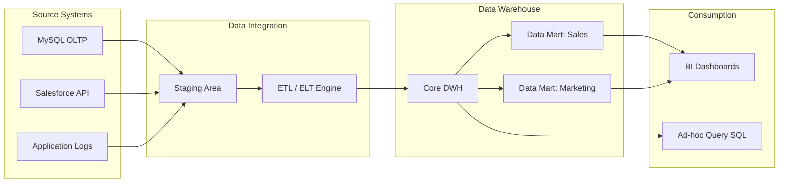

# Kho dữ liệu phân tích - Data Warehouse

## Summary

Data Warehouse (DWH) là hệ thống lưu trữ dữ liệu tập trung, đã được tích hợp, làm sạch và tổ chức theo mô hình dữ liệu đa chiều nhằm tối ưu hóa cho các truy vấn phân tích (analytical queries), báo cáo (reporting) và hỗ trợ ra quyết định (business intelligence). DWH đóng vai trò là nguồn chân lý duy nhất (single source of truth) về mặt dữ liệu lịch sử của toàn bộ doanh nghiệp.

---

## Definition

**Data Warehouse - Kho dữ liệu phân tích tập trung** là một hệ thống cơ sở dữ liệu chuyên biệt dùng để thu thập, tích hợp dữ liệu từ nhiều nguồn khác nhau (OLTP databases, CRM, ERP, logs), thực hiện biến đổi và lưu trữ dữ liệu lịch sử lâu dài nhằm phục vụ mục đích phân tích.

Khác với các cơ sở dữ liệu vận hành (operational databases) tối ưu cho việc ghi nhận giao dịch nhanh (OLTP - Online Transaction Processing), Data Warehouse sử dụng kiến trúc OLAP (Online Analytical Processing) tối ưu cho các truy vấn đọc dữ liệu quy mô lớn (analytical query workloads) và tổng hợp thông tin (aggregation).

---

## Why it exists

Trong các doanh nghiệp, dữ liệu vận hành bị phân tán ở nhiều hệ thống độc lập (ví dụ: dữ liệu đơn hàng nằm ở PostgreSQL, dữ liệu khách hàng nằm ở Salesforce, dữ liệu thanh toán nằm ở MySQL). Việc phân tích dữ liệu trực tiếp trên các hệ thống này gặp phải 3 vấn đề lớn:
1. **Quá tải hệ thống vận hành**: Các câu lệnh truy vấn phân tích (như tính tổng doanh thu năm) yêu cầu quét hàng triệu dòng dữ liệu, có thể làm sập hoặc làm chậm hệ thống OLTP đang phục vụ người dùng thực tế.
2. **Không đồng nhất dữ liệu**: Cùng một thực thể (khách hàng) có thể có định dạng khác nhau ở các hệ thống khác nhau (ví dụ: hệ thống đơn hàng dùng `customer_id` kiểu UUID, hệ thống CRM dùng `client_id` kiểu Integer).
3. **Mất dấu lịch sử**: Hệ thống OLTP thường chỉ lưu trạng thái hiện tại (ví dụ: địa chỉ hiện tại của khách hàng) và ghi đè trạng thái cũ, làm mất đi khả năng phân tích dữ liệu theo thời gian (historical analysis).

Data Warehouse ra đời để giải quyết các bài toán này bằng cách gom toàn bộ dữ liệu về một nơi, chuẩn hóa cấu trúc và lưu trữ lịch sử thay đổi để phục vụ phân tích mà không ảnh hưởng tới hệ thống vận hành.

---

## Core idea

Nguyên lý cốt lõi của một Data Warehouse truyền thống bao gồm 4 đặc tính được định nghĩa bởi Bill Inmon:
* **Subject-Oriented (Hướng chủ đề)**: Dữ liệu được tổ chức xoay quanh các chủ đề kinh doanh chính của doanh nghiệp (ví dụ: Khách hàng, Doanh số, Sản phẩm) thay vì tổ chức theo luồng xử lý của ứng dụng.
* **Integrated (Tích hợp)**: Dữ liệu từ các nguồn khác nhau phải được làm sạch, đồng nhất hóa kiểu dữ liệu, định dạng mã hóa và quy ước đặt tên trước khi ghi vào kho.
* **Non-volatile (Không biến động)**: Dữ liệu một khi đã được nạp vào DWH thì chỉ có thể đọc và append thêm dữ liệu lịch sử mới, không bị sửa đổi trực tiếp hoặc xóa đi như trong OLTP.
* **Time-variant (Biến thiên theo thời gian)**: Dữ liệu luôn đi kèm với mốc thời gian cụ thể (timestamp, date key) để phản ánh trạng thái của thực thể tại thời điểm đó, phục vụ phân tích xu hướng lịch sử.

---

## How it works

Quy trình hoạt động của một Data Warehouse gồm 5 bước cơ bản:
1. **Data Ingestion (Thu nạp)**: Trích xuất dữ liệu thô từ các hệ thống OLTP nguồn thông qua các tác vụ ETL/ELT định kỳ hoặc Change Data Capture (CDC).
2. **Staging**: Đưa dữ liệu thô vào vùng đệm (staging area) để chuẩn bị biến đổi nhằm giảm tải kết nối trực tiếp đến nguồn.
3. **Data Transformation (Biến đổi)**: Thực hiện chuẩn hóa kiểu dữ liệu, lọc bỏ dữ liệu rác, xử lý dữ liệu trùng lặp, giải quyết SCD (Slowly Changing Dimensions) và ánh xạ các khóa tự nhiên thành khóa thay thế (surrogate keys).
4. **Data Loading (Nạp)**: Ghi dữ liệu đã làm sạch vào mô hình dữ liệu đa chiều (Dimensional Model) của Data Warehouse.
5. **Data Serving (Phục vụ)**: Cung cấp dữ liệu qua lớp ngữ nghĩa (Semantic Layer / Data Marts) cho các công cụ BI (Tableau, PowerBI) hoặc Analysts viết truy vấn SQL trực tiếp.

---

## Architecture / Flow

Dưới đây là sơ đồ luồng dữ liệu kiến trúc Data Warehouse điển hình:



---

## Practical example

Xét một hệ thống E-commerce lớn. Chúng ta cần xây dựng Fact Table và Dimension Table để phục vụ báo cáo doanh thu theo khu vực và sản phẩm.

**1. Dimension Table: `dim_product` (Lưu thông tin sản phẩm)**
```sql
CREATE TABLE dim_product (
    product_key INT PRIMARY KEY, -- Surrogate Key tự sinh
    product_id VARCHAR(50),      -- Natural Key từ hệ thống nguồn
    product_name VARCHAR(255),
    category VARCHAR(100),
    price DECIMAL(10, 2),
    is_active BOOLEAN,
    start_date DATE,
    end_date DATE
);
```

**2. Fact Table: `fact_sales` (Lưu thông tin giao dịch)**
```sql
CREATE TABLE fact_sales (
    sales_key BIGINT PRIMARY KEY,
    date_key INT,               -- Foreign key liên kết sang dim_date
    customer_key INT,           -- Foreign key liên kết sang dim_customer
    product_key INT,            -- Foreign key liên kết sang dim_product
    order_id VARCHAR(50),       -- Degenerate Dimension (Mã đơn hàng)
    quantity INT,               -- Metric
    revenue DECIMAL(12, 2)      -- Metric (Lượng hóa)
);
```

Truy vấn tính doanh số theo từng danh mục sản phẩm trong tháng 5 năm 2026:
```sql
SELECT 
    p.category,
    SUM(f.revenue) AS total_revenue,
    SUM(f.quantity) AS total_quantity
FROM fact_sales f
JOIN dim_product p ON f.product_key = p.product_key
JOIN dim_date d ON f.date_key = d.date_key
WHERE d.year = 2026 AND d.month = 5
GROUP BY p.category
ORDER BY total_revenue DESC;
```

---

## Best practices

* **Sử dụng Surrogate Keys**: Luôn dùng surrogate keys (khóa thay thế) làm khóa chính cho các bảng Dimension để độc lập hoàn toàn với sự thay đổi ID của hệ thống nguồn và tối ưu hóa hiệu năng JOIN (kiểu dữ liệu INT/BIGINT luôn JOIN nhanh hơn VARCHAR/UUID).
* **Tuân thủ đúng Granularity (Grain)**: Xác định rõ ràng mức độ chi tiết của Fact Table trước khi thiết kế. Tuyệt đối không trộn lẫn các dòng dữ liệu có mức độ chi tiết khác nhau (ví dụ: dòng ghi nhận từng mặt hàng và dòng ghi nhận tổng hóa đơn) trong cùng một Fact Table.
* **Xây dựng Conformed Dimensions**: Thiết kế các Dimension dùng chung (như `dim_date`, `dim_customer`) thống nhất trên toàn doanh nghiệp để đảm bảo các Data Marts của các phòng ban khác nhau có thể liên kết và đối chiếu dữ liệu chính xác.
* **Tránh Null trong Foreign Keys**: Trong Fact Table, không để giá trị NULL ở các cột khóa ngoại. Hãy tạo một bản ghi mặc định trong bảng Dimension với ID là `-1` (đại diện cho "Chưa xác định" hoặc "N/A") và gán khóa ngoại đó vào Fact Table khi thiếu thông tin.

---

## Common mistakes

* **Xem DWH như Operational Database (OLTP)**: Thiết kế lược đồ DWH chuẩn hóa ở mức 3NF quá mức, dẫn đến các câu lệnh truy vấn báo cáo phải JOIN hàng chục bảng lại với nhau làm sập hiệu năng đọc.
* **Lạm dụng Snowflake Schema**: Chuẩn hóa sâu các bảng Dimension (tách bảng danh mục sản phẩm ra khỏi bảng sản phẩm) làm tăng số lượng các phép JOIN vật lý một cách không cần thiết, làm chậm OLAP engine.
* **Cập nhật dữ liệu trực tiếp bằng UPDATE**: Sửa đổi thủ công các dòng dữ liệu cũ trong Fact Table mà không thông qua pipeline. Việc này làm mất đi tính toàn vẹn của dữ liệu lịch sử và phá vỡ nguyên lý *non-volatile*.

---

## Trade-offs

### Ưu điểm
* Tối ưu hóa tuyệt đối cho tốc độ đọc và phân tích dữ liệu lớn.
* Chuẩn hóa và làm sạch dữ liệu giúp tạo ra một nguồn thông tin đáng tin cậy duy nhất cho doanh nghiệp.
* Tách biệt hoàn toàn tài nguyên tính toán của phân tích khỏi hệ thống vận hành.

### Nhược điểm
* **Chi phí lưu trữ cao**: Việc lưu trữ dữ liệu lịch sử không biến động đòi hỏi dung lượng đĩa lớn theo thời gian.
* **Độ trễ dữ liệu (Data Latency)**: DWH truyền thống thường được cập nhật theo lô (Batch) hàng ngày hoặc hàng giờ, dữ liệu không thể đạt độ trễ thời gian thực (real-time).
* **Thiếu linh hoạt với dữ liệu phi cấu trúc**: Khó khăn trong việc lưu trữ trực tiếp hình ảnh, âm thanh, văn bản tự do trước khi chúng được xử lý bán cấu trúc.

---

## When to use

* Doanh nghiệp có nhiều nguồn dữ liệu phân tán cần tích hợp để phục vụ BI và ra quyết định.
* Yêu cầu phân tích dữ liệu lịch sử dài hạn (so sánh doanh số cùng kỳ năm ngoái, phân tích xu hướng 5 năm).
* Nhóm phân tích (Data Analysts, Business Analysts) sử dụng SQL và BI tools làm công cụ khai thác chính.

## When not to use

* Hệ thống chỉ cần lưu trữ và truy xuất trạng thái hiện tại của thực thể với độ trễ thấp (millisecond).
* Doanh nghiệp chỉ có duy nhất một nguồn dữ liệu OLTP và dung lượng dữ liệu nhỏ dưới vài chục Gigabytes (có thể tối ưu bằng read-replica).
* Dữ liệu đầu vào chủ yếu là dữ liệu phi cấu trúc, tệp tin nhị phân lớn phục vụ cho các bài toán huấn luyện Deep Learning (hồ dữ liệu - Data Lake phù hợp hơn).

---

## Related concepts

* [OLAP (Online Analytical Processing)](/concepts/olap)
* [Dimensional Modeling](/concepts/dimensional-modeling)
* [Data Lake](/concepts/data-lake)
* [Slowly Changing Dimension (SCD)](/concepts/slowly-changing-dimension)

---

## Interview questions

### 1. Phân biệt phương pháp luận xây dựng Data Warehouse của Ralph Kimball và Bill Inmon.
* **Người phỏng vấn muốn kiểm tra**: Hiểu biết sâu sắc về tư duy kiến trúc và quy hoạch hệ thống dữ liệu doanh nghiệp.
* **Gợi ý trả lời (Strong Answer)**: 
  * Kimball đề xuất hướng tiếp cận từ dưới lên (Bottom-up). Dữ liệu được trích xuất từ nguồn đưa vào Staging, biến đổi trực tiếp thành các Dimensional Model (Star Schema) phục vụ trực tiếp cho từng phòng ban (Data Marts), sau đó các Data Mart kết hợp lại thông qua Conformed Dimensions để tạo thành Enterprise Data Warehouse. Phương pháp này triển khai nhanh, dễ ra kết quả trực quan cho doanh nghiệp nhưng khó quản lý quy mô cực lớn.
  * Inmon đề xuất hướng tiếp cận từ trên xuống (Top-down). Dữ liệu từ nguồn được đưa vào một kho dữ liệu trung tâm được chuẩn hóa ở mức 3NF để giảm thiểu trùng lặp dữ liệu tối đa. Từ kho 3NF này, dữ liệu mới được trích xuất và phi chuẩn hóa (denormalize) thành các Data Mart dạng Star Schema phục vụ phòng ban. Cách này đảm bảo tính nhất quán rất cao, dễ bảo trì nhưng tốn nhiều thời gian và chi phí ban đầu để triển khai.
* **Lỗi cần tránh (Weak Answer)**: Trả lời hời hợt rằng Kimball là Star Schema còn Inmon là Snowflake Schema (đây chỉ là chi tiết thiết kế vật lý, không phản ánh tư duy kiến trúc).

### 2. Sự khác biệt chính giữa Star Schema và Snowflake Schema là gì? Khi nào nên chọn loại nào?
* **Người phỏng vấn muốn kiểm tra**: Kỹ năng thiết kế lược đồ dữ liệu và hiểu biết về tối ưu hóa công cụ OLAP.
* **Gợi ý trả lời (Strong Answer)**:
  * Star Schema giữ các Dimension ở dạng phi chuẩn hóa (denormalized), thông tin chi tiết lưu chung trong một bảng Dimension duy nhất. Ưu điểm là giảm số lượng phép JOIN, tối ưu cho tốc độ đọc và dễ hiểu cho người dùng.
  * Snowflake Schema chuẩn hóa các bảng Dimension bằng cách tách chúng thành các bảng phân cấp nhỏ hơn (ví dụ: tách bảng Category ra khỏi bảng Product). Ưu điểm là giảm thiểu trùng lặp dữ liệu, tiết kiệm không gian đĩa nhưng làm tăng độ phức tạp truy vấn và giảm hiệu năng đọc do phải thực hiện nhiều phép JOIN vật lý.
  * *Lựa chọn*: Ưu tiên Star Schema trong hầu hết các thiết kế DWH hiện đại vì chi phí ổ đĩa hiện tại rất rẻ, việc đánh đổi dung lượng để lấy hiệu năng truy vấn nhanh là hoàn toàn xứng đáng. Chỉ cân nhắc Snowflake khi các dimension quá lớn và việc cập nhật dữ liệu trùng lặp gặp khó khăn nghiêm trọng về mặt quản trị.
* **Lỗi cần tránh**: Trả lời chung chung là "chọn tùy trường hợp" mà không phân tích được yếu tố chi phí đĩa cứng vs hiệu năng tính toán JOIN.

### 3. Giải thích khái niệm Slowly Changing Dimension (SCD) và phân tích sự khác biệt giữa Type 1 và Type 2.
* **Người phỏng vấn muốn kiểm tra**: Kỹ năng xử lý dữ liệu thay đổi theo thời gian trong thiết kế Dimension.
* **Gợi ý trả lời (Strong Answer)**:
  * SCD là kỹ thuật xử lý sự thay đổi thông tin thuộc tính của Dimension theo thời gian.
  * **SCD Type 1**: Ghi đè trực tiếp dữ liệu cũ bằng dữ liệu mới. Lịch sử bị xóa hoàn toàn. Dùng khi thông tin cũ không có giá trị phân tích (ví dụ: sửa lỗi chính tả tên khách hàng).
  * **SCD Type 2**: Tạo một dòng mới hoàn toàn trong bảng Dimension để lưu trạng thái mới, giữ nguyên dòng cũ và sử dụng các cột cờ hiệu hiệu lực (`is_active`, `start_date`, `end_date`) kết hợp khóa chính mới (Surrogate Key). Dùng khi cần phân tích chính xác lịch sử (ví dụ: tính toán doanh số của nhân viên sales khi họ chuyển từ chi nhánh Hà Nội vào TP.HCM).
* **Lỗi cần tránh**: Không giải thích được vai trò của Surrogate Key trong SCD Type 2 (nếu giữ nguyên Natural Key của nguồn thì bảng sẽ bị trùng khóa chính khi lưu nhiều dòng lịch sử).

### 4. Tại sao chúng ta không nên để giá trị NULL làm khóa ngoại trong Fact Table? Giải pháp thay thế là gì?
* **Người phỏng vấn muốn kiểm tra**: Tư duy thiết kế chịu lỗi và tối ưu hóa câu lệnh SQL trong thực tế.
* **Gợi ý trả lời (Strong Answer)**:
  * Để NULL trong khóa ngoại của Fact Table sẽ làm hỏng kết quả của các phép JOIN thông thường (INNER JOIN sẽ loại bỏ hoàn toàn các dòng Fact có khóa ngoại NULL, dẫn đến tính toán doanh thu bị thiếu hụt). Nếu dùng LEFT JOIN để giữ lại thì câu lệnh SQL trở nên phức tạp và hiệu năng xử lý JOIN bị suy giảm.
  * *Giải pháp*: Trong các bảng Dimension, luôn định nghĩa sẵn một dòng mặc định có ID đặc biệt (ví dụ: `-1`), giá trị các cột mô tả là `'Chưa xác định'` hoặc `'N/A'`. Khi nạp dữ liệu vào Fact Table, nếu trường thông tin nguồn bị khuyết thiếu, pipeline ETL/ELT sẽ tự động điền giá trị `-1` này thay vì để NULL.
* **Lỗi cần tránh**: Trả lời là dùng mệnh đề `COALESCE` trong câu lệnh SQL truy vấn (đây là giải pháp vá lỗi ở tầng tiêu thụ, không phải thiết kế chuẩn hóa tại kho dữ liệu).

### 5. Degenerate Dimension là gì? Hãy đưa ra một ví dụ thực tế.
* **Người phỏng vấn muốn kiểm tra**: Kiến thức sâu về dimensional modeling và cách tổ chức Fact Table tối ưu.
* **Gợi ý trả lời (Strong Answer)**:
  * Degenerate Dimension (Chiều suy biến) là thuộc tính mô tả (dimension) nhưng được lưu trực tiếp trong Fact Table mà không cần liên kết sang một bảng Dimension riêng biệt nào khác. Điều này xảy ra khi thuộc tính đó không có thêm thông tin chi tiết nào đi kèm ngoài chính giá trị của nó.
  * *Ví dụ*: Mã hóa đơn (`order_id`, `invoice_number`), số vận đơn. Các mã này rất quan trọng để đối chiếu dữ liệu nhưng chúng không có bảng dimension riêng vì tất cả thông tin như khách hàng, ngày tháng, sản phẩm đã được liên kết qua các khóa ngoại khác trong Fact Table.
* **Lỗi cần tránh**: Nhầm lẫn Degenerate Dimension với Fact Table Primary Key.

---

## References

1. **Designing Data-Intensive Applications** - Martin Kleppmann (Chương 3: Storage and Retrieval - Phần phân tích về Column-oriented storage).
2. **The Data Warehouse Toolkit** - Ralph Kimball, Margy Ross (Sách gối đầu giường về thiết kế lược đồ Dimensional Modeling và Star Schema).
3. **Building the Data Warehouse** - W. H. Inmon (Tài liệu chi tiết về tri thức kiến trúc DWH trung tâm 3NF).
4. **Fundamentals of Data Engineering** - Joe Reis, Matt Housley (Chương 7: Data Storage - So sánh chi tiết OLTP và OLAP).
5. **Google Cloud BigQuery Documentation** - BigQuery Architecture Guide (Tài liệu thực tế của GCP giải thích cơ chế tối ưu hóa lưu trữ cột cho kiến trúc DWH hiện đại).

---

## English summary

A Data Warehouse (DWH) is a centralized, integrated, non-volatile, and time-variant database optimized for analytical processing (OLAP) rather than transactional workloads (OLTP). By consolidating data from disparate source systems, resolving formatting inconsistencies, and maintaining historical changes (using techniques like Slowly Changing Dimensions), a DWH serves as the single source of truth for business intelligence, reporting, and ad-hoc analytics. The architecture typically relies on dimensional modeling (Star or Snowflake Schema) consisting of Fact Tables for metrics and Dimension Tables for descriptive context, utilizing surrogate keys to ensure data integrity and optimal join performance.
