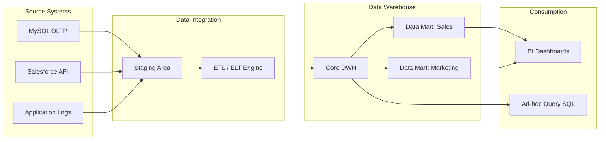

Hãy tưởng tượng bạn là Giám đốc Công nghệ của một chuỗi siêu thị lớn. Bạn muốn biết doanh thu bán hàng trong tháng trước thay đổi ra sao, khách hàng ở khu vực nào mua nhiều nhất và chiến dịch marketing nào mang lại hiệu quả cao nhất. Tuy nhiên, thông tin giao dịch lại nằm ở cơ sở dữ liệu bán hàng (PostgreSQL), thông tin khách hàng nằm ở CRM (Salesforce) và chi phí quảng cáo nằm ở Google Ads. Làm sao để bạn kết nối và khai phá đống dữ liệu phân tán này mà không làm treo hệ thống bán lẻ đang chạy thực tế của các siêu thị?

Đây chính là sứ mệnh của **Data Warehouse (DWH - Kho dữ liệu phân tích)** — "đại bản doanh" lưu trữ và xử lý toàn bộ dữ liệu lịch sử của doanh nghiệp.

## Data Warehouse thực chất là gì?

**Data Warehouse** là một hệ thống cơ sở dữ liệu chuyên biệt, nơi tích hợp dữ liệu từ nhiều nguồn khác nhau, thực hiện làm sạch, biến đổi và lưu trữ lịch sử lâu dài để tối ưu hóa cho các truy vấn phân tích (Analytical Queries), báo cáo (Reporting) và hỗ trợ ra quyết định (Business Intelligence - BI).

Khác với các cơ sở dữ liệu vận hành ([OLTP](/concepts/database-storage/oltp/) - Online Transaction Processing) được thiết kế tối ưu cho việc ghi nhận giao dịch nhanh chóng với độ trễ cực thấp, Data Warehouse sử dụng kiến trúc [OLAP](/concepts/database-storage/olap/) (Online Analytical Processing) tối ưu cho việc đọc dữ liệu quy mô lớn và tổng hợp thông tin (Aggregation) trên hàng triệu, hàng tỷ dòng.

## Tại sao chúng ta cần một Kho dữ liệu riêng biệt?

Việc phân tích dữ liệu trực tiếp trên các cơ sở dữ liệu vận hành (OLTP) của doanh nghiệp luôn đi kèm 3 vấn đề lớn:

1. **Quá tải hệ thống vận hành**: Một câu lệnh SQL tính tổng doanh thu năm yêu cầu quét qua hàng triệu dòng. Nếu chạy trực tiếp trên database chính, nó sẽ ngốn sạch tài nguyên CPU/RAM, khiến hệ thống bán hàng bị chậm hoặc sập hoàn toàn.
2. **Sự bất đồng nhất về dữ liệu**: Cùng một thực thể khách hàng nhưng hệ thống bán hàng lưu là `customer_id` kiểu UUID, trong khi hệ thống CRM lại lưu là `client_id` kiểu Integer.
3. **Mất vết lịch sử**: Hệ thống OLTP thường chỉ lưu trạng thái hiện tại (ví dụ: địa chỉ hiện tại của khách hàng) và ghi đè trực tiếp lên dữ liệu cũ, làm mất đi khả năng phân tích xu hướng hoặc so sánh dữ liệu theo thời gian (Historical Analysis).

Data Warehouse ra đời để giải quyết triệt để các bài toán trên bằng cách gom dữ liệu về một nơi tập trung, chuẩn hóa cấu trúc và lưu giữ toàn bộ dòng lịch sử biến động.

## 4 Đặc tính bất biến của một Data Warehouse

Theo Bill Inmon - một trong những "cha đẻ" của ngành Data Warehouse, một hệ thống DWH tiêu chuẩn bắt buộc phải có 4 đặc tính sau:

* **Hướng chủ đề (Subject-Oriented)**: Dữ liệu được tổ chức xung quanh các thực thể kinh doanh cốt lõi (như Khách hàng, Sản phẩm, Doanh số) thay vì tổ chức theo luồng xử lý của ứng dụng.
* **Tích hợp (Integrated)**: Dữ liệu từ mọi nguồn khi đổ vào kho phải được định dạng lại, đồng nhất kiểu dữ liệu, múi giờ và quy tắc đặt tên.
* **Không biến động (Non-volatile)**: Dữ liệu khi đã nạp vào DWH chỉ có đọc và ghi thêm (Append), không bị chỉnh sửa trực tiếp hoặc xóa bỏ như trong hệ thống giao dịch.
* **Biến thiên theo thời gian (Time-variant)**: Dữ liệu luôn đi kèm mốc thời gian cụ thể (Timestamp, Date Key) để ghi nhận trạng thái tại thời điểm đó, phục vụ việc phân tích xu hướng lịch sử.

## Đường đi của dữ liệu vào Kho

Kiến trúc luồng dữ liệu của một Data Warehouse điển hình thường trải qua các giai đoạn sau:


1. **Thu nạp dữ liệu ([Data Ingestion](/concepts/etl-elt/data-ingestion/))**: Trích xuất dữ liệu từ các nguồn thông qua CDC ([Change Data Capture](/concepts/etl-elt/change-data-capture/)) hoặc các công cụ [ETL](/concepts/etl-elt/etl/)/[ELT](/concepts/etl-elt/elt/) theo lô (Batch).
2. **Vùng đệm (Staging Area)**: Lưu trữ tạm thời dữ liệu thô để xử lý mà không làm ảnh hưởng đến hiệu năng kết nối của database nguồn.
3. **Biến đổi dữ liệu ([Data Transformation](/concepts/etl-elt/data-transformation/))**: Thực hiện lọc rác, khử trùng lặp, giải quyết lịch sử thay đổi (SCD - Slowly Changing Dimensions) và gán khóa thay thế (Surrogate Keys).
4. **Nạp dữ liệu ([Data Loading](/concepts/etl-elt/data-loading/))**: Ghi dữ liệu sạch vào các mô hình đa chiều (Dimensional Model) của kho dữ liệu.
5. **Cung cấp dữ liệu (Serving)**: Phân phối dữ liệu qua các phân kho nhỏ hơn phục vụ riêng cho từng phòng ban (Data Marts) hoặc cho các công cụ BI vẽ dashboard.

## Thiết kế thực tế: Fact Table và Dimension Table

Hãy cùng xem một thiết kế thực tế cho hệ thống Thương mại điện tử (E-commerce) sử dụng mô hình Star Schema.

### 1. Bảng Dimension: `dim_product` (Lưu thông tin sản phẩm)

```sql
CREATE TABLE dim_product (
    product_key INT PRIMARY KEY, -- Surrogate Key tự sinh
    product_id VARCHAR(50),      -- Natural Key từ hệ thống nguồn
    product_name VARCHAR(255),
    category VARCHAR(100),
    price DECIMAL(10, 2),
    is_active BOOLEAN,
    start_date DATE,
    end_date DATE
);
```

### 2. Bảng Fact: `fact_sales` (Lưu thông tin giao dịch)

```sql
CREATE TABLE fact_sales (
    sales_key BIGINT PRIMARY KEY,
    date_key INT,               -- Foreign key liên kết sang dim_date
    customer_key INT,           -- Foreign key liên kết sang dim_customer
    product_key INT,            -- Foreign key liên kết sang dim_product
    order_id VARCHAR(50),       -- Degenerate Dimension (Mã đơn hàng)
    quantity INT,               -- Metric (Số lượng)
    revenue DECIMAL(12, 2)      -- Metric (Doanh thu)
);
```

### Truy vấn phân tích mẫu
Để tính toán tổng doanh số theo danh mục sản phẩm trong tháng 5 năm 2026:

```sql
SELECT 
    p.category,
    SUM(f.revenue) AS total_revenue,
    SUM(f.quantity) AS total_quantity
FROM fact_sales f
JOIN dim_product p ON f.product_key = p.product_key
JOIN dim_date d ON f.date_key = d.date_key
WHERE d.year = 2026 AND d.month = 5
GROUP BY p.category
ORDER BY total_revenue DESC;
```

---

## "Bí kíp" thiết kế và những sai lầm kinh điển

### Thói quen tốt cần có (Best Practices)
* **Luôn sử dụng Surrogate Keys**: Hãy dùng khóa tự sinh (Surrogate Key) làm khóa chính cho bảng Dimension thay vì dùng ID gốc của nguồn. Việc này giúp kho dữ liệu độc lập hoàn toàn với các thay đổi ID ở nguồn và tăng tốc độ JOIN (kiểu dữ liệu số `INT`/`BIGINT` JOIN nhanh hơn kiểu chữ `VARCHAR`/`UUID`).
* **Định nghĩa rõ độ chi tiết (Grain)**: Phải xác định mức độ chi tiết nhỏ nhất của Fact Table trước khi bắt tay thiết kế. Tuyệt đối không trộn lẫn các dòng có mức độ chi tiết khác nhau (ví dụ: dòng ghi chi tiết sản phẩm và dòng ghi tổng tiền hóa đơn) trong cùng một Fact Table.
* **Xây dựng Conformed Dimensions**: Thiết kế các Dimension dùng chung (như `dim_date`, `dim_customer`) thống nhất cho toàn công ty để đảm bảo các phòng ban khi đối chiếu số liệu không bị lệch nhau.
* **Chặn đứng giá trị NULL ở khóa ngoại**: Đừng để NULL xuất hiện ở cột khóa ngoại trong Fact Table. Hãy tạo một bản ghi mặc định trong bảng Dimension với ID là `-1` (đại diện cho "Chưa xác định") để trỏ tới khi dữ liệu nguồn bị khuyết thiếu.

### Những sai lầm phổ biến cần tránh
* **Thiết kế DWH giống hệt như DB vận hành (OLTP)**: Cố gắng đưa cấu trúc bảng về dạng chuẩn hóa 3NF khiến các câu lệnh truy vấn báo cáo phải JOIN hàng chục bảng lại với nhau, làm tê liệt hiệu năng đọc.
* **Lạm dụng Snowflake Schema**: Việc chuẩn hóa quá mức các bảng Dimension (ví dụ tách bảng Category ra khỏi Product) làm tăng các phép JOIN vật lý một cách không cần thiết, làm chậm tốc độ của OLAP Engine.
* **Cập nhật bằng lệnh UPDATE thủ công**: Trực tiếp thay đổi số liệu trong Fact Table làm mất đi tính toàn vẹn của lịch sử và phá vỡ nguyên lý không biến động dữ liệu.

### Sự đánh đổi (Trade-offs)
* **Hiệu năng đọc vs. Chi phí lưu trữ**: Để có tốc độ truy vấn nhanh, DWH chấp nhận việc lưu trữ dữ liệu lịch sử lặp đi lặp lại không biến động, đòi hỏi dung lượng đĩa lớn theo thời gian.
* **Tốc độ truy cập vs. Độ trễ dữ liệu**: DWH truyền thống cập nhật dữ liệu theo lô (Batch) định kỳ nên dữ liệu thường có độ trễ (ví dụ trễ 1 ngày), không thể đạt thời gian thực (real-time).
* **Không tối ưu cho dữ liệu phi cấu trúc**: DWH chỉ mạnh khi làm việc với dữ liệu có cấu trúc dạng bảng. Các định dạng hình ảnh, âm thanh, văn bản tự do nên được lưu trữ ở hồ dữ liệu (Data Lake) sẽ phù hợp hơn.

---

## Góc phỏng vấn

### 1. Phân biệt phương pháp luận xây dựng Data Warehouse của Ralph Kimball và Bill Inmon.
* **Gợi ý trả lời**: 
  * **Kimball** đề xuất hướng tiếp cận từ dưới lên (Bottom-up). Dữ liệu được trích xuất từ nguồn đưa vào Staging, biến đổi trực tiếp thành các Dimensional Model (Star Schema) phục vụ cho từng phòng ban (Data Marts), sau đó các Data Mart kết hợp lại thông qua Conformed Dimensions để tạo thành Enterprise Data Warehouse. Phương pháp này triển khai nhanh, dễ ra kết quả trực quan cho doanh nghiệp nhưng khó quản lý quy mô cực lớn.
  * **Inmon** đề xuất hướng tiếp cận từ trên xuống (Top-down). Dữ liệu từ nguồn được đưa vào một kho dữ liệu trung tâm được chuẩn hóa ở mức 3NF để giảm thiểu trùng lặp dữ liệu tối đa. Từ kho 3NF này, dữ liệu mới được trích xuất và phi chuẩn hóa (denormalize) thành các Data Mart dạng Star Schema phục vụ phòng ban. Cách này đảm bảo tính nhất quán rất cao, dễ bảo trì nhưng tốn nhiều thời gian và chi phí ban đầu để triển khai.

### 2. Sự khác biệt chính giữa Star Schema và Snowflake Schema là gì? Khi nào nên chọn loại nào?
* **Gợi ý trả lời**:
  * **Star Schema** phi chuẩn hóa (denormalize) các Dimension. Mọi thông tin chi tiết của dimension nằm chung trong một bảng duy nhất. Ưu điểm là giảm số lượng phép JOIN, tối ưu cho tốc độ đọc và dễ hiểu cho người dùng.
  * **Snowflake Schema** chuẩn hóa (normalize) các bảng Dimension bằng cách tách chúng thành các bảng phân cấp nhỏ hơn (ví dụ tách Category ra khỏi Product). Ưu điểm là tiết kiệm dung lượng lưu trữ, nhưng làm tăng độ phức tạp của câu lệnh SQL và giảm hiệu năng đọc do phải thực hiện nhiều phép JOIN vật lý hơn.
  * **Lựa chọn**: Trong thời đại ngày nay, chi phí lưu trữ đĩa cứng đã rất rẻ. Do đó, hầu hết các DWH hiện đại đều ưu tiên chọn **Star Schema** để đổi dung lượng lưu trữ lấy tốc độ truy vấn tối đa. Chỉ chọn [Snowflake](/concepts/cloud-data-platform/snowflake/) khi dimension quá lớn và việc cập nhật dữ liệu trùng lặp gặp khó khăn nghiêm trọng về mặt quản trị.

### 3. Giải thích khái niệm Slowly Changing Dimension (SCD) và phân tích sự khác biệt giữa Type 1 và Type 2.
* **Gợi ý trả lời**:
  * **SCD** là kỹ thuật xử lý sự thay đổi thông tin thuộc tính của Dimension theo thời gian.
  * **SCD Type 1**: Ghi đè trực tiếp dữ liệu cũ bằng dữ liệu mới. Lịch sử bị xóa hoàn toàn. Dùng khi thông tin cũ không có giá trị phân tích (ví dụ: sửa lỗi chính tả tên khách hàng).
  * **SCD Type 2**: Tạo một dòng mới hoàn toàn trong bảng Dimension để lưu trạng thái mới, giữ nguyên dòng cũ và sử dụng các cột cờ hiệu hiệu lực (`is_active`, `start_date`, `end_date`) kết hợp khóa chính mới (Surrogate Key). Dùng khi cần phân tích chính xác lịch sử (ví dụ: tính toán doanh số của nhân viên sales khi họ chuyển từ chi nhánh Hà Nội vào TP.HCM).

### 4. Tại sao chúng ta không nên để giá trị NULL làm khóa ngoại trong Fact Table? Giải pháp thay thế là gì?
* **Gợi ý trả lời**:
  * Để NULL ở cột khóa ngoại trong Fact Table sẽ làm sai lệch kết quả của các phép JOIN thông thường. Phép `INNER JOIN` sẽ loại bỏ hoàn toàn các dòng Fact có khóa ngoại NULL, dẫn đến tính toán số liệu bị thiếu hụt. Nếu dùng `LEFT JOIN` để giữ dòng, hiệu năng câu lệnh SQL sẽ bị suy giảm nghiêm trọng.
  * **Giải pháp**: Trong các bảng Dimension, ta định nghĩa sẵn một bản ghi mặc định có ID đặc biệt (ví dụ: `-1`), giá trị là `'N/A'` hoặc `'Chưa xác định'`. Khi nạp dữ liệu vào Fact Table, nếu trường thông tin nguồn bị khuyết thiếu, pipeline ETL/ELT sẽ tự động điền giá trị `-1` này thay vì để NULL.

### 5. Degenerate Dimension là gì? Hãy đưa ra một ví dụ thực tế.
* **Gợi ý trả lời**:
  * **Degenerate Dimension (Chiều suy biến)** là thuộc tính mô tả nhưng được lưu trực tiếp trong Fact Table mà không cần liên kết sang một bảng Dimension riêng biệt nào khác. Điều này xảy ra khi thuộc tính đó không có thêm thông tin chi tiết nào đi kèm ngoài chính giá trị của nó.
  * **Ví dụ**: Mã hóa đơn (`order_id`, `invoice_number`), số vận đơn. Các mã này rất quan trọng để đối chiếu dữ liệu nhưng chúng không cần bảng dimension riêng vì tất cả thông tin liên quan như khách hàng, ngày tháng, sản phẩm đã được liên kết qua các khóa ngoại khác trong Fact Table.

---

## Khái niệm liên quan
* [Dimensional Modeling](/concepts/data-warehouse/dimensional-modeling/)
* [Slowly Changing Dimension (SCD)](/concepts/data-warehouse/slowly-changing-dimension/)

## Tài liệu tham khảo

1. [Snowflake: Data Warehousing Guide](https://www.snowflake.com/trending/data-warehousing) - Overview of cloud data warehouse features, storage mechanisms, and design methodologies.
2. [Databricks: Medallion Architecture](https://www.databricks.com/glossary/medallion-architecture) - Documentation on organizing data warehouse layers (Bronze, Silver, Gold) in the [Lakehouse](/concepts/data-lake-lakehouse/lakehouse/).
3. [O'Reilly: The Data Warehouse Toolkit, 3rd Edition](https://www.oreilly.com/library/view/the-data-warehouse/9781118530801/) - Ralph Kimball and Margy Ross's definitive guide on dimensional modeling and star schema design.
4. [DAMA International Official Site](https://www.dama.org/) - Official resources from the Data Management Association outlining the DMBOK standards for corporate data warehousing.
5. [Databricks Blog: What is a Data Lakehouse?](https://www.databricks.com/blog/2020/01/30/what-is-a-data-lakehouse.html) - Foundational post detailing the evolution of data warehouses towards unified lakehouse designs.

## English Summary

A Data Warehouse (DWH) is a centralized, integrated, non-volatile, and time-variant database optimized for analytical processing (OLAP) rather than transactional workloads (OLTP). By consolidating data from disparate [source systems](/concepts/foundation/source-systems/), resolving formatting inconsistencies, and maintaining historical changes (using techniques like Slowly Changing Dimensions), a DWH serves as the single source of truth for business intelligence, reporting, and ad-hoc analytics. The architecture typically relies on dimensional modeling (Star or Snowflake Schema) consisting of Fact Tables for metrics and Dimension Tables for descriptive context, utilizing surrogate keys to ensure data integrity and optimal join performance.