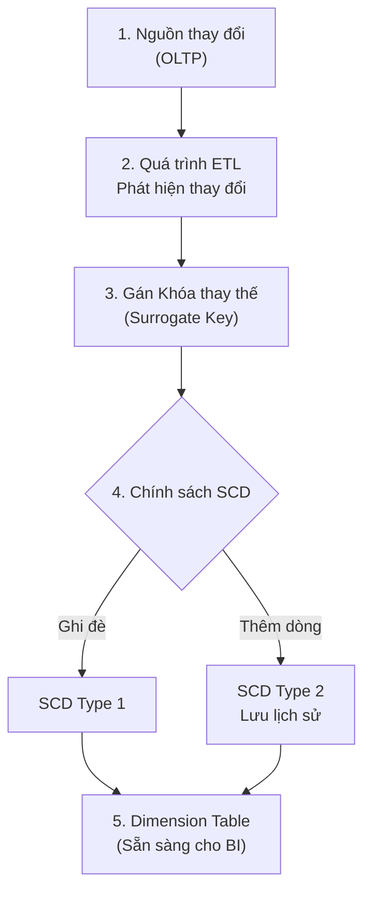

Nếu bạn mở một bảng sự kiện (Fact Table) trong kho dữ liệu ra và chỉ thấy những con số khô khan như `revenue = 500,000` hay `quantity = 10`, bạn sẽ không thể biết được ý nghĩa thực sự của chúng. 500,000 này là doanh thu bán sản phẩm nào? Ai là người mua? Mua ở chi nhánh nào? Vào thời gian nào?

Để trả lời những câu hỏi mang tính ngữ cảnh đó, chúng ta cần đến **Dimension Table (Bảng chiều)**. Trong Lược đồ hình sao ([Star Schema](/concepts/data-warehouse/star-schema/)), nếu Fact Table là tâm điểm chứa các con số đo lường, thì các bảng Dimension bao quanh chính là linh hồn giúp biến dữ liệu thô vô cảm thành những thông tin kinh doanh có giá trị.

## Bảng chiều (Dimension Table) thực chất là gì?

**Dimension Table (Bảng chiều)** là một bảng cơ sở dữ liệu chuyên biệt trong [Data Warehouse](/concepts/data-warehouse/data-warehouse/) dùng để lưu trữ các thuộc tính mang tính mô tả (Descriptive Attributes). Nó cung cấp câu trả lời cho các câu hỏi về ngữ cảnh: *"Ai? Cái gì? Ở đâu? Khi nào? Như thế nào?"*.

Một bảng chiều tiêu chuẩn thường có các đặc điểm vật lý sau:
1. **Thiết kế "Rộng" (Wide)**: Chứa rất nhiều cột thuộc tính mô tả chi tiết (ví dụ: bảng `dim_customer` có thể có tới hàng chục, thậm chí hàng trăm cột như Tên, Tuổi, Giới tính, Email, Địa chỉ, Phân khúc,...).
2. **Kích thước dòng "Nông" (Shallow)**: So với bảng Fact chứa hàng tỷ dòng giao dịch, bảng Dimension thường có kích thước nhỏ hơn rất nhiều, dao động từ vài trăm dòng (như bảng chi nhánh) cho tới vài triệu dòng (như bảng khách hàng lớn).
3. **Sử dụng Khóa thay thế ([Surrogate Key](/concepts/data-warehouse/surrogate-key/))**: Bảng chiều sử dụng một khóa chính tự sinh dạng số nguyên (`INT`/`BIGINT`) làm khóa chính thay vì dùng ID gốc của hệ thống nguồn.

## Tại sao chúng ta cần tách biệt bảng chiều?

Trong thiết kế cơ sở dữ liệu phân tích, việc gộp chung tất cả thông tin mô tả sản phẩm hay khách hàng vào chung một bảng giao dịch khổng lồ là một thảm họa. Nó sẽ làm cho bảng giao dịch phình to một cách khủng khiếp, ngốn tài nguyên lưu trữ và kéo sập hiệu năng truy vấn của hệ thống.

Bằng cách tách các thuộc tính mô tả ra các bảng Dimension độc lập, chúng ta đạt được khả năng **tái sử dụng (Reusability)** cực kỳ cao. Một bảng sản phẩm chuẩn `dim_product` có thể được JOIN linh hoạt với bảng doanh số (`fact_sales`), bảng hàng tồn kho (`fact_inventory`) và bảng kế hoạch doanh thu (`fact_budget`), tạo nên một mạng lưới báo cáo đồng nhất và nhất quán cho toàn bộ doanh nghiệp.

## 3 Triết lý cốt lõi khi thiết kế bảng chiều

* **Phi chuẩn hóa (Denormalization)**: Trái ngược với cơ sở dữ liệu vận hành ([OLTP](/concepts/database-storage/oltp/)) vốn cố gắng phân rã bảng để tránh trùng lặp dữ liệu, bảng Dimension trong Data Warehouse lại ưu tiên phi chuẩn hóa để tăng tốc độ đọc. Tên danh mục, tên thương hiệu được lưu trực tiếp ngay cạnh tên sản phẩm trong cùng một bảng, chấp nhận trùng lặp thông tin để tránh các phép JOIN phức tạp khi người dùng truy vấn.
* **Nặng về văn bản (Text-heavy)**: Hầu hết các cột trong bảng chiều là kiểu chuỗi ký tự (`VARCHAR`). Chúng sinh ra để hiển thị trực tiếp lên các trục tiêu đề hoặc bộ lọc (Filters/Slicers) trên các dashboard BI (Tableau, Power BI).
* **Tính đồng nhất (Conformed Dimensions)**: Đây là yếu tố sống còn của một Data Warehouse. Nếu phòng bán hàng và phòng kho cùng sử dụng chung một bảng `dim_product` duy nhất, doanh nghiệp có thể dễ dàng đối chiếu số lượng bán và số lượng tồn kho trên cùng một báo cáo. Việc thiết kế sai lệch, mỗi phòng ban dùng một bảng Dimension riêng sẽ dẫn đến tình trạng "Silo dữ liệu" — nơi số liệu của các bộ phận không bao giờ khớp nhau.

### Ví dụ về cấu trúc một bảng chiều sản phẩm (`dim_product`) phi chuẩn hóa:

| product_key (PK - Surrogate) | product_id (Natural Key) | product_name | category_name | brand_name | unit_cost | is_active |
| :--- | :--- | :--- | :--- | :--- | :--- | :--- |
| **101** | PRD-001 | iPhone 15 Pro | Điện thoại di động | Apple | 900.00 | True |
| **102** | PRD-002 | Galaxy S24 Ultra | Điện thoại di động | Samsung | 850.00 | True |
| **103** | PRD-003 | MacBook Pro 16 | Máy tính xách tay | Apple | 2000.00 | True |

*Nhận xét*: Các chuỗi chữ như `Điện thoại di động` hay `Apple` được lưu lặp đi lặp lại. Trong Star Schema, đây là một tính năng tối ưu chủ động để tăng tốc độ đọc, không phải là lỗi thiết kế.

---

## Từ hệ thống nguồn đến bảng chiều trên Data Warehouse

Quy trình cập nhật dữ liệu của bảng chiều diễn ra như sau:


1. Người dùng thay đổi thông tin (ví dụ: cập nhật số điện thoại mới) trên hệ thống nguồn CRM/ERP.
2. Công cụ ETL quét và phát hiện ra sự thay đổi này.
3. Hệ thống sinh ra hoặc liên kết với một Khóa thay thế (Surrogate Key).
4. Tùy thuộc vào quy trình quản lý thay đổi **SCD (Slowly Changing Dimension)**:
   * **SCD Type 1**: Ghi đè trực tiếp thông tin mới lên dòng cũ (chấp nhận mất lịch sử).
   * **SCD Type 2**: Chèn thêm một dòng mới với Surrogate Key mới để lưu lại lịch sử thông tin cũ của khách hàng.
5. Bảng chiều sạch sẽ sẵn sàng phục vụ người dùng kéo thả báo cáo trên BI tools.

---

## Một ví dụ kinh điển: Bảng chiều thời gian (`dim_date`)

Một trong những Dimension quan trọng nhất của mọi Data Warehouse là bảng chiều thời gian. Thay vì dùng các hàm tính toán ngày tháng của SQL trực tiếp trên bảng Fact (rất chậm), Data Warehouse thiết kế hẳn một bảng chứa lịch vật lý.

### Câu lệnh SQL khởi tạo bảng `dim_date`

```sql
CREATE TABLE dim_date (
    date_key INT PRIMARY KEY,         -- Định dạng YYYYMMDD (ví dụ: 20260607)
    full_date DATE,
    day_of_week INT,
    day_name VARCHAR(15),             -- 'Sunday', 'Monday'
    is_weekend BOOLEAN,
    calendar_month INT,               -- 1 -> 12
    calendar_quarter INT,             -- 1 -> 4
    calendar_year INT,
    fiscal_year INT,                  -- Năm tài chính
    holiday_name VARCHAR(50),         -- Tên ngày lễ
    is_holiday BOOLEAN
);
```

**Tại sao chúng ta phải làm việc này?**
Nếu ban giám đốc yêu cầu: *"Hãy thống kê doanh thu bán hàng của các ngày nghỉ lễ trong năm tài chính 2026"*. 
Nếu không có bảng `dim_date`, bạn sẽ phải viết một câu lệnh SQL phức tạp chứa hàng loạt hàm `CASE WHEN` để kiểm tra lịch (như mùng 1 Tết Âm Lịch hay Lễ Quốc khánh rơi vào ngày dương lịch nào). Còn nếu có bảng chiều thời gian, câu truy vấn chỉ đơn giản là lọc điều kiện:
`WHERE is_holiday = TRUE AND fiscal_year = 2026`.

---

## "Bí kíp" thực chiến & Những sự đánh đổi

### Kinh nghiệm thiết kế tốt (Best Practices)
* **Lưu thông tin mô tả tường minh**: Tránh lưu các mã code viết tắt khó hiểu trong bảng chiều (ví dụ `status = 'C'`). Hãy giải mã nó thành cột mô tả dễ hiểu ở lớp ETL: `status_description = 'Completed'`. Người dùng BI không có nhiệm vụ phải nhớ các mã kỹ thuật của bạn.
* **Luôn sử dụng Surrogate Keys**: Khóa chính của bảng chiều bắt buộc phải là một số nguyên tự tăng do Data Warehouse tự quản lý. Nếu hệ thống nguồn đột ngột thay đổi quy tắc đặt ID của họ, Surrogate Key sẽ giúp bảo vệ toàn bộ cấu trúc JOIN bên trong Data Warehouse không bị ảnh hưởng.
* **Tạo dòng giá trị mặc định**: Hãy tạo sẵn một dòng dữ liệu mặc định ở đầu bảng chiều với `ID = -1` mang ý nghĩa "Unknown" (Không xác định). Khi bảng Fact nạp dữ liệu bị thiếu mất thông tin khóa ngoại, chúng ta sẽ trỏ khóa ngoại đó về `-1` thay vì để NULL.

### Những sai lầm phổ biến cần tránh
* **Ám ảnh với việc chuẩn hóa**: Việc chia nhỏ bảng chiều (ví dụ: tách bảng nhóm sản phẩm ra khỏi bảng sản phẩm) sẽ phá vỡ lược đồ Star Schema, biến nó thành Snowflake Schema. Điều này làm tăng số lượng phép JOIN vật lý và làm giảm hiệu năng truy vấn của hệ thống đáng kể.
* **Đưa các thuộc tính biến đổi quá nhanh vào bảng chiều**: Đưa các trường thay đổi liên tục theo từng phút (ví dụ: số lần click chuột của user) vào bảng chiều khách hàng. Việc này sẽ khiến hệ thống SCD Type 2 bị quá tải và phình to bộ nhớ do phải sinh ra quá nhiều dòng lịch sử. Những thông tin này nên được chuyển sang bảng Fact hoặc bảng Mini-dimension riêng.

### Đánh đổi (Trade-offs)
* **Dung lượng lưu trữ vs. Hiệu năng**: Phi chuẩn hóa bảng chiều sẽ làm tăng dung lượng đĩa cứng do dữ liệu chữ bị lặp đi lặp lại. Tuy nhiên, trong thời đại ổ đĩa đám mây giá rẻ hiện nay, đây là sự đánh đổi hoàn toàn xứng đáng để lấy tốc độ truy vấn vượt trội.
* **Độ phức tạp của ETL**: Việc quản lý lịch sử thay đổi (SCD Type 2) yêu cầu code ETL phải xử lý logic đóng dòng cũ, mở dòng mới rất cẩn thận, làm tăng khối lượng công việc phát triển pipeline.

---

## Góc phỏng vấn

### 1. Tại sao Dimension 'Date' (Thời gian) lại được thiết kế thành một bảng vật lý riêng biệt thay vì dùng trực tiếp các hàm xử lý ngày tháng của SQL?
* **Gợi ý trả lời**: Có hai lý do chính:
  1. **Hiệu năng**: Nếu chạy các hàm xử lý ngày tháng (như `EXTRACT()`, `DATE_TRUNC()`) trực tiếp trên bảng Fact hàng tỷ dòng, hệ thống sẽ phải thực hiện tính toán trên từng dòng dữ liệu, ngốn rất nhiều CPU. Việc JOIN với bảng `dim_date` qua khóa phụ dạng số nguyên (`date_key`) sẽ giúp tối ưu hóa tốc độ truy vấn nhanh hơn rất nhiều.
  2. **Logic nghiệp vụ đặc thù**: SQL không thể tự biết ngày nào là ngày nghỉ lễ tết của Việt Nam, ngày thành lập công ty hay chu kỳ năm tài chính (Fiscal Year) riêng của từng doanh nghiệp. Bảng `dim_date` được tính toán sẵn sẽ giúp thống nhất định nghĩa thời gian cho toàn bộ hệ thống.

### 2. Sự khác biệt giữa Natural Key và Surrogate Key trong Dimension Table là gì?
* **Gợi ý trả lời**:
  * **Natural Key (Khóa tự nhiên)**: Là khóa định danh sinh ra từ hệ thống ứng dụng nguồn (ví dụ: số CMND/CCCD, mã sản phẩm `SKU-1002`). Nó mang ý nghĩa nghiệp vụ cụ thể.
  * **Surrogate Key (Khóa thay thế)**: Là một dãy số nguyên tuần tăng (1, 2, 3...) vô nghĩa do chính hệ thống Data Warehouse tự sinh ra để làm khóa chính.
  * **Tại sao dùng Surrogate Key**: Khi một nhân viên chuyển phòng ban, nếu dùng Natural Key, chúng ta chỉ có thể ghi đè (UPDATE) thông tin mới và mất đi thông tin lịch sử. Bằng cách dùng Surrogate Key, chúng ta có thể tạo ra 2 dòng dữ liệu với 2 Surrogate Key khác nhau cho cùng một Natural Key của nhân viên đó, giúp dễ dàng theo dõi lịch sử thay đổi thông tin (SCD Type 2).

---

## Khái niệm liên quan
* [Fact Table](/concepts/data-warehouse/fact-table/)
* [Slowly Changing Dimension (SCD)](/concepts/data-warehouse/slowly-changing-dimension/)

## Tài liệu tham khảo

1. [O'Reilly: The Data Warehouse Toolkit, 3rd Edition](https://www.oreilly.com/library/view/the-data-warehouse/9781118530801/) - Ralph Kimball and Margy Ross's foundational book on [dimensional modeling](/concepts/data-warehouse/dimensional-modeling/) and dimension table design.
2. [Snowflake Documentation: Designing Dimension Tables](https://docs.snowflake.com/) - Best practices and modeling principles for optimized dimensions in [Snowflake](/concepts/cloud-data-platform/snowflake/).
3. [Databricks Documentation: Slowly Changing Dimensions (SCD)](https://docs.databricks.com/en/delta-live-tables/cdc.html) - Technical guide to implementing and running SCD Type 1 and Type 2 updates in [Delta Lake](/concepts/data-lake-lakehouse/delta-lake/).
4. [Monte Carlo Data: Dimensional Modeling 101](https://www.montecarlodata.com/blog-dimensional-modeling-101/) - Detailed blog post explaining how dimensions provide descriptive context to metrics in modern data architectures.
5. [Databricks Blog: Dimensional Modeling in the Modern Data Lakehouse](https://www.databricks.com/blog/2022/06/24/dimensional-modeling-in-the-modern-data-lakehouse.html) - Strategic guide on deploying star schemas and dimension tables on modern cloud lakehouses.

## English Summary

A Dimension Table is a highly denormalized, wide, and text-heavy structure in a dimensional model (Star Schema) that stores descriptive context—the "who, what, where, when, and why"—associated with the quantitative metrics found in Fact Tables. By isolating categorical attributes, hierarchies, and labels (such as customer demographics or product details) and linking them to facts via system-generated Surrogate Keys, dimension tables enable intuitive filtering, grouping, and drill-down analysis for business intelligence tools. The strategic implementation of "Conformed Dimensions" ensures that different data marts across an enterprise share a common truth, preventing isolated data silos.