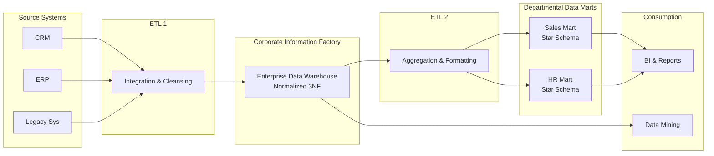

Khi thiết kế và xây dựng một kho dữ liệu trung tâm (Data Warehouse) cho doanh nghiệp, bạn sẽ nhanh chóng nhận ra đây không chỉ là một bài toán kỹ thuật lập trình đơn thuần. Đó là cuộc chiến về mặt kiến trúc và triết lý quản trị dữ liệu. Trong lịch sử phát triển của ngành, hai trường phái lớn luôn đứng đối lập nhau. Một bên là tư duy thực tiễn, nhanh gọn của Ralph Kimball; bên còn lại là sự chặt chẽ, quy chuẩn và mang tính hệ thống cao của Bill Inmon — người vẫn được cả thế giới kính trọng gọi là "Cha đẻ của Data Warehouse".

## Tổng quan: Lời giải của Bill Inmon cho bài toán dữ liệu lớn

Theo định nghĩa nguyên bản của Bill Inmon, Data Warehouse là: *"Một tập hợp dữ liệu hướng chủ đề (subject-oriented), được tích hợp (integrated), thay đổi theo thời gian (time-variant) và không biến động (non-volatile) để hỗ trợ quá trình ra quyết định của ban quản lý."*

Phương pháp luận Inmon (thường gắn liền với mô hình **Corporate Information Factory - CIF**) đề xuất cách tiếp cận "từ trên xuống" (Top-down). Trọng tâm của triết lý này là xây dựng một Kho dữ liệu doanh nghiệp (Enterprise Data Warehouse - EDW) tập trung, lưu giữ toàn bộ thông tin lịch sử của tổ chức ở mức chi tiết nhất. Kho dữ liệu này được thiết kế theo mô hình quan hệ chuẩn hóa nghiêm ngặt (thường là dạng Third Normal Form - 3NF) nhằm loại bỏ tối đa sự dư thừa dữ liệu, tạo nên một "nguồn chân lý duy nhất" (Single Source of Truth) vững chắc trước khi phân phối ra ngoài phục vụ phân tích.

## Tại sao triết lý Inmon lại ra đời?

Hãy tưởng tượng một tập đoàn đa quốc gia có hàng trăm hệ thống giao dịch ([OLTP](/concepts/database-storage/oltp/)) khác nhau hoạt động độc lập. Nếu cho phép mỗi phòng ban tự định nghĩa các bảng dữ liệu (Data Mart) theo nhu cầu riêng (Bottom-up), về lâu dài hệ thống sẽ rơi vào trạng thái mâu thuẫn thông tin nghiêm trọng. Phòng Marketing báo cáo số lượng khách hàng hoạt động một kiểu, phòng Tài chính lại ra một con số hoàn toàn khác do cách định nghĩa logic lệch nhau.

Tư duy kiến trúc của Inmon ra đời để giải quyết triệt để hai bài toán lớn ở quy mô doanh nghiệp lớn:

1. **Quản trị dữ liệu chặt chẽ ([Data Governance](/concepts/governance-metadata/data-governance/))**: Do tính chất không trùng lặp của chuẩn hóa 3NF, mọi thay đổi về cấu trúc kinh doanh của doanh nghiệp chỉ cần được khai báo và cập nhật tại một điểm duy nhất (Core EDW) mà không sợ ảnh hưởng dây chuyền đến các bảng khác.
2. **Bảo toàn dữ liệu nguyên tử (Atomic Data)**: Dữ liệu được lưu trữ ở mức độ chi tiết nguyên bản nhất. Điều này cực kỳ quan trọng cho các hoạt động kiểm toán, đối soát tài chính hoặc khai phá dữ liệu (Data Mining) của các nhà khoa học dữ liệu — những tác vụ mà cấu trúc tổng hợp của [Star Schema](/concepts/data-warehouse/star-schema/) (Kimball) đôi khi vô tình làm mất mát thông tin.

## Triết lý cốt lõi: Top-down và Chuẩn hóa 3NF

Phương pháp luận Inmon được xây dựng trên ba trụ cột chính:

1. **Enterprise Data Warehouse (EDW) làm trung tâm**: Mọi nguồn dữ liệu thô từ hệ thống ERP, CRM phải quy tụ về một nơi, được làm sạch và mô hình hóa theo cấu trúc thực thể quan hệ (ER Model) chuẩn hóa 3NF. EDW này được thiết kế để bao quát toàn bộ bức tranh của doanh nghiệp chứ không phục vụ riêng lẻ một phòng ban nào.
2. **Data Marts phụ thuộc (Dependent Data Marts)**: Vì cấu trúc chuẩn hóa 3NF của EDW rất phức tạp và đòi hỏi nhiều phép JOIN khi truy vấn, người dùng kinh doanh (Business Users) sẽ không trực tiếp khai thác trên lớp này. Thay vào đó, đội ngũ IT sẽ định kỳ trích xuất dữ liệu từ EDW, phi chuẩn hóa chúng để tạo ra các Data Mart dạng Star Schema nhỏ gọn, dễ dùng cho từng phòng ban (Sales, HR, Marketing).
3. **Đồng bộ hóa nguồn chân lý**: Do tất cả các Data Mart phòng ban đều được sinh ra từ một nguồn EDW 3NF trung tâm, tính nhất quán về mặt số liệu trên toàn tập đoàn luôn được bảo đảm tuyệt đối.

## Sơ đồ kiến trúc Nhà máy thông tin doanh nghiệp (CIF)

Kiến trúc Corporate Information Factory (CIF) theo triết lý Inmon được mô tả qua sơ đồ dưới đây:


*Lưu ý quan trọng: Nhờ kiến trúc này, các bộ phận nghiên cứu chuyên sâu (Data Science/Data Mining) có thể bỏ qua lớp Data Mart và chọc thẳng vào Core EDW (3NF) để khai thác nguồn dữ liệu chi tiết thô nguyên bản.*

## Minh họa thực tế: Mô hình hóa dữ liệu Khách hàng chuẩn 3NF

Thay vì tạo một bảng khách hàng phẳng và rộng chứa đầy đủ thông tin địa chỉ (`dim_customer` theo phong cách Kimball), Inmon yêu cầu tách biệt hoàn toàn các thực thể để triệt tiêu sự trùng lặp dữ liệu:

**1. Bảng Khách Hàng cốt lõi (`edw_customer`)**

```sql
CREATE TABLE edw_customer (
    customer_id INT PRIMARY KEY,
    first_name VARCHAR(50),
    last_name VARCHAR(50),
    gender CHAR(1),
    date_of_birth DATE
);
```

**2. Bảng Địa chỉ (`edw_address`)**

```sql
CREATE TABLE edw_address (
    address_id INT PRIMARY KEY,
    street VARCHAR(255),
    city VARCHAR(100),
    state VARCHAR(50),
    zip_code VARCHAR(20)
);
```

**3. Bảng Ánh xạ trung gian (`edw_customer_address`) để giải quyết quan hệ nhiều-nhiều (N-N)**

```sql
CREATE TABLE edw_customer_address (
    customer_id INT,
    address_id INT,
    address_type VARCHAR(20), -- 'Home', 'Office'
    is_current BOOLEAN,
    FOREIGN KEY (customer_id) REFERENCES edw_customer(customer_id),
    FOREIGN KEY (address_id) REFERENCES edw_address(address_id)
);
```

Sau khi cấu trúc 3NF này được hoàn thiện trong Core EDW, quy trình [ETL](/concepts/etl-elt/etl/) thứ hai (ETL 2) mới tiến hành tổng hợp, nối các bảng này lại thành một bảng duy nhất để đẩy ra Sales Data Mart cho nhân viên kinh doanh làm báo cáo doanh thu.

## Quy tắc thực thi thành công

* **Đầu tư nghiêm túc cho giai đoạn thiết kế mô hình (Data Modeling)**: Thiết kế mô hình dữ liệu doanh nghiệp (Enterprise Data Model) chuẩn 3NF là công việc vô cùng phức tạp. Dự án cần sự dẫn dắt của các kiến trúc sư dữ liệu dày dặn kinh nghiệm để phác thảo sơ đồ toàn cảnh trước khi tiến hành viết code.
* **Tự động hóa hoàn toàn luồng cấp liệu cấp hai**: Phải đảm bảo quy trình chuyển dịch dữ liệu từ EDW 3NF xuống các Data Mart phòng ban được tự động hóa mượt mà, tránh tạo ra điểm nghẽn cổ chai làm chậm tiến độ nhận báo cáo của doanh nghiệp.
* **Mở rộng giá trị cốt lõi cho Advanced Analytics**: Hãy tận dụng tối đa kho dữ liệu 3NF bằng cách mở cổng cho các nhà khoa học dữ liệu (Data Scientists) truy cập trực tiếp. Dữ liệu lịch sử chi tiết ở dạng hạt mịn chưa qua tổng hợp chính là nguồn tài nguyên vô giá để huấn luyện các mô hình Machine Learning.

## Những cái bẫy "đốt tiền" của kiến trúc Inmon

* **Tham vọng ôm đồm quá mức ("Boiling the Ocean")**: Sai lầm kinh điển nhất của các dự án theo triết lý Inmon là cố gắng mô hình hóa hoàn hảo 100% dữ liệu của toàn bộ tập đoàn thành cấu trúc 3NF ngay từ ngày đầu tiên. Điều này thường khiến dự án kéo dài nhiều năm, đốt hàng triệu USD ngân sách mà không đem lại bất kỳ giá trị kinh doanh thực tế nào trong thời gian dài. Bạn nên áp dụng phương pháp cuốn chiếu: làm từng mảng chủ đề nghiệp vụ một.
* **Cho phép người dùng Business truy vấn trực tiếp vào Core EDW**: Việc để những nhân viên không chuyên về kỹ thuật viết các câu truy vấn SQL JOIN hàng chục bảng 3NF với nhau sẽ gây nghẽn băng thông hệ thống nghiêm trọng và dễ dẫn đến các câu lệnh tính toán sai lệch logic. Hãy luôn hướng họ sử dụng các Data Mart được thiết kế riêng.

## Cân đo đong đếm được và mất (Trade-offs)

### Ưu điểm
* **Nguồn chân lý duy nhất vững chãi**: Dữ liệu có tính toàn vẹn và độ tin cậy tuyệt đối, loại bỏ hoàn toàn sự trùng lặp và dư thừa thông tin.
* **Dễ dàng bảo trì và mở rộng dài hạn**: Việc chỉnh sửa logic hoặc tích hợp thêm một hệ thống nghiệp vụ mới vào kiến trúc 3NF diễn ra rất tự nhiên và ít gây xáo trộn cho cấu trúc tổng thể.
* **Khai thác tối đa năng lực Data Science**: Lưu giữ trọn vẹn dữ liệu ở mức độ chi tiết nguyên tử sâu nhất.

### Nhược điểm
* **Thời gian triển khai lâu (High Time-to-Value)**: Do yêu cầu thiết kế tổng thể bài bản ngay từ đầu, doanh nghiệp sẽ phải chờ đợi một khoảng thời gian khá dài (có thể lên tới hàng năm) trước khi nhận được các báo cáo đầu tiên.
* **Đòi hỏi đội ngũ nhân sự chất lượng cao**: Yêu cầu các kỹ sư dữ liệu và kiến trúc sư hệ thống phải có trình độ chuyên môn rất sâu sắc.
* **Gánh nặng chi phí ETL**: Bạn phải xây dựng và vận hành song song hai quy trình ETL độc lập (Nguồn $\rightarrow$ EDW 3NF và EDW 3NF $\rightarrow$ Data Marts).

## Khi nào nên dùng và khi nào không?

**Nên chọn Inmon khi:**
* Bạn thiết kế kho dữ liệu cho các tổ chức quy mô rất lớn, cấu trúc nghiệp vụ phức tạp và yêu cầu quản trị dữ liệu cực kỳ khắt khe như Ngân hàng, Viễn thông, Bảo hiểm, nơi tính toàn vẹn và khả năng kiểm toán dữ liệu là ưu tiên số một.
* Doanh nghiệp có tiềm lực tài chính dài hạn ổn định cùng đội ngũ kỹ sư dữ liệu chuyên nghiệp.
* Doanh nghiệp có định hướng phát triển mạnh mẽ mảng Khoa học dữ liệu (Data Science) song song với Báo cáo quản trị (BI).

**Không nên chọn Inmon khi:**
* Các công ty khởi nghiệp (Startups) hoặc doanh nghiệp vừa và nhỏ cần xây dựng nhanh các Dashboard báo cáo để phục vụ ra quyết định kinh doanh tức thì. Trong trường hợp này, phương pháp luận Kimball sẽ là sự lựa chọn kinh tế và hiệu quả hơn.

## Các khái niệm liên quan

* [Kimball Methodology (Phương pháp luận Kimball)](/concepts/data-warehouse/kimball-methodology/)
* [Data Warehouse (Kho dữ liệu)](/concepts/data-warehouse/data-warehouse/)
* Third Normal Form (3NF - Dạng chuẩn hóa mức 3)

## Góc phỏng vấn: Đối đáp tự tin cùng nhà tuyển dụng

### 1. Tại sao Bill Inmon lại quyết định chọn mô hình chuẩn hóa 3NF để thiết kế lõi Data Warehouse thay vì sử dụng mô hình Star Schema như Ralph Kimball?
* **Mục đích câu hỏi**: Đánh giá sự thấu hiểu của ứng viên về các triết lý quản trị dữ liệu ở quy mô doanh nghiệp lớn.
* **Gợi ý trả lời**: Bill Inmon ưu tiên tính toàn vẹn dữ liệu và khả năng quản lý quy mô lâu dài của cả một tập đoàn lớn. Mô hình Star Schema chấp nhận lưu trữ dữ liệu dư thừa (phi chuẩn hóa) để đổi lấy tốc độ đọc và sự đơn giản khi truy vấn. Tuy nhiên, trong một kho dữ liệu trung tâm chứa thông tin của hàng trăm phòng ban, nếu có sự thay đổi về mặt logic nghiệp vụ, việc cập nhật dữ liệu dư thừa trên diện rộng sẽ tiềm ẩn rủi ro rất cao gây ra lỗi bất đồng bộ dữ liệu. Chuẩn hóa 3NF đảm bảo nguyên tắc: *"Mỗi thông tin chỉ được lưu trữ duy nhất một lần"*, giúp giảm thiểu chi phí cập nhật, dễ dàng mở rộng và tạo dựng một "Nguồn chân lý duy nhất" vững chắc cho toàn bộ tổ chức.

### 2. Hãy so sánh sự khác biệt cơ bản về vai trò và cách định nghĩa của Data Mart giữa hai phương pháp luận Inmon và Kimball?
* **Mục đích câu hỏi**: Đảm bảo ứng viên phân biệt rõ ràng hai kiến trúc thiết kế Data Warehouse kinh điển.
* **Gợi ý trả lời**:
  * Theo phương pháp luận **Kimball (Bottom-up)**: Data Mart đóng vai trò là viên gạch nền móng đầu tiên. Kho dữ liệu doanh nghiệp (EDW) thực chất là tập hợp của nhiều Data Mart được liên kết lại với nhau thông qua các chiều dữ liệu chung (Conformed Dimensions). Các Data Mart lấy dữ liệu trực tiếp từ vùng đệm Staging.
  * Theo phương pháp luận **Inmon (Top-down)**: Data Mart là sản phẩm thứ cấp (Dependent Data Mart). Bạn bắt buộc phải xây dựng thành công Core EDW theo chuẩn 3NF trước. Sau đó, dữ liệu của các Data Mart phòng ban mới được trích xuất và tổng hợp ra từ lõi EDW này, tuyệt đối không lấy trực tiếp từ nguồn thô.

### 3. Trong kiến trúc Inmon, khi phát sinh nhu cầu xây dựng một Data Mart mới cho phòng ban, quy trình triển khai của đội ngũ dữ liệu sẽ diễn ra như thế nào?
* **Mục đích câu hỏi**: Đánh giá khả năng quy hoạch và thiết lập quy trình ETL/[ELT](/concepts/etl-elt/elt/) hai tầng theo đúng chuẩn Corporate Information Factory.
* **Gợi ý trả lời**: Luồng công việc sẽ được thực hiện tuần tự theo các bước:
  1. Đội ngũ dữ liệu sẽ kiểm tra xem các trường thông tin cần thiết phục vụ cho phòng ban đó đã có sẵn trong Core EDW (3NF) chưa.
  2. Nếu chưa có, chúng tôi sẽ tiến hành viết luồng ETL thứ nhất (ETL 1) để kéo dữ liệu thô từ hệ thống nguồn vào vùng Staging, làm sạch và nạp vào Core EDW dưới dạng mô hình chuẩn hóa 3NF.
  3. Sau khi dữ liệu đã nằm an toàn trong Core EDW, chúng tôi sẽ viết luồng ETL thứ hai (ETL 2) để thực hiện các phép gom nhóm, tính toán và phi chuẩn hóa dữ liệu từ Core EDW 3NF ra thành các bảng Star Schema chuyên biệt nằm trong Data Mart của phòng ban đó.

## Tài liệu tham khảo

1. [Building the Data Warehouse, 4th Edition](https://www.oreilly.com/library/view/building-the-data/9780764599446/) - W.H. Inmon's foundational book defining the architecture and principles of data warehousing on O'Reilly.
2. [Corporate Information Factory, 2nd Edition](https://www.oreilly.com/library/view/corporate-information-factory/9780471399612/) - W.H. Inmon, Claudia Imhoff, and Ryan Sousa's guide to the CIF framework on O'Reilly.
3. [What is a Data Warehouse?](https://www.databricks.com/glossary/data-warehouse) - An entry in the Databricks Glossary outlining the Inmon Top-Down methodology and Corporate Information Factory design.
4. [Difference between Kimball and Inmon](https://www.geeksforgeeks.org/difference-between-kimball-and-inmon/) - Comparison of architecture, deployment, and data modeling between the two schools of thought on GeeksforGeeks.
5. [Kimball vs. Inmon: Two School of Thoughts](https://www.holistics.io/books/setup-analytics/kimball-vs-inmon-two-schools-of-thought/) - Structured comparison of the two classic approaches to data warehouse design from the Holistics Analytics Setup Guide.

## English Summary

The Inmon Methodology, established by Bill Inmon (the "Father of Data Warehousing"), dictates a top-down, data-driven approach to constructing an Enterprise Data Warehouse (EDW). Central to this philosophy is the Corporate Information Factory (CIF), where all enterprise data is integrated into a highly normalized (typically 3NF) centralized repository to establish an infallible "Single Source of Truth." Instead of querying this complex 3NF core directly, business users consume data through secondary, dependent Data Marts (often modeled as Star Schemas) extracted and aggregated from the EDW. While Inmon’s approach guarantees unparalleled data integrity, lack of redundancy, and robust scalability for huge enterprises, it suffers from a significantly slower time-to-value and requires rigorous up-front data modeling compared to the Kimball method.