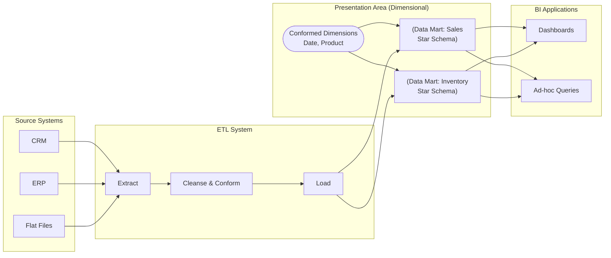

Khi bắt tay vào xây dựng kho dữ liệu ([Data Warehouse](/concepts/data-warehouse/data-warehouse/)) cho doanh nghiệp, một trong những thách thức lớn nhất không nằm ở khâu viết code hay quản trị phần cứng. Thử thách thực sự là làm sao để cấu trúc đống dữ liệu khổng lồ, hỗn độn kia thành một mô hình trực quan, dễ hiểu với người dùng kinh doanh (Business Users) và mang lại tốc độ truy vấn báo cáo nhanh nhất. Để giải quyết bài toán này, phần lớn các doanh nghiệp hiện nay đều lựa chọn đi theo triết lý thực tiễn và vô cùng mạnh mẽ của Ralph Kimball: **Phương pháp luận Kimball** (Kimball Methodology).

## Khởi đầu từ nhu cầu thực tiễn

Kimball Methodology là một framework toàn diện được phát triển bởi chuyên gia Ralph Kimball để xây dựng hệ thống báo cáo quản trị (Business Intelligence - BI) và Kho dữ liệu (Data Warehouse). 

Trái ngược với cách chuẩn hóa dữ liệu chặt chẽ ở các cơ sở dữ liệu quan hệ truyền thống (như dạng chuẩn 3NF), phương pháp Kimball chủ trương **phi chuẩn hóa (denormalization)** dữ liệu để chia thành hai loại bảng rõ rệt:
* **Fact Tables (Bảng sự kiện)**: Đóng vai trò là trung tâm, lưu giữ các chỉ số đo lường định lượng (facts/metrics) của các giao dịch kinh doanh (ví dụ: số lượng sản phẩm bán ra, doanh thu, chiết khấu).
* **Dimension Tables (Bảng chiều)**: Lưu giữ các thông tin mô tả ngữ cảnh xung quanh sự kiện đó (Ví dụ: ai mua, mua ở đâu, mua khi nào, sản phẩm gì).

Mối liên kết giữa bảng Fact và các bảng Dimension tạo thành **Star Schema (Lược đồ hình sao)** — đây chính là nền tảng cốt lõi của mọi hệ thống dữ liệu thiết kế theo chuẩn Kimball.

## Tại sao chúng ta cần đến phương pháp luận Kimball?

Vào những năm 1990, khi các doanh nghiệp cố gắng sử dụng mô hình thực thể quan hệ chuẩn hóa mức 3NF cho mục đích làm báo cáo phân tích, họ nhanh chóng đập đầu vào hai bức tường lớn:

1. **Hiệu năng truy vấn nghèo nàn**: Để cho ra một báo cáo tổng hợp doanh thu, hệ thống phải thực hiện các phép JOIN qua hàng chục bảng dữ liệu chuẩn hóa khác nhau. Điều này ngốn sạch tài nguyên CPU/RAM của database và khiến thời gian tải báo cáo kéo dài hàng giờ.
2. **Khoảng cách về mặt ngôn ngữ**: Mô hình 3NF mô tả cấu trúc dữ liệu theo góc nhìn kỹ thuật của phần mềm. Nó hoàn toàn xa lạ và cực kỳ khó hiểu đối với tư duy nghiệp vụ của những người làm kinh doanh.

Ralph Kimball đã phá vỡ các rào cản này bằng cách tổ chức lại dữ liệu theo đúng cách mà doanh nghiệp vận hành và đánh giá hiệu quả kinh doanh của họ, ưu tiên tối đa cho tốc độ đọc dữ liệu và tính trực quan dễ tiếp cận.

## Triết lý cốt lõi: Tiếp cận "Từ dưới lên" (Bottom-up)

Kiến trúc Kimball được xây dựng dựa trên nguyên lý **Bottom-up (Từ dưới lên)** thông qua ba khái niệm then chốt:

1. **Xây dựng theo từng Data Mart**: Kho dữ liệu của doanh nghiệp không cần phải hoàn thiện hoành chỉnh toàn bộ ngay từ đầu. Chúng ta sẽ xây dựng dần dần theo dạng cuốn chiếu qua các dự án nhỏ gọi là Data Mart. Mỗi Data Mart phục vụ riêng cho một quy trình kinh doanh cụ thể (Ví dụ: Bán hàng, Tồn kho, Quản lý nhân sự).
2. **Conformed Dimensions (Chiều dùng chung)**: Đây chính là trái tim của kiến trúc Kimball. Để ngăn các Data Mart biến thành các "ốc đảo dữ liệu" (Data Silos) rời rạc không liên quan đến nhau, Kimball bắt buộc các Data Mart phải chia sẻ chung một bộ bảng Dimension cốt lõi (Ví dụ: dùng chung bảng ngày `dim_date`, bảng khách hàng `dim_customer`, bảng sản phẩm `dim_product`).
3. **Enterprise Data Warehouse (EDW) tích hợp**: Trong triết lý Kimball, EDW không phải là một siêu cơ sở dữ liệu khổng lồ tập trung từ đầu. Nó đơn giản là sự hợp nhất logic của tất cả các Data Mart phòng ban được liên kết chặt chẽ với nhau thông qua cơ chế Conformed Dimensions (hay còn gọi là kiến trúc Data Warehouse Bus).

## Quy trình 4 bước thiết kế mô hình đa chiều chuẩn Kimball

Để tạo dựng một mô hình dữ liệu đa chiều hiệu quả, Kimball đưa ra quy trình thiết kế gồm 4 bước kinh điển:

1. **Chọn quy trình nghiệp vụ (Select the Business Process)**: Xác định rõ quy trình thực tế nào cần phân tích (ví dụ: quy trình quét mã thanh toán tại quầy siêu thị).
2. **Khai báo mức độ chi tiết (Declare the [Grain](/concepts/data-warehouse/grain/))**: Định nghĩa chính xác một dòng dữ liệu trong bảng Fact đại diện cho sự kiện gì. Đây là bước quan trọng nhất để tránh các lỗi tính toán sai lệch sau này (ví dụ: *"Mỗi dòng là một mặt hàng được quét mã vạch trên một hóa đơn"*).
3. **Xác định các chiều (Identify the Dimensions)**: Xác định các ngữ cảnh mô tả xung quanh sự kiện (như Ngày mua, Cửa hàng, Khách hàng, Sản phẩm).
4. **Xác định các chỉ số đo lường (Identify the Facts)**: Định nghĩa các con số có thể cộng gộp để đo lường hiệu quả (như Số lượng bán, Đơn giá, Giá trị chiết khấu).

## Sơ đồ kiến trúc 4 tầng trong hệ thống Kimball

Kiến trúc hệ thống dữ liệu theo Kimball được chia thành 4 tầng rõ rệt:



* **Operational [Source Systems](/concepts/foundation/source-systems/)**: Nguồn dữ liệu vận hành hàng ngày của doanh nghiệp.
* **[ETL](/concepts/etl-elt/etl/) System (Tầng trích xuất - biến đổi - nạp)**: Tầng xử lý kỹ thuật phức tạp nhất. Tại đây dữ liệu được làm sạch, đồng nhất định dạng, xử lý sự thay đổi lịch sử (SCD) và tạo ra các khóa thay thế (Surrogate Keys).
* **Presentation Area**: Lớp lưu trữ vật lý phục vụ truy vấn. Dữ liệu bắt buộc phải nằm ở dạng Star Schema dễ hiểu.
* **BI Applications**: Các công cụ trực quan hóa (Tableau, PowerBI) kết nối trực tiếp vào Presentation Area để vẽ Dashboard.

## Thực chiến: Thiết kế Data Mart Bán hàng dạng Star Schema

Dưới đây là đoạn code SQL thiết kế bảng Fact Bán hàng (`fact_sales`) tuân thủ nghiêm ngặt theo triết lý Kimball:

```sql
-- Dimensional Modeling / Star Schema
CREATE TABLE fact_sales (
    date_key INT,               -- Conformed
    store_key INT,              -- Conformed
    product_key INT,            -- Conformed
    customer_key INT,           -- Conformed
    cashier_key INT,
    ticket_number VARCHAR(50),  -- Degenerate dimension
    quantity INT,
    unit_price DECIMAL(10,2),
    discount_amount DECIMAL(10,2),
    -- Surrogate key cho fact (tùy chọn)
    sales_fact_key BIGINT PRIMARY KEY
);
```

## Những quy tắc "vàng" khi triển khai

* **Luôn bám sát quy trình 4 bước**: Đừng bao giờ bỏ qua bước 2 (Declare the Grain). Việc xác định sai mức độ mịn dữ liệu sẽ phá hỏng toàn bộ logic tính toán khi bạn chạy các hàm tổng hợp `SUM` hay `COUNT`.
* **Luôn luôn sử dụng Surrogate Keys (Khóa thay thế)**: Đối với các bảng Dimension, tuyệt đối không sử dụng ID tự nhiên của hệ thống nguồn (Natural Key) làm khóa chính. Hãy tự tạo một khóa thay thế dạng số nguyên tự tăng (`INT`). Điều này giúp cải thiện hiệu năng JOIN của database và hỗ trợ quản lý lịch sử thay đổi thông tin (SCD Type 2) một cách trơn tru.
* **Xây dựng Ma trận Bus Matrix từ trước**: Thiết lập một bảng ma trận biểu diễn mối quan hệ giữa các Quy trình nghiệp vụ (hàng dọc) và các Chiều dữ liệu dùng chung (hàng ngang). Đây chính là tấm bản đồ quy hoạch tổng thể giúp bạn giữ vững hướng đi khi xây dựng hệ thống dữ liệu cho doanh nghiệp.
* **Nói KHÔNG với giá trị Null ở [Fact Table](/concepts/data-warehouse/fact-table/)**: Đảm bảo tất cả các cột khóa ngoại trong Fact Table đều trỏ đến một bản ghi hợp lệ trong [Dimension Table](/concepts/data-warehouse/dimension-table/). Nếu dữ liệu nguồn bị khuyết, hãy hướng nó về một dòng mặc định trong bảng Dim (ví dụ: `-1: Chưa xác định`).

## Những sai lầm kinh điển cần tránh

* **Snowflaking vô tội vạ**: Nhiều kỹ sư có thói quen chuẩn hóa các bảng Dimension quá sâu (ví dụ: tách bảng nhóm sản phẩm con ra khỏi bảng sản phẩm gốc để tạo thành [Snowflake Schema](/concepts/data-warehouse/snowflake-schema/)). Việc này làm tăng số lượng phép JOIN khi người dùng viết SQL, làm giảm tốc độ truy vấn và làm mất đi tính trực quan vốn có của Star Schema.
* **Thiếu sự đồng thuận về Conformed Dimensions**: Mỗi phòng ban tự định nghĩa một bảng khách hàng hoặc sản phẩm riêng trong Data Mart của mình. Kết quả là báo cáo số liệu của phòng Sales và phòng Kế toán không bao giờ khớp nhau, gây tranh cãi lớn trong nội bộ doanh nghiệp.
* **Trộn lẫn các mức Grain trong Fact Table**: Nhét chung thông tin tổng đơn hàng (Header) và thông tin chi tiết từng món hàng (Line Item) vào cùng một bảng Fact, dẫn đến lỗi tính trùng lặp số liệu.

## Cân đo đong đếm được và mất (Trade-offs)

### Điểm cộng
* **Thân thiện với người dùng**: Cấu trúc dữ liệu trực quan, mô tả đúng ngôn ngữ kinh doanh của doanh nghiệp.
* **Thời gian ra mắt nhanh (Time-to-Value)**: Tiếp cận Bottom-up cho phép doanh nghiệp nhanh chóng hoàn thiện các Data Mart đầu tiên (chỉ khoảng 3-4 tháng) để đưa vào sử dụng ngay thay vì phải chờ đợi thiết kế toàn tập đoàn.
* **Hiệu năng truy vấn xuất sắc**: Cấu trúc Star Schema ít phép JOIN, cực kỳ tối ưu cho các hệ thống phân tích dữ liệu [OLAP](/concepts/database-storage/olap/).

### Điểm trừ
* **Gánh nặng đẩy hết về tầng ETL**: Việc xử lý làm sạch dữ liệu và đồng nhất cấu trúc để tạo ra các Conformed Dimensions đòi hỏi kỹ năng lập trình đường ống ETL cực kỳ phức tạp và tốn nhiều công sức bảo trì.
* **Thiếu lớp lưu trữ chuẩn hóa trung tâm**: Do không xây dựng một kho dữ liệu trung tâm chuẩn hóa (3NF) như Inmon, việc truy xuất lại dữ liệu thô nguyên bản chưa được đưa vào mô hình Dimension sau này sẽ gặp nhiều khó khăn.

## Khi nào nên dùng và khi nào không?

**Nên chọn Kimball khi:**
* Doanh nghiệp cần nhìn thấy kết quả thực tế (ROI) sớm từ dự án dữ liệu.
* Phương thức tiêu thụ dữ liệu chính là thông qua các công cụ báo cáo trực quan BI (Tableau, PowerBI, Looker).
* Bạn muốn hỗ trợ người dùng tự xây dựng báo cáo (Self-service BI) mà không cần phụ thuộc quá nhiều vào đội ngũ kỹ thuật.

**Không nên chọn Kimball khi:**
* Mục tiêu của bạn chỉ là tích hợp dữ liệu giữa các ứng dụng với nhau (Application-to-Application integration) mà không có nhu cầu phân tích đa chiều.
* Các bài toán khai phá dữ liệu (Data Science) đòi hỏi nguồn dữ liệu thô phẳng, nguyên bản chưa qua xử lý định hình ngữ nghĩa.

## Các khái niệm liên quan

* [Inmon Methodology (Phương pháp luận Inmon)](/concepts/data-warehouse/inmon-methodology/)
* [Dimensional Modeling (Mô hình hóa chiều)](/concepts/data-warehouse/dimensional-modeling/)
* [Star Schema (Lược đồ hình sao)](/concepts/data-warehouse/star-schema/)
* [Slowly Changing Dimension (SCD - Chiều thay đổi chậm)](/concepts/data-warehouse/slowly-changing-dimension/)

## Góc phỏng vấn: Đối đáp tự tin cùng nhà tuyển dụng

### 1. Hãy phân biệt sự khác nhau cơ bản giữa phương pháp luận Kimball (Bottom-up) và phương pháp luận Inmon (Top-down)?
* **Mục đích câu hỏi**: Đánh giá hiểu biết sâu sắc của ứng viên về hai trường phái thiết kế Data Warehouse kinh điển và khả năng tư duy hệ thống.
* **Gợi ý trả lời**:
  * **Inmon (Top-down)** hướng tới việc xây dựng một Kho dữ liệu doanh nghiệp (EDW) tập trung, chuẩn hóa ở mức 3NF trước tiên để đảm bảo tính toàn vẹn dữ liệu và loại bỏ hoàn toàn sự trùng lặp. Từ kho trung tâm này, dữ liệu mới được bóc tách ra các Data Mart phòng ban để phục vụ phân tích. Cách này ưu tiên tính quản trị dữ liệu chặt chẽ ở quy mô lớn, bảo trì dễ dàng nhưng thời gian triển khai rất lâu.
  * **Kimball (Bottom-up)** đi ngược lại bằng cách xây dựng các Data Mart dạng Star Schema phục vụ trực tiếp cho từng quy trình kinh doanh trước để nhanh chóng đem lại giá trị sử dụng. Các Data Mart này được liên kết chặt chẽ với nhau thông qua bộ Dimension dùng chung (Conformed Dimensions) tạo thành một Enterprise DWH dạng Bus. Cách này ưu tiên tính trực quan, tốc độ truy vấn nhanh và thời gian triển khai ngắn.

### 2. Tại sao khái niệm Conformed Dimensions lại được coi là yếu tố sống còn trong kiến trúc kho dữ liệu thiết kế theo phương pháp Kimball?
* **Mục đích câu hỏi**: Kiểm tra khả năng nhận diện điểm yếu của mô hình Bottom-up và cách giải quyết bài toán Data Silos.
* **Gợi ý trả lời**: Vì kiến trúc Kimball không xây dựng một kho dữ liệu trung tâm chuẩn hóa 3NF để làm trung gian đồng nhất dữ liệu. EDW của Kimball thực chất là sự ghép nối logic giữa các Data Mart. Nếu không có Conformed Dimensions (ví dụ: dùng chung bảng khách hàng, sản phẩm), các Data Mart của phòng Sales, phòng Marketing sẽ hoạt động như các ốc đảo độc lập với các định nghĩa khác nhau. Điều này khiến chúng ta không thể tạo ra các báo cáo xuyên suốt doanh nghiệp (Cross-functional reporting) và làm mất đi tính nhất quán số liệu toàn công ty.

### 3. Nguyên tắc tối thượng của Kimball đối với vấn đề xử lý các mức độ chi tiết (Grain) khác nhau trong Fact Table là gì? Bạn sẽ thiết kế thế nào nếu gặp trường hợp này?
* **Mục đích câu hỏi**: Đánh giá tư duy thiết kế mô hình dữ liệu thực chiến và khả năng xử lý bài toán chênh lệch độ mịn dữ liệu.
* **Gợi ý trả lời**: Nguyên tắc bất di bất dịch của Kimball là **tuyệt đối không trộn lẫn các mức Grain khác nhau trong cùng một Fact Table**.
  Nếu gặp tình huống dữ liệu ở các mức độ chi tiết khác nhau (ví dụ: dữ liệu kế hoạch ngân sách được giao theo Tháng, còn doanh thu thực tế ghi nhận theo Ngày), tôi bắt buộc phải tách chúng thành hai Fact Table độc lập (ví dụ bảng `fact_monthly_budget` và bảng `fact_daily_sales`).
  Khi người dùng có nhu cầu viết câu truy vấn so sánh giữa mục tiêu và thực tế, chúng ta sẽ thực hiện tổng hợp (Roll-up) bảng doanh thu thực tế lên cấp độ Tháng trước, rồi mới JOIN hai bảng này lại với nhau thông qua chiều dùng chung (Conformed Dimensions) như `dim_date` hay `dim_product`. Kỹ thuật này được gọi là Drill-across.

## Tài liệu tham khảo

1. [The Data Warehouse Toolkit, 3rd Edition](https://www.oreilly.com/library/view/the-data-warehouse/9781118530801/) - Ralph Kimball and Margy Ross's definitive book on dimensional modeling on O'Reilly.
2. [Kimball Dimensional Modeling Techniques](https://www.kimballgroup.com/data-warehouse-business-intelligence-resources/kimball-techniques/) - Official Kimball Group registry of dimensional modeling design techniques.
3. [Dimensional Modeling](https://en.wikipedia.org/wiki/Dimensional_modeling) - Wikipedia's overview of dimensional modeling design concepts, star schemas, and Kimball's data warehouse bus architecture.
4. [Difference between Kimball and Inmon](https://www.geeksforgeeks.org/difference-between-kimball-and-inmon/) - Comparison of Kimball and Inmon data warehouse architectures on GeeksforGeeks.
5. [Kimball vs. Inmon: Two School of Thoughts](https://www.holistics.io/books/setup-analytics/kimball-vs-inmon-two-schools-of-thought/) - Structured comparison of the two leading data warehousing schools of thought in the Holistics Analytics Setup Guide.

## English Summary

The Kimball Methodology, developed by Ralph Kimball, is a business-driven, bottom-up approach to designing Data Warehouses. It abandons strict ER normalization (3NF) in favor of Dimensional Modeling—specifically the Star Schema—separating data into Fact Tables (quantitative metrics) and Dimension Tables (descriptive context). Kimball advocates building independent, process-specific Data Marts iteratively, which are logically bound together into an Enterprise Data Warehouse using Conformed Dimensions (the Data Warehouse Bus Architecture). This methodology prioritizes query performance, rapid ROI, and business user understandability, heavily pushing the complexity of data cleansing and integration into the ETL layer.
