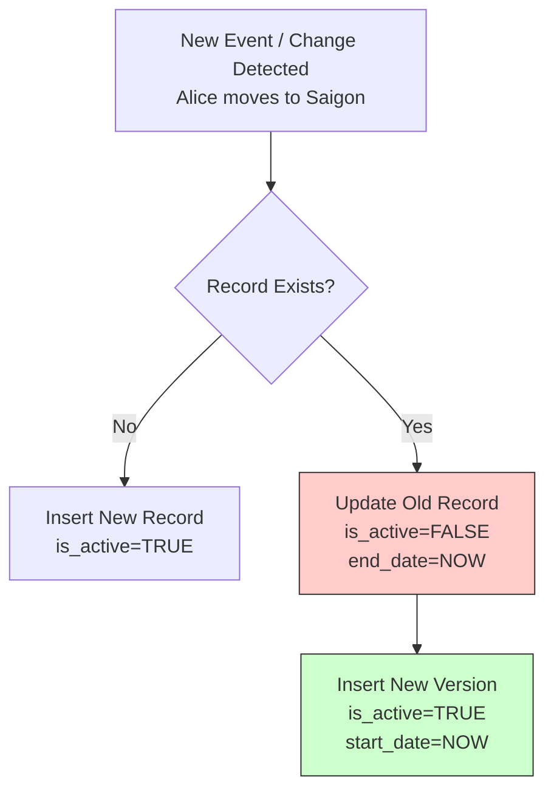

Trong quá trình xây dựng Data Warehouse, một trong những thách thức lớn nhất đối với Data Engineer là làm thế nào để lưu trữ và phân tích chính xác lịch sử thay đổi của dữ liệu. Khách hàng có thể chuyển địa chỉ nhà, nhân viên được thăng chức hoặc chuyển chi nhánh, sản phẩm được cập nhật công thức đóng gói mới. 

Những thông tin mô tả này không thay đổi liên tục từng giây từng phút, mà chúng thay đổi một cách từ từ theo thời gian. Kỹ thuật quản lý những thay đổi này được gọi là **Slowly Changing Dimension (SCD - Chiều thay đổi chậm)**.

## Kiến trúc và Nguyên lý hoạt động của Slowly Changing Dimension

**Slowly Changing Dimension (SCD)** là tập hợp các phương pháp thiết kế trong Data Warehouse nhằm quản lý và lưu trữ thông tin lịch sử của các thuộc tính trong bảng chiều (Dimension Table). 

Khi dữ liệu nguồn thay đổi, SCD định nghĩa cách thức hệ thống ETL/ELT ghi nhận sự thay đổi đó vào kho dữ liệu. Mục tiêu tối thượng của SCD là đảm bảo tính chính xác theo thời gian (point-in-time accuracy), giúp các báo cáo phân tích phản ánh đúng ngữ cảnh lịch sử tại thời điểm sự kiện diễn ra.

## Tại sao chúng ta cần SCD? Bài toán "John chuyển vùng công tác"

Hãy tưởng tượng một kịch bản thực tế sau:

Anh **John** là một nhân viên bán hàng xuất sắc của công ty. Trong tháng 1, anh làm việc tại khu vực **Hà Nội** và mang về 100 đơn hàng. Sang tháng 2, anh được điều chuyển công tác vào chi nhánh **TP.HCM** và bán thêm được 50 đơn hàng.

* **Nếu chúng ta làm như database nguồn (OLTP)**: Chỉ đơn giản chạy lệnh `UPDATE` cập nhật khu vực của John thành "TP.HCM".
* **Hậu quả**: Khi ban giám đốc mở báo cáo doanh thu lũy kế theo khu vực, toàn bộ 100 đơn hàng của tháng 1 (vốn được bán ở Hà Nội) sẽ bị tính gộp vào doanh số của TP.HCM. Báo cáo lịch sử của Hà Nội lập tức bị hụt số liệu và sai lệch hoàn toàn.

SCD ra đời để ngăn chặn thảm họa báo cáo này bằng cách lưu giữ các "phiên bản" khác nhau của dữ liệu bảng chiều tương ứng với từng thời kỳ lịch sử.

## Các phương pháp SCD phổ biến: Từ đơn giản đến nâng cao

Tùy thuộc vào nhu cầu phân tích của doanh nghiệp, chúng ta có nhiều cách để xử lý thay đổi:

### SCD Type 0: Giữ nguyên gốc (Retain Original)
Hệ thống hoàn toàn bỏ qua mọi thay đổi từ nguồn. Dữ liệu ghi nhận lần đầu tiên sẽ được giữ nguyên mãi mãi.
* *Ứng dụng*: Phù hợp cho các thông tin bất biến như Ngày sinh, ID khách hàng gốc, Ngày đăng ký tài khoản.

### SCD Type 1: Ghi đè (Overwrite)
Hệ thống cập nhật đè dữ liệu mới trực tiếp lên dữ liệu cũ. Toàn bộ lịch sử thay đổi trước đó sẽ bị xóa bỏ vĩnh viễn. Mọi báo cáo chạy từ trước đến nay sẽ tự động cập nhật theo giá trị mới nhất.
* *Ứng dụng*: Dùng khi cần sửa lỗi chính tả (ví dụ gõ sai tên từ "Alise" thành "Alice") hoặc các thuộc tính không có giá trị phân tích lịch sử như số điện thoại, email cá nhân.

### SCD Type 2: Thêm dòng mới (Add New Row) - *Trọng tâm thiết kế*
Đây là loại SCD quan trọng nhất và được sử dụng rộng rãi nhất. Khi phát hiện thay đổi, hệ thống sẽ đánh dấu hết hạn dòng dữ liệu hiện tại và chèn thêm một dòng dữ liệu mới hoàn toàn với một Surrogate Key (khóa thay thế) mới.
* *Đặc điểm*: Yêu cầu bảng dimension có thêm các trường quản lý như `start_date`, `end_date`, và cờ `is_active`.
* *Ứng dụng*: Áp dụng cho hầu hết các chiều dữ liệu cốt lõi cần theo dõi lịch sử chuẩn xác như địa chỉ khách hàng, phòng ban nhân viên, giá sản phẩm.

### SCD Type 3: Thêm cột mới (Add New Column)
Hệ thống thêm một cột phụ vào bảng để lưu giá trị ngay trước đó. Cách này chỉ cho phép lưu giữ duy nhất một thế hệ lịch sử gần nhất mà không làm tăng số dòng trong bảng.
* *Ứng dụng*: Thường dùng khi doanh nghiệp muốn so sánh trực tiếp kết quả theo cấu trúc mới và cấu trúc cũ (ví dụ: doanh số theo mã phòng ban mới vs mã phòng ban cũ).

### Các loại nâng cao (Hybrid)
* **SCD Type 4**: Giữ thông tin hiện tại ở bảng chính (như Type 1) và đẩy toàn bộ lịch sử thay đổi vào một bảng riêng biệt (History Table) để tối ưu hóa kích thước bảng chính.
* **SCD Type 6 (1 + 2 + 3)**: Kết hợp cả ba kỹ thuật chính. Nó vừa thêm dòng mới (Type 2), vừa cập nhật thông tin hiện hành ở tất cả dòng cũ (Type 1), và lưu thông tin lịch sử ngang qua cột (Type 3).

## Chi tiết SCD Type 2: Trọng tâm của quản trị lịch sử

Hãy cùng xem cơ chế hoạt động của SCD Type 2 qua sơ đồ tư duy:



### Minh họa bằng dữ liệu thực tế:
**1. Trạng thái ban đầu:** Khách hàng Alice sống ở Hanoi.

| customer_sk (Surrogate Key) | customer_id (Natural Key) | name | city | is_active | start_date | end_date |
| :--- | :--- | :--- | :--- | :--- | :--- | :--- |
| **101** | CUS-99 | Alice | Hanoi | TRUE | 2025-01-01 | 9999-12-31 |

*(Mọi hóa đơn mua hàng của Alice trong giai đoạn này sẽ được liên kết với `customer_sk = 101`)*.

**2. Sự kiện:** Ngày `2026-06-07`, Alice chuyển nhà vào Saigon.

**3. Kết quả bảng `dim_customer` sau khi chạy ETL SCD Type 2:**

| customer_sk (Surrogate Key) | customer_id (Natural Key) | name | city | is_active | start_date | end_date |
| :--- | :--- | :--- | :--- | :--- | :--- | :--- |
| **101** | CUS-99 | Alice | Hanoi | FALSE | 2025-01-01 | **2026-06-07** |
| **102** | CUS-99 | Alice | Saigon | **TRUE** | **2026-06-07** | 9999-12-31 |

*(Kể từ ngày 2026-06-07, các giao dịch mua hàng mới của Alice sẽ liên kết với khóa mới `customer_sk = 102`. Các hóa đơn cũ trước đó vẫn giữ nguyên liên kết với khóa `101`. Lịch sử mua hàng theo khu vực được bảo toàn chính xác tuyệt đối!).*

### Công thức tự động hóa SCD Type 2 với dbt Snapshot

Viết code SQL thuần để xử lý logic Update dòng cũ và Insert dòng mới rất phức tạp và dễ nhầm lẫn. Trong Modern Data Stack, công cụ **dbt (Data Build Tool)** hỗ trợ giải quyết việc này vô cùng ngắn gọn thông qua tính năng **dbt Snapshots**:

```sql


{{
    config(
      target_schema='snapshots',
      unique_key='customer_id',
      strategy='check',
      # Theo dõi sự thay đổi trên cột 'city'
      check_cols=['city'],
    )
}}

SELECT
    customer_id,
    name,
    city
FROM {{ source('raw_data', 'customers') }}


```

Khi chạy tệp tin này, dbt sẽ tự động đối chiếu dữ liệu nguồn và đích, sinh ra mã SQL MERGE để cập nhật các trường thời gian hiệu lực (mặc định là `dbt_valid_from` và `dbt_valid_to`) mà không cần bạn phải can thiệp thủ công.

## Sai lầm thường gặp và Best Practices

* **Bắt buộc sử dụng Surrogate Key (Khóa thay thế)**: SCD Type 2 không thể tồn tại nếu thiếu Surrogate Key. Nếu bạn dùng Natural Key (như mã định danh gốc `customer_id = CUS-99`) làm khóa chính, cơ sở dữ liệu sẽ báo lỗi trùng lặp khóa chính (Primary Key Violation) ngay khi bạn insert dòng phiên bản thứ hai của khách hàng đó.
* **Đặt mốc thời gian kết thúc mặc định**: Thay vì để `end_date` của bản ghi đang hoạt động là `NULL`, hãy dùng một mốc thời gian xa xôi trong tương lai (ví dụ: `9999-12-31`). Kỹ thuật này giúp tối ưu hóa hiệu năng của câu lệnh `JOIN` khi dùng điều kiện `BETWEEN start_date AND end_date`, tránh các lỗi so sánh với giá trị `NULL`.
* **Tránh áp dụng Type 2 cho các thuộc tính thay đổi quá nhanh (Fast Changing)**: Nếu một thuộc tính thay đổi liên tục hàng ngày hoặc hàng giờ (như điểm tích lũy của khách hàng, số dư tài khoản), việc tạo dòng mới bằng SCD Type 2 sẽ khiến bảng Dimension phình to khủng khiếp. Trong trường hợp này, hãy tách thuộc tính đó ra một bảng Dimension phụ (Mini-Dimension) hoặc lưu trữ trực tiếp dưới dạng Fact Table.
* **Sử dụng Hash Key để tăng tốc độ đối chiếu**: Thay vì so sánh từng cột riêng lẻ để phát hiện sự thay đổi, hãy tạo một cột băm `row_hash` (ví dụ sử dụng thuật toán MD5 hoặc SHA-256) gộp tất cả các thuộc tính lại. Khi chạy ETL, bạn chỉ cần so sánh giá trị mã băm này giữa nguồn và đích để phát hiện nhanh chóng bản ghi nào có sự biến động.

### So sánh nhanh các loại SCD:

| Tiêu chí | SCD Type 1 (Ghi đè) | SCD Type 2 (Dòng mới) | SCD Type 3 (Cột mới) |
| :--- | :--- | :--- | :--- |
| **Theo dõi lịch sử** | Không | Đầy đủ, không giới hạn | Hạn chế (chỉ 1 phiên bản trước) |
| **Ảnh hưởng báo cáo** | Thay đổi toàn bộ lịch sử | Giữ đúng ngữ cảnh lịch sử | Cho phép so sánh song song |
| **Dung lượng lưu trữ** | Thấp, không đổi | Tăng liên tục theo biến động | Thấp, chỉ tăng nhẹ theo cột |
| **Mức độ phức tạp** | Rất thấp | Cao, yêu cầu Surrogate Key | Trung bình |

## Khái niệm liên quan

* [Dimension Table](/concepts/data-warehouse/dimension-table/): Bảng chiều chứa các thông tin mô tả ngữ cảnh.
* [Surrogate Key](/concepts/data-warehouse/surrogate-key/): Khóa thay thế nhân tạo trong thiết kế kho dữ liệu.
* [Data Warehouse](/concepts/data-warehouse/data-warehouse/): Kho dữ liệu tổng hợp phục vụ phân tích.

## Trọng tâm ôn luyện phỏng vấn

### 1. Tại sao Surrogate Key lại là điều kiện tiên quyết để triển khai SCD Type 2?
* **Gợi ý trả lời**: Trong SCD Type 2, một thực thể dữ liệu thực tế (ví dụ: một khách hàng cụ thể) sẽ có nhiều dòng dữ liệu trong bảng Dimension để mô tả các trạng thái của họ qua từng thời kỳ. Nếu dùng Natural Key (như mã ID khách hàng được sinh ra từ ứng dụng nguồn) làm khóa chính, hệ thống sẽ từ chối chèn dòng thứ hai do vi phạm ràng buộc duy nhất (Unique Constraint). 
  Vì vậy, chúng ta bắt buộc phải sinh ra một Surrogate Key (Khóa thay thế nhân tạo tự tăng) để làm khóa chính. Khóa này đảm bảo mỗi phiên bản lịch sử của khách hàng là một dòng duy nhất, giúp bảng Fact có thể tham chiếu chính xác đến đúng phiên bản của khách hàng tại thời điểm phát sinh giao dịch.

### 2. dbt hỗ trợ xử lý SCD Type 2 như thế nào? Nêu ưu điểm của nó.
* **Gợi ý trả lời**: dbt hỗ trợ triển khai SCD Type 2 tự động thông qua tính năng **dbt Snapshots**. Chúng ta chỉ cần khai báo bảng nguồn, khóa duy nhất và chiến lược theo dõi thay đổi (ví dụ: theo dõi cột `updated_at` hoặc quét tất cả các cột). 
  Ưu điểm lớn nhất là dbt tự động biên dịch và thực thi toàn bộ logic SQL MERGE/UPDATE/INSERT phức tạp bên dưới cơ sở dữ liệu. Nó tự động quản lý các cột mốc thời gian hiệu lực (`dbt_valid_from`, `dbt_valid_to`), giúp kỹ sư dữ liệu tiết kiệm thời gian viết và bảo trì các đường ống ETL rườm rà.

### 3. SCD Type 4 và SCD Type 6 khác nhau như thế nào? Khi nào nên chọn loại nào?
* **Gợi ý trả lời**: 
  * **SCD Type 4** tách biệt hoàn toàn dữ liệu hiện tại (nằm ở bảng chính) và lịch sử thay đổi (nằm ở một bảng lịch sử riêng). Điều này giữ cho bảng chính luôn gọn nhẹ và truy vấn nhanh.
  * **SCD Type 6 (1 + 2 + 3)** kết hợp cả 3 loại: thêm dòng mới (Type 2) để lưu lịch sử, ghi đè giá trị hiện tại lên tất cả các dòng cũ của khách hàng đó (Type 1), và dùng cột phụ để lưu giá trị trước đó (Type 3).
  * **Lựa chọn**: Chọn Type 4 khi bảng dimension thay đổi tương đối nhanh và bạn muốn bảo vệ hiệu năng đọc của bảng chính. Chọn Type 6 khi người dùng BI vừa muốn phân tích doanh số theo thuộc tính tại thời điểm mua (point-in-time), vừa muốn tổng hợp nhanh theo thuộc tính hiện tại mà không cần viết câu lệnh JOIN phức tạp.

## Tài liệu tham khảo

1. [The Data Warehouse Toolkit, 3rd Edition](https://www.oreilly.com/library/view/the-data-warehouse/9781118530801/) - Ralph Kimball's definitive guide to dimensional modeling and SCD patterns on O'Reilly.
2. [dbt Snapshots Documentation](https://docs.getdbt.com/docs/build/snapshots) - Official dbt guide on implementing SCD Type 2 using snapshots.
3. [Change Data Capture with Delta Live Tables](https://docs.databricks.com/en/delta-live-tables/cdc.html) - Official Databricks guide on applying changes (SCD Type 1 & Type 2) natively using Delta Live Tables.
4. Slowly Changing Dimensions in Snowflake with dbt - Snowflake blog post outlining design patterns for tracking historical dimension changes.
5. [Slowly Changing Dimension](https://en.wikipedia.org/wiki/Slowly_changing_dimension) - Wikipedia's overview of Slowly Changing Dimension types (Type 0 through Type 6).

## English Summary

Slowly Changing Dimensions (SCD) define the strategic methodologies used in Data Warehousing to manage and track changes to dimension attributes over time. 
* **SCD Type 1** simply overwrites existing data, destroying historical context but keeping the architecture simple. 
* **SCD Type 2** (the most prevalent) preserves complete history by expiring the old record (via timestamps) and inserting a new version of the record with a fresh Surrogate Key, ensuring "point-in-time" accuracy for Fact Table analysis. 
* **SCD Type 3** adds a new column to track only the immediate previous value.
Proper implementation of SCD Type 2 requires the strict usage of Surrogate Keys and careful ETL logic (often handled by modern tools like dbt Snapshots) to prevent rapid inflation of dimension tables.
