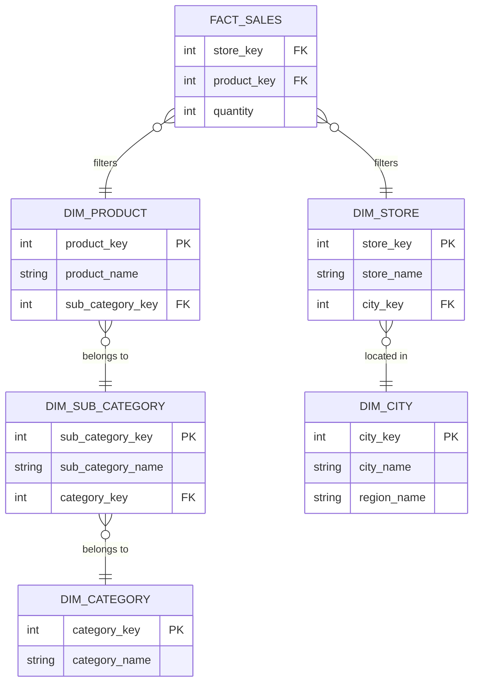

Khi bắt tay vào thiết kế mô hình dữ liệu đa chiều cho [Data Warehouse](/concepts/data-warehouse/data-warehouse/), lược đồ hình sao (Star Schema) thường là lựa chọn đầu tiên xuất hiện trong tâm trí các Data Engineer. Thế nhưng trong thực tế, khi đối mặt với những bảng chiều (Dimension Tables) có kích thước khổng lồ và chứa nhiều cấp độ phân cấp phức tạp, các kỹ sư dữ liệu đã phát triển một mô hình biến thể sâu hơn: **Snowflake Schema (Lược đồ bông tuyết)**.

## Snowflake Schema là gì? Hình dáng bông tuyết trong thiết kế kho dữ liệu

**Snowflake Schema** là một mô hình thiết kế Data Warehouse mở rộng từ Star Schema. Điểm khác biệt cốt lõi nằm ở chỗ: các bảng chiều (Dimension Tables) trong Snowflake Schema được **chuẩn hóa (normalization)** thành các bảng nhỏ hơn, chi tiết hơn. 

Khi vẽ sơ đồ quan hệ thực thể (ERD), bảng sự kiện ([Fact Table](/concepts/data-warehouse/fact-table/)) vẫn nằm ở trung tâm, nhưng các bảng chiều phân cấp kết nối chéo với nhau tỏa ra xung quanh, tạo thành hình dáng phức tạp giống như một bông tuyết.

Mô hình này bao gồm:
1. **Fact Table ở trung tâm**: Giữ nguyên vai trò như trong Star Schema – lưu trữ các khóa ngoại (Foreign Keys) liên kết và các chỉ số đo lường (Metrics/Measures).
2. **Dimension Tables phân cấp**: Thay vì bẻ phẳng toàn bộ thuộc tính vào một bảng duy nhất (phi chuẩn hóa), [Snowflake](/concepts/cloud-data-platform/snowflake/) tách các thông tin có tính phân cấp (hierarchy) thành các bảng tra cứu phụ (lookup tables) và liên kết ngược lại bảng chiều chính bằng khóa ngoại.

*Ví dụ*: Trong Star Schema, bảng `dim_product` chứa trực tiếp tên danh mục sản phẩm (Category) và thương hiệu (Brand). Trong Snowflake Schema, các thuộc tính này được tách ra thành hai bảng riêng biệt là `dim_category` và `dim_brand`, bảng `dim_product` lúc này chỉ lưu trữ khóa ngoại `category_id` và `brand_id`.

## Tại sao Snowflake Schema ra đời? Cuộc chiến chống lãng phí ổ đĩa

Lược đồ bông tuyết ra đời trong bối cảnh các hệ thống máy tính thời kỳ đầu có không gian lưu trữ (disk space) vô cùng đắt đỏ và hạn chế. Nó được thiết kế nhằm giải quyết hai điểm yếu lớn của Star Schema:

1. **Dư thừa dữ liệu (Data Redundancy)**: Việc bẻ phẳng dữ liệu của Star Schema làm cho các chuỗi văn bản dài bị lặp đi lặp lại hàng triệu lần (ví dụ: chữ "Electronics" được lưu trùng lặp ở mọi dòng sản phẩm thuộc danh mục này).
2. **Khó khăn khi bảo trì (Data Anomalies)**: Nếu doanh nghiệp muốn đổi tên danh mục từ "Electronics" thành "Consumer Electronics", hệ thống [ETL](/concepts/etl-elt/etl/) của Star Schema phải quét và cập nhật lại hàng vạn dòng dữ liệu. Với Snowflake, công việc này cực kỳ đơn giản: bạn chỉ cần cập nhật đúng một dòng duy nhất trong bảng `dim_category`.

## Nguyên lý hoạt động: Hành trình đi tìm thông tin qua nhiều lớp JOIN

Ý tưởng cốt lõi của Snowflake Schema là **tách các thuộc tính có tính phân cấp (Hierarchies) ra khỏi bảng dimension gốc**. 

Sự phân cấp xuất hiện rất nhiều trong vận hành kinh doanh:
* Phân cấp địa lý: *Quốc gia $\rightarrow$ Khu vực $\rightarrow$ Tỉnh/Bang $\rightarrow$ Cửa hàng*.
* Phân cấp sản phẩm: *Nhóm ngành $\rightarrow$ Danh mục $\rightarrow$ Phân loại con $\rightarrow$ Sản phẩm chi tiết*.

Thay vì nhồi nhét tất cả các cấp này vào một bảng duy nhất, Snowflake bẻ nhỏ chúng ra. Cấp độ dưới (ví dụ: Cửa hàng) sẽ trỏ lên cấp độ trên (ví dụ: Tỉnh/Bang) thông qua khóa ngoại. 

Hệ quả là khi người dùng muốn truy vấn tổng doanh số theo "Quốc gia", hệ thống sẽ phải thực hiện một chuỗi phép `JOIN` liên hoàn: từ Fact Table nối sang bảng Cửa hàng, cửa hàng nối sang Tỉnh/Bang, rồi từ đó mới nối tiếp sang Quốc gia để lấy tên hiển thị.

## Kiến trúc lược đồ bông tuyết

Hãy cùng quan sát sơ đồ thực thể (ERD) mẫu của một Snowflake Schema để thấy rõ tính phân nhánh của nó:


## Trải nghiệm thực tế: Khi Star Schema đối đầu Snowflake Schema qua câu SQL

Hãy cùng so sánh câu lệnh SQL truy vấn tổng doanh thu theo tên Danh mục Sản phẩm (Category) giữa hai mô hình:

### Trên Star Schema (Phi chuẩn hóa - Chỉ cần 1 phép JOIN)

```sql
SELECT p.category_name, SUM(f.revenue)
FROM fact_sales f
JOIN dim_product p ON f.product_key = p.product_key
GROUP BY p.category_name;
```

### Trên Snowflake Schema (Đã chuẩn hóa - Cần tới 3 phép JOIN liên tiếp)

```sql
SELECT c.category_name, SUM(f.revenue)
FROM fact_sales f
JOIN dim_product p ON f.product_key = p.product_key
JOIN dim_sub_category sc ON p.sub_category_key = sc.sub_category_key
JOIN dim_category c ON sc.category_key = c.category_key
GROUP BY c.category_name;
```

Rõ ràng, việc tăng số lượng phép `JOIN` làm cho câu lệnh SQL trở nên phức tạp hơn, đồng thời bắt buộc Database Engine phải tiêu tốn nhiều CPU để ánh xạ dữ liệu, làm giảm tốc độ phản hồi của truy vấn.

## Nghệ thuật áp dụng Snowflake Schema trong kỷ nguyên Cloud

Mặc dù Ralph Kimball – cha đẻ của mô hình hóa đa chiều – khuyên nên tránh thiết kế dạng Snowflake để tối ưu hóa hiệu năng, trong thực tế vẫn có những trường hợp Snowflake là lựa chọn hợp lý:

* ** Monster Dimensions (Bảng chiều siêu khổng lồ)**: Nếu bạn có một bảng `dim_customer` chứa hàng trăm triệu khách hàng và các thuộc tính nhân khẩu học (demographics) của họ thay đổi liên tục, việc tách phần thông tin nhân khẩu học thành một bảng phụ (Outrigger Table) liên kết là cách làm thông minh để dễ dàng bảo trì dữ liệu.
* **Sử dụng Database Views ảo**: Để che đi sự phức tạp của Snowflake Schema với người dùng cuối, bạn có thể tạo các Database Views ảo. View này thực hiện sẵn các phép `JOIN` phân cấp, biến Snowflake Schema thành một Star Schema ảo giúp các công cụ BI (như Power BI, Tableau) kết nối và truy vấn mượt mà.
* **Giới hạn số cấp phân cấp**: Đừng chia nhỏ dữ liệu quá mức (không nên vượt quá 2-3 cấp). Chia tách quá nhiều bảng sẽ khiến hiệu năng của Data Warehouse suy sụp nhanh chóng.

### So sánh ưu nhược điểm:

| Tiêu chí | Lược đồ hình sao (Star Schema) | Lược đồ bông tuyết (Snowflake Schema) |
| :--- | :--- | :--- |
| **Cấu trúc** | Phi chuẩn hóa (Denormalized), bảng phẳng | Chuẩn hóa (Normalized), nhiều bảng phân cấp |
| **Hiệu năng truy vấn** | Cực nhanh nhờ tối giản phép JOIN | Chậm hơn do phải thực hiện nhiều phép JOIN |
| **Dung lượng lưu trữ** | Tốn diện tích đĩa cứng do dư thừa dữ liệu | Tiết kiệm không gian lưu trữ tối đa |
| **Độ dễ sử dụng** | Rất thân thiện với Business Users | Phức tạp, dễ gây rối cho người dùng tự phục vụ |
| **Khả năng bảo trì** | Khó khăn khi cập nhật dữ liệu hàng loạt | Dễ dàng, hạn chế tối đa dị biệt dữ liệu |

## Khái niệm liên quan

* [Star Schema](/concepts/data-warehouse/star-schema/): Lược đồ hình sao – mô hình đơn giản và phổ biến nhất.
* [Dimensional Modeling](/concepts/data-warehouse/dimensional-modeling/): Phương pháp luận mô hình hóa dữ liệu đa chiều.
* Third Normal Form (3NF): Dạng chuẩn hóa dữ liệu thông thường trong các hệ thống [OLTP](/concepts/database-storage/oltp/).

## Góc phỏng vấn: Trả lời thông minh về Snowflake Schema

### 1. Phân tích sự đánh đổi (Trade-off) cốt lõi giữa Star Schema và Snowflake Schema?
* **Gợi ý trả lời**: Sự đánh đổi cốt lõi ở đây là giữa **Không gian lưu trữ (Storage)** và **Hiệu năng tính toán (Compute)**:
  * **Star Schema** ưu tiên tốc độ truy vấn bằng cách chấp nhận dư thừa dữ liệu (tốn bộ nhớ đĩa). Nó tối giản hóa số lượng phép `JOIN` để tối ưu tài nguyên tính toán (Compute) và giúp người dùng cuối dễ dàng tự truy vấn.
  * **Snowflake Schema** đi theo hướng ngược lại, ưu tiên tính toàn vẹn dữ liệu và tiết kiệm đĩa cứng bằng cách chuẩn hóa các bảng chiều. Tuy nhiên, cái giá phải trả là hệ thống phải thực hiện nhiều phép `JOIN` hơn, gây tốn tài nguyên CPU lúc truy vấn.
  Trong kỷ nguyên điện toán đám mây hiện nay, khi chi phí lưu trữ ngày càng rẻ và chi phí tính toán CPU/RAM trở nên đắt đỏ, Star Schema thường là thiết kế tối ưu và được ưa chuộng hơn.

### 2. Sự phổ biến của Database dạng cột (Columnar Storage) ảnh hưởng thế nào đến vị thế của Snowflake Schema?
* **Gợi ý trả lời**: Các Data Warehouse hiện đại (như BigQuery, Snowflake, Redshift) và các định dạng file lưu trữ cột (như Parquet) sử dụng các thuật toán nén dữ liệu cực kỳ mạnh mẽ (ví dụ: Dictionary Encoding). 
  Khi bạn lặp lại chữ "Electronics" 1 triệu lần trong một bảng Star Schema, hệ thống lưu trữ cột không thực tế ghi chuỗi đó 1 triệu lần xuống đĩa, mà chỉ lưu một từ điển ánh xạ nhỏ gọn. Cơ chế này đã loại bỏ hoàn toàn ưu điểm lớn nhất của Snowflake Schema là "tiết kiệm dung lượng đĩa". Vì vậy, trong các kiến trúc dữ liệu hiện đại, nhu cầu sử dụng Snowflake Schema đã giảm đi rất nhiều.

## Tài liệu tham khảo

1. [The Data Warehouse Toolkit, 3rd Edition](https://www.oreilly.com/library/view/the-data-warehouse/9781118530801/) - Ralph Kimball's guide detailing why star schemas are generally preferred over snowflake schemas on O'Reilly.
2. [What is Snowflake Schema?](https://www.databricks.com/glossary/snowflake-schema) - Definition, characteristics, and comparison of Snowflake Schema in the Databricks Glossary.
3. [Snowflake Schema](https://en.wikipedia.org/wiki/Snowflake_schema) - Wikipedia's overview of the snowflake schema model and database normalization for multidimensional tables.
4. [Snowflake Schema in Data Warehouse](https://www.geeksforgeeks.org/snowflake-schema-in-data-warehouse/) - Educational article explaining the architectural differences between star and snowflake schemas on GeeksforGeeks.
5. [Designing Data-Intensive Applications](https://www.oreilly.com/library/view/designing-data-intensive-applications/9781491903063/) - Martin Kleppmann's book discussing storage models, schemas, and analytical query performance on O'Reilly.

## English Summary

A Snowflake Schema is an extension of the Star Schema where the dimension tables are highly normalized into multiple related tables, forming a hierarchical, snowflake-like structure. While this normalization eliminates data redundancy, saves storage space, and simplifies maintenance when categorical hierarchy data changes, it severely impacts query performance due to the necessity of complex, multi-table joins. In modern data architecture, where storage is inexpensive and analytical databases heavily utilize columnar compression, the storage benefits of the Snowflake Schema are largely negated, making the Star Schema the preferred choice for performance and business-user simplicity.