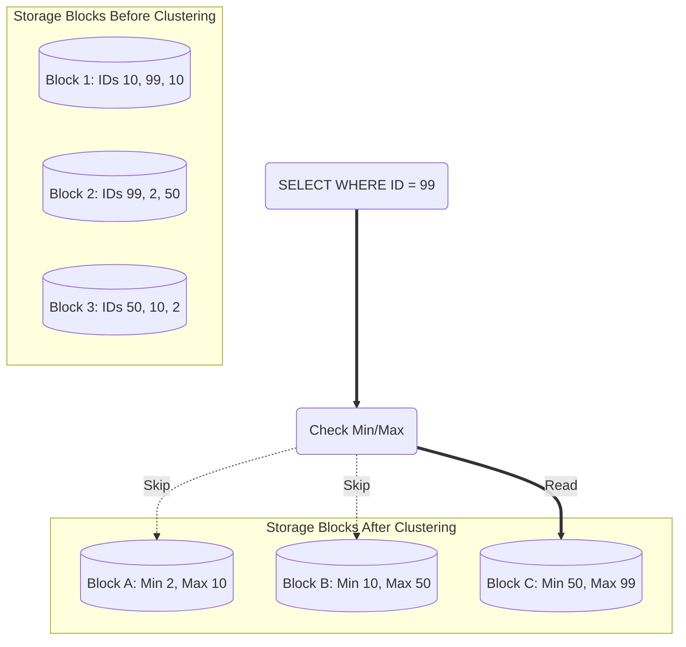

Trong các hệ thống Data Warehouse hiện đại, khi đối mặt với những bảng dữ liệu khổng lồ lên tới hàng trăm Terabytes, việc tối ưu hóa tốc độ truy vấn và giảm thiểu chi phí quét đĩa là mục tiêu hàng đầu của mọi Data Engineer. Bên cạnh kỹ thuật phân vùng quen thuộc (Partitioning), **Clustering (Phân cụm dữ liệu)** chính là "vũ khí tối thượng" thứ hai giúp bạn sắp đặt dữ liệu một cách thông minh nhất để tăng tốc hệ thống.

## Phân cụm dữ liệu (Clustering): Nghệ thuật sắp đặt vật lý tối ưu

Về mặt bản chất, **Clustering** là quá trình sắp xếp dữ liệu một cách vật lý trên ổ đĩa sao cho các bản ghi có giá trị tương đồng (dựa trên một hoặc nhiều cột được chỉ định trước) sẽ được đặt sát cạnh nhau trong cùng một khối lưu trữ `(block hoặc file)`. 

Hãy tưởng tượng bạn có một thư viện sách. Nếu Partitioning là việc phân chia sách vào các khu vực riêng như "Sách Văn học", "Sách Lịch sử" thì Clustering chính là việc sắp xếp các cuốn sách trong mỗi khu vực đó theo thứ tự tên tác giả để khi cần, bạn có thể tìm thấy ngay cuốn sách mình muốn mà không phải lục tung cả giá sách.

## Tại sao chúng ta cần Clustering?

Mặc dù Partitioning cực kỳ hiệu quả để lọc dữ liệu theo một chiều (như cột Thời gian), nhưng nó bắt đầu gặp giới hạn khi bạn cần lọc theo các tiêu chí khác chi tiết hơn.

Giả sử bạn đã phân vùng bảng dữ liệu theo Ngày. Bây giờ, một nhà phân tích gửi câu lệnh truy vấn: *"Tìm tất cả các giao dịch của khách hàng vip có `customer_id = 999` trong cả năm nay"*. 

Hệ thống sẽ dùng cơ chế loại bỏ phân vùng `(Partition Pruning)` để giới hạn tìm kiếm trong các file của năm nay. Tuy nhiên, bên trong các file đó, giao dịch của khách hàng số `999` lại nằm rải rác ở khắp mọi nơi. Ổ đĩa buộc phải quét qua toàn bộ khối lượng dữ liệu khổng lồ của năm nay chỉ để nhặt ra vài dòng dữ liệu của khách hàng này. Điều này cực kỳ lãng phí thời gian và tiền bạc.

Clustering sinh ra để giải quyết lỗ hổng này. Bằng cách ép các giao dịch của cùng một khách hàng nằm chung một chỗ trên đĩa cứng, hệ thống chỉ cần đọc đúng một vài block lưu trữ cụ thể thay vì quét toàn bộ file.

## Sự khác biệt giữa Partitioning và Clustering

Để áp dụng hiệu quả, chúng ta cần phân biệt rõ hai khái niệm này ở hai cấp độ:

* **Partitioning (Vĩ mô - Macro-level)**: Chia cắt dữ liệu thành các tệp tin hoặc thư mục vật lý hoàn toàn tách biệt. Phương pháp này chỉ phù hợp cho các cột có số lượng giá trị duy nhất ít `(low cardinality)` như Năm, Tháng, hoặc Quốc gia.
* **Clustering (Vi mô - Micro-level)**: Sắp xếp trật tự các dòng dữ liệu ngay bên trong các tệp tin đó. Phương pháp này đặc biệt lý tưởng cho các cột có số lượng giá trị duy nhất cực kỳ lớn `(high cardinality)` như `user_id`, `product_id`.

Khi lưu trữ dữ liệu, hệ thống sẽ tự động ghi lại thông tin giá trị Nhỏ nhất (Min) và Lớn nhất (Max) của cột Clustering trong từng block dữ liệu vào phần siêu dữ liệu (Metadata). Khi bạn thực hiện truy vấn tìm `customer_id = 999`, hệ thống sẽ kiểm tra Metadata trước. Nếu block A chỉ chứa dải khách hàng từ 100 đến 500, hệ thống sẽ lập tức bỏ qua block A mà không tốn một lượt đọc đĩa nào. Cơ chế này được gọi là **Block Pruning** hoặc **Zone Map filtering**.

## Cơ chế hoạt động của Clustering

Hãy quan sát sự thay đổi của các khối lưu trữ trước và sau khi được gom cụm:

**Dữ liệu thô trước khi Clustering (Sắp xếp lộn xộn theo thời gian đổ vào):**
* Block 1: `(User 10), (User 99), (User 10)`
* Block 2: `(User 99), (User 2), (User 50)`
* Block 3: `(User 50), (User 10), (User 2)`
*(Để tìm thông tin của User 10, hệ thống bắt buộc phải đọc cả 3 Blocks).*

**Dữ liệu sau khi Clustering (Sắp xếp có trật tự theo User ID):**
* Block A (Min 2, Max 10): `(User 2), (User 2), (User 10)`
* Block B (Min 10, Max 50): `(User 10), (User 10), (User 50)`
* Block C (Min 50, Max 99): `(User 50), (User 99), (User 99)`
*(Giờ đây, nếu cần tìm User 99, hệ thống kiểm tra metadata và biết chắc chỉ cần đọc Block C).*

Sơ đồ hóa quy trình quét dữ liệu thông minh này:



## Thực tế áp dụng trên Google BigQuery

Trong thực tế dự án, bạn sẽ thường kết hợp cả hai kỹ thuật này khi thiết kế bảng dữ liệu. Dưới đây là câu lệnh SQL tạo bảng mẫu trên Google BigQuery:

```sql
CREATE TABLE sales_data.transactions
(
  transaction_id STRING,
  customer_id STRING,
  product_category STRING,
  amount FLOAT64,
  transaction_date DATE
)
-- 1. Phân chia dữ liệu theo Tháng (Macro)
PARTITION BY DATE_TRUNC(transaction_date, MONTH)
-- 2. Gom cụm các giao dịch của cùng khách hàng và danh mục sản phẩm nằm cạnh nhau (Micro)
CLUSTER BY customer_id, product_category;
```

Khi một nhà phân tích chạy câu lệnh:
```sql
SELECT SUM(amount) 
FROM sales_data.transactions 
WHERE transaction_date = '2026-06-07' AND customer_id = 'CUST-123';
```

Hệ thống BigQuery sẽ thực hiện quy trình tối ưu hóa qua hai bước:
1. Nhảy thẳng vào phân vùng của Tháng 6/2026 (Nhờ cơ chế Partitioning).
2. Quét nhanh Metadata để chỉ đọc đúng Block chứa khóa `CUST-123` (Nhờ cơ chế Clustering).
Nhờ sự kết hợp này, dung lượng dữ liệu cần quét có thể giảm từ vài chục GB xuống chỉ còn vài MB, giúp tốc độ truy vấn tăng vọt và tiết kiệm chi phí sử dụng dịch vụ đám mây.

## Thiết kế Clustering sao cho chuẩn? (Best Practices)

* **Thứ tự khai báo các cột Clustering rất quan trọng**: Nếu bạn cấu hình Cluster theo danh sách `(Cột A, Cột B, Cột C)`, hệ thống sẽ ưu tiên gom nhóm theo cột A trước, rồi mới đến cột B và C. Nếu câu truy vấn của bạn chỉ lọc theo cột C mà không có cột A và B, cơ chế Clustering sẽ không hoạt động hiệu quả. Do đó, hãy luôn đặt cột hay được dùng trong mệnh đề `WHERE` nhất ở vị trí đầu tiên.
* **Không áp dụng Clustering cho bảng quá nhỏ**: Nếu kích thước bảng của bạn dưới 1 GB, hệ thống có thể tải toàn bộ bảng lên RAM để xử lý trong tích tắc. Chi phí quản lý và duy trì cấu trúc Cluster trong trường hợp này sẽ lớn hơn nhiều so với lợi ích thực tế nó mang lại.
* **Bảo trì và tái phân cụm**: Khi dữ liệu mới liên tục được thêm vào bảng `(INSERT)`, trật tự sắp xếp ban đầu sẽ bị phá vỡ và phân mảnh. Các hệ thống Data Warehouse hiện đại (như Snowflake hay BigQuery) thường tự động chạy các tác vụ Re-clustering ngầm để tái sắp xếp dữ liệu, tuy nhiên việc này sẽ tiêu tốn của bạn một lượng chi phí tính toán `(compute cost)` nhất định.

## Những sai lầm phổ biến khi gom cụm

* **Chọn cột có số lượng giá trị lặp lại quá ít (Low Cardinality) để Cluster**: Ví dụ, bạn chọn cột `Giới tính` (chỉ có Nam và Nữ) để Cluster. Khi truy vấn lọc theo Nữ, hệ thống vẫn phải quét tới 50% dữ liệu của bảng, khiến Clustering gần như vô tác dụng.
* **Lọc nhầm cột để Partition**: Cố gắng dùng cột `user_id` (chứa hàng triệu ID khách hàng khác nhau) để làm khóa Partition. Kết quả là hệ thống sẽ tạo ra hàng triệu thư mục con trên bộ lưu trữ đám mây, gây quá tải bộ nhớ quản lý metadata và làm tê liệt hệ thống. Hãy nhớ: Cột có Cardinality cao chỉ được phép dùng cho Clustering!

## Bức tranh hai mặt: Ưu điểm & Nhược điểm

### Ưu điểm
* Hỗ trợ tối ưu hóa và lọc dữ liệu trên nhiều cột cùng lúc (trong khi Partitioning thường chỉ giới hạn trên một cột duy nhất).
* Hoạt động mượt mà trên các cột có hàng tỷ giá trị khác nhau mà không sợ quá tải metadata.
* Giúp tăng tỷ lệ nén dữ liệu cực tốt trong các định dạng lưu trữ dạng cột `(Columnar Storage)`. Khi các giá trị giống nhau nằm cạnh nhau, các thuật toán nén như Run-Length Encoding (RLE) sẽ hoạt động hiệu quả tối đa, giúp tiết kiệm dung lượng đĩa.

### Nhược điểm
* **Chi phí ghi dữ liệu cao**: Mỗi khi có dữ liệu mới đổ vào, hệ thống phải tiêu tốn thêm tài nguyên tính toán để xắp xếp và tổ chức lại các khối dữ liệu bị phân mảnh ở chế độ nền.

## Khi nào nên dùng và khi nào không?

**Nên dùng khi:**
* Bạn thiết kế các bảng Fact khổng lồ chứa hàng tỷ dòng dữ liệu, nơi có nhiều cột thường xuyên được sử dụng để lọc dữ liệu `(WHERE)` hoặc kết nối bảng `(JOIN)`.
* Cột cần lọc có phân phối giá trị quá đa dạng (như ID thiết bị, Mã khách hàng) không thể sử dụng làm Partition Key.

**Không nên dùng khi:**
* Các bảng dữ liệu thường xuyên được truy vấn quét toàn bộ bảng để tính toán tổng hợp mà không sử dụng bộ lọc `WHERE`.
* Bảng dữ liệu liên tục bị cập nhật thay đổi giá trị của chính các cột đang cấu hình làm Clustering Key.

## Góc phỏng vấn: Thử thách tư duy thực chiến

### 1. Phân biệt rõ ràng giữa Partitioning và Clustering trong Data Warehouse?
* **Gợi ý trả lời**:
  * *Về cấp độ*: Partitioning chia nhỏ dữ liệu ở mức vật lý bằng cách tạo ra các thư mục lưu trữ hoàn toàn độc lập. Clustering thực hiện sắp xếp thứ tự dữ liệu ở mức micro (bên trong các tệp dữ liệu).
  * *Về cột lựa chọn*: Partitioning phù hợp cho các cột có Cardinality thấp (như Ngày, Tháng, Trạng thái) để tránh tạo quá nhiều file nhỏ. Clustering phù hợp cho các cột có Cardinality cao (như Customer ID, Email).
  * *Về sự kết hợp*: Trong thực tế, chúng ta thường kết hợp cả hai: Chia bảng thành các thư mục theo Ngày (Partition), và trong mỗi Ngày thì dữ liệu được sắp xếp sẵn theo Customer ID (Cluster).

### 2. Tại sao Clustering lại giúp nén dữ liệu dạng cột (Columnar Storage) tốt hơn?
* **Gợi ý trả lời**:
  * Hệ thống lưu trữ dạng cột thường sử dụng thuật toán Run-Length Encoding (RLE) để nén dữ liệu bằng cách gom các giá trị giống nhau nằm liên tiếp cạnh nhau (ví dụ: chuỗi `A, A, A, B, B` sẽ được nén gọn lại thành `3A, 2B`).
  * Khi chúng ta áp dụng Clustering, dữ liệu có cùng giá trị thuộc tính được gom lại và nằm sát nhau trên ổ đĩa. Điều này tạo ra các chuỗi giá trị lặp lại dài nhất có thể, giúp tối ưu hóa hiệu suất nén của thuật toán RLE, làm giảm đáng kể dung lượng lưu trữ cần thiết trên đĩa cứng.

## Khái niệm liên quan & Tài liệu tham khảo

**Khái niệm liên quan:**
* [Partitioning](/concepts/database-storage/partitioning/)
* [Columnar Storage](/concepts/database-storage/columnar-storage/)

## Tài liệu tham khảo

1. [Introduction to clustered tables](https://cloud.google.com/bigquery/docs/clustered-tables) - Official Google Cloud BigQuery guide on creating and using clustered tables.
2. [Clustering Keys & Clustered Tables](https://docs.snowflake.com/en/user-guide/tables-clustering-keys) - Official Snowflake documentation outlining micro-partitioning and custom clustering keys.
3. [Use Liquid Clustering for Delta tables](https://docs.databricks.com/en/delta/clustering.html) - Official Databricks guide on implementing Liquid Clustering for automated data layout optimization.
4. [Choosing sort keys in Amazon Redshift](https://docs.aws.amazon.com/redshift/latest/dg/t_Sorting_data.html) - AWS documentation explaining sorting and physical data layout strategies in Redshift.
5. [Difference between Partitioning and Clustering in BigQuery](https://www.geeksforgeeks.org/difference-between-partitioning-and-clustering-in-bigquery/) - Explanatory article on structural and usage differences between partitioning and clustering on GeeksforGeeks.

## English Summary

Clustering (or Data Sorting) is the technique of physically organizing data within storage blocks so that records with similar values (based on defined cluster keys) are stored adjacently. While Partitioning separates data into distinct folders (macro-level, ideal for dates), Clustering orders data within those partitions (micro-level, ideal for high-cardinality keys like `user_id`). By keeping metadata (Min/Max values) of each block, the engine can perform Block Pruning to skip irrelevant blocks during query execution, significantly speeding up complex filtering and enhancing columnar data compression.
