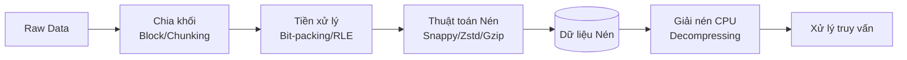

Trong thiết kế hệ thống dữ liệu lớn (Big Data), việc tối ưu hóa dung lượng lưu trữ và tốc độ truyền tải thông tin là một bài toán sống còn. Khi lưu trữ hàng Terabytes hay Petabytes dữ liệu trên Cloud, hóa đơn thanh toán sẽ nhanh chóng vượt tầm kiểm soát nếu bạn không có một chiến lược nén dữ liệu tốt. **Compression Algorithms (Thuật toán nén dữ liệu)** chính là chìa khóa vàng giúp doanh nghiệp tiết kiệm hàng ngàn đô-la chi phí lưu trữ, đồng thời đẩy nhanh tốc độ truy vấn lên gấp nhiều lần.

## Nén dữ liệu: Nghệ thuật hóa giải nút thắt I/O trong Big Data

Về mặt khái niệm, **Thuật toán nén dữ liệu** trong Big Data là tập hợp các kỹ thuật mã hóa dữ liệu nhằm giảm kích thước vật lý của dữ liệu trên đĩa cứng hoặc trên đường truyền mạng. Khác với nén ảnh hay nén video có thể chấp nhận mất mát một phần chi tiết nhỏ (lossy), các thuật toán dùng cho cơ sở dữ liệu bắt buộc phải là **nén không mất dữ liệu (lossless compression)**. Điều này đảm bảo dữ liệu sau khi giải nén phải khôi phục chính xác 100% so với dữ liệu nguyên bản.

Các thuật toán nén phổ biến nhất trong Data Engineering ngày nay bao gồm: **Snappy** (do Google phát triển), **Gzip** (chuẩn nén GNU kinh điển), **Zstandard/Zstd** (do Facebook phát triển) và **LZ4**. Hầu hết chúng đều dựa trên các biến thể của thuật toán từ điển nổi tiếng LZ77/LZ78 kết hợp với kỹ thuật mã hóa entropy (như Huffman coding).

## Tại sao chúng ta cần nén dữ liệu? (Khi CPU không còn là điểm nghẽn)

Trong các hệ thống tính toán phân tán hiện đại (như Apache Spark, Hadoop, Kafka), CPU rất ít khi là nút thắt cổ chai làm chậm hệ thống. Thay vào đó, giới hạn lớn nhất về mặt hiệu năng thường nằm ở:
1. **Tốc độ đọc ghi ổ đĩa (Disk I/O)**: Tốc độ đọc dữ liệu thô từ ổ cứng HDD hoặc SSD vào RAM.
2. **Băng thông mạng (Network I/O)**: Quá trình truyền tải dữ liệu giữa các máy chủ trong mạng (ví dụ trong giai đoạn Shuffle của Spark).

Nén dữ liệu giải quyết cả hai bài toán này theo cách cực kỳ thông minh:
* **Tiết kiệm chi phí lưu trữ**: Giảm dung lượng file trên Cloud Storage (như Amazon S3 hay GCS) xuống nhiều lần, giảm trực tiếp hóa đơn lưu trữ hàng tháng.
* **Đẩy nhanh tốc độ đọc dữ liệu**: Việc đọc 1GB dữ liệu đã nén từ đĩa vào RAM rồi dùng CPU giải nén ra thành 3GB thường diễn ra **nhanh hơn rất nhiều** so với việc bắt ổ đĩa phải đọc thô trực tiếp 3GB dữ liệu chưa nén. Tốc độ tính toán của CPU hiện đại ngày nay vượt trội hơn hẳn so với tốc độ truyền tải vật lý của đĩa cứng.

## Ý tưởng cốt lõi của các thuật toán nén hiện đại

Hầu hết các thuật toán nén lossless hoạt động dựa trên hai nguyên lý cốt lõi:

* **Sử dụng từ điển (Dictionary-based / Lempel-Ziv)**: Thuật toán quét văn bản và tìm kiếm các chuỗi ký tự lặp lại, sau đó thay thế chúng bằng các tham chiếu ngắn hơn. Ví dụ, nếu từ `"database"` xuất hiện 100 lần trong file, nó chỉ được lưu đầy đủ ở lần đầu tiên. 99 lần xuất hiện tiếp theo sẽ được thay thế bằng một con trỏ tham chiếu cực nhẹ. (Các thuật toán như LZ4, Snappy áp dụng nguyên lý này rất triệt để nhằm đạt tốc độ tối đa).
* **Mã hóa Entropy (Entropy Encoding / Huffman)**: Thuật toán biểu diễn các ký tự xuất hiện thường xuyên bằng số lượng bit ít nhất có thể, và dùng nhiều bit hơn cho các ký tự hiếm gặp. (Gzip kết hợp cả hai kỹ thuật LZ77 và Huffman để đạt tỷ lệ nén cao nhất).

## Luồng xử lý nén dữ liệu diễn ra như thế nào?

Hệ thống lưu trữ áp dụng nén dữ liệu qua các giai đoạn tuần tự sau:
1. **Chia khối (Block/Chunking)**: File dữ liệu lớn được chia thành các nhóm dòng (row groups) hoặc các block nhỏ (ví dụ 64MB hoặc 128MB). Việc nén sẽ được thực hiện độc lập trên từng block này.
2. **Tiền xử lý (Filtering)**: Áp dụng các thuật toán như Bit-packing, Run-Length Encoding (RLE) hay Delta Encoding để biến đổi dữ liệu thành dạng đồng nhất (đặc biệt hiệu quả với dữ liệu dạng cột Parquet).
3. **Nén dữ liệu (Compressing)**: Block dữ liệu đã lọc được đưa qua các engine nén như Snappy hoặc Zstd để tạo ra block nén vật lý ghi xuống đĩa.
4. **Giải nén (Decompressing)**: Khi người dùng truy vấn, hệ thống đọc block nén vào RAM và dùng CPU giải nén tức thì trước khi thực hiện tính toán.



## Đặt lên bàn cân các thuật toán nén phổ biến

Mỗi thuật toán nén đều có những ưu và nhược điểm riêng phù hợp cho từng hoàn cảnh cụ thể:

| Thuật toán | Tỉ lệ nén (Compression Ratio) | Tốc độ nén (Compression Speed) | Tốc độ giải nén (Decompression Speed) | CPU Usage | Phù hợp nhất cho |
| :--- | :--- | :--- | :--- | :--- | :--- |
| **Snappy** | Thấp (Khoảng 1.5x - 2x) | Rất nhanh (~500 MB/s) | Cực nhanh (~1.5 GB/s) | Thấp | Dữ liệu trung gian (Shuffle), Cache, Kafka |
| **LZ4** | Rất thấp (Gần bằng Snappy) | Nhanh nhất (~800 MB/s) | Nhanh nhất (~4.0 GB/s) | Rất thấp | In-memory storage, Caching |
| **Gzip** | Cao (Khoảng 3x - 4x) | Chậm (~50 MB/s) | Chậm (~150 MB/s) | Cao | Lưu trữ Cold Data, Logs, JSON/CSV dài hạn |
| **Zstandard (Zstd)** | Rất cao (Tương đương Gzip) | Nhanh (~250 MB/s) | Rất nhanh (~750 MB/s) | Trung bình | Lưu trữ Data Lake (Parquet), Hầu hết mọi Use case hiện nay |

## Ví dụ thực chiến: Cấu hình chuẩn nén trong PySpark

Hãy xem cách cấu hình các định dạng nén khác nhau khi ghi file Parquet bằng PySpark:

```python
from pyspark.sql import SparkSession

spark = SparkSession.builder.appName("CompressionExample").getOrCreate()

# Đọc tập dữ liệu lớn từ nguồn
df = spark.read.csv("s3://bucket/raw_data/*.csv", header=True)

# 1. Lưu với Snappy: Ưu tiên tốc độ tối đa (lựa chọn mặc định của nhiều hệ thống cũ)
df.write.parquet("s3://bucket/processed/snappy_data/", compression="snappy")

# 2. Lưu với Gzip: Ưu tiên dung lượng nhỏ nhất, chấp nhận tốc độ chậm
df.write.parquet("s3://bucket/processed/gzip_data/", compression="gzip")

# 3. Lưu với Zstandard: Sự kết hợp hoàn hảo giữa tốc độ và khả năng nén (Lựa chọn tối ưu nhất)
df.write.parquet("s3://bucket/processed/zstd_data/", compression="zstd")
```

Trong thực tế, một file thô dung lượng ban đầu 10GB sau khi xử lý có thể cho ra kết quả:
* **Snappy**: ~4GB
* **Zstd**: ~2.5GB (nhưng tốc độ đọc ghi nhanh gấp đôi Gzip)
* **Gzip**: ~2.4GB

## Cẩm nang áp dụng nén dữ liệu (Best Practices)

* **Zstandard (Zstd) là ưu tiên số một**: Ở thời điểm hiện tại, hãy luôn chọn Zstd làm cấu hình mặc định cho các file lưu trữ dài hạn trên Data Lake (như Parquet, ORC). Nó mang lại tỷ lệ nén gần như tương đương Gzip nhưng tốc độ nén/giải nén nhanh hơn gấp 3 - 5 lần.
* **Tránh dùng Gzip cho các file text lớn**: Gzip là thuật toán không thể chia nhỏ `(not splittable)`. Nếu bạn lưu một file CSV nén Gzip dung lượng 10GB trên HDFS, Spark chỉ có thể giao file đó cho đúng 1 CPU core duy nhất xử lý từ đầu đến cuối, làm mất đi hoàn toàn lợi thế của tính toán song song. Hãy dùng định dạng hỗ trợ block-level compression như Parquet, ORC, hoặc dùng định dạng nén splittable như Bzip2 (dù tốc độ nén rất chậm).
* **Tận dụng định dạng lưu trữ dạng cột**: Thiết kế dữ liệu theo cột (Parquet) giúp các dữ liệu cùng loại đứng cạnh nhau, nâng cao hiệu suất của các thuật toán tiền xử lý như Run-Length Encoding trước khi chạy nén tổng thể.

## Những sai lầm kinh điển cần tránh

* **Cố nén dữ liệu đã được nén sẵn**: Đưa các file hình ảnh (JPEG), video (MP4) hay nhạc (MP3) qua các thuật toán nén Snappy/Gzip. Bản chất các định dạng này đã được nén bằng thuật toán chuyên dụng. Việc cố nén thêm chỉ làm tiêu tốn CPU của hệ thống một cách vô ích mà không giúp file nhỏ lại.
* **Chọn Gzip cho giai đoạn Spark Shuffle**: Giai đoạn Shuffle yêu cầu tốc độ đọc ghi dữ liệu trung gian liên tục. Sử dụng Gzip lúc này sẽ làm nghẽn CPU nghiêm trọng. Hãy dùng Snappy hoặc LZ4 để đạt tốc độ tốt nhất.
* **Cấu hình cấp độ nén quá cao (Over-compression)**: Việc tăng cấu hình nén của Zstd lên mức tối đa (ví dụ level 19) để cố gắng tiết kiệm thêm vài Megabytes dữ liệu là không cần thiết. Nó sẽ làm tăng thời gian xử lý của CPU lên gấp 10 lần, kéo dài thời gian hoàn thành của toàn bộ pipeline ETL.

## Sự đánh đổi thực tế giữa các thuật toán

* **Snappy / LZ4**: Đánh đổi dung lượng lưu trữ (tốn đĩa hơn) để lấy tốc độ xử lý siêu nhanh và mức tiêu hao CPU cực thấp.
* **Gzip**: Đánh đổi tốc độ và CPU (xử lý rất chậm, tốn CPU) để đạt được khả năng nén tối đa. Ngoài ra, việc không thể xử lý song song trên một file là một nhược điểm lớn trong môi trường phân tán.
* **Zstd**: Điểm ngọt `(sweet spot)` của công nghệ nén hiện đại. Khắc phục được hầu hết các nhược điểm của hai nhóm trên: nén tốt như Gzip và tốc độ tiệm cận Snappy.

## Góc phỏng vấn: Những câu hỏi hóc búa

### 1. Tại sao nén dữ liệu lại làm TĂNG tốc độ của các truy vấn phân tích (OLAP) dù hệ thống phải tốn thêm tài nguyên CPU để giải nén?
* **Mục đích câu hỏi**: Kiểm tra hiểu biết của ứng viên về bản chất các điểm nghẽn (bottleneck) trong hệ thống dữ liệu lớn.
* **Gợi ý trả lời**:
  * Trong các hệ thống phân tán xử lý hàng tỷ dòng dữ liệu, tốc độ CPU thường rất dư thừa. Nút thắt cổ chai thực sự làm chậm hệ thống chính là tốc độ đọc dữ liệu từ đĩa cứng (Disk I/O) và tốc độ truyền dữ liệu qua mạng (Network I/O).
  * Tốc độ giải nén của CPU hiện đại cực kỳ nhanh (đạt tới hàng GB/s). Do đó, việc hệ thống đọc 1GB dữ liệu đã nén từ đĩa vào RAM rồi dùng CPU giải nén ra thành 3GB sẽ tốn ít thời gian hơn rất nhiều so với việc bắt ổ đĩa phải đọc thô trực tiếp 3GB dữ liệu chưa nén.

### 2. Sự khác biệt giữa Block-level Compression (trong Parquet/ORC) và File-level Compression (như file CSV nén đuôi .csv.gz) là gì?
* **Mục đích câu hỏi**: Kiểm tra kiến thức về khả năng chia nhỏ dữ liệu (Splittability) trong môi trường tính toán phân tán.
* **Gợi ý trả lời**:
  * Với *File-level Compression* (như `.csv.gz`), toàn bộ file dữ liệu được nén thành một khối liên tục từ đầu đến cuối. Gzip không hỗ trợ cơ chế đánh chỉ mục nội bộ, vì vậy Spark buộc phải giao toàn bộ file đó cho một Executor duy nhất xử lý, làm mất hoàn toàn khả năng tính toán song song.
  * Với *Block-level Compression* (trong Parquet/ORC), file dữ liệu lớn được chia thành nhiều block độc lập (ví dụ 128MB) và mỗi block được nén riêng biệt. Spark có thể dễ dàng phân chia 10 blocks cho 10 Executors khác nhau để giải nén và tính toán song song cùng một lúc.

### 3. Bạn sẽ chọn thuật toán nén nào cho hệ thống Data Lake hiện đại và tại sao?
* **Mục đích câu hỏi**: Đánh giá khả năng cập nhật xu hướng công nghệ mới của ứng viên.
* **Gợi ý trả lời**:
  * Tôi sẽ ưu tiên lựa chọn **Zstandard (Zstd)** làm thuật toán nén mặc định cho Data Lake.
  * Lý do là Zstd giải quyết được bài toán đánh đổi kinh điển giữa tốc độ và dung lượng nén. Nó mang lại tỷ lệ nén tốt ngang ngửa Gzip nhưng tốc độ đọc ghi tiệm cận Snappy. Điều này giúp doanh nghiệp vừa tối ưu được chi phí lưu trữ trên S3/GCS, vừa đảm bảo tốc độ truy vấn vượt trội cho các engine như Athena, Trino hay Spark SQL.

## Khái niệm liên quan & Tài liệu tham khảo

**Khái niệm liên quan:**
* [Columnar Storage](/concepts/database-storage/columnar-storage/)
* Định dạng lưu trữ Parquet
* [Data Lake](/concepts/data-lake-lakehouse/data-lake/)

## Tài liệu tham khảo

1. [Designing Data-Intensive Applications](https://www.oreilly.com/library/view/designing-data-intensive-applications/9781491903063/) - Martin Kleppmann's book detailing compression layout, Run-Length Encoding, and columnar storage optimization on O'Reilly.
2. [Compression in Apache Kafka: Gzip, Snappy, LZ4, Zstd](https://www.confluent.io/blog/compression-in-apache-kafka-gzip-snappy-lz4-zstd/) - Confluent blog post analyzing and benchmarking different compression formats for stream processing.
3. [Zstandard Compression Project](https://github.com/facebook/zstd) - Official GitHub repository and performance metrics for the Meta Zstd algorithm.
4. [Google Snappy Project](https://github.com/google/snappy) - Official GitHub repository for Google's fast compression/decompression library Snappy.
5. [LZ4 Compression Project](https://github.com/lz4/lz4) - Official GitHub repository for the extremely fast lossless compression algorithm LZ4.

## English Summary

Compression algorithms in data engineering (like Snappy, Gzip, Zstd, LZ4) are critical techniques for reducing storage footprint and mitigating I/O bottlenecks. In distributed systems, CPU cycles are relatively abundant while disk and network throughput are scarce; thus, compressing data accelerates query execution by trading fast CPU decompression for minimized Disk/Network I/O. Modern architectures heavily favor Zstandard (Zstd) for analytical storage (Parquet/ORC) as it strikes a perfect balance—achieving Gzip-level compression ratios with speeds approaching Snappy—while Snappy or LZ4 remains ideal for ephemeral operations like streaming and Spark shuffle. Splittability, achieved via block-level compression in formats like Parquet, is essential to enable parallel distributed processing.
