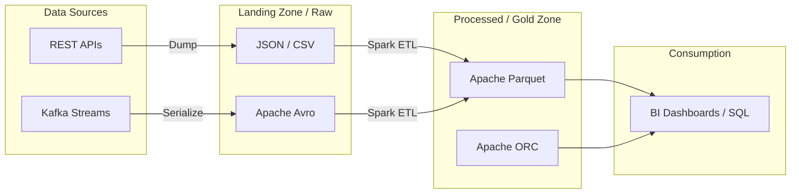

Trong các hệ quản trị cơ sở dữ liệu truyền thống (như MySQL hay PostgreSQL), dữ liệu được ẩn giấu và quản lý khép kín trong các cấu trúc lưu trữ riêng của hệ thống. Tuy nhiên, trong kiến trúc Data Lake và Big Data, bức tranh hoàn toàn thay đổi. Dữ liệu được lưu trữ công khai dưới dạng các tệp tin vật lý trên các hệ thống Object Storage (như Amazon S3, Google Cloud Storage). Việc lựa chọn định dạng tệp (File format) như Apache Parquet, ORC, Avro hay CSV không đơn thuần là cách lưu trữ, mà nó quyết định trực tiếp đến dung lượng ví tiền của doanh nghiệp, tốc độ đọc/ghi dữ liệu và hiệu năng vận hành của toàn bộ hệ thống Data Pipeline.

## Bản chất của việc lưu trữ dữ liệu trong Data Lake

Định dạng tệp (File Format) trong kỹ thuật dữ liệu quy định cách cấu trúc dữ liệu được mã hóa (encoded) thành các bit nhị phân để ghi xuống ổ đĩa vật lý. Nhìn chung, chúng ta có thể chia các định dạng này thành 3 nhóm chính:

1. **Định dạng Text (Human-readable)**: Đọc được trực tiếp bằng mắt người như CSV, JSON, XML. Dù cực kỳ phổ biến và dễ dùng, nhóm này lại có tốc độ xử lý rất chậm và tiêu tốn nhiều dung lượng lưu trữ.
2. **Định dạng Dòng nhị phân (Binary Row-based)**: Điển hình là Apache Avro, được thiết kế tối ưu cho các thao tác ghi dữ liệu tốc độ cao.
3. **Định dạng Cột nhị phân (Binary Columnar)**: Tiêu biểu là Apache Parquet và Apache ORC, được tinh chỉnh tối đa cho các tác vụ truy vấn phân tích (đọc nhiều cột cụ thể).

## CSV thôi chưa đủ: Tại sao chúng ta cần các định dạng tệp chuyên dụng?

Hãy thử tưởng tượng bạn đang lưu trữ 1 tỷ dòng dữ liệu nhật ký hệ thống (log) vào một file `log.csv`. 

File CSV cực kỳ trực quan và dễ mở. Thế nhưng, nó lại ẩn chứa những điểm yếu chí mạng khi quy mô dữ liệu phình to:
* **Không có schema nội tại**: Hệ thống không biết cột nào là số nguyên (int), cột nào là chuỗi (string) trừ khi người lập trình tự viết code để phán đoán.
* **Khả năng nén kém**: Không có cơ chế nén tự thân hiệu quả để tiết kiệm băng thông mạng (Network I/O).
* **Không thể nhảy dòng (seek)**: Bạn không thể nhảy thẳng tới dòng thứ 500 triệu mà không phải quét qua 499,999,999 dòng trước đó.
* **Không thể trích xuất cột đơn lẻ**: Mỗi lần truy vấn một cột, hệ thống vẫn phải tải toàn bộ hàng lên bộ nhớ.

Khi thế giới bước vào kỷ nguyên Big Data với các công cụ xử lý mạnh mẽ như Hadoop và Apache Spark, các kỹ sư cần những định dạng tệp mới để:
* Nén dữ liệu tối đa nhằm giảm thiểu chi phí lưu trữ và băng thông truyền tải dữ liệu.
* Tự chứa thông tin cấu trúc (Self-describing schema) ngay trong tệp tin.
* Hỗ trợ chia nhỏ dữ liệu để xử lý song song (Splittable) trên nhiều máy chủ khác nhau.

## Ba "anh tài" trong làng lưu trữ Big Data

### 1. Apache Parquet
* **Cấu trúc lưu trữ**: Columnar (Lưu theo cột).
* **Đặc tính nổi bật**: Khả năng nén cực kỳ mạnh mẽ. Hỗ trợ kỹ thuật Projection Pushdown (chỉ đọc các cột cần thiết trong câu truy vấn).
* **Ứng dụng**: Đây được coi là tiêu chuẩn vàng cho các truy vấn phân tích OLAP và xây dựng Data Warehouse/Lakehouse.

### 2. Apache ORC (Optimized Row Columnar)
* **Cấu trúc lưu trữ**: Columnar (Tương tự như Parquet).
* **Đặc tính nổi bật**: Thiết kế ban đầu được tối ưu hóa đặc biệt cho hệ sinh thái Apache Hive.
* **Ứng dụng**: Mang lại hiệu suất phân tích tương tự như Parquet, thường bắt gặp trong các hệ thống chạy Hadoop thế hệ cũ.

### 3. Apache Avro
* **Cấu trúc lưu trữ**: Row-based (Lưu theo dòng).
* **Đặc tính nổi bật**: Nén tốt hơn CSV, tốc độ ghi (Write) và tuần tự hóa (Serialization) nhanh vượt trội. Điểm sáng lớn nhất của Avro là khả năng hỗ trợ tiến hóa schema (Schema Evolution), cho phép thay đổi cấu trúc bảng mà không làm hỏng các tệp tin cũ.
* **Ứng dụng**: Phù hợp cho các hệ thống truyền nhận dữ liệu thời gian thực (như Apache Kafka) hoặc lưu trữ dữ liệu thô tại vùng đệm (Landing Zone).

## Sơ đồ kiến trúc: Dữ liệu đi đâu về đâu?

Trong một Data Lake điển hình, việc lựa chọn định dạng tệp sẽ thay đổi tùy theo từng phân vùng (zone) của dữ liệu:



## Câu chuyện tiến hóa Schema (Schema Evolution) và cách nó cứu sống Data Pipeline

Với các tệp tin tự chứa schema (self-describing), phần đầu (header) hoặc cuối (footer) của file luôn chứa một khối Metadata dạng JSON định nghĩa chi tiết kiểu dữ liệu của từng cột.

Hãy tưởng tượng một ngày, đội ngũ phát triển Backend quyết định xóa một cột cũ và thêm vào một cột mới.
* **Với định dạng CSV**: Data Pipeline của bạn sẽ đổ sập lập tức vì hệ thống không biết ánh xạ cột nào vào giá trị nào nữa.
* **Với Avro/Parquet**: Các công cụ xử lý như Spark sẽ đọc Metadata của cả file cũ lẫn file mới. Nó tự hiểu rằng các file cũ không có cột mới (sẽ tự động trả về giá trị `NULL`) và tiến hành hợp nhất (Merge Schema) an toàn mà không gây ra bất kỳ lỗi crash nào.

## Thực chiến: Đo đạc hiệu năng nén của Parquet bằng Python

Đoạn code Python dưới đây (sử dụng thư viện `pandas` và `pyarrow`) sẽ minh họa rõ nét sự chênh lệch đáng kinh ngạc về kích thước lưu trữ giữa CSV và Parquet khi xử lý 1 triệu dòng dữ liệu:

```python
import pandas as pd
import numpy as np

# Tạo 1 triệu dòng dữ liệu giả lập
df = pd.DataFrame({
    'id': range(1000000),
    'status': np.random.choice(['SUCCESS', 'FAIL', 'PENDING'], 1000000),
    'revenue': np.random.random(1000000) * 100
})

# Lưu dưới dạng CSV
df.to_csv('data.csv', index=False)
# Kích thước: ~ 35 MB

# Lưu dưới dạng Parquet (mặc định nén Snappy)
df.to_parquet('data.parquet')
# Kích thước: ~ 4 MB (Nhỏ hơn gần 10 lần do cột 'status' được Dictionary Encoding)
```

## Quy tắc "vàng" khi làm việc với File Formats

* **Tránh dùng JSON/CSV ở lớp dữ liệu phục vụ (Serving Layer)**: Việc sử dụng các công cụ như AWS Athena hay Google BigQuery truy vấn trực tiếp trên hàng chục GB tệp JSON/CSV không nén sẽ nhanh chóng làm cạn kiệt ngân sách của bạn do dung lượng quét dữ liệu quá lớn. Hãy luôn chuyển đổi chúng sang Parquet trước khi đưa vào khai thác.
* **Giải quyết bài toán "Tệp tin quá nhỏ" (Small File Problem)**: Truy vấn trên 10,000 tệp Parquet kích thước 1MB sẽ chậm hơn rất nhiều so với việc truy vấn trên 10 tệp Parquet kích thước 1GB do overhead quản lý file. Hãy thiết lập các tác vụ định kỳ để nén gom (compact) các tệp nhỏ này lại.
* **Chọn đúng thuật toán nén (Compression Codec)**: Thuật toán `Snappy` (mặc định trong Parquet) mang lại sự cân bằng hoàn hảo giữa tốc độ nén/giải nén và dung lượng. Trong khi đó, `Gzip` nén dữ liệu nhỏ hơn nhưng lại ngốn nhiều CPU hơn để giải nén, rất thích hợp cho nhu cầu lưu trữ dữ liệu lạnh (Archiving/Cold Storage).
* **Đừng cố mở file Parquet bằng Text Editor**: Nhiều kỹ sư mới thường có thói quen dùng Notepad hoặc lệnh `cat` trên Linux để xem nội dung file Parquet và nhận về một màn hình toàn ký tự nhị phân lỗi. Hãy dùng các thư viện lập trình (như Pandas) hoặc công cụ chuyên dụng như `parquet-tools` để đọc dữ liệu này.
* **Không dùng Parquet cho Data Streaming thời gian thực**: Parquet không được thiết kế cho việc chèn (append) nhỏ giọt từng dòng dữ liệu liên tục vì cơ chế gom cột của nó cần một bộ đệm (buffer) rất lớn trên RAM trước khi ghi xuống đĩa. Hệ thống Streaming nên ưu tiên dùng Avro.

## Lựa chọn đúng đắn: So sánh nhanh ưu nhược điểm

### JSON / CSV
* **Ưu điểm**: Thân thiện với con người (Human-readable), dễ dàng chia sẻ và tương thích với hầu như mọi công cụ văn phòng và lập trình.
* **Nhược điểm**: Kích thước lưu trữ cồng kềnh, phân tích chậm và không hỗ trợ ràng buộc schema chặt chẽ.

### Apache Parquet
* **Ưu điểm**: Tối ưu hóa cho các câu lệnh SQL phân tích (OLAP) với tốc độ vượt trội, tiết kiệm tới 70-90% dung lượng lưu trữ trên đám mây.
* **Nhược điểm**: Thời gian ghi dữ liệu lâu hơn, không thích hợp cho các tác vụ OLTP hoặc Streaming.

### Apache Avro
* **Ưu điểm**: Ghi dữ liệu nhanh, hỗ trợ Schema Evolution mạnh mẽ, là lựa chọn số một cho các kiến trúc Microservices truyền tin qua Kafka.
* **Nhược điểm**: Phân tích SQL chậm hơn đáng kể so với Parquet do cấu trúc lưu trữ theo dòng (Row-based).

## Các khái niệm liên quan

* [Columnar Storage (Lưu trữ dạng cột)](/concepts/database-storage/columnar-storage/)
* [Data Pipeline (Đường ống dữ liệu)](/concepts/foundation/data-pipeline/)

## Góc phỏng vấn: Trả lời thông minh trước nhà tuyển dụng

### 1. Tại sao Parquet lại có tốc độ truy vấn nhanh hơn JSON rất nhiều trên Data Lake?
* **Gợi ý trả lời**: Khi thực hiện câu lệnh truy vấn như `SELECT id FROM table`:
  * Với định dạng JSON (dạng dòng): Các công cụ truy vấn (như Spark/Athena) bắt buộc phải quét qua toàn bộ file văn bản, phân tích cú pháp (parse) từng dòng để bóc tách trường `id`. Điều này gây tốn tài nguyên I/O đĩa và CPU rất lớn.
  * Với định dạng Parquet (dạng cột nhị phân): Trình truy vấn chỉ cần đọc phần Metadata ở cuối file để xác định cột `id` nằm chính xác ở dải byte (offset) nào. Nó sẽ bỏ qua toàn bộ các cột khác và chỉ nạp đúng các byte của cột `id` lên bộ nhớ RAM. Nhờ dữ liệu được nén tối đa, thời gian truyền tải I/O giảm đi đáng kể.

### 2. Tính năng Schema Evolution trong Avro mang lại giá trị gì cho các kỹ sư dữ liệu?
* **Gợi ý trả lời**: Trong các dự án thực tế, các trường thông tin luôn thay đổi liên tục (thêm cột, xóa cột hoặc đổi tên). Nhờ việc Avro nhúng trực tiếp định nghĩa Schema (dạng JSON) vào từng file nhị phân, khi hệ thống tiến hành đọc dữ liệu, nó sẽ tự động so sánh Schema của file được ghi (Writer's Schema) với Schema mà ứng dụng hiện tại đang mong muốn đọc (Reader's Schema). Từ đó, Avro tự động ánh xạ các trường tương ứng hoặc điền giá trị mặc định (`NULL`) cho các trường còn thiếu, giúp Data Pipeline vận hành trơn tru mà không bị sập giữa chừng.

## Tài liệu tham khảo

1. [Apache Parquet Documentation](https://parquet.apache.org/docs/) - Official documentation for Apache Parquet columnar storage format.
2. [Apache Avro Documentation](https://avro.apache.org/docs/current/) - Official documentation for Apache Avro serialization system.
3. [Apache ORC Documentation](https://orc.apache.org/docs/) - Official documentation for the Optimized Row Columnar file format.
4. [Designing Data-Intensive Applications](https://www.oreilly.com/library/view/designing-data-intensive-applications/9781491903063/) - Martin Kleppmann's book detailing encoding, schemas, and file evolution patterns on O'Reilly.
5. [What is Apache Parquet?](https://www.databricks.com/glossary/parquet) - Entry in the Databricks Glossary discussing Parquet's columnar compression and metadata architecture.

## English Summary

In Data Lakes and Big Data architectures, choosing the right file format is crucial for performance and cost. Text formats like CSV and JSON are human-readable but bloated and slow for analytics. Apache Avro, a binary row-based format, excels in fast write operations and robust Schema Evolution, making it ideal for streaming data (e.g., Kafka) and raw data landing. Apache Parquet and ORC are binary columnar formats that offer extreme compression and "Projection Pushdown" capabilities, making them the industry standard for fast, cost-effective read-heavy analytical workloads (OLAP) on cloud object storage.
