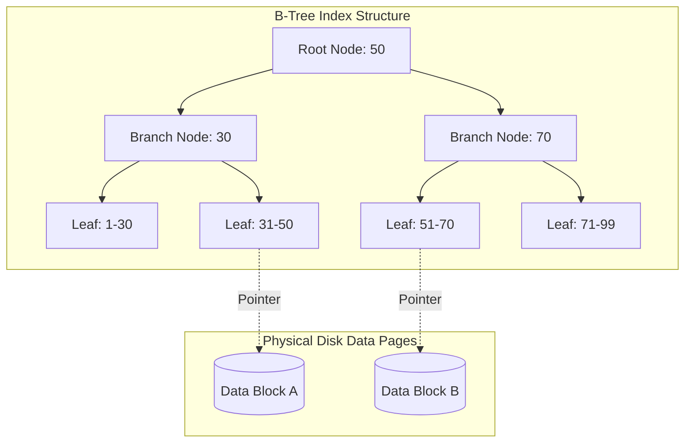

Hãy tưởng tượng bạn đang cầm trên tay một cuốn sách bách khoa toàn thư dày 1,000 trang và muốn tìm định nghĩa của cụm từ "Database". Nếu cuốn sách không có mục lục, bạn bắt buộc phải lật giở và đọc từng trang từ trang 1 đến trang 1000. Hành động mệt mỏi và tốn thời gian này được gọi là quét toàn bộ (Full Scan). Nhưng nhờ có phần Mục lục (Index) ở cuối cuốn sách, được sắp xếp thứ tự chữ cái A-Z, bạn dễ dàng tra ra từ "Database" nằm ở trang 450 và lật thẳng tới đó. 

Trong thế giới cơ sở dữ liệu, kỹ thuật tăng tốc thần kỳ này được gọi là **Indexing** (Chỉ mục cơ sở dữ liệu).

## Chỉ mục cơ sở dữ liệu là gì?

Database Index (Chỉ mục cơ sở dữ liệu) là một cấu trúc dữ liệu phụ được xây dựng trên một hoặc nhiều cột của bảng. Nó lưu trữ dữ liệu dưới một định dạng đã được sắp xếp thứ tự, đi kèm với các con trỏ (pointers) trỏ trực tiếp đến vị trí vật lý của dòng dữ liệu gốc trên ổ đĩa. 

Mục tiêu duy nhất của Index là cải thiện tốc độ tìm kiếm và truy xuất thông tin của các câu lệnh đọc (`SELECT`). Tuy nhiên, cái giá phải trả là nó sẽ ngốn thêm không gian lưu trữ và làm chậm phần nào các thao tác ghi dữ liệu (`INSERT`, `UPDATE`, `DELETE`).

## Tại sao chúng ta cần đến Indexing?

Khi cơ sở dữ liệu phình to lên hàng chục triệu bản ghi, việc quét toàn bộ ổ đĩa để tìm một vài dòng dữ liệu cụ thể sẽ gây ra nghẽn I/O (nút thắt cổ chai về đọc ghi của đĩa cứng) và làm sập hiệu năng hệ thống. Indexing ra đời như một giải pháp cứu cánh giúp giảm thiểu thời gian tìm kiếm từ vài phút xuống còn một vài mili-giây thông qua cấu trúc dữ liệu được tối ưu hóa.

## Những cấu trúc dữ liệu đứng sau Index

Tùy thuộc vào động cơ lưu trữ và bài toán truy vấn, cơ sở dữ liệu sẽ áp dụng các cấu trúc dữ liệu Index khác nhau:

1. **B-Tree (Balanced Tree - Cây cân bằng)**: Đây là loại cấu trúc phổ biến và được đặt làm mặc định trong hầu hết các hệ quản trị cơ sở dữ liệu như MySQL, PostgreSQL hay Oracle. B-Tree luôn giữ cho cây được cân bằng về mặt độ sâu, giúp các tác vụ tìm khớp bằng (`=`), tìm theo khoảng (`BETWEEN`), hoặc lọc tiền tố chữ (`LIKE 'Nguyen%'`) đều hoạt động cực nhanh với độ phức tạp thuật toán là $O(\log N)$.
2. **Hash Index (Bảng băm)**: Cực kỳ tối ưu cho các truy vấn tìm kiếm chính xác tuyệt đối (ví dụ `WHERE id = 5`) với độ phức tạp lý tưởng $O(1)$. Tuy nhiên, điểm yếu của nó là hoàn toàn bất lực trước các câu lệnh tìm kiếm theo khoảng (Range query như `WHERE age > 18`).
3. **Bitmap Index**: Rất phổ biến trong các kho dữ liệu phân tích ([Data Warehouse](/concepts/data-warehouse/data-warehouse/)). Cấu trúc này tối ưu cho các cột có tính đa dạng thấp (Low Cardinality) - tức là cột có ít giá trị phân biệt như Giới tính (Nam/Nữ) hay Trạng thái đơn hàng (Thành công/Thất bại).

## Cơ chế hoạt động của B-Tree Index

Khi bạn thực thi câu lệnh SQL: `SELECT * FROM users WHERE user_id = 45;` (với giả thiết `user_id` đã được đánh Index), cơ sở dữ liệu sẽ không quét qua bảng dữ liệu vật lý mà thực hiện các bước sau:


1. Hệ thống truy cập vào nút gốc (Root Node) của cây Index. Giả sử nút gốc chứa giá trị `50`. Hệ thống biết ngay giá trị `45` cần tìm nằm ở nhánh bên trái (nhỏ hơn 50).
2. Nó đi xuống nút nhánh (Branch Node) `[30]` và xác định `45 > 30`, do đó đi xuống nút lá (Leaf Node) chứa dải `[31-50]`.
3. Tại nút lá `[31-50]`, hệ thống tìm thấy khóa `45`. Đi kèm với khóa này là con trỏ vật lý trỏ trực tiếp đến dải byte trên đĩa cứng (ví dụ: `Block 5, Offset 10` thuộc `Data Block A`).
4. Cơ sở dữ liệu nhảy thẳng tới địa chỉ ổ đĩa đó để lấy lên các thông tin còn lại của người dùng (tên, tuổi, email) và trả về cho bạn. Tiến trình này chỉ tiêu tốn 3 lần đọc đĩa (I/O), cực kỳ tiết kiệm tài nguyên.

## Thực chiến: Khởi tạo và sử dụng Index trong PostgreSQL

Dưới đây là ví dụ minh họa cách tạo lập bảng và cấu hình chỉ mục:
```sql
-- Tạo một bảng User
CREATE TABLE users (
    id SERIAL PRIMARY KEY, -- Mặc định tạo B-Tree Index trên khóa chính
    email VARCHAR(255) UNIQUE, -- Mặc định tạo B-Tree Index (Unique)
    first_name VARCHAR(50),
    last_name VARCHAR(50),
    created_at TIMESTAMP
);

-- Tình huống: Thường xuyên tìm user theo Họ và Tên
-- Tạo Composite Index (Index phức hợp trên nhiều cột)
CREATE INDEX idx_users_name ON users(last_name, first_name);

-- Câu lệnh này sẽ DÙNG được Index
SELECT * FROM users WHERE last_name = 'Nguyen' AND first_name = 'An';

-- Câu lệnh này KHÔNG DÙNG được Index (Lỗi phổ biến)
SELECT * FROM users WHERE first_name = 'An';
-- Giải thích: Composite Index giống như danh bạ điện thoại sắp xếp theo Họ, rồi mới đến Tên. 
-- Nếu bạn không biết Họ, bạn không thể tìm nhanh theo Tên.
```

## Quy tắc "vàng" thiết kế Index hiệu năng

* **Luôn Index cho Khóa ngoại (Foreign Keys)**: Đây là quy tắc tối thượng để tối ưu hóa hiệu năng của các phép nối bảng (`JOIN`).
* **Đánh chỉ mục cho các cột lọc và sắp xếp**: Hãy ưu tiên tạo Index cho các cột thường xuyên xuất hiện trong các mệnh đề lọc `WHERE`, sắp xếp `ORDER BY`, hoặc gom nhóm `GROUP BY`.
* **Hiểu sâu quy tắc "Left-most Prefix" đối với Chỉ mục phức hợp (Composite Index)**: Thứ tự sắp xếp các cột trong Composite Index đóng vai trò quyết định. Bạn phải luôn xếp các cột có độ phân tán giá trị cao (High Selectivity) lên phía trước.
* **Tận dụng Cover Index (Chỉ mục bao phủ)**: Nếu câu truy vấn của bạn chỉ là `SELECT email FROM users WHERE id = 1`, và bạn đã thiết lập chỉ mục phức hợp trên cả hai trường `(id, email)`, cơ sở dữ liệu sẽ bốc trực tiếp dữ liệu từ cây Index ra trả về cho bạn mà không cần tốn thêm một vòng I/O nhảy vào đĩa tìm dòng gốc (Index-only scan).

## Những sai lầm kinh điển làm vô hiệu hóa Index

* **Bệnh lạm dụng (Over-indexing)**: Nhiều lập trình viên thường đánh Index cho toàn bộ tất cả các cột trong bảng vì nghĩ rằng "càng nhiều chỉ mục chạy càng nhanh". Thực tế, mỗi lần bạn chèn hoặc sửa đổi dữ liệu, database sẽ phải cập nhật lại cấu trúc của hàng chục cây B-Tree tương ứng. Điều này sẽ khiến hiệu năng của các tác vụ Ghi (`INSERT/UPDATE`) sụt giảm nghiêm trọng.
* **Đánh chỉ mục B-Tree trên các cột Low Cardinality**: Đánh chỉ mục B-Tree cho cột giới tính (chỉ có Nam hoặc Nữ). Chỉ mục này hoàn toàn vô dụng vì lượng dữ liệu chỉ phân mảnh làm hai phần lớn. Trình tối ưu hóa (Optimizer) của database sẽ bỏ qua index này và quét toàn bảng vì nó tính toán thấy quét thẳng còn nhanh hơn duyệt qua cây rồi nhảy đĩa.
* **Bọc cột trong hàm (Function-wrapped column)**: Viết câu lệnh `WHERE YEAR(created_at) = 2026`. Phép toán này sẽ vô hiệu hóa hoàn toàn Index đã đánh trên cột `created_at` vì database bắt buộc phải quét từng dòng dữ liệu để chạy hàm `YEAR()` rồi mới so sánh. Hãy thay thế bằng câu lệnh lọc khoảng: `WHERE created_at >= '2026-01-01' AND created_at < '2027-01-01'`.

## Cân đo đong đếm giữa Đọc và Ghi (Trade-offs)

### Điểm mạnh
* Giảm thiểu đáng kể số lượng I/O đọc đĩa, giải phóng băng thông tài nguyên máy chủ.
* Hỗ trợ thực hiện các tác vụ sắp xếp và gom nhóm cực nhanh mà không gây quá tải bộ nhớ RAM.

### Điểm yếu
* **Gánh nặng cho tác vụ ghi (Write Penalty)**: Gây chậm các lệnh Insert, Update, Delete do phải cập nhật và tái cân bằng lại cấu trúc cây Index.
* **Chiếm dụng không gian lưu trữ**: Đôi khi file Index của các bảng dữ liệu lớn có dung lượng vật lý còn vượt quá cả dung lượng file dữ liệu gốc.

## Khi nào nên dùng và khi nào không?

**Nên dùng khi:**
* Các bảng dữ liệu lớn trong hệ thống giao dịch OLTP có tần suất đọc thông tin vượt trội so với ghi.
* Bắt buộc phải có trên các trường định danh Khóa chính và Khóa ngoại.

**Không nên dùng khi:**
* Các bảng dữ liệu quá nhỏ (dưới vài ngàn dòng). Việc nạp toàn bộ bảng lên RAM để lọc trực tiếp còn nhanh hơn đi qua cây Index.
* Các bảng ghi nhận log lịch sử hệ thống (chỉ ghi ghi liên tục và hiếm khi đọc lại). Việc đánh Index lúc này chỉ làm lãng phí năng lực ghi của đĩa cứng.

## Các khái niệm liên quan

* [Relational Database (Cơ sở dữ liệu quan hệ)](/concepts/database-storage/relational-database/)
* [OLTP (Xử lý giao dịch trực tuyến)](/concepts/database-storage/oltp/)

## Góc phỏng vấn: Trả lời tự tin trước nhà tuyển dụng

### 1. Tại sao các hệ quản trị cơ sở dữ liệu quan hệ lại chọn cấu trúc B-Tree làm cấu trúc chỉ mục mặc định thay vì Hash Table dù Hash Table có tốc độ tìm kiếm lý thuyết là $O(1)$?
* **Mục đích câu hỏi**: Kiểm tra hiểu biết sâu sắc của ứng viên về cấu trúc dữ liệu và giải thuật trong lưu trữ dữ liệu thực tế.
* **Gợi ý trả lời**: Đúng là Hash Table có tốc độ tìm kiếm khớp bằng (`WHERE id = 5`) đạt mức lý tưởng $O(1)$. Tuy nhiên, nó lại không thể hỗ trợ các truy vấn tìm kiếm theo khoảng (ví dụ: `WHERE age BETWEEN 20 AND 30`) hoặc các câu lệnh sắp xếp (`ORDER BY`), vì thuật toán băm sẽ phân tán các giá trị ngẫu nhiên trên đĩa. Trong khi đó, cấu trúc B-Tree lưu trữ các khóa theo thứ tự sắp xếp tăng dần tại các nút lá và kết nối chúng bằng cấu trúc danh sách liên kết (Linked List). Điều này cho phép cơ sở dữ liệu duyệt tuần tự qua dải dữ liệu rất nhanh chóng, đáp ứng hoàn hảo các nhu cầu đa dạng của ngôn ngữ SQL như lọc khoảng, sắp xếp và gom nhóm.

### 2. Hiện tượng "vô hiệu hóa Index" (Index Invalidation) là gì? Hãy nêu các trường hợp phổ biến làm xảy ra hiện tượng này trong các câu lệnh SQL hàng ngày?
* **Mục đích câu hỏi**: Đánh giá kinh nghiệm tối ưu hóa câu lệnh SQL và viết mã hiệu năng cao của ứng viên.
* **Gợi ý trả lời**: Hiện tượng vô hiệu hóa Index xảy ra khi trình tối ưu hóa truy vấn của database quyết định bỏ qua chỉ mục đã tạo và quay lại thực hiện quét toàn bảng (Full Table Scan) vì cấu trúc câu lệnh SQL ngăn cản việc duyệt cây.
  Các lỗi phổ biến dẫn đến tình trạng này bao gồm:
  1. Áp dụng các hàm toán học hoặc xử lý chuỗi lên cột được đánh chỉ mục ở vế trái mệnh đề `WHERE` (ví dụ `WHERE LOWER(email) = 'abc@gmail.com'`).
  2. Thực hiện các phép tính toán trực tiếp trên cột (ví dụ `WHERE price + 10 > 100`).
  3. Sử dụng ký tự đại diện `%` ở ngay đầu chuỗi tìm kiếm trong mệnh đề `LIKE` (ví dụ `WHERE name LIKE '%An'`). Trong trường hợp này, cây B-Tree không thể xác định điểm bắt đầu của tiền tố để duyệt và buộc phải quét toàn bảng.

## Tài liệu tham khảo

1. [Use The Index, Luke!](https://use-the-index-luke.com/) - A developer-centric guide to database indexing by Markus Winand.
2. [Indexes in PostgreSQL](https://www.postgresql.org/docs/current/indexes.html) - Official PostgreSQL documentation explaining index types and usage.
3. [Optimization and Indexes in MySQL](https://dev.mysql.com/doc/refman/8.0/en/optimization-indexes.html) - Official MySQL reference manual outlining query performance and index optimization.
4. [Indexes and Index-Organized Tables in Oracle](https://docs.oracle.com/en/database/oracle/oracle-database/19/cncpt/indexes-and-index-organized-tables.html) - Official Oracle concepts guide on logical and physical index structures.
5. [Indexing in Databases](https://www.geeksforgeeks.org/indexing-in-databases-sql/) - Educational overview of primary, secondary, and clustered indexing structures on GeeksforGeeks.

## English Summary

Database Indexing is a data structure technique (most commonly B-Trees) used to quickly locate and access the data in a database, avoiding costly full table scans. While indexes drastically improve read (SELECT) performance and enable efficient sorting and range queries, they come with a trade-off: they consume additional disk space and incur a write penalty, as the index tree must be updated during INSERT, UPDATE, and DELETE operations. Best practices include indexing foreign keys, utilizing composite indexes carefully respecting the left-most prefix rule, and avoiding function-wrapped columns in WHERE clauses which silently invalidate the index.