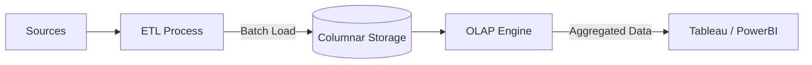

Hãy tưởng tượng CEO của một chuỗi bán lẻ lớn đưa ra yêu cầu: *"Cho tôi biết tổng doanh thu của tất cả cửa hàng tại Đông Nam Á trong quý 3 năm nay, so với cùng kỳ năm ngoái, và chia nhỏ theo từng danh mục sản phẩm."*

Nếu bạn cố gắng chạy câu lệnh SQL này trên cơ sở dữ liệu vận hành thông thường (như MySQL hay PostgreSQL phục vụ hệ thống ERP/CRM của công ty), hệ thống sẽ lập tức bị đơ. Lý do là vì cơ sở dữ liệu giao dịch phải thực hiện hàng chục phép `JOIN` và quét qua hàng triệu dòng bản ghi thô để gom nhóm dữ liệu. Việc này không chỉ làm tê liệt các ứng dụng bán hàng đang chạy mà còn tốn rất nhiều thời gian chờ đợi.

Để giải quyết bài toán phân tích dữ liệu quy mô lớn mà không làm gián đoạn hệ thống vận hành, chúng ta cần đến **OLAP (Online Analytical Processing - Xử lý Phân tích Trực tuyến)**.

OLAP là kiến trúc cơ sở dữ liệu được tối ưu hóa đặc biệt cho các tác vụ đọc dữ liệu (read-heavy), tính toán tổng hợp (aggregations) trên các tập dữ liệu lịch sử khổng lồ lên tới hàng Terabyte hoặc Petabyte. Nó chính là công nghệ lõi đứng sau các kho dữ liệu ([Data Warehouse](/concepts/data-warehouse/data-warehouse/)) và các công cụ báo cáo thông minh (BI Tools).

---

## Những trụ cột công nghệ giúp OLAP chạy siêu tốc

Khác với các cơ sở dữ liệu giao dịch truyền thống, OLAP đạt được hiệu năng truy vấn phân tích vượt trội nhờ áp dụng ba nguyên lý thiết kế cốt lõi:

### 1. Lưu trữ dạng cột (Column-oriented storage)
Đây là vũ khí tối tân của OLAP. Trong khi cơ sở dữ liệu giao dịch lưu trữ toàn bộ dữ liệu của một dòng (row) nằm sát nhau trên đĩa cứng, thì các cơ sở dữ liệu OLAP (như BigQuery, ClickHouse, Snowflake) lại lưu trữ toàn bộ dữ liệu của một cột nằm cạnh nhau.
* *Lợi ích*: Khi bạn chạy lệnh `SUM(sales_amount)`, hệ thống chỉ cần đọc chính xác file chứa cột `sales_amount` trên đĩa và bỏ qua toàn bộ các cột khác (như tên khách hàng, địa chỉ, số điện thoại). Điều này giúp giảm thiểu tối đa lưu lượng đọc ghi I/O của đĩa cứng và tăng tốc độ truy vấn lên hàng chục lần.

### 2. Phi chuẩn hóa (Denormalization)
Trong thiết kế database truyền thống, chúng ta cố gắng chuẩn hóa dữ liệu (như dạng chuẩn 3NF) để tránh trùng lặp thông tin và tối ưu hóa việc ghi. Tuy nhiên, việc này tạo ra quá nhiều bảng nhỏ và bắt buộc phải dùng nhiều phép `JOIN` khi truy vấn. OLAP đi theo hướng ngược lại: chấp nhận lưu trữ dữ liệu trùng lặp (ví dụ thiết kế theo Star Schema) để giảm thiểu tối đa các phép `JOIN` phức tạp khi chạy báo cáo.

### 3. Tính toán trước (Pre-aggregation)
Các hệ thống OLAP Cubes cổ điển (như SQL Server Analysis Services - SSAS) thường thực hiện tính toán và lưu sẵn kết quả tổng hợp trước khi người dùng yêu cầu (ví dụ: tính sẵn tổng doanh số theo từng tháng). Đối với các hệ thống Cloud OLAP hiện đại nhờ sức mạnh phần cứng khổng lồ, chúng có thể tính toán trực tiếp ngay khi nhận yêu cầu (on-the-fly) nhưng vẫn đảm bảo tốc độ cực nhanh.

---

## Thế giới đa chiều của Khối dữ liệu (Data Cube)

Thao tác phân tích dữ liệu trong OLAP thường được trực quan hóa giống như việc bạn xoay một khối Rubik đa chiều (Data Cube). Mỗi chiều của khối Rubik đại diện cho một thuộc tính dữ liệu (Ví dụ: Chiều Thời gian, Chiều Địa lý, Chiều Sản phẩm).

Chúng ta có 4 thao tác cơ bản trên khối dữ liệu này:
* **Roll-up (Gom nhóm)**: Di chuyển mức độ chi tiết của dữ liệu lên tầm cao hơn (Ví dụ: Từ doanh thu theo Ngày gộp lại thành doanh thu theo Tháng).
* **Drill-down (Đi sâu)**: Đi sâu hơn vào chi tiết của dữ liệu (Ví dụ: Từ doanh thu theo Quốc gia nhấp chuột xuống để xem chi tiết theo từng Tỉnh/Thành phố).
* **Slice (Cắt lớp)**: Chọn ra duy nhất một mặt của khối dữ liệu để phân tích (Ví dụ: Chỉ lọc ra xem dữ liệu của riêng năm 2026).
* **Dice (Cắt khối nhỏ)**: Cắt ra một phần nhỏ hơn của khối dữ liệu dựa trên nhiều điều kiện (Ví dụ: Xem doanh thu của riêng nhóm hàng (Điện thoại) VÀ tại thị trường (Hà Nội)).

---

## Vị trí của OLAP trong đường ống dữ liệu

Dưới đây là sơ đồ mô tả cách dữ liệu được trích xuất từ các nguồn giao dịch, đưa qua đường ống làm sạch để nạp vào hệ thống OLAP phục vụ báo cáo:


---

## Minh họa thực tế: Truy vấn báo cáo trên Data Warehouse

Hãy xem một câu lệnh SQL đặc trưng của hệ thống OLAP. Truy vấn này quét qua hàng triệu dòng dữ liệu để so sánh doanh số theo phân khúc sản phẩm giữa các quý:
```sql
SELECT 
    d_date.year,
    d_date.quarter,
    d_product.category,
    SUM(f_sales.revenue) AS total_revenue,
    COUNT(DISTINCT f_sales.customer_id) AS unique_buyers
FROM fact_sales AS f_sales
JOIN dim_date AS d_date ON f_sales.date_key = d_date.date_key
JOIN dim_product AS d_product ON f_sales.product_key = d_product.product_key
WHERE d_date.year IN (2025, 2026)
GROUP BY 
    d_date.year, 
    d_date.quarter, 
    d_product.category
ORDER BY 
    total_revenue DESC;
```

Nếu chạy trên một database dạng hàng thông thường, câu lệnh này sẽ mất rất nhiều thời gian. Nhưng trên một OLAP Engine sử dụng lưu trữ dạng cột ([Columnar Storage](/concepts/database-storage/columnar-storage/)), kết quả sẽ được trả về chỉ trong vòng vài giây ngắn ngủi.

---

## Cân nhắc ưu nhược điểm và kinh nghiệm thực chiến

### Những ưu điểm vượt trội (Pros)
* **Tốc độ truy vấn phân tích đáng kinh ngạc**: Khả năng xử lý hàng tỷ dòng dữ liệu để trả về kết quả tổng hợp tức thì.
* **Tối ưu hóa dung lượng lưu trữ**: Do dữ liệu lưu theo cột, các giá trị tương tự nhau nằm cạnh nhau nên các thuật toán nén dữ liệu hoạt động cực kỳ hiệu quả, giúp tiết kiệm bộ nhớ.
* **Phục vụ tốt cho báo cáo tự phục vụ (Self-service BI)**: Cấu trúc đa chiều giúp người dùng không chuyên kỹ thuật dễ dàng kéo thả để tạo biểu đồ.

### Những hạn chế cần lưu ý (Cons)
* **Độ trễ của dữ liệu**: Dữ liệu trong OLAP thường không phản ánh thời gian thực tế 100%. Nó cần trải qua các đường ống ETL để nạp định kỳ (ví dụ nạp theo giờ hoặc theo ngày), nên số liệu báo cáo thường có độ trễ nhất định.
* **Tốc độ ghi (Write) rất chậm**: OLAP được thiết kế tối ưu cho việc đọc. Việc cố gắng chèn (INSERT) hay cập nhật (UPDATE) từng dòng dữ liệu riêng lẻ sẽ cực kỳ chậm và gây quá tải cho hệ thống.

### Lời khuyên xương máu khi triển khai (Best Practices)
* **Luôn sử dụng Star Schema**: Hãy tổ chức dữ liệu theo mô hình Fact (bảng chứa các chỉ số đo lường) và Dimension (bảng chứa các thuộc tính mô tả). Đây là cấu trúc chuẩn hóa giúp OLAP hoạt động mượt mà nhất.
* **Cấu hình Phân vùng (Partitioning)**: Hãy phân chia dữ liệu của các bảng lớn theo các trục thời gian (ví dụ phân vùng theo ngày/tháng). Khi người dùng chỉ muốn xem báo cáo của tháng này, OLAP engine sẽ tự động bỏ qua (prune) việc đọc dữ liệu của các tháng khác trên đĩa cứng, giúp tiết kiệm chi phí quét dữ liệu.
* **Tận dụng Materialized Views**: Với các báo cáo dashboard phức tạp có tần suất truy cập cao hàng ngày, hãy lưu sẵn kết quả tính toán vào các Materialized Views để tránh việc hệ thống phải chạy lại câu query nặng nề đó nhiều lần.

---

## Khi nào nên và không nên chọn OLAP?

### Nên chọn khi:
* Bạn đang xây dựng hệ thống Data Warehouse, Data Mart phục vụ cho các dự án Business Intelligence và phân tích số liệu nội bộ của doanh nghiệp.
* Cần cho phép các nhà phân tích dữ liệu viết các câu truy vấn tự do (Ad-hoc queries) trên tập dữ liệu lớn để tìm kiếm insights.

### Không nên chọn khi:
* Tuyệt đối không dùng làm cơ sở dữ liệu chính (Backend) cho một website ứng dụng để xử lý giỏ hàng hay lưu trữ thông tin đăng nhập của người dùng. Các tác vụ này bắt buộc phải sử dụng hệ thống **[OLTP](/concepts/database-storage/oltp/) (Online Transaction Processing)** để đảm bảo tính toàn vẹn giao dịch và tốc độ phản hồi tính bằng mili-giây cho từng người dùng lẻ.

---

## Khái niệm liên quan

* [OLTP](/concepts/database-storage/oltp/)
* [Data Warehouse](/concepts/data-warehouse/data-warehouse/)
* [Columnar Storage](/concepts/database-storage/columnar-storage/)

---

## Góc phỏng vấn: Câu hỏi thường gặp

### 1. Tại sao cơ sở dữ liệu lưu trữ dạng cột (Columnar Storage) lại là lựa chọn hoàn hảo cho hệ thống OLAP?
* **Mục đích của người phỏng vấn**: Đánh giá sự hiểu biết của bạn về kiến trúc lưu trữ vật lý của cơ sở dữ liệu phân tích.
* **Gợi ý trả lời**:
  * Trong các tác vụ phân tích dữ liệu (OLAP), người dùng thường chỉ cần tính toán (như tính tổng, tính trung bình) trên một vài cột cụ thể của hàng triệu hay hàng tỷ dòng dữ liệu (ví dụ: tính tổng doanh thu của cả năm).
  * Trong cơ sở dữ liệu dạng cột, toàn bộ giá trị của một cột được lưu liên tiếp nhau trên đĩa. Do đó, hệ thống chỉ cần đọc đúng tệp tin chứa cột Doanh thu và bỏ qua hoàn toàn các tệp tin chứa các cột khác (như địa chỉ, tên khách hàng...). Điều này giúp giảm thiểu tối đa lượng dữ liệu phải đọc từ đĩa cứng (giảm I/O), giúp tốc độ truy vấn nhanh hơn gấp nhiều lần so với cơ sở dữ liệu dạng dòng truyền thống (vốn phải quét qua toàn bộ các thuộc tính của dòng dữ liệu).

### 2. Mô tả ý nghĩa của hai thao tác Roll-up và Drill-down trong phân tích đa chiều?
* **Mục đích của người phỏng vấn**: Kiểm tra xem bạn có nắm vững các thuật ngữ thao tác dữ liệu cơ bản trên OLAP Cube không.
* **Gợi ý trả lời**:
  * **Roll-up (Gom nhóm)** là thao tác giảm mức độ chi tiết của dữ liệu để có cái nhìn tổng quan hơn. Nó được thực hiện bằng cách gộp dữ liệu lên một cấp bậc cao hơn (ví dụ: từ Doanh thu theo từng Ngày gom lại thành doanh thu theo từng Tháng, hoặc từ Doanh thu theo từng Cửa hàng gộp lại theo từng Quốc gia).
  * **Drill-down (Đi sâu)** là thao tác ngược lại với Roll-up. Nó giúp tăng mức độ chi tiết của dữ liệu để đi sâu vào phân tích nguyên nhân gốc rễ (ví dụ: từ Doanh thu theo Quốc gia nhấp chuột xuống để xem chi tiết theo từng Tỉnh/Thành phố, hoặc xem chi tiết doanh số bán lẻ của từng cửa hàng cụ thể).

---

## Tài liệu tham khảo

1. The Data Warehouse Toolkit - The definitive guide to dimensional modeling by Ralph Kimball and Margy Ross.
2. [Designing Data-Intensive Applications](https://www.oreilly.com/library/view/designing-data-intensive-applications/9781491903063/) - Book by Martin Kleppmann analyzing storage engines, column-oriented storage, and OLAP.
3. [Snowflake Documentation: OLAP vs. OLTP](https://www.snowflake.com/guides/olap-vs-oltp) - Detailed guide explaining the differences between transactional and analytical processing.
4. [ClickHouse Documentation: What is OLAP?](https://clickhouse.com/docs/en/intro/) - High-level introduction to analytical database systems and columnar storage principles.
5. [Microsoft Learn: Online Analytical Processing (OLAP)](https://learn.microsoft.com/en-us/azure/architecture/data-guide/relational-data/online-analytical-processing) - Overview of analytical data store architecture and dimensional modeling in Azure.


---

## English summary

OLAP (Online Analytical Processing) systems are specialized database engines designed to answer complex, multi-dimensional queries and perform high-speed aggregations across vast amounts of historical data. Operating as the backbone for Data Warehouses and BI tools, OLAP typically employs columnar storage and denormalized dimensional models ([Star Schema](/concepts/data-warehouse/star-schema/)) to optimize read-heavy analytical workloads. Unlike OLTP, OLAP is not suitable for high-frequency transactional updates, but excels at enabling analysts to slice, dice, roll-up, and drill-down into data to extract business intelligence.