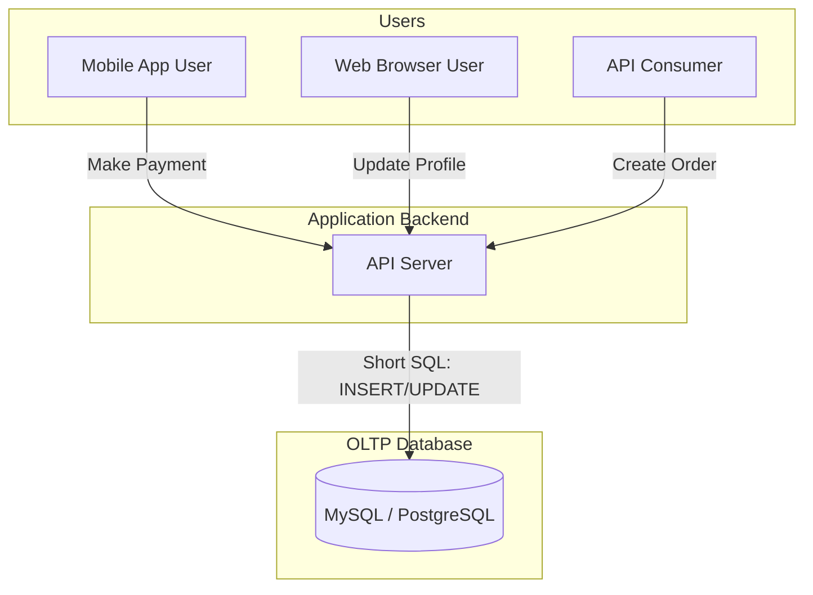

Mỗi khi bạn thực hiện một hành động như thêm hàng vào giỏ trên Shopee, chuyển khoản ngân hàng qua ứng dụng di động, hay đặt mua một vé máy bay trực tuyến, bạn đang trực tiếp tương tác với một hệ thống **OLTP (Online Transaction Processing - Xử lý Giao dịch Trực tuyến)**.

Nếu như các hệ thống phân tích ([OLAP](/concepts/database-storage/olap/)) đóng vai trò là "bộ não" giúp doanh nghiệp nhìn nhận lại quá khứ để ra quyết định, thì OLTP chính là "hệ tuần hoàn" giữ cho các ứng dụng vận hành hàng ngày sống sót. 

Nhiệm vụ tối thượng của OLTP là xử lý một lượng khổng lồ các giao dịch (transactions) ngắn, diễn ra liên tục với yêu cầu tốc độ phản hồi cực nhanh (tính bằng mili-giây) và độ chính xác tuyệt đối.

## Bản chất của một "Giao dịch" trong OLTP

Dưới góc nhìn cơ sở dữ liệu, một "giao dịch" trong OLTP là tập hợp các câu lệnh SQL viết dữ liệu (`INSERT`, `UPDATE`, `DELETE`) tác động lên một số lượng nhỏ các bản ghi. 

Để đảm bảo hệ thống vận hành an toàn, các cơ sở dữ liệu OLAP/OLTP truyền thống (như MySQL, PostgreSQL, Oracle) bắt buộc phải tuân thủ chặt chẽ nguyên tắc **ACID** (Tính nguyên tố, Tính nhất quán, Tính cô lập, Tính bền vững). 

Nguyên tắc này đảm bảo rằng: hoặc là toàn bộ các bước trong giao dịch của bạn (ví dụ: trừ tiền tài khoản của bạn VÀ cộng tiền vào tài khoản người nhận) phải thành công trọn vẹn, hoặc là tất cả sẽ bị hủy bỏ (rollback) nếu có lỗi xảy ra giữa chừng. Hệ thống tuyệt đối không chấp nhận trạng thái nửa vời (tiền của bạn đã bị trừ nhưng người nhận chưa nhận được).

---

## Tại sao chúng ta cần hệ thống OLTP chuyên biệt?

Hãy tưởng tượng trong một đợt săn sale trên trang thương mại điện tử, có hàng chục nghìn người cùng nhấn nút "Mua ngay" cho một món hàng cuối cùng trong kho.
* Nếu hệ thống phản hồi chậm trễ, người dùng sẽ lập tức rời bỏ ứng dụng.
* Nếu hệ thống không xử lý tốt bài toán tranh chấp dữ liệu (concurrency control) và cho phép cả hai người cùng mua được món hàng đó, doanh nghiệp sẽ gặp rắc rối lớn với khách hàng.

OLTP tồn tại để giải quyết bài toán: **Làm sao để phục vụ hàng triệu người dùng đồng thời đọc và ghi dữ liệu cực nhanh mà không để xảy ra bất kỳ sự sai sót hay chồng chéo số liệu nào**.

## Các đặc trưng thiết kế của OLTP

Để đạt được tốc độ xử lý giao dịch đáng kinh ngạc, hệ thống OLTP được xây dựng dựa trên các đặc điểm kỹ thuật sau:

* **Tần suất cao, quy mô nhỏ**: Hệ thống phải xử lý hàng triệu câu lệnh mỗi ngày, nhưng mỗi câu lệnh thường chỉ tác động đến một vài dòng dữ liệu cụ thể (ví dụ: cập nhật số dư tài khoản của đúng một khách hàng).
* **Chuẩn hóa dữ liệu cao (High Normalization)**: Dữ liệu trong hệ thống OLTP thường được tổ chức theo dạng chuẩn 3NF. Việc chia nhỏ dữ liệu thành nhiều bảng liên kết giúp hạn chế tối đa việc trùng lặp thông tin, đảm bảo thao tác ghi và cập nhật diễn ra nhanh nhất có thể.
* **Lưu trữ dạng Dòng (Row-based storage)**: Dữ liệu được lưu trữ trên đĩa cứng theo từng dòng. Điều này rất hoàn hảo vì khi bạn cần truy vấn thông tin của một khách hàng, hệ thống sẽ đọc toàn bộ các thuộc tính (tên, tuổi, địa chỉ, số điện thoại) nằm liền kề nhau trên đĩa chỉ trong một lần quét duy nhất.

---

## Cơ chế hoạt động: Khóa (Locking) và Ghi nhật ký (WAL)

Để đảm bảo tính nhất quán của dữ liệu khi có nhiều người cùng truy cập, OLTP vận hành dựa trên hai cơ chế cốt lõi:
1. **Khóa dữ liệu (Locking)**: Khi bạn đang sửa đổi thông tin của một dòng dữ liệu (ví dụ: đang cập nhật số ghế trống của một chuyến bay), hệ thống sẽ lập tức đặt một "Khóa độc quyền" (Exclusive Lock) lên dòng đó. Mọi giao dịch khác muốn sửa đổi dòng này sẽ phải xếp hàng chờ đợi cho đến khi bạn hoàn tất.
2. **Nhật ký ghi trước (Write-Ahead Logging - WAL)**: Trước khi ghi dữ liệu chính thức vào RAM hay đĩa cứng, hệ thống sẽ nhanh chóng ghi lại hành động đó vào một file nhật ký (transaction log). Nếu máy chủ đột ngột bị mất điện giữa chừng, hệ thống khi khởi động lại sẽ đọc file nhật ký này để khôi phục hoặc hủy bỏ các giao dịch đang chạy dở, đảm bảo dữ liệu không bao giờ bị hỏng.

---

## Kiến trúc tổng quan của hệ thống OLTP

Dưới đây là sơ đồ mô tả cách người dùng tương tác với cơ sở dữ liệu OLTP thông qua ứng dụng backend:



---

## Minh họa thực tế: Quy trình đặt vé máy bay

Dưới đây là một ví dụ điển hình về một giao dịch OLTP thực hiện việc đặt vé máy bay của người dùng:

```sql
BEGIN;

-- 1. Trừ số ghế trống của chuyến bay
UPDATE flights
SET available_seats = available_seats - 1
WHERE flight_id = 'VN247' AND available_seats > 0;

-- 2. Ghi nhận vé cho người dùng
INSERT INTO tickets (ticket_id, user_id, flight_id, status)
VALUES ('TICKET_001', 5678, 'VN247', 'CONFIRMED');

-- 3. Cập nhật số dư tài khoản của khách hàng
UPDATE accounts
SET balance = balance - 150.00
WHERE user_id = 5678;

COMMIT;
```

Tất cả các câu lệnh trên đều tận dụng chỉ mục (Index) trên khóa chính (`flight_id`, `user_id`) để tìm kiếm bản ghi tức thì, toàn bộ quá trình thực thi thường diễn ra trong vòng chưa đầy 10 mili-giây.

---

## Cân nhắc ưu nhược điểm và kinh nghiệm thực chiến

### Những ưu điểm vượt trội (Pros)
* Tốc độ phản hồi cực nhanh cho các giao dịch đơn lẻ.
* Đảm bảo tính toàn vẹn dữ liệu ở mức cao nhất, không lo bị trùng lặp hay mất mát thông tin nhờ cơ chế ACID.

### Những hạn chế cần lưu ý (Cons)
* Nếu bạn thiết kế các câu lệnh truy vấn không sử dụng Index, hệ thống sẽ phải quét toàn bộ bảng (Full Table Scan), làm tốc độ ghi/đọc giảm sút nghiêm trọng.
* Không có khả năng chạy các câu lệnh truy vấn phân tích tổng hợp phức tạp trên tập dữ liệu lịch sử lớn.

### Lời khuyên xương máu khi triển khai (Best Practices)
* **Giữ các giao dịch thật ngắn**: Tuyệt đối không đưa các tác vụ gọi API mạng (như gọi sang bên thứ ba thanh toán) vào nằm giữa khối `BEGIN` và `COMMIT`. Nếu API đó phản hồi chậm, giao dịch sẽ giữ Khóa (Lock) trên database lâu hơn, làm nghẽn toàn bộ các yêu cầu của người dùng khác.
* **Đánh chỉ mục (Index) thông minh**: Tạo index cho các cột thường xuyên dùng để tìm kiếm hoặc các khóa ngoại. Tuy nhiên, đừng lạm dụng tạo quá nhiều index cho một bảng, vì mỗi khi bạn thêm mới dữ liệu (`INSERT`), database sẽ phải mất thêm thời gian để cập nhật lại toàn bộ các cây index đó, làm chậm tốc độ ghi.
* **Lập kế hoạch dọn dẹp dữ liệu cũ (Archiving)**: Cơ sở dữ liệu OLTP sẽ chạy chậm dần theo thời gian nếu bảng dữ liệu phình to lên hàng trăm triệu dòng. Hãy xây dựng các job định kỳ để di chuyển các dữ liệu lịch sử cũ (ví dụ dữ liệu từ 3 năm trước) sang các kho lưu trữ lạnh giá rẻ hoặc Data Warehouse để giải phóng dung lượng cho OLTP.

### Những sai lầm phổ biến cần tránh
* **Chạy báo cáo trực tiếp trên Database vận hành**: Nhiều nhà phân tích dữ liệu vô tư chạy các câu lệnh SQL gom nhóm (`GROUP BY`, `SUM` quét toàn bộ bảng) trực tiếp trên database đang phục vụ người dùng. Điều này sẽ chiếm dụng toàn bộ tài nguyên CPU/RAM và khiến hệ thống của khách hàng bị treo cứng. 
  * *Giải pháp*: Hãy thiết kế một bản sao chỉ đọc (Read Replica) riêng biệt để chạy báo cáo, hoặc đồng bộ dữ liệu sang Data Warehouse (OLAP).

---

## Khi nào nên và không nên chọn OLTP?

### Nên chọn khi:
* Bạn đang xây dựng cơ sở dữ liệu backend cho các ứng dụng tương tác trực tiếp với người dùng như: ứng dụng ngân hàng, mạng xã hội, web bán hàng, cổng đặt vé... cần cập nhật dữ liệu liên tục và tức thì.

### Không nên chọn khi:
* Bạn đang xây dựng hệ thống báo cáo xu hướng kinh doanh, vẽ biểu đồ dashboard phục vụ phân tích dữ liệu lớn. Đối với các bài toán này, hãy trích xuất dữ liệu từ OLTP đưa sang hệ thống **OLAP** để xử lý hiệu quả hơn.

---

## Khái niệm liên quan

* [Relational Database](/concepts/database-storage/relational-database/)
* [OLAP](/concepts/database-storage/olap/)
* [Row-based Storage](/concepts/database-storage/row-based-storage/)

---

## Góc phỏng vấn: Câu hỏi thường gặp

### 1. Phân biệt sự khác nhau cơ bản nhất giữa hệ thống OLTP và OLAP?
* **Mục đích của người phỏng vấn**: Đánh giá tầm nhìn tổng quan của bạn về cách phân chia hạ tầng dữ liệu trong doanh nghiệp.
* **Gợi ý trả lời**:
  * **OLTP (Online Transaction Processing)** phục vụ cho các ứng dụng vận hành hàng ngày (Operational). Nó được tối ưu hóa cho tốc độ ghi và cập nhật các giao dịch nhỏ lẻ, ngắn gọn của hàng triệu người dùng đồng thời. Dữ liệu thường được tổ chức theo cấu trúc chuẩn hóa cao (như 3NF) để tránh trùng lặp thông tin.
  * **OLAP (Online Analytical Processing)** phục vụ cho các ứng dụng phân tích báo cáo (Analytical). Nó được tối ưu hóa cho tốc độ đọc và tính toán tổng hợp dữ liệu trên tập dữ liệu lịch sử khổng lồ. Dữ liệu thường được tổ chức theo cấu trúc phi chuẩn hóa (như [Star Schema](/concepts/data-warehouse/star-schema/)) để hạn chế các phép JOIN khi truy vấn.

### 2. Tại sao lưu trữ dạng dòng (Row-oriented storage) lại là lựa chọn tối ưu cho hệ thống OLTP?
* **Mục đích của người phỏng vấn**: Đánh giá hiểu biết sâu sắc của bạn về cơ chế lưu trữ vật lý của cơ sở dữ liệu.
* **Gợi ý trả lời**:
  * Trong các hệ thống OLTP, thao tác phổ biến nhất là thêm mới một bản ghi (như đăng ký tài khoản mới) hoặc lấy ra toàn bộ thông tin chi tiết của một đối tượng cụ thể (như xem thông tin hồ sơ cá nhân của một user).
  * Việc lưu trữ dạng dòng giúp lưu toàn bộ các thuộc tính của một bản ghi nằm liền kề nhau trên đĩa cứng. Nhờ đó, đầu đọc của đĩa chỉ cần thực hiện một lần quét duy nhất là lấy ra được trọn vẹn thông tin cần thiết, giúp tốc độ phản hồi đạt mức tối đa.

---

## Tài liệu tham khảo

1. [Designing Data-Intensive Applications](https://www.oreilly.com/library/view/designing-data-intensive-applications/9781491903063/) - Book by Martin Kleppmann analyzing transactional database internals, locking, and ACID constraints.
2. [Fundamentals of Data Engineering](https://www.oreilly.com/library/view/fundamentals-of-data/9781098108298/) - Book by Joe Reis and Matt Housley describing transactional systems as data sources.
3. [AWS: What is OLTP?](https://aws.amazon.com/what-is/oltp/) - Detailed explanation of OLTP systems, their characteristics, and transactional database architecture.
4. [IBM Topic: Online Transaction Processing (OLTP)](https://www.ibm.com/topics/oltp) - Core reference guide detailing ACID compliance, multi-tier architectures, and operational databases.
5. [Microsoft Learn: Online Transaction Processing (OLTP)](https://learn.microsoft.com/en-us/azure/architecture/data-guide/relational-data/online-transaction-processing) - Reference architecture for transactional processing systems and database patterns.


---

## English summary

OLTP (Online Transaction Processing) refers to systems designed to handle a massive volume of short, fast, and concurrent transactions securely. Powering everyday applications like e-commerce, banking, and ticketing, OLTP relies heavily on relational databases (RDBMS) ensuring strict ACID compliance. The architecture is optimized for low-latency, real-time read and write operations on highly normalized data stored in a row-oriented format. However, OLTP is not suitable for complex analytical queries across large historical datasets, a task designated for OLAP systems.
