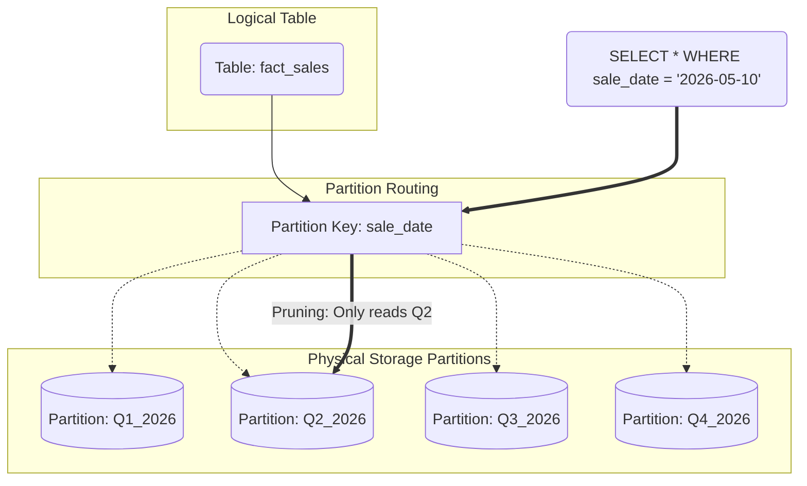

Khi cơ sở dữ liệu của bạn phình to từ vài triệu dòng lên hàng tỷ dòng, những câu truy vấn SQL từng chạy trong chớp mắt bỗng trở nên chậm chạp và ì ạch. Bạn đã thử tạo index (chỉ mục), nhưng khi dữ liệu quá khổng lồ, bộ index cũng lớn đến mức không thể nhét vừa vào bộ nhớ RAM. Đây chính là lúc chúng ta cần đến **Partitioning** (Phân vùng dữ liệu) - một nghệ thuật "chia để trị" kinh điển trong ngành kỹ thuật dữ liệu.

## Nghệ thuật "chia để trị" trong thế giới dữ liệu lớn

Về mặt khái niệm, phân vùng dữ liệu là việc chia nhỏ một bảng dữ liệu logic khổng lồ thành các phần vật lý nhỏ hơn (gọi là các partition) lưu trữ trên đĩa cứng. Điểm hay là đối với người dùng cuối hoặc các ứng dụng, họ vẫn nhìn thấy và truy vấn trên một bảng duy nhất. Nhưng ở bên dưới, hệ thống cơ sở dữ liệu sẽ thông minh chỉ quét các phân vùng thực sự chứa dữ liệu cần thiết, giúp giảm thiểu đáng kể lượng dữ liệu phải đọc ghi (I/O) và tăng tốc độ truy vấn lên gấp nhiều lần.

Khác với Index (chỉ tạo ra một cấu trúc phụ để tra cứu nhanh), Partitioning trực tiếp phân chia tệp tin dữ liệu gốc thành các thư mục hoặc tệp tin nhỏ riêng biệt. 

Có hai cách phân vùng chính:
* **Horizontal Partitioning (Phân vùng ngang)**: Chia bảng theo dòng. Ví dụ, các dòng dữ liệu của năm 2025 được cất ở phân vùng A, dòng của năm 2026 cất ở phân vùng B. Đây là phương pháp phổ biến nhất trong các Data Warehouse.
* **Vertical Partitioning (Phân vùng dọc)**: Chia bảng theo cột. Những cột ít khi dùng tới hoặc có kích thước lớn sẽ được tách riêng sang một vùng lưu trữ khác để giữ cho bảng chính luôn gọn nhẹ.

## Tại sao chúng ta cần phân vùng dữ liệu?

Hãy tưởng tượng bạn là một nhà phân tích muốn chạy báo cáo doanh thu của tháng này từ một bảng lưu trữ lịch sử bán hàng suốt 10 năm qua (nặng hàng Terabytes).

* **Nếu không có Partitioning**: Cơ sở dữ liệu bắt buộc phải quét toàn bộ tập tin khổng lồ chứa dữ liệu của cả 10 năm chỉ để lọc ra đúng 30 ngày gần nhất (Full Table Scan). Điều này cực kỳ lãng phí thời gian và tài nguyên máy tính.
* **Khi đã được Partitioning**: Hệ thống sẽ bỏ qua dữ liệu của 9 năm 11 tháng trước đó, đi thẳng vào thư mục chứa dữ liệu của riêng "Tháng này" để tính toán. Hành động thông minh này được gọi là **Partition Pruning (Tỉa phân vùng)**.

## Các chiến lược phân vùng phổ biến

Để chia nhỏ dữ liệu, trước tiên bạn cần chọn ra một cột làm **Partition Key (Khóa phân vùng)**. Cột thời gian (`Date` hoặc `Timestamp`) thường là ứng cử viên hàng đầu vì hầu hết các câu lệnh phân tích dữ liệu đều đi kèm điều kiện lọc thời gian (`WHERE date >= ...`).

Tùy thuộc vào đặc thù dữ liệu, bạn có thể áp dụng các chiến lược sau:
1. **Range Partitioning (Phân vùng theo khoảng)**: Chia dữ liệu dựa trên các khoảng giá trị liên tục. Ví dụ như chia theo từng tháng hoặc từng năm. Đây là lựa chọn hoàn hảo cho dữ liệu chuỗi thời gian (time-series).
2. **List Partitioning (Phân vùng theo danh sách)**: Chia dữ liệu theo các giá trị cụ thể, cố định. Ví dụ: phân vùng theo quốc gia (`country` là 'VN', 'US', 'JP').
3. **Hash Partitioning (Phân vùng theo mã băm)**: Dùng thuật toán Hash biến đổi giá trị của một cột (như `user_id`) rồi chia đều dữ liệu vào $N$ phân vùng cố định. Kỹ thuật này giúp phân tán đều tải trọng ghi dữ liệu, tránh tình trạng nghẽn cổ chai (load balancing).

### Cách lưu trữ vật lý trong Data Lake (ví dụ Amazon S3)

Nếu bạn lưu trữ dữ liệu dưới định dạng Parquet trong một Data Lake và thực hiện phân vùng theo `year` và `month`, cấu trúc thư mục thực tế sẽ được tổ chức rất rõ ràng như thế này:

```text
s3://my-data-lake/sales/
├── year=2025/
│   ├── month=11/ -> chứa data_part1.parquet
│   └── month=12/ -> chứa data_part2.parquet
└── year=2026/
    ├── month=01/ -> chứa data_part3.parquet
    └── month=02/ -> chứa data_part4.parquet
```

Khi bạn thực hiện câu lệnh SQL:
```sql
SELECT SUM(revenue) FROM sales WHERE year=2026 AND month=01;
```
Bộ máy truy vấn (Query Engine như Athena hoặc Trino) sẽ bỏ qua toàn bộ các thư mục khác, chỉ đọc đúng file `data_part3.parquet` nằm trong thư mục `year=2026/month=01/`. Nhờ vậy, hóa đơn Cloud của doanh nghiệp được giảm đáng kể vì phí dịch vụ thường tính trên lượng dữ liệu được quét.

## Sơ đồ kiến trúc phân vùng



## Ví dụ thực tế: Cài đặt phân vùng trong PostgreSQL

Dưới đây là cách bạn có thể khai báo một bảng phân vùng theo khoảng thời gian trong cơ sở dữ liệu PostgreSQL:

```sql
-- 1. Định nghĩa bảng cha (Master table) và chỉ định khóa phân vùng
CREATE TABLE measurement (
    city_id         int not null,
    logdate         date not null,
    peaktemp        int,
    unitsales       int
) PARTITION BY RANGE (logdate);

-- 2. Tạo các bảng phân vùng con (Child tables) để hứng dữ liệu cụ thể
CREATE TABLE measurement_y2026m01 PARTITION OF measurement
    FOR VALUES FROM ('2026-01-01') TO ('2026-02-01');

CREATE TABLE measurement_y2026m02 PARTITION OF measurement
    FOR VALUES FROM ('2026-02-01') TO ('2026-03-01');

-- 3. Sử dụng dữ liệu
-- Từ nay, khi bạn thực hiện câu lệnh INSERT vào bảng chung 'measurement', 
-- PostgreSQL sẽ tự động định tuyến (routing) dữ liệu vào đúng bảng con dựa trên giá trị của cột 'logdate'.
```

## Thiết kế phân vùng thế nào cho đúng?

### Các nguyên tắc thiết kế quan trọng (Best Practices)
* **Chọn đúng chìa khóa**: Hãy chọn cột thường xuyên xuất hiện nhất trong điều kiện lọc của các câu truy vấn. Nếu bạn phân vùng bảng theo quốc gia nhưng thói quen truy vấn của nhóm phân tích luôn lọc theo ngày tháng, tính năng cắt tỉa phân vùng (Partition Pruning) sẽ bị vô hiệu hóa, và hệ thống vẫn phải quét toàn bộ bảng.
* **Chú ý đến độ mịn của phân vùng (Granularity)**: Tránh chia dữ liệu quá nhỏ (ví dụ phân vùng theo từng giờ). Việc tạo ra hàng chục nghìn thư mục nhỏ sẽ tạo ra gánh nặng quản lý (metadata overhead) cho hệ thống khi lập kế hoạch truy vấn. Kích thước tối ưu cho mỗi phân vùng trên các nền tảng Data Lake thường dao động từ 1GB đến vài chục GB.

### Những cái bẫy thường gặp (Common Mistakes)
* **Lệch dữ liệu (Data Skew)**: Chẳng hạn bạn phân vùng theo mã cửa hàng (`store_id`), nhưng có một cửa hàng flagship mang lại 90% doanh thu trong khi hàng trăm cửa hàng khác cộng lại chỉ chiếm 10%. Phân vùng chứa cửa hàng flagship này sẽ cực kỳ khổng lồ, làm mất đi hoàn toàn lợi ích của việc chia nhỏ dữ liệu để xử lý song song.
* **Quên lọc theo khóa phân vùng**: Mặc dù bảng đã được phân vùng theo `date_key`, nhưng người viết truy vấn lại sử dụng cột `created_at` để lọc dữ liệu. Do không khớp khóa phân vùng, hệ thống buộc phải thực hiện quét toàn bảng (Full Scan), gây tốn kém chi phí và tài nguyên hệ thống.

## Cân nhắc hai mặt của đồng xu: Ưu và nhược điểm

### Điểm cộng lớn
* **Tăng tốc độ truy vấn vượt trội**: Nhờ cơ chế cắt tỉa phân vùng thông minh, lượng dữ liệu cần đọc giảm đi tối đa.
* **Vòng đời dữ liệu dễ quản lý (Data Lifecycle Management)**: Khi dữ liệu của 5 năm trước đã lỗi thời và cần xóa bỏ, thay vì chạy lệnh `DELETE` quét từng dòng cực kỳ chậm chạp và khóa bảng, bạn chỉ cần thực hiện lệnh hủy phân vùng (`DROP PARTITION`). Hệ thống sẽ xóa bỏ file vật lý tương ứng chỉ trong vòng 1 giây.

### Điểm trừ cần lưu ý
* **Ràng buộc thói quen viết code**: Người dùng cuối bắt buộc phải luôn nhớ đưa khóa phân vùng vào điều kiện lọc trong mệnh đề `WHERE`.
* **Rủi ro thiếu phân vùng**: Nếu một dòng dữ liệu mới không khớp với bất kỳ khoảng phân vùng nào đã định trước (và bạn quên cấu hình phân vùng mặc định - `DEFAULT`), câu lệnh ghi dữ liệu sẽ bị lỗi ngay lập tức.

### Khi nào nên áp dụng?
* Bắt buộc phải có cho các bảng sự kiện lớn (Fact tables) trong Data Warehouse hoặc các kho nhật ký sự kiện (Event logs) trong Data Lake.
* Các bảng chứa dữ liệu chuỗi thời gian liên tục tăng trưởng nhanh chóng theo ngày tháng.

### Khi nào không nên áp dụng?
* Các bảng danh mục, cấu hình nhỏ (Dimension tables) ví dụ như danh sách phòng ban, quốc gia. Việc phân vùng các bảng này chỉ làm tăng độ phức tạp không đáng có.
* Tổng dung lượng dữ liệu của bảng chưa vượt quá ngưỡng 10GB.

## Các khái niệm liên quan

* [Clustering](/concepts/database-storage/clustering/)
* [Data Warehouse](/concepts/data-warehouse/data-warehouse/)

## Góc phỏng vấn: Những thử thách thường gặp

### 1. Hãy phân biệt rõ Partitioning và Indexing. Khi nào thì dùng loại nào?
* **Gợi ý trả lời**: 
  - **Indexing** giống như phần mục lục của cuốn sách. Nó tạo ra một cấu trúc tìm kiếm phụ (thường là B-Tree) chỉ đến vị trí vật lý của dữ liệu. Indexing cực kỳ thích hợp cho các truy vấn có độ chọn lọc cao (High Selectivity) - tức là bạn cần tìm một hoặc vài dòng cụ thể trong hàng triệu dòng (ví dụ: tìm thông tin người dùng theo `user_id`).
  - **Partitioning** giống như việc chia một cuốn sách dày thành nhiều tập mỏng độc lập. Nó thích hợp cho các truy vấn quét diện rộng (Scan) nhưng trong một phạm vi giới hạn (ví dụ: tính doanh thu cả tháng).
  - Trong thực tế, chúng ta thường kết hợp cả hai: phân vùng bảng theo thời gian (Tháng), và trong mỗi phân vùng đó, ta tiếp tục đánh chỉ mục (Index) theo mã người dùng.

### 2. Sự cố "Data Skew" (Lệch dữ liệu) trong Partitioning là gì và bạn giải quyết thế nào?
* **Gợi ý trả lời**: Lệch dữ liệu xảy ra khi lượng dữ liệu phân bố không đồng đều giữa các phân vùng (ví dụ phân vùng của ngày lễ mua sắm lớn nhận lượng bản ghi khổng lồ so với ngày thường). Khi chạy các tác vụ xử lý song song (như Apache Spark), phân vùng bị lệch sẽ khiến một Node phải làm việc quá tải trong khi các Node khác đã rảnh rỗi (hiện tượng Straggler). Để giải quyết, ta có thể áp dụng kỹ thuật "Salting" (thêm một giá trị ngẫu nhiên vào khóa phân vùng để chia nhỏ tiếp) hoặc chuyển sang phân vùng theo mã băm (Hash Partitioning) để đảm bảo dữ liệu được rải đều trên mặt vật lý.

## Tài liệu tham khảo

1. **Google Cloud BigQuery Documentation** - Introduction to partitioned tables.
2. **Designing Data-Intensive Applications** - Martin Kleppmann (Chương 6 - Partitioning).

## English Summary

Partitioning is the database optimization technique of dividing a large logical table into smaller, physically separate parts (partitions) based on a specific key, usually a date or timestamp. Its primary analytical benefit is "Partition Pruning": when a query filters by the partition key, the database engine skips scanning irrelevant partitions, massively reducing disk I/O and query costs. While highly effective for managing large time-series data and enforcing data lifecycle policies (by simply dropping old partitions), it requires careful selection of the partition key to avoid data skew and scanning overhead.
