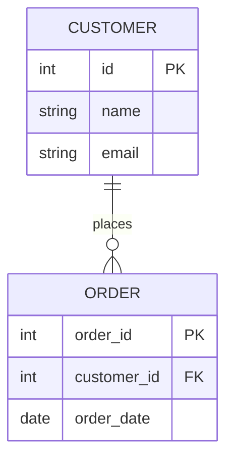

# Cơ sở Dữ liệu Quan hệ - Relational Database

Trong thế giới lưu trữ dữ liệu, dù có bao nhiêu công nghệ mới ra đời thì **Cơ sở dữ liệu quan hệ (Relational Database - RDBMS)** vẫn luôn đứng vững như một tượng đài, là sự lựa chọn hàng đầu cho hầu hết các hệ thống công nghệ từ nhỏ đến lớn. Đây là nền tảng đáng tin cậy giúp quản lý thông tin giao dịch, dữ liệu khách hàng và vận hành các ứng dụng cốt lõi của doanh nghiệp.

## Trật tự trong thế giới dữ liệu: Cơ sở dữ liệu quan hệ là gì?

Cơ sở dữ liệu quan hệ là một hệ thống tổ chức thông tin dưới dạng các bảng (Tables) có mối liên hệ chặt chẽ với nhau. Mô hình này được Edgar F. Codd đề xuất vào năm 1970 và nhanh chóng trở thành tiêu chuẩn công nghệ nhờ tính khoa học và rõ ràng.

Trong mô hình này:
* Dữ liệu được cấu trúc trong các bảng biểu (Tables / Relations).
* Mỗi cột (Columns / Attributes) đại diện cho một thuộc tính thông tin cụ thể (ví dụ: Tên, Số điện thoại, Ngày sinh).
* Mỗi dòng (Row / Tuple) đại diện cho một bản ghi dữ liệu riêng biệt của một thực thể.
* Các bảng liên kết chặt chẽ với nhau thông qua cơ chế **Khóa chính (Primary Key)** và **Khóa ngoại (Foreign Key)**.
* Ngôn ngữ truy vấn có cấu trúc **SQL (Structured Query Language)** được sử dụng làm ngôn ngữ tiêu chuẩn để giao tiếp và thao tác dữ liệu.

Các hệ quản trị cơ sở dữ liệu quan hệ phổ biến nhất hiện nay có thể kể đến MySQL, PostgreSQL, Oracle Database và Microsoft SQL Server.

## Nguồn gốc ra đời và những bài toán cần giải quyết

Trước khi mô hình quan hệ xuất hiện, dữ liệu thường được lưu trữ dưới dạng cấu trúc cây (Hierarchical databases) hoặc mạng lưới (Network databases). Cách lưu trữ này khiến việc thay đổi cấu trúc dữ liệu hoặc thực hiện các truy vấn phức tạp trở thành một cơn ác mộng đối với lập trình viên vì họ phải tự lập trình các đường dẫn vật lý để tìm đến dữ liệu.

RDBMS ra đời như một cuộc cách mạng nhằm giải quyết 3 bài toán lớn:
1. **Tính độc lập của dữ liệu**: Tách biệt hoàn toàn cách dữ liệu được lưu trữ vật lý trên đĩa cứng khỏi cách biểu diễn logic cho người dùng hoặc ứng dụng. Người dùng chỉ cần quan tâm bảng này có những cột nào, còn việc làm sao để tìm ra nó trên đĩa cứng là nhiệm vụ của RDBMS.
2. **Loại bỏ dữ liệu dư thừa (Data Redundancy)**: Nhờ các nguyên tắc chuẩn hóa dữ liệu (Normalization) và liên kết bằng khóa ngoại, RDBMS giúp tiết kiệm không gian lưu trữ và tránh được các sai sót khi cập nhật thông tin (ví dụ: thông tin chi tiết của một khách hàng chỉ cần lưu ở bảng Khách hàng một lần duy nhất, chứ không cần ghi đè lên từng đơn hàng họ mua).
3. **Đảm bảo tính toàn vẹn (Data Integrity)**: Đảm bảo dữ liệu luôn chính xác, đồng nhất ngay cả khi có hàng nghìn người dùng đồng thời truy cập và thực hiện chỉnh sửa.

## Những trụ cột của CSDL Quan hệ

### 1. Khái niệm về Khóa (Keys)
* **Primary Key (Khóa chính)**: Là một hoặc một nhóm cột có giá trị duy nhất dùng để định danh cho mỗi dòng dữ liệu trong bảng (ví dụ: `customer_id`).
* **Foreign Key (Khóa ngoại)**: Là một cột trong bảng này trỏ trực tiếp đến Khóa chính của một bảng khác, tạo nên sợi dây liên kết ngữ nghĩa giữa hai bảng dữ liệu.

### 2. Tính chất ACID
Đây chính là linh hồn của RDBMS, đảm bảo mọi giao dịch (Transactions) trong cơ sở dữ liệu luôn diễn ra an toàn và chính xác tuyệt đối:
* **A - Atomicity (Tính nguyên tử)**: Một giao dịch phải được thực hiện theo nguyên tắc "được ăn cả, ngã về không". Tất cả các bước trong giao dịch phải thành công toàn bộ, hoặc nếu có một bước lỗi thì toàn bộ giao dịch phải được hủy bỏ (Rollback) để đưa dữ liệu về trạng thái ban đầu. (Ví dụ: Khi chuyển tiền, tài khoản gửi bị trừ tiền thì tài khoản nhận bắt buộc phải cộng tiền; nếu có lỗi ở bước cộng tiền, số tiền bị trừ phải được hoàn lại).
* **C - Consistency (Tính nhất quán)**: Dữ liệu trước và sau khi thực hiện giao dịch phải luôn tuân thủ các quy tắc ràng buộc (Constraints) đã được thiết lập trước đó.
* **I - Isolation (Tính cô lập)**: Nhiều giao dịch chạy đồng thời phải diễn ra độc lập, không được can thiệp hay nhìn thấy dữ liệu tạm thời của nhau cho đến khi giao dịch hoàn tất.
* **D - Durability (Tính bền vững)**: Một khi giao dịch đã được xác nhận thành công (Committed), dữ liệu sẽ được lưu trữ vĩnh viễn xuống ổ đĩa cứng và không bị mất đi ngay cả khi hệ thống gặp sự cố mất điện đột ngột.

## Cách thức một RDBMS vận hành bên dưới

Khi bạn gửi một câu lệnh SQL đến cơ sở dữ liệu, RDBMS sẽ thực hiện quy trình xử lý gồm các bước sau:

1. **Parser (Trình phân tích cú pháp)**: Kiểm tra cú pháp của câu lệnh SQL xem có viết đúng chính tả không, các bảng và cột được gọi có thực sự tồn tại trong hệ thống hay không.
2. **Query Optimizer (Trình tối ưu hóa truy vấn)**: RDBMS phân tích dữ liệu thống kê để tính toán và lựa chọn ra phương án truy vấn nhanh nhất (ví dụ: nên quét toàn bảng hay sử dụng index, join bảng nào trước bảng nào sau).
3. **Execution Engine (Bộ thực thi)**: Thực hiện các thao tác đọc/ghi vật lý xuống đĩa cứng, có thể tận dụng bộ nhớ đệm (Buffer Pool/Cache) trên RAM để đẩy nhanh tốc độ phản hồi.
4. **Transaction & Lock Manager (Quản lý giao dịch và khóa)**: Thực thi cơ chế khóa (Locking) trên các dòng hoặc bảng dữ liệu đang được sửa đổi để ngăn chặn xung đột dữ liệu giữa các phiên làm việc của người dùng khác nhau, bảo toàn tính chất ACID.

## Sơ đồ Thực thể - Liên kết (ERD)

Sơ đồ ERD cơ bản dưới đây mô tả mối quan hệ 1-Nhiều kinh điển giữa thực thể Khách hàng (Customer) và Đơn hàng (Order):



## Minh họa thực tế: Thiết kế bảng và giao dịch SQL

Dưới đây là ví dụ về cách tạo bảng, thiết lập khóa ngoại và thực thi một giao dịch an toàn trong cơ sở dữ liệu:

```sql
-- 1. Khởi tạo bảng Khách hàng
CREATE TABLE Customers (
    CustomerID INT PRIMARY KEY AUTO_INCREMENT,
    Name VARCHAR(100) NOT NULL,
    Email VARCHAR(100) UNIQUE
);

-- 2. Khởi tạo bảng Đơn hàng liên kết với bảng Khách hàng bằng Khóa ngoại (Foreign Key)
CREATE TABLE Orders (
    OrderID INT PRIMARY KEY AUTO_INCREMENT,
    OrderDate DATE,
    CustomerID INT,
    TotalAmount DECIMAL(10, 2),
    FOREIGN KEY (CustomerID) REFERENCES Customers(CustomerID)
);

-- 3. Thực thi một giao dịch (Transaction) an toàn để thêm dữ liệu đồng thời
BEGIN TRANSACTION;
INSERT INTO Customers (Name, Email) VALUES ('Nguyen Van A', 'a@example.com');
-- Lấy giá trị ID vừa tự động tạo ra của khách hàng để chèn vào bảng Đơn hàng
INSERT INTO Orders (OrderDate, CustomerID, TotalAmount) VALUES ('2026-06-07', 1, 500.00);
COMMIT;
```

## Thiết kế chuẩn và những lỗi cần tránh

### Các nguyên tắc vàng khi thiết kế (Best Practices)
* **Áp dụng các dạng chuẩn (Normalization)**: Thiết kế cấu trúc các bảng tuân theo các dạng chuẩn hóa (thường là dạng chuẩn 3 - 3NF) để loại bỏ tối đa dữ liệu trùng lặp và ngăn chặn các lỗi logic khi cập nhật dữ liệu.
* **Đánh chỉ mục (Indexing) thông minh**: Tạo index cho các cột thường xuyên xuất hiện trong mệnh đề tìm kiếm `WHERE`, `JOIN` hoặc `ORDER BY` để tăng tốc độ truy xuất.
* **Tận dụng tối đa các ràng buộc (Constraints)**: Sử dụng các điều kiện ràng buộc như `NOT NULL`, `UNIQUE`, `CHECK` trực tiếp ở tầng database để tự động kiểm duyệt dữ liệu đầu vào, tránh phụ thuộc hoàn toàn vào code của ứng dụng.

### Những sai lầm phổ biến
* **Quên tạo Index**: Khi dung lượng dữ liệu tăng lên, việc thiếu index sẽ khiến hệ thống phải quét toàn bộ bảng (Full Table Scan) cho mỗi câu lệnh tìm kiếm, gây quá tải CPU và làm nghẽn toàn bộ ứng dụng.
* **Lưu các file nhị phân quá lớn (BLOB)**: Việc lưu trữ trực tiếp file ảnh, video hay tài liệu lớn vào RDBMS là một thiết kế tồi. Giải pháp chuẩn là lưu các file đó lên các kho lưu trữ đối tượng (như Amazon S3) và chỉ lưu đường dẫn URL trong database.
* **Sử dụng lệnh SELECT ***: Trong các ứng dụng production, việc viết `SELECT *` thay vì liệt kê rõ ràng các cột cần lấy sẽ làm tăng băng thông mạng và lãng phí RAM không đáng có.

## Đánh đổi thực tế: Khi nào nên và không nên chọn RDBMS?

### Điểm cộng lớn
* Bảo vệ tính toàn vẹn và đồng nhất của dữ liệu ở mức tối đa nhờ tuân thủ chặt chẽ ACID.
* Ngôn ngữ SQL cực kỳ mạnh mẽ, linh hoạt và được chuẩn hóa toàn cầu, giúp xử lý các bài toán truy vấn phức tạp một cách dễ dàng.

### Điểm trừ cần lưu ý
* **Khó mở rộng theo chiều ngang (Horizontal Scaling)**: RDBMS được thiết kế tốt nhất để chạy trên một máy chủ đơn lẻ (Scale Up). Khi dữ liệu quá lớn và cần phân tán ra nhiều máy (Sharding), việc quản trị và bảo toàn tính ACID trở nên rất phức tạp.
* **Cấu trúc bảng cứng nhắc**: Việc thay đổi cấu trúc bảng (như thêm cột) trên một bảng chứa hàng tỷ dòng dữ liệu có thể làm khóa bảng và treo hệ thống trong thời gian dài.

### Khi nào RDBMS là lựa chọn tốt nhất?
* Các ứng dụng yêu cầu tính nhất quán dữ liệu tuyệt đối như hệ thống tài chính, ngân hàng, thanh toán và quản lý đơn hàng.
* Các hệ thống có mô hình dữ liệu rõ ràng, có cấu trúc chặt chẽ và ít khi thay đổi cấu trúc đột ngột.

### Khi nào nên cân nhắc giải pháp khác?
* Dữ liệu hoàn toàn không có cấu trúc cố định hoặc thay đổi liên tục theo từng bản ghi (nên chọn NoSQL như MongoDB).
* Yêu cầu lưu trữ khối lượng dữ liệu khổng lồ (hàng Petabytes) phục vụ cho việc phân tích dữ liệu lớn hoặc huấn luyện Machine Learning (nên chọn Data Lake).

## Các khái niệm liên quan

* [OLTP](/concepts/database-storage/oltp/)
* [Indexing](/concepts/database-storage/indexing/)
* [Data Warehouse](/concepts/data-warehouse/data-warehouse/)

## Góc phỏng vấn: Những thử thách tư duy về CSDL Quan hệ

### 1. Bạn hãy giải thích cụ thể ý nghĩa của từng chữ cái trong tính chất ACID.
* **Gợi ý trả lời**: 
  - **Atomicity** (Tính nguyên tử): Đảm bảo giao dịch thực hiện trọn vẹn (thành công hết hoặc thất bại hết, không có trạng thái lửng lơ).
  - **Consistency** (Tính nhất quán): Dữ liệu luôn tuân thủ các quy tắc ràng buộc logic từ trước đến sau giao dịch.
  - **Isolation** (Tính cô lập): Các giao dịch chạy song song không được làm phiền hay nhìn thấy dữ liệu trung gian của nhau.
  - **Durability** (Tính bền vững): Dữ liệu sau khi commit sẽ được ghi vĩnh viễn xuống ổ cứng vật lý, an toàn trước các sự cố sập nguồn.

### 2. Sự khác biệt cốt lõi giữa hai câu lệnh DELETE và TRUNCATE trong SQL là gì?
* **Gợi ý trả lời**:
  - `DELETE` là lệnh DML (Data Manipulation Language). Nó thực hiện xóa từng dòng dữ liệu cụ thể, có ghi nhận chi tiết vào transaction log nên chạy chậm hơn trên các bảng lớn nhưng có thể khôi phục lại (Rollback) được và sẽ kích hoạt các Trigger liên quan.
  - `TRUNCATE` là lệnh DDL (Data Definition Language). Nó xóa toàn bộ dữ liệu bằng cách giải phóng trực tiếp các trang đĩa vật lý của bảng dữ liệu đó. Lệnh này không ghi log chi tiết từng dòng nên chạy cực kỳ nhanh, không kích hoạt Trigger và thông thường không thể Rollback sau khi thực hiện.

## Tài liệu tham khảo

1. **Designing Data-Intensive Applications** - Martin Kleppmann (Chương 2: Data Models and Query Languages).
2. **Database System Concepts** - Abraham Silberschatz.

## English Summary

A Relational Database (RDBMS) organizes data into tables with predefined columns and rows, establishing links (relationships) between them using Primary and Foreign keys. It uses SQL for querying and managing data. The defining characteristic of an RDBMS is its strict adherence to ACID properties (Atomicity, Consistency, Isolation, Durability), ensuring absolute data integrity and reliability for transactional systems. While highly structured and secure, it can be challenging to scale horizontally compared to NoSQL databases.
