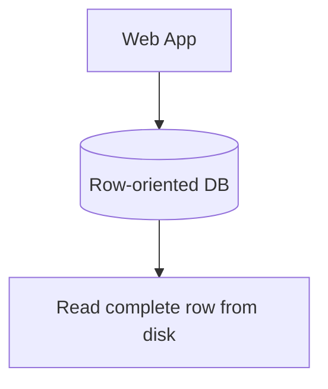

Khi bắt đầu tìm hiểu về cách cơ sở dữ liệu lưu trữ thông tin vật lý trên đĩa cứng, chúng ta sẽ bắt gặp hai trường phái thiết kế kinh điển: Lưu trữ dạng Dòng (Row-based Storage) và Lưu trữ dạng Cột (Columnar Storage). Trong số đó, **Row-based Storage** là mô hình lâu đời, phổ biến và là xương sống cho hầu hết các hệ quản trị cơ sở dữ liệu quan hệ (RDBMS) quen thuộc như MySQL, PostgreSQL hay Oracle.

## Lưu trữ theo hàng dọc ổ đĩa: Row-based Storage là gì?

Lưu trữ dạng dòng (hay Row-oriented storage) là phương pháp tổ chức dữ liệu vật lý trên ổ đĩa sao cho toàn bộ các thuộc tính (cột) của cùng một bản ghi (dòng) được xếp nằm cạnh nhau một cách tuần tự.

Hãy tưởng tượng ổ cứng của bạn giống như một cuốn sổ viết dòng chữ liên tục. Trong kiến trúc Row-based, hệ thống sẽ ghi hết tất cả thông tin của dòng thứ nhất (cột 1, cột 2, cột 3...), sau đó xuống dòng và ghi tiếp toàn bộ thông tin của dòng thứ hai. Mô hình này được tối ưu hóa ở mức cao nhất cho các hệ thống xử lý giao dịch trực tuyến **OLTP (Online Transaction Processing)**.

## Tại sao chúng ta cần lưu trữ dạng dòng?

Để hiểu lý do tại sao Row-based Storage lại thống trị thế giới ứng dụng web và mobile, hãy nhìn vào thói quen đọc/ghi dữ liệu của các phần mềm hướng người dùng cuối:

* **Thêm mới một bản ghi đầy đủ**: Khi một người dùng đăng ký tài khoản mới, hệ thống cần ghi nhận một thực thể hoàn chỉnh bao gồm: Tên, Email, Mật khẩu, Số điện thoại và Địa chỉ.
* **Lấy chi tiết một thực thể**: Khi người dùng nhấn vào trang cá nhân, hệ thống cần đọc ra toàn bộ thông tin chi tiết của riêng người dùng đó để hiển thị trên màn hình.

Ổ đĩa máy tính hoạt động bằng cách đọc/ghi dữ liệu theo từng khối (blocks hoặc pages). Nhờ cách xếp dữ liệu nằm sát cạnh nhau của Row-based Storage, thao tác *"ghi hoặc đọc nguyên một thực thể"* chỉ tốn duy nhất một (hoặc rất ít) nhịp đọc/ghi vật lý của ổ đĩa (Disk I/O). Nếu dữ liệu của cùng một người dùng bị xé lẻ ra nhiều nơi trên ổ đĩa, đầu đọc sẽ phải di chuyển liên tục để gom thông tin, làm suy giảm hiệu năng nghiêm trọng.

## Những trụ cột tạo nên sức mạnh của Row-based Storage

* **Tốc độ ghi chèn cực nhanh (Fast Writes)**: Khi có dữ liệu mới, hệ thống chỉ việc tìm đến cuối file dữ liệu hiện tại (Append) và ghi liền một mạch toàn bộ thuộc tính của dòng đó.
* **Tính toàn vẹn thực thể (Entity Locality)**: Việc lưu trữ dữ liệu của một bản ghi tập trung tại một chỗ rất thân thiện với bộ đệm cache của hệ điều hành. Khi bạn kéo một dòng dữ liệu lên RAM, tất cả các thuộc tính của nó đều sẵn sàng để sử dụng ngay lập tức mà không cần tốn thêm kết nối.
* **Hỗ trợ Index (Chỉ mục) mạnh mẽ**: Các RDBMS đã dành hàng thập kỷ để tối ưu hóa cấu trúc chỉ mục cây B-Tree. Cấu trúc này giúp trỏ trực tiếp đến địa chỉ vật lý của một dòng cụ thể trên đĩa cứng với độ trễ cực thấp.

## Bản chất vật lý của dữ liệu dạng dòng

Hãy xem cách dữ liệu được sắp xếp trên đĩa cứng:

### Bảng dữ liệu logic của người dùng:
| ID | Name  | Age | City  |
|----|-------|-----|-------|
| 1  | Alice | 25  | Hanoi |
| 2  | Bob   | 28  | HCM   |

### Cách dữ liệu thực tế ghi trên đĩa (Row-based):
Dữ liệu được chia thành các Block vật lý liên tiếp nhau:
* Block 1: `[1, "Alice", 25, "Hanoi"]`
* Block 2: `[2, "Bob", 28, "HCM"]`

Khi bạn chạy truy vấn `SELECT * FROM users WHERE ID = 1`, Database sử dụng Index để xác định bản ghi nằm ở Block 1. Nó lập tức tải toàn bộ Block 1 lên bộ nhớ RAM chỉ trong một lượt đọc đĩa và trả kết quả về cho ứng dụng.

## Sơ đồ luồng truy xuất dữ liệu



## Ví dụ thực tế: Thao tác mua hàng trên E-commerce

Khi bạn bấm nút mua hàng trên một trang thương mại điện tử, hệ thống sẽ thực thi lệnh chèn một đơn hàng mới vào cơ sở dữ liệu:

```sql
INSERT INTO orders (id, user_id, total, status, created_at, shipping_addr)
VALUES (1001, 5, 250.00, 'PENDING', '2026-06-07 10:00:00', '123 P. Hue');
```

Nếu cơ sở dữ liệu sử dụng cấu trúc Row-based (như InnoDB của MySQL), toàn bộ chuỗi dữ liệu trên sẽ được đóng gói thành một chuỗi byte liên tục và ghi tuần tự vào cuối file log ghi nhật ký (Write-Ahead Log - WAL) trước khi đồng bộ xuống đĩa. Việc ghi liền mạch này giúp giảm thiểu tối đa độ trễ ghi dữ liệu. 

*(Nếu hệ thống sử dụng Columnar Storage, nó sẽ phải tách 6 giá trị này ra để ghi vào 6 tệp tin cột khác nhau, khiến quá trình ghi giao dịch trở nên chậm chạp hơn rất nhiều).*

## Những nguyên tắc vàng và sai lầm thường gặp

### Kinh nghiệm thiết kế (Best Practices)
* **Luôn tạo Index phù hợp**: Nhược điểm lớn nhất của Row-based Storage là thao tác quét toàn bảng (Full Table Scan). Nếu bạn tìm kiếm dữ liệu mà không có Index hỗ trợ, hệ thống bắt buộc phải đọc từng dòng từ đầu đến cuối đĩa để lọc kết quả, gây nghẽn cổ chai I/O. Do đó, hãy luôn tạo Index cho các cột xuất hiện nhiều trong mệnh đề tìm kiếm `WHERE`.
* **Tránh bảng quá rộng (Quá nhiều cột)**: Thiết kế một bảng chứa 100-200 cột trong hệ thống Row-based là một thực hành tồi. Mỗi lần bạn muốn đọc một dòng dữ liệu, hệ thống bắt buộc phải kéo một khối lượng dữ liệu khổng lồ chứa hàng trăm cột không dùng tới vào RAM, gây lãng phí bộ đệm (Buffer Pool). Hãy chia nhỏ bảng bằng các nguyên tắc chuẩn hóa dữ liệu.

### Những sai lầm kinh điển
* **Sử dụng CSDL Row-based làm kho phân tích (Data Warehouse)**: Nhiều lập trình viên viết các câu lệnh phân tích như `SELECT SUM(total) FROM orders` trên MySQL. Để tính tổng doanh thu của cột `total`, ổ đĩa vẫn buộc phải quét qua toàn bộ dữ liệu của các cột khác như tên khách hàng, trạng thái, địa chỉ... gây lãng phí tài nguyên I/O đĩa cứng cực kỳ lớn.
* **Lạm dụng lệnh SELECT ***: Thói quen viết `SELECT *` trong code ứng dụng để lấy toàn bộ cột của một dòng từ database lên RAM chỉ để hiển thị đúng 2 thông tin tên và tuổi lên giao diện sẽ làm lãng phí băng thông mạng và bộ nhớ hệ thống.

## Đánh đổi thực tế: Khi nào nên và không nên sử dụng?

### Lợi ích nổi bật
* Tốc độ xử lý cực nhanh đối với các tác vụ thêm, sửa, xóa (Write-heavy) của từng giao dịch đơn lẻ.
* Tối ưu hóa tối đa hiệu năng I/O khi cần truy vấn toàn bộ thông tin của một đối tượng cụ thể dựa trên khóa chính.

### Điểm hạn chế
* Hiệu suất rất kém đối với các câu lệnh phân tích, tổng hợp dữ liệu quy mô lớn (như tính tổng, trung bình cộng trên hàng triệu dòng).
* Hiệu quả nén dữ liệu thấp do các kiểu dữ liệu khác nhau (số, chữ, ngày tháng) nằm xếp đan xen nhau trên đĩa cứng, gây khó khăn cho việc áp dụng các thuật toán nén chuyên dụng.

### Khi nào nên áp dụng?
* Xương sống của các ứng dụng Backend, Web, Mobile, CRM, ERP, hệ thống lõi của ngân hàng và ví điện tử (nơi các giao dịch OLTP diễn ra liên tục).

### Khi nào không nên áp dụng?
* Xây dựng các hệ thống báo cáo phân tích thông minh (BI), Data Warehouse phục vụ cho phân tích dữ liệu lớn (nơi các cơ sở dữ liệu dạng cột Columnar Storage đang thống trị).

## Các khái niệm liên quan

* [Columnar Storage](/concepts/database-storage/columnar-storage/)
* [OLTP](/concepts/database-storage/oltp/)
* [Relational Database](/concepts/database-storage/relational-database/)

## Góc phỏng vấn: Thử thách phân biệt Row-based và Column-based

### 1. Bạn hãy giải thích cụ thể khi nào doanh nghiệp nên lựa chọn Row-based và khi nào nên chọn Column-based storage?
* **Gợi ý trả lời**: 
  - Chúng ta chọn **Row-based** cho các hệ thống OLTP (như cơ sở dữ liệu vận hành ứng dụng) nơi có tần suất ghi chèn, cập nhật các dòng đơn lẻ diễn ra liên tục, và các truy vấn thường có xu hướng đọc ra toàn bộ thông tin của một bản ghi cụ thể.
  - Chúng ta chọn **Column-based** cho các hệ thống OLAP (như Data Warehouse để phân tích) nơi dữ liệu hầu như chỉ đọc (Read-heavy), ít khi cập nhật từng dòng và các câu truy vấn thường quét qua hàng triệu dòng dữ liệu nhưng chỉ tập trung tính toán tổng hợp trên một vài cột cụ thể (như tính tổng doanh thu, đếm số lượng người dùng).

### 2. Nếu một bảng dữ liệu Row-based không có Index, điều gì sẽ xảy ra ở tầng vật lý của đĩa cứng khi ta chạy câu lệnh `SELECT name FROM users WHERE email = 'a@a.com'`?
* **Gợi ý trả lời**: Do không có Index, hệ thống buộc phải thực hiện quét toàn bảng (Full Table Scan). Ở tầng vật lý, ổ đĩa cứng bắt buộc phải đọc tuần tự từng block dữ liệu từ đầu đến cuối. Mặc dù chúng ta chỉ cần lấy giá trị của cột `name`, ổ đĩa vẫn phải đọc toàn bộ thông tin của tất cả các cột không liên quan nằm chung trên dòng đó (như tuổi, địa chỉ, lịch sử hoạt động) để nạp lên RAM rồi mới tiến hành lọc. Việc này gây lãng phí tài nguyên băng thông I/O của đĩa và khiến tốc độ phản hồi cực kỳ chậm nếu bảng có hàng triệu bản ghi.

## Tài liệu tham khảo

1. [Designing Data-Intensive Applications](https://www.oreilly.com/library/view/designing-data-intensive-applications/9781491903063/) - Book by Martin Kleppmann providing in-depth analysis of row-oriented vs. column-oriented physical database layout.
2. [C-Store: A Column-Oriented DBMS](https://dl.acm.org/doi/10.1145/1083592.1083658) - Seminal research paper by Michael Stonebraker et al. contrasting column store with traditional row store.
3. [ClickHouse Documentation: Column-oriented DBMS](https://clickhouse.com/docs/en/about/olap) - Explains why column-oriented storage outperforms row-oriented storage for analytical queries.
4. [PostgreSQL Documentation: Database Physical Storage](https://www.postgresql.org/docs/current/storage.html) - Official PostgreSQL documentation on how tables and rows are physically structured as pages and blocks on disk.
5. [AWS: Row-Oriented vs. Column-Oriented Databases](https://aws.amazon.com/compare/the-difference-between-row-oriented-and-column-oriented-databases/) - AWS comparison guide detailing performance trade-offs, transactional vs. analytical workloads, and storage patterns.


## English Summary

Row-based Storage organizes data physically on disk row by row, keeping all attributes (columns) of a single record adjacent to one another. This design is highly optimized for Online Transaction Processing (OLTP) systems, where typical operations involve inserting, updating, or fetching a complete entity (like a user profile) in a single disk I/O operation. While it provides excellent performance for transactions, it is inefficient for analytical queries (OLAP) because computing an aggregate over a single column requires the disk to read the entire row, causing massive I/O waste compared to columnar storage.
