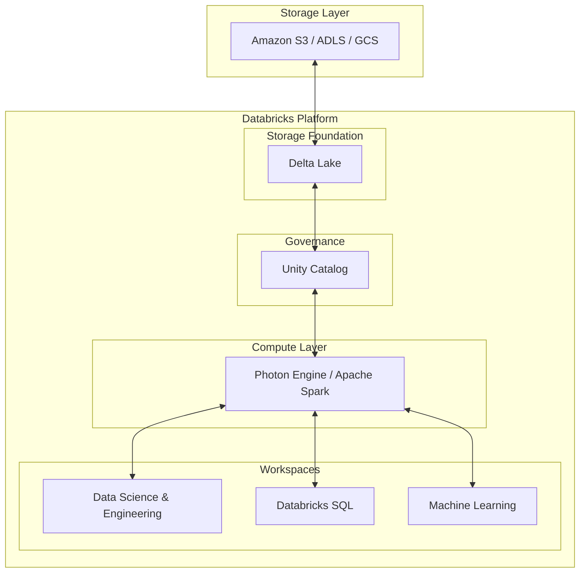

# Databricks Platform

## Summary

Nền tảng Databricks là một nền tảng dữ liệu đám mây thống nhất tiên phong trong mô hình kiến trúc Lakehouse. Được xây dựng bởi những người tạo ra Apache Spark, Databricks kết hợp những ưu điểm tốt nhất của Data Lake và Data Warehouse, cung cấp môi trường tính toán mạnh mẽ cho kỹ thuật dữ liệu, khoa học dữ liệu, học máy và phân tích kinh doanh.

---

## Definition

**Databricks Platform** là một nền tảng dữ liệu, phân tích và trí tuệ nhân tạo (AI) chạy trên đám mây (AWS, Azure, GCP). Nền tảng này dựa trên kiến trúc Lakehouse, cho phép quản lý vòng đời dữ liệu từ lúc nhập (ingestion), xử lý ETL/ELT, đến học máy (ML) và trực quan hóa (BI) trong một môi trường hợp nhất dựa trên động cơ Apache Spark được tinh chỉnh và công nghệ lưu trữ Delta Lake.

---

## Why it exists

Trước khi có Lakehouse, các doanh nghiệp thường phải sử dụng Data Lake cho lưu trữ giá rẻ, máy học và sử dụng Data Warehouse để phân tích cấu trúc, BI. Sự tách biệt này sinh ra các vấn đề:
1. **Dữ liệu dư thừa**: Dữ liệu phải được sao chép và di chuyển qua lại giữa Data Lake và Data Warehouse (ETL chéo).
2. **Khó đảm bảo độ tin cảy của dữ liệu**: Data Lake truyền thống không có tính toàn vẹn giao dịch (ACID transactions), dễ dẫn đến sai lệch khi có lỗi ghi đè dữ liệu.
3. **Môi trường rời rạc**: Data Engineers (dùng Scala/Spark), Data Scientists (dùng Python/Jupyter), và Data Analysts (dùng SQL) làm việc trên các công cụ riêng biệt, khó cộng tác.

Databricks giải quyết triệt để các vấn đề này thông qua kiến trúc Lakehouse và môi trường Notebooks cộng tác.

---

## Core idea

Databricks được xây dựng dựa trên ba công nghệ cốt lõi, thường là mã nguồn mở nhưng được Databricks cung cấp các phiên bản doanh nghiệp tối ưu hóa:
* **Apache Spark**: Động cơ xử lý phân tán khổng lồ (tối ưu hóa dưới tên gọi Databricks Photon Engine để cho tốc độ xử lý nhanh hơn).
* **Delta Lake**: Lớp lưu trữ mã nguồn mở mang lại độ tin cậy giao dịch ACID cho các Data Lake, cho phép xử lý lô và luồng (batch and streaming) một cách nhất quán.
* **MLflow**: Nền tảng quản lý vòng đời Machine Learning (ML lifecycle), theo dõi các mô hình, thí nghiệm và triển khai chúng dễ dàng.

---

## How it works

Hệ sinh thái Databricks hoạt động như một tầng tính toán linh hoạt (elastic compute layer) nằm trên hạ tầng lưu trữ đám mây gốc (như Amazon S3, Azure Data Lake, Google Cloud Storage).
1. **Workspace**: Người dùng tương tác thông qua Databricks Workspace với giao diện sổ tay (notebooks) thân thiện, hỗ trợ Python, SQL, Scala và R.
2. **Cluster Management**: Tự động cấp phát, quản lý và thu hồi các cụm máy chủ xử lý dữ liệu (Clusters). Có thể tùy chọn các cụm tương tác (Interactive Clusters) cho phát triển, hoặc cụm tác vụ (Job Clusters) để chạy lịch trình.
3. **Data Management**: Dữ liệu lưu trong hạ tầng Cloud Storage được định dạng Delta Lake, giúp xử lý cập nhật (upsert/delete) như trong CSDL truyền thống trong khi giữ được chi phí rẻ của Data Lake.
4. **Unity Catalog**: Tầng quản trị dữ liệu tập trung thống nhất trên tất cả các không gian làm việc (Workspaces), cho phép phân quyền chi tiết đến từng cột/hàng và truy xuất phả hệ dữ liệu (Data Lineage).

---

## Architecture / Flow



---

## Practical example

Một nhóm Kỹ sư Dữ liệu muốn tạo một pipeline để xử lý luồng dữ liệu clickstream từ người dùng với độ trễ thấp và lưu trữ trực tiếp vào Lakehouse bằng Python (PySpark).

```python
from pyspark.sql.functions import col

# Đọc luồng dữ liệu trực tiếp từ Kafka
df = spark.readStream \
    .format("kafka") \
    .option("kafka.bootstrap.servers", "host1:port1") \
    .option("subscribe", "clickstream") \
    .load()

# Xử lý và làm sạch dữ liệu
processed_df = df.selectExpr("CAST(value AS STRING) as json_payload") \
    .filter(col("json_payload").isNotNull())

# Ghi trực tiếp ra Delta Table (sử dụng Delta Lake)
query = processed_df.writeStream \
    .format("delta") \
    .outputMode("append") \
    .option("checkpointLocation", "/data/checkpoints/clickstream") \
    .start("/data/lakehouse/clickstream_gold")
```

Bảng `clickstream_gold` ngay lập tức có thể được các Analyst dùng Databricks SQL để phân tích và vẽ biểu đồ.

---

## Best practices

* **Tối ưu hóa Delta Tables**: Thường xuyên chạy các lệnh `OPTIMIZE` và `ZORDER` trên Delta tables để gom các file nhỏ thành file lớn và sắp xếp dữ liệu tối ưu hóa cho tốc độ đọc.
* **Sử dụng Job Clusters cho Pipeline Production**: Không sử dụng All-purpose (Interactive) clusters để chạy các tác vụ định kỳ, hãy dùng Job clusters vì chúng tiết kiệm chi phí hơn đáng kể.
* **Tận dụng Photon**: Kích hoạt Databricks Photon engine cho các khối lượng công việc nặng về SQL và xử lý DataFrame để tận dụng sức mạnh biên dịch và tăng tốc phần cứng.
* **Tách biệt Môi trường**: Sử dụng các Workspace riêng biệt cho Dev, Staging và Production, đồng thời dùng Unity Catalog để quản lý truy cập dữ liệu giữa các môi trường một cách tập trung.

---

## Common mistakes

* **Quản lý file không tốt (Small files problem)**: Việc ghi streaming hoặc các batch nhỏ sinh ra hàng triệu file kích thước siêu nhỏ trong cloud storage. Nếu không dùng lệnh `OPTIMIZE` thường xuyên, nó sẽ làm chậm đáng kể hiệu năng đọc.
* **Lạm dụng `.collect()` trong Spark**: Chuyển toàn bộ dữ liệu từ các Worker nodes về Driver node khi dữ liệu quá lớn, dẫn đến lỗi "Out of Memory" (OOM).
* **Bỏ qua VACUUM**: Dữ liệu lịch sử từ các thao tác cập nhật của Delta Lake nếu không được xóa (chạy lệnh `VACUUM`) sẽ làm tăng chi phí lưu trữ một cách không kiểm soát được.

---

## Trade-offs

### Ưu điểm
* Hệ sinh thái thống nhất và mạnh mẽ bậc nhất cho Data Engineering và Machine Learning.
* Kiến trúc Lakehouse khắc phục triệt để bài toán tích hợp giữa Data Warehouse và Data Lake.
* Hiệu suất vượt trội so với Spark nguồn mở nhờ Photon engine.
* Môi trường notebook cộng tác thời gian thực xuất sắc.

### Nhược điểm
* Rất tốn kém nếu không kiểm soát tốt cách thức cụm máy chủ chạy.
* Rào cản kỹ thuật cao hơn so với Data Warehouse truyền thống như Snowflake (đòi hỏi sự am hiểu nhất định về Spark và lập trình).
* Đôi khi phức tạp trong quá trình triển khai cấu hình mạng lưới (Network) trên môi trường Cloud Enterprise.

---

## When to use

* Cần tích hợp chặt chẽ quy trình Khoa học Dữ liệu (Machine Learning, AI) vào cùng hệ sinh thái kỹ thuật dữ liệu.
* Khi khối lượng dữ liệu khổng lồ, cần sức mạnh xử lý song song và khả năng kết hợp luồng dữ liệu (streaming) và theo lô (batch).
* Triển khai kiến trúc Lakehouse.

## When not to use

* Nhu cầu chủ yếu chỉ là các báo cáo BI đơn giản trên tập dữ liệu nhỏ.
* Tổ chức không có đội ngũ quen thuộc với Python, Scala hoặc mô hình xử lý phân tán. (Có thể cân nhắc Snowflake để dễ dùng hơn).
* Ngân sách rất eo hẹp và khối lượng dữ liệu tĩnh không đổi.

---

## Related concepts

* [Delta Lake](/concepts/delta-lake)
* [Data Mesh](/concepts/data-mesh)
* [Azure Synapse](/concepts/azure-synapse)
* [Lambda Architecture](/concepts/lambda-architecture)

---

## Interview questions

### 1. Giải thích sự khác biệt giữa Databricks All-Purpose Clusters và Job Clusters.
* **Người phỏng vấn muốn kiểm tra**: Hiểu biết thực tế về quản lý tài nguyên và chi phí trên nền tảng.
* **Gợi ý trả lời (Strong Answer)**: All-Purpose Clusters được sử dụng bởi nhiều người dùng để phân tích ad-hoc, chạy sổ tay (notebooks) tương tác, có thể bị chấm dứt (terminate) và khởi động lại. Chi phí Databricks Units (DBUs) cao hơn. Job Clusters chỉ được tạo tự động khi chạy tác vụ (job), và bị hủy ngay lập tức sau khi hoàn thành để tiết kiệm chi phí, không hỗ trợ giao diện tương tác, và có chi phí DBU rẻ hơn nhiều.

### 2. Lệnh `OPTIMIZE` và `ZORDER` trong Delta Lake (Databricks) làm gì?
* **Người phỏng vấn muốn kiểm tra**: Kiến thức về tối ưu hóa lưu trữ cột (columnar storage) phân tán.
* **Gợi ý trả lời (Strong Answer)**: `OPTIMIZE` giúp giải quyết vấn đề các tập tin nhỏ (small file problem) bằng cách hợp nhất (compact) nhiều file Parquet nhỏ lại thành các file lớn hơn (thường ~1GB), giúp giảm tải tác vụ đọc file metadata. `ZORDER` là một kỹ thuật bố cục đa chiều (multi-dimensional layout) kết hợp với OPTIMIZE để tổ chức dữ liệu cạnh nhau trên các cột lọc thường xuyên, tối ưu hóa việc loại bỏ dữ liệu (data skipping) khi chạy truy vấn SQL.

### 3. Bạn đã bao giờ gặp lỗi "Out of Memory" trong Spark Databricks chưa? Nguyên nhân và cách khắc phục?
* **Người phỏng vấn muốn kiểm tra**: Kinh nghiệm gỡ lỗi (debugging) hệ thống phân tán.
* **Gợi ý trả lời (Strong Answer)**: OOM có thể xảy ra ở Driver (khi gọi `collect()` dữ liệu quá lớn về driver) hoặc ở Executor (khi xử lý dữ liệu bị nghiêng (Data Skew) trong lúc thực hiện `join` hoặc `groupBy`). Cách khắc phục bao gồm: kiểm tra lại kích thước dữ liệu thu thập, nâng cấp RAM, sử dụng Salting technique để rải đều dữ liệu khi bị nghiêng (skew), tăng số lượng partitions phân tán (`spark.sql.shuffle.partitions`), và kích hoạt Adaptive Query Execution (AQE).

---

## References

1. **Databricks Documentation** - The unified data analytics platform.
2. **Lakehouse Architecture** - Giới thiệu cấu trúc Lakehouse của Bill Inmon và Databricks.
3. **Spark: The Definitive Guide** - Bill Chambers & Matei Zaharia.

---

## English summary

The Databricks Platform is a unified cloud-native analytics environment that pioneers the Lakehouse architecture, combining the scalability and low cost of a Data Lake with the ACID transactions and performance of a Data Warehouse. Built on an optimized Apache Spark engine and Delta Lake, it provides an integrated ecosystem for data engineering, real-time analytics, data science, and machine learning, fostering seamless collaboration across technical teams while managing massive datasets efficiently.
