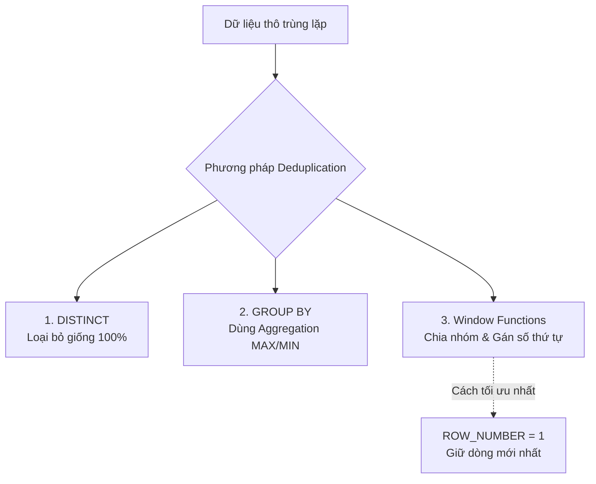

# Loại bỏ trùng lặp - Deduplication

## Summary

Deduplication (Khử trùng lặp) là quá trình nhận diện và loại bỏ các bản ghi bị trùng lặp (duplicate records) trong tập dữ liệu. Đây là bước làm sạch dữ liệu thiết yếu nhằm bảo đảm tính chính xác cho báo cáo (báo cáo doanh thu, hành vi người dùng) và tiết kiệm tài nguyên lưu trữ, tính toán.

---

## Definition

Trong Data Engineering, **Deduplication** là kỹ thuật được áp dụng trong giai đoạn Transformation của ETL/ELT pipeline nhằm đảm bảo tính duy nhất (uniqueness) của các thực thể tại một mức độ chi tiết (granularity) nhất định. Quá trình này sẽ chọn giữ lại một bản ghi "đại diện chuẩn" (golden record) và xóa hoặc bỏ qua các bản ghi còn lại.

---

## Why it exists

Dữ liệu bị trùng lặp là một trong những nguyên nhân phổ biến nhất gây ra số liệu sai lệch (data mismatch) trên hệ thống báo cáo (Data Warehouse/BI). 

Nguyên nhân gây ra dữ liệu trùng bao gồm:
1. **Lỗi hệ thống nguồn**: Người dùng nhấn nút Submit hai lần, hoặc ứng dụng retry gọi API nhiều lần khi có độ trễ mạng (Network Timeout) gây ra nhiều sự kiện giống nhau.
2. **Quá trình thu thập dữ liệu (Ingestion)**: Hệ thống Kafka hoặc thông điệp Pub/Sub được thiết kế với cơ chế gửi *At-least-once* (ít nhất một lần), nên việc gửi một message nhiều lần là điều bình thường.
3. **Lỗi Data Pipeline**: Pipeline bị thất bại và chạy lại, nhưng thiết kế không tuân thủ tính lũy đẳng (Idempotency) dẫn đến việc append (nạp thêm) dữ liệu bị lặp.

Deduplication tồn tại để giải quyết bài toán này, bảo vệ tính toàn vẹn của dữ liệu trước khi cung cấp cho các bên tiêu thụ (Data Analysts, Business Users).

---

## How it works

Deduplication thường được giải quyết bằng ba cách phổ biến, phụ thuộc vào công cụ và loại dữ liệu:



1. **DISTINCT**: Lọc bỏ những dòng giống nhau 100% trên toàn bộ các cột. Kỹ thuật này đơn giản nhưng kém linh hoạt.
2. **GROUP BY**: Gom nhóm dữ liệu theo các trường khóa (Key) và dùng các hàm tập hợp (Aggregation Functions) như `MAX()`, `MIN()` để giữ lại giá trị cần thiết.
3. **Window Functions (Hàm cửa sổ)**: Đây là phương pháp phổ biến và tối ưu nhất. Sử dụng hàm `ROW_NUMBER()` chia nhóm theo các cột Khóa (Partition By) và sắp xếp (Order By) theo tiêu chí (như thời gian mới nhất `updated_at DESC`), sau đó chỉ lấy dòng có số thứ tự bằng 1.

---

## Practical example

Xét tập dữ liệu người dùng (users) trong vùng Staging bị trùng lặp sau:

| user_id | email            | status   | updated_at          |
|---------|------------------|----------|---------------------|
| 1       | bob@gmail.com    | pending  | 2026-06-07 10:00:00 |
| 1       | bob@gmail.com    | active   | 2026-06-07 10:05:00 |
| 2       | alice@gmail.com  | active   | 2026-06-07 09:00:00 |

Mục tiêu: Giữ lại duy nhất 1 bản ghi cho mỗi `user_id`, ưu tiên lấy trạng thái mới nhất dựa trên `updated_at`.

**Sử dụng Window Function `ROW_NUMBER()` trong SQL:**

```sql
WITH RankedUsers AS (
    SELECT 
        user_id,
        email,
        status,
        updated_at,
        ROW_NUMBER() OVER (
            PARTITION BY user_id 
            ORDER BY updated_at DESC
        ) as rn
    FROM staging_users
)
SELECT 
    user_id,
    email,
    status,
    updated_at
FROM RankedUsers
WHERE rn = 1;
```

Kết quả sẽ chỉ trả về bản ghi của Bob lúc `10:05:00` (trạng thái active) và bản ghi của Alice, loại bỏ trạng thái "pending" cũ của Bob.

---

## Best practices

* **Khử trùng lặp càng sớm càng tốt (Shift Left)**: Nên thực hiện deduplication ở tầng Staging hoặc tầng Bronze/Silver trong Data Lakehouse để ngăn rác lan truyền xuống hạ nguồn.
* **Xác định rõ Khóa duy nhất (Unique Key/Granularity)**: Phải hiểu cực rõ ngữ nghĩa dữ liệu để xác định xem việc nhóm bằng `PARTITION BY` gồm những cột nào để tạo thành một Unique Key chính xác.
* **Có tiêu chí giữ lại rõ ràng**: Luôn có cột `ORDER BY` (như `updated_at`, `timestamp`, `version_id`) để biết chắc chắn bản ghi nào sẽ được giữ lại khi có trùng lặp. Đừng bao giờ Order bằng thứ tự ngẫu nhiên, hệ thống sẽ mất tính tất định (determinism).

---

## Common mistakes

* **Sử dụng SELECT DISTINCT bừa bãi**: `DISTINCT` quét toàn bộ hàng để so sánh. Nếu có một cột timestamp thay đổi từng microsecond, `DISTINCT` sẽ thất bại trong việc loại bỏ trùng lặp vì hàng đó đã khác nhau 1 chút, mặc dù về mặt nghiệp vụ là trùng.
* **Lỗi logic do NULLs**: Khi Partition By bằng cột có giá trị NULL, công cụ có thể gom chung mọi dòng NULL vào cùng 1 nhóm, vô tình loại bỏ những bản ghi quan trọng khác.

---

## Trade-offs

### Ưu điểm
* **Dữ liệu đáng tin cậy**: Ngăn ngừa hiện tượng báo cáo sai số (ví dụ: Double counting revenue).
* **Tiết kiệm tài nguyên**: Cải thiện hiệu suất hệ thống kho dữ liệu nhờ dữ liệu sạch, ít rác.

### Nhược điểm
* **Tốn kém tài nguyên tính toán (Computation Cost)**: Thao tác chia nhóm `PARTITION BY` và sắp xếp `ORDER BY` trong Window Function đòi hỏi hệ thống phân tán (như Spark, BigQuery) phải thực hiện **Shuffle** toàn mạng, rất tốn kém tài nguyên.
* **Độ trễ**: Tăng thời gian xử lý tổng thể của pipeline.

---

## When to use

* Là bắt buộc (mandatory) khi xử lý dữ liệu từ các hệ thống truyền tin Message Queue (như Kafka) sử dụng cơ chế *At-least-once*.
* Thường xuyên sử dụng trong các hệ thống kiến trúc Lambda/Kappa kết nối luồng dữ liệu streaming và batch.

## When not to use

* Khi xử lý những tập dữ liệu Event log khổng lồ mà mục đích là thống kê phân phối xác suất và độ sai số nhỏ có thể chấp nhận được (sử dụng thuật toán HyperLogLog thay vì deduplication trực tiếp).

---

## Related concepts

* [Idempotency](/concepts/idempotency)
* [Change Data Capture (CDC)](/concepts/change-data-capture)
* [Data Quality](/concepts/data-quality)

---

## Interview questions

### 1. Phân biệt `RANK()`, `DENSE_RANK()`, và `ROW_NUMBER()` trong việc loại bỏ trùng lặp?
* **Người phỏng vấn muốn kiểm tra**: Hiểu biết sâu về SQL Window Functions.
* **Gợi ý trả lời**:
  * `ROW_NUMBER()`: Gán một số thứ tự duy nhất tuần tự (1, 2, 3...) cho dù có đồng hạng. Đây là hàm an toàn nhất và dùng nhiều nhất để lọc lấy 1 dòng duy nhất (Deduplicate).
  * `RANK()`: Có nhảy số nếu bị đồng hạng (1, 1, 3). Nếu dùng Rank để deduplicate có thể trả về 2 kết quả nếu chúng cùng `updated_at`.
  * `DENSE_RANK()`: Không nhảy số khi có đồng hạng (1, 1, 2). Tương tự RANK, có rủi ro không thể lấy 1 bản ghi duy nhất.

### 2. Làm thế nào để xử lý trùng lặp trong luồng dữ liệu thời gian thực (Streaming) với hàng triệu event mỗi giây?
* **Người phỏng vấn muốn kiểm tra**: Kiến thức thiết kế hệ thống Streaming thực tế.
* **Gợi ý trả lời**: Không thể dùng GROUP BY toàn tập như trong Batch. Phải sử dụng cấu trúc lưu trữ trạng thái (State Store) như RocksDB trong Flink/Spark Structured Streaming với một cửa sổ thời gian (Watermark/Time window). Hệ thống chỉ giữ lại các Unique Key trong bộ nhớ trong một thời gian nhất định (ví dụ 10 phút) để so khớp và loại bỏ duplicate event rơi vào cùng cửa sổ đó. Sau 10 phút, bộ nhớ bị xóa bỏ.

---

## References

* **SQL Cookbook** - Anthony Molinaro.
* **Designing Data-Intensive Applications** - Martin Kleppmann (Chương thảo luận về Message Delivery Semantics).

---

## English summary

Deduplication is the process of identifying and removing duplicate records in a dataset to ensure uniqueness. It is highly critical for maintaining data quality, avoiding issues like double-counting in analytical reports. Often required due to "at-least-once" delivery semantics from upstream source systems, deduplication is typically implemented via SQL window functions (`ROW_NUMBER()`) prioritizing the most recent record. While it ensures accuracy, it introduces computational overhead associated with sorting and shuffling large volumes of data.
