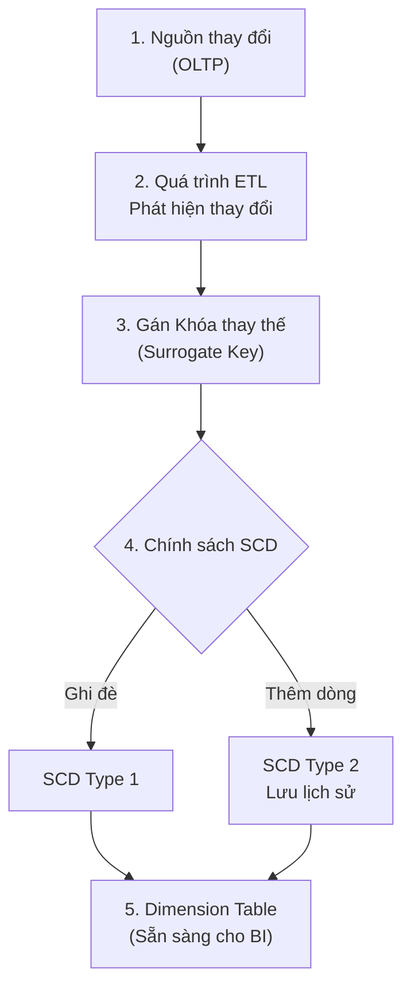

# Bảng chiều - Dimension Table

## Summary

Nếu Fact Table (Bảng sự kiện) chứa các con số để trả lời câu hỏi "Bao nhiêu?", thì Dimension Table (Bảng chiều) chứa các chuỗi văn bản mô tả để trả lời các câu hỏi ngữ cảnh: "Ai?", "Cái gì?", "Ở đâu?", "Khi nào?", và "Như thế nào?". Nằm bao quanh Fact Table trong kiến trúc Lược đồ hình sao (Star Schema), Dimension Table là linh hồn của hệ thống Data Warehouse vì nó định nghĩa toàn bộ cách thức doanh nghiệp lọc, nhóm (group by) và phân tích báo cáo số liệu.

---

## Definition

**Dimension Table (Bảng chiều)** là một bảng cơ sở dữ liệu chuyên biệt lưu trữ các thuộc tính mang tính mô tả (descriptive attributes). 

Đặc điểm của một Dimension Table chuẩn:
1. **Rất "rộng" (Wide)**: Có thể chứa từ vài chục đến hàng trăm cột mô tả (Ví dụ: Bảng `dim_customer` chứa tên, tuổi, giới tính, thu nhập, số điện thoại, phân khúc, địa chỉ,...).
2. **Ngắn/Ít dòng (Shallow)**: So với Fact Table (tỷ dòng), Dimension Table thường nhỏ hơn rất nhiều (từ vài trăm đến vài triệu dòng).
3. **Khóa chính thay thế (Surrogate Key)**: Thường sử dụng cột số nguyên tự tăng (Integer) làm khóa chính (PK) thay vì dùng mã ID của hệ thống vận hành.

---

## Why it exists

Dữ liệu con số thuần túy trong Fact Table (như `revenue = 500,000`) là vô nghĩa nếu thiếu ngữ cảnh. Để biến Dữ liệu (Data) thành Thông tin (Information), ta cần gán ngữ cảnh cho nó.

Thay vì gộp chung các thuộc tính mô tả vào bảng giao dịch - làm bảng giao dịch phình to khủng khiếp và chậm chạp - thiết kế tách biệt bảng Dimension mang lại khả năng tái sử dụng (Reusability). Một bảng `dim_product` có thể được JOIN với bảng doanh thu (`fact_sales`), bảng tồn kho (`fact_inventory`), và bảng kế hoạch (`fact_budget`), tạo nên một mạng lưới kết nối đồng nhất dữ liệu cho toàn bộ công ty.

---

## Core idea

Ý tưởng thiết kế Dimension Table xoay quanh các khái niệm sau:

1. **Denormalization (Phi chuẩn hóa)**: Trái với OLTP, dữ liệu trong bảng Dimension thường bị phi chuẩn hóa để ưu tiên tốc độ đọc. Tên Danh mục, Tên Ngành hàng sẽ được lưu trực tiếp cạnh Tên Sản phẩm trong cùng một bảng, dù điều này sinh ra sự lặp lại dữ liệu. Điều này giúp loại bỏ hoàn toàn các lệnh JOIN phức tạp.
2. **Text-heavy (Nặng về văn bản)**: Các cột trong Dimension chủ yếu là định dạng `VARCHAR`. Chúng được thiết kế để hiển thị thẳng lên báo cáo BI (PowerBI, Tableau) làm tiêu đề cột (Row Headers) hoặc Bộ lọc (Filters/Slicers).
3. **Conformed Dimensions (Chiều dùng chung)**: Sự đồng nhất của Data Warehouse phụ thuộc vào khái niệm này. Nếu 2 Data Mart (Bán hàng và Tồn kho) sử dụng chung một bảng `dim_product`, thì ta có thể so sánh chéo Doanh thu bán hàng và Số lượng tồn kho trên cùng 1 báo cáo. Nếu chúng dùng 2 bảng Product khác nhau, hệ thống sẽ rơi vào thảm họa "Silo dữ liệu".

---

## How it works

Dòng chảy dữ liệu của Dimension Table trong kiến trúc Data Warehouse:



1. Hệ thống nguồn (OLTP CRM, ERP) thay đổi thông tin khách hàng.
2. Hệ thống ETL phát hiện sự thay đổi.
3. ETL gán một Khóa thay thế (Surrogate Key - ví dụ: INT tự tăng) cho bản ghi khách hàng đó.
4. Tùy thuộc vào chính sách **Slowly Changing Dimension (SCD)**, ETL sẽ cập nhật (ghi đè) lên dòng cũ, hoặc chèn (INSERT) thêm một dòng mới vào `dim_customer` để giữ lại lịch sử thông tin khách hàng cũ.
5. Khi người dùng lên Dashboard phân tích, các Dimension được hiển thị dưới dạng thanh lọc (Filter).

---

## Architecture / Flow

Mô phỏng cấu trúc của một Bảng `dim_product` phi chuẩn hóa:

| product_key (PK - Surrogate) | product_id (Natural Key) | product_name | category_name | brand_name | unit_cost | is_active |
| :--- | :--- | :--- | :--- | :--- | :--- | :--- |
| **101** | PRD-001 | iPhone 15 Pro | Điện thoại di động | Apple | 900.00 | True |
| **102** | PRD-002 | Galaxy S24 Ultra | Điện thoại di động | Samsung | 850.00 | True |
| **103** | PRD-003 | MacBook Pro 16 | Máy tính xách tay | Apple | 2000.00 | True |

*Nhận xét: Chữ `Điện thoại di động` và chữ `Apple` bị lặp lại nhiều lần. Trong Star Schema, đây là một Feature (Tính năng tối ưu tốc độ) chứ không phải Bug (Lỗi trùng lặp).*

---

## Practical example

Một trong những Dimension quan trọng nhất của mọi Data Warehouse là **Date Dimension (`dim_date`)**. Khác với các hệ thống OLTP dùng hàm SQL trực tiếp (như `EXTRACT(YEAR FROM date)`), Data Warehouse sinh ra hẳn một bảng chứa lịch vật lý.

Ví dụ tạo bảng `dim_date`:

```sql
CREATE TABLE dim_date (
    date_key INT PRIMARY KEY,         -- Định dạng YYYYMMDD (ví dụ: 20260607)
    full_date DATE,
    day_of_week INT,
    day_name VARCHAR(15),             -- 'Sunday', 'Monday'
    is_weekend BOOLEAN,
    calendar_month INT,               -- 1 -> 12
    calendar_quarter INT,             -- 1 -> 4
    calendar_year INT,
    fiscal_year INT,                  -- Năm tài chính (tùy công ty)
    holiday_name VARCHAR(50),         -- Tên ngày lễ (nếu có)
    is_holiday BOOLEAN
);
```

**Tại sao phải làm thế này?**
Nếu sếp hỏi: *"Cho tôi doanh thu bán hàng của các Ngày nghỉ lễ (Holidays) trong năm tài chính 2026?"*
Nếu không có bảng Dimension này, kỹ sư SQL phải viết các hàm CASE WHEN, kiểm tra logic lịch phức tạp (như mùng 1 Tết Âm Lịch rơi vào ngày nào dương lịch). Với `dim_date`, câu query chỉ đơn giản là:
`WHERE is_holiday = TRUE AND fiscal_year = 2026`.

---

## Best practices

* **Mô tả tường minh**: Không bao giờ lưu các mã code bí ẩn trong Dimension (ví dụ `status = 'C'`). Hãy giải mã nó ra cột mới `status_description = 'Completed'` trong quá trình ETL. Người dùng BI không có trách nhiệm phải nhớ mã code của bạn.
* **Luôn sử dụng Surrogate Keys**: Khóa chính của bảng Dimension phải là một dãy số nguyên do Data Warehouse tự sinh ra độc lập với hệ thống nguồn. Hệ thống nguồn có thể đổi quy tắc đặt mã ID khách hàng bất cứ lúc nào, Surrogate key sẽ bảo vệ DWH khỏi rủi ro này.
* **Xử lý giá trị mặc định**: Dimension phải luôn chứa một bản ghi ở dòng đầu tiên với `ID = -1` mang ý nghĩa "Unknown" (Không xác định) hoặc "Not Applicable" (Không áp dụng) để hỗ trợ Fact table khi bị khuyết dữ liệu khóa ngoại.

---

## Common mistakes

* **Quá ám ảnh với việc chuẩn hóa (Normalization)**: Sợ tốn đĩa cứng nên chia nhỏ bảng Dimension (`dim_product` tách thành `dim_category`). Việc này bẻ gãy Star Schema, biến nó thành Snowflake Schema và làm suy giảm nghiêm trọng tốc độ tạo báo cáo.
* **Tích hợp các trường dữ liệu biến đổi liên tục (Rapidly Changing Attributes)**: Đưa một trường dữ liệu nhảy liên tục mỗi phút (như "Số lần click chuột của khách hàng") vào bảng chiều khách hàng. Nó sẽ làm hệ thống quản lý lịch sử (SCD Type 2) sụp đổ vì sinh ra quá nhiều dòng dư thừa. Những dữ liệu thay đổi nhanh nên được xem xét tách ra thành bảng Mini-dimension hoặc chuyển thành Fact.

---

## Trade-offs

### Ưu điểm
* **Trực quan tuyệt đối**: Rất dễ tiếp cận đối với nhân viên không rành kỹ thuật.
* **Hiệu suất lọc dữ liệu (Filtering)**: Filter trên Dimension bằng các chuỗi ký tự diễn ra cực nhanh trước khi quét Fact Table.
* **Quản lý lịch sử mạnh mẽ**: Kết hợp với Slowly Changing Dimension (SCD), Dimension Table cho phép tổ chức khôi phục trạng thái đối tượng chính xác tại một thời điểm trong quá khứ.

### Nhược điểm
* **Dư thừa dữ liệu (Redundancy)**: Tốn không gian lưu trữ cho việc lặp chuỗi văn bản (Mặc dù các hệ thống Columnar database hiện nay nén rất tốt).
* **Quản trị ETL phức tạp**: Nếu cập nhật dữ liệu với chính sách SCD Type 2, hệ thống ETL cần xử lý logic tạo record mới, đóng record cũ cẩn thận.

---

## When to use

* Luôn luôn sử dụng để cung cấp thuộc tính mô tả (ngữ cảnh) cho dữ liệu trong kiến trúc Data Warehouse / Data Lakehouse phục vụ Business Intelligence.
* Khuyến nghị dùng để xây dựng *Semantic Layer* cho các công cụ như PowerBI, dbt, Looker.

## When not to use

* Trong hệ thống quản lý giao dịch lõi (Core Banking, E-commerce Backend) cần đáp ứng tính toàn vẹn và tối ưu việc ghi (WRITE) nhanh bằng chuẩn 3NF.

---

## Related concepts

* [Fact Table](/concepts/fact-table)
* [Star Schema](/concepts/star-schema)
* [Surrogate Key](/concepts/surrogate-key)
* [Slowly Changing Dimension (SCD)](/concepts/slowly-changing-dimension)

---

## Interview questions

### 1. Tại sao Dimension 'Date' (Thời gian) lại được thiết kế thành một bảng vật lý riêng biệt thay vì dùng trực tiếp các hàm xử lý ngày tháng của SQL?
* **Người phỏng vấn muốn kiểm tra**: Tư duy thực tiễn về tối ưu hóa BI và hiểu biết logic kinh doanh.
* **Gợi ý trả lời**: 
  1. **Hiệu năng**: Các hàm xử lý ngày tháng (`EXTRACT()`, `DATE_TRUNC()`) tính toán trực tiếp trên Fact Table hàng tỷ dòng sẽ làm tăng tải CPU đáng kể (Full table scan). Việc JOIN với `dim_date` nhanh hơn nhiều nhờ sử dụng chỉ mục số nguyên (`date_key`).
  2. **Logic kinh doanh đặc thù**: SQL không thể biết ngày nào là Tết Nguyên Đán, Lễ Tạ Ơn, hoặc ngày thành lập công ty. SQL cũng không biết "Năm tài chính" (Fiscal Year) của công ty bắt đầu vào tháng 4 hay tháng 1. Bảng `dim_date` giải quyết triệt để vấn đề này, giúp mọi bộ phận có chung một định nghĩa về thời gian.

### 2. Sự khác biệt giữa Natural Key và Surrogate Key trong Dimension Table là gì?
* **Người phỏng vấn muốn kiểm tra**: Khái niệm kỹ thuật lõi trong Data Warehousing.
* **Gợi ý trả lời**: 
  * **Natural Key (Khóa tự nhiên)**: Là định danh sinh ra từ hệ thống ứng dụng nguồn (Ví dụ: Số Căn cước công dân, Mã sinh viên `SV1001`). Nó mang ý nghĩa kinh doanh.
  * **Surrogate Key (Khóa thay thế)**: Là một số nguyên vô nghĩa (như 1, 2, 3...) do chính hệ thống Data Warehouse tự sinh ra làm Khóa chính (Primary Key). 
  * **Tại sao dùng Surrogate Key?**: Khi một nhân viên đổi phòng ban, nếu dùng Natural Key, DWH chỉ có thể ghi đè (UPDATE) bản ghi, xóa bỏ thông tin phòng ban cũ. Bằng việc dùng Surrogate Key, hệ thống có thể tạo ra 2 Surrogate Key khác nhau (dòng lịch sử và dòng hiện hành) trên cùng 1 Natural Key của nhân viên đó. (Mở màn cho việc áp dụng SCD Type 2).

---

## References

1. **The Data Warehouse Toolkit** - Ralph Kimball (Chương 2, 3: Phân tích chuyên sâu về Dimension).
2. **Kimball Group Design Tips**: Bài viết "Conformed Dimensions as the Foundation of the Enterprise Data Warehouse".

---

## English summary

A Dimension Table is a highly denormalized, wide, and text-heavy structure in a dimensional model (Star Schema) that stores descriptive context—the "who, what, where, when, and why"—associated with the quantitative metrics found in Fact Tables. By isolating categorical attributes, hierarchies, and labels (such as customer demographics or product details) and linking them to facts via system-generated Surrogate Keys, dimension tables enable intuitive filtering, grouping, and drill-down analysis for business intelligence tools. The strategic implementation of "Conformed Dimensions" ensures that different data marts across an enterprise share a common truth, preventing isolated data silos.
