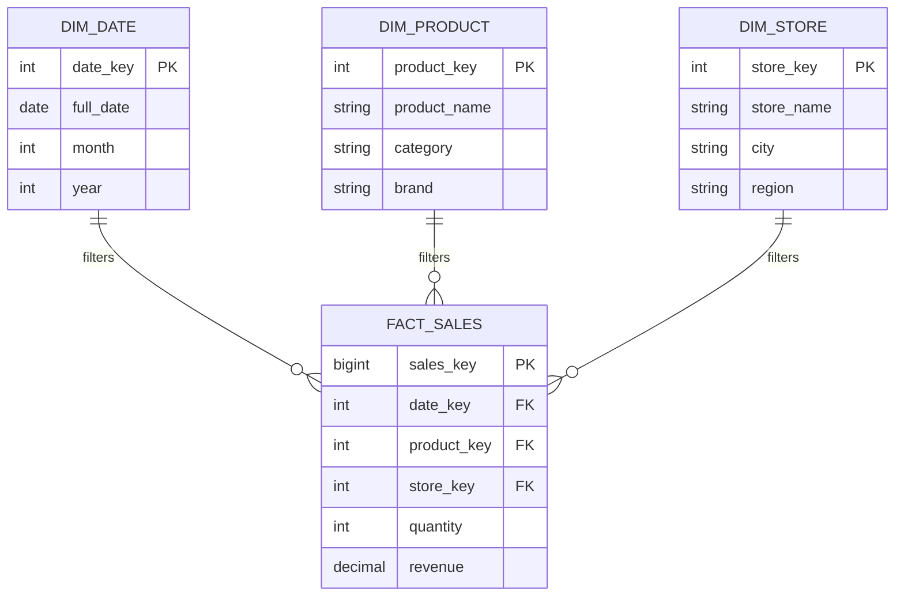

# Mô hình hóa dữ liệu đa chiều - Dimensional Modeling

## Summary

Dimensional Modeling (Mô hình hóa dữ liệu đa chiều) là một kỹ thuật thiết kế cơ sở dữ liệu chuyên biệt dành cho các hệ thống Kho dữ liệu (Data Warehouse) và Data Mart. Thay vì chuẩn hóa dữ liệu chặt chẽ (như mô hình ER trong OLTP), Dimensional Modeling tổ chức dữ liệu thành hai loại bảng đơn giản: Bảng sự kiện (Fact Table) chứa các con số đo lường, và Bảng chiều (Dimension Table) chứa các thuộc tính ngữ cảnh. Cách tiếp cận này giúp cơ sở dữ liệu cực kỳ dễ hiểu đối với người dùng kinh doanh và tối ưu hóa tối đa tốc độ thực thi cho các câu lệnh truy vấn phân tích (OLAP).

---

## Definition

Theo định nghĩa của Ralph Kimball, **Dimensional Modeling** là kỹ thuật cấu trúc dữ liệu kinh doanh thành các "Fact" (sự thật/số liệu) và "Dimensions" (chiều ngữ cảnh).

Khác với mô hình chuẩn hóa hạng 3 (3NF) tối ưu cho việc ghi dữ liệu (insert/update) mà không trùng lặp, Dimensional Modeling chấp nhận việc dư thừa dữ liệu (redundancy) ở mức độ nhất định để đổi lấy khả năng biểu diễn dữ liệu trực quan theo cách con người tự nhiên suy nghĩ: "Tôi muốn xem [Doanh thu] theo [Thời gian], theo [Sản phẩm] và theo [Cửa hàng]".

---

## Why it exists

Trong quá khứ, các hệ thống báo cáo thường truy vấn trực tiếp vào cơ sở dữ liệu giao dịch (OLTP). Các cơ sở dữ liệu này được thiết kế theo mô hình ER (Entity-Relationship) chuẩn hóa 3NF để đảm bảo mỗi thông tin chỉ xuất hiện 1 lần, giúp ứng dụng không bị lỗi dữ liệu khi có nhiều người cùng chỉnh sửa.

Tuy nhiên, đối với mục đích phân tích, mô hình 3NF lộ rõ 2 điểm yếu chí mạng:
1. **Quá phức tạp**: Một báo cáo doanh thu đơn giản có thể yêu cầu người phân tích (Data Analyst) phải viết câu lệnh SQL thực hiện JOIN 15-20 bảng khác nhau (Hóa đơn $\rightarrow$ Chi tiết hóa đơn $\rightarrow$ Sản phẩm $\rightarrow$ Danh mục $\rightarrow$ Phân loại $\rightarrow$ ...). Điều này dẫn tới mã SQL cực kỳ rối rắm và dễ sai sót.
2. **Quá chậm**: Hệ quản trị CSDL quan hệ (RDBMS) hoạt động rất kém hiệu quả khi phải join hàng chục bảng chứa hàng triệu dòng dữ liệu cùng lúc.

Dimensional Modeling ra đời để giải quyết bài toán này bằng cách bẻ phẳng (flatten) sự phức tạp, giảm số lượng phép JOIN xuống mức tối thiểu.

---

## Core idea

Cốt lõi của Dimensional Modeling xoay quanh hai khái niệm không thể tách rời:

1. **Fact (Chỉ số/Sự kiện)**: Là những con số có thể định lượng được sinh ra từ quy trình kinh doanh. Thường là các dữ liệu dạng số (numeric) và có thể cộng gộp (additive). Ví dụ: `số lượng bán (quantity)`, `doanh thu (revenue)`, `chiết khấu (discount)`. Bảng chứa các Fact được gọi là **Fact Table**.
2. **Dimension (Chiều/Ngữ cảnh)**: Là các thông tin mô tả "Cái gì", "Khi nào", "Ở đâu", "Ai", "Như thế nào" liên quan đến Fact đó. Thường là dạng văn bản (text). Ví dụ: `tên sản phẩm`, `tên khách hàng`, `quốc gia`, `tháng/năm`. Bảng chứa các Dimension được gọi là **Dimension Table**.

Hai cấu trúc nổi tiếng nhất được sinh ra từ Dimensional Modeling là **Star Schema** (Lược đồ hình sao) và **Snowflake Schema** (Lược đồ bông tuyết).

---

## How it works

Quy trình thiết kế mô hình đa chiều thường tuân theo **4 bước của Kimball**:
1. **Lựa chọn Quy trình nghiệp vụ (Business Process)**: Xác định hoạt động kinh doanh cần phân tích. Ví dụ: Quá trình đặt phòng khách sạn.
2. **Xác định Độ mịn (Grain)**: Quyết định mức độ chi tiết sâu nhất mà bảng Fact sẽ lưu trữ. Ví dụ: Mỗi dòng là 1 đêm nghỉ của 1 phòng (Nightly room grain).
3. **Xác định các Chiều (Dimensions)**: Trả lời câu hỏi "Ngữ cảnh của một đêm nghỉ là gì?". Ví dụ: Ngày (`dim_date`), Phòng (`dim_room`), Khách hàng (`dim_customer`), Kênh đặt phòng (`dim_channel`).
4. **Xác định các Chỉ số (Facts)**: Trả lời câu hỏi "Chúng ta đo lường cái gì?". Ví dụ: Giá tiền thu được, số lượng khách, số dịch vụ phát sinh.

---

## Architecture / Flow

Mô hình Dimensional Modeling cơ bản tạo ra một cấu trúc giống hình ngôi sao (Star Schema), với Fact Table ở trung tâm và các Dimension Tables bao quanh.



*Trong hình trên, để biết doanh thu của một cửa hàng, hệ thống chỉ thực hiện 1 phép JOIN đơn giản từ `FACT_SALES` sang `DIM_STORE`.*

---

## Practical example

Trái ngược với hệ thống OLTP nơi thông tin sản phẩm và danh mục sản phẩm thường được tách thành 2-3 bảng (Product, SubCategory, Category), trong Dimensional Modeling, chúng ta "phi chuẩn hóa" (denormalize) tất cả vào một bảng Dimension duy nhất để phục vụ việc truy vấn nhanh.

**Thay vì (Trong OLTP 3NF):**
```sql
-- Cần JOIN 3 bảng để lấy tên Danh mục
SELECT c.CategoryName, SUM(s.Amount) 
FROM Sales s
JOIN Products p ON s.ProductID = p.ProductID
JOIN SubCategories sc ON p.SubCatID = sc.SubCatID
JOIN Categories c ON sc.CategoryID = c.CategoryID
GROUP BY c.CategoryName;
```

**Với Dimensional Modeling (Star Schema):**
```sql
-- Dữ liệu CategoryName đã nằm sẵn trong dim_product
SELECT p.CategoryName, SUM(f.Revenue)
FROM fact_sales f
JOIN dim_product p ON f.ProductKey = p.ProductKey
GROUP BY p.CategoryName;
```
Câu lệnh SQL trở nên ngắn gọn, minh bạch và RDBMS thực thi nó với tốc độ cực nhanh.

---

## Best practices

* **Khóa thay thế (Surrogate Keys)**: Sử dụng các số nguyên tự tăng (như Identity column hoặc Hash keys) làm khóa chính (PK) cho các bảng Dimension, thay vì dùng ID của hệ thống nguồn (Natural Key). Điều này giúp cô lập Data Warehouse khỏi các thay đổi cấu trúc của hệ thống ứng dụng nguồn.
* **Xử lý giá trị NULL**: Đừng để NULL ở các khóa ngoại (FK) trong Fact Table. Hãy ánh xạ chúng vào một bản ghi mặc định trong Dimension Table (ví dụ `dimension_key = -1` nghĩa là "Không xác định" hoặc "N/A").
* **Thống nhất định nghĩa (Conformed Dimensions)**: Khi xây dựng nhiều mô hình đa chiều cho các phòng ban khác nhau (Sales, HR, Marketing), phải đảm bảo chúng sử dụng chung các Dimension Table cốt lõi (như Thời gian, Nhân viên) để dữ liệu có thể liên kết (drill-across) chéo với nhau.

---

## Common mistakes

* **Mô hình hóa quá chuẩn hóa**: Cố gắng chuẩn hóa bảng Dimension (Snowflaking) quá mức cần thiết chỉ để tiết kiệm một chút dung lượng đĩa. Sự phức tạp hóa này sẽ đánh bại mục đích nguyên thủy của Dimensional Modeling là "đơn giản hóa".
* **Xác định Grain sai**: Thiết kế Fact Table chứa cả dữ liệu tổng hợp (theo ngày) và dữ liệu chi tiết (theo từng giao dịch) trong cùng một bảng. Khi BI tools cộng dồn doanh thu, số liệu sẽ bị nhân đôi. Cần tách chúng ra các Fact Table riêng biệt.

---

## Trade-offs

### Ưu điểm
* **Dễ hiểu và Trực quan**: Kiến trúc xoay quanh các khái niệm kinh doanh thực tế, Business Analyst có thể tự viết SQL mà không cần hiểu cấu trúc backend phức tạp.
* **Tốc độ truy vấn**: Giảm thiểu tối đa các tác vụ JOIN nặng nề. Hầu hết các hệ quản trị CSDL phân tích (Redshift, BigQuery, Snowflake) đều có thuật toán tối ưu hóa (Star-join optimization) dành riêng cho mô hình này.
* **Dễ mở rộng**: Khi doanh nghiệp cần theo dõi thêm một chiều ngữ cảnh mới (ví dụ: Kênh tiếp thị), chỉ việc tạo thêm một bảng `dim_channel` và thêm một cột foreign key vào bảng Fact mà không làm hỏng các báo cáo cũ.

### Nhược điểm
* **Trùng lặp dữ liệu (Redundancy)**: Việc gộp tất cả thông tin phân cấp vào một bảng Dimension rộng (ví dụ: Tên quốc gia "Vietnam" bị lặp lại cho mỗi khách hàng ở VN) làm tốn dung lượng đĩa.
* **Cập nhật phức tạp**: Khi một thuộc tính (như tên Quốc gia) bị đổi, luồng ETL phải cập nhật (Update) hàng loạt dòng dữ liệu bị trùng lặp đó thay vì chỉ sửa ở một chỗ như mô hình 3NF. (Tuy nhiên, kỹ thuật Slowly Changing Dimension sẽ giải quyết bài toán này).

---

## When to use

* Xây dựng Data Warehouse truyền thống hoặc Data Mart cho phòng ban.
* Tạo lớp ngữ nghĩa (Semantic Layer) hoặc thiết kế mô hình dữ liệu bên trong các công cụ BI như PowerBI, Tableau, Looker.
* Các hệ thống yêu cầu độ trễ báo cáo thấp với khối lượng dữ liệu khổng lồ (OLAP).

## When not to use

* Hệ thống giao dịch lõi (OLTP) cần ghi nhận dữ liệu liên tục với hàng ngàn giao dịch/giây và yêu cầu tính toàn vẹn (ACID) nghiêm ngặt tuyệt đối.
* Dữ liệu phi cấu trúc (Unstructured data) như Text logs thuần, Hình ảnh, Video (cần xử lý bằng Data Lake trước).

---

## Related concepts

* [Star Schema](/concepts/star-schema)
* [Snowflake Schema](/concepts/snowflake-schema)
* [Fact Table](/concepts/fact-table)
* [Dimension Table](/concepts/dimension-table)

---

## Interview questions

### 1. Tại sao Dimensional Modeling lại tốt hơn Entity-Relationship (ER) Modeling cho mục đích phân tích?
* **Người phỏng vấn muốn kiểm tra**: Hiểu biết cơ bản về sự khác biệt giữa OLAP và OLTP.
* **Gợi ý trả lời**: ER Modeling (đặc biệt là 3NF) sinh ra để giải quyết bài toán của OLTP: loại bỏ dư thừa dữ liệu nhằm đảm bảo update/insert siêu nhanh, không bị data anomalies. Nhưng để đáp ứng mục tiêu đó, nó băm nhỏ dữ liệu ra hàng chục bảng. Khi phục vụ phân tích (OLAP), nơi chủ yếu thực hiện các lệnh đọc lớn và gom nhóm (GROUP BY), ER Model bắt database engine phải thực hiện quá nhiều phép JOIN tốn tài nguyên. Dimensional Modeling chấp nhận việc dư thừa dữ liệu ở các bảng Dimension để triệt tiêu các phép JOIN này, mang lại hiệu năng truy vấn vượt trội và một schema cực kỳ dễ hiểu cho công cụ BI kéo-thả.

### 2. Định nghĩa "Grain" trong Dimensional Modeling là gì và tại sao nó lại quan trọng nhất?
* **Người phỏng vấn muốn kiểm tra**: Kiến thức thiết kế Fact Table (Bước 2 của quy trình Kimball).
* **Gợi ý trả lời**: "Grain" là mức độ chi tiết thấp nhất mà một dòng dữ liệu (record) trong Fact Table đại diện. Nó quan trọng nhất vì nếu khai báo grain không rõ ràng hoặc để lẫn lộn các grain khác nhau trong cùng một bảng (ví dụ: 1 dòng đại diện cho 1 hóa đơn, nhưng dòng khác lại đại diện cho 1 sản phẩm trong hóa đơn đó), thì khi dùng hàm SUM(), kết quả tổng doanh thu chắc chắn sẽ sai lệch (nhân đôi). Mọi khóa ngoại của Dimension Table gắn vào Fact phải hoàn toàn tương thích với Grain đã được định nghĩa.

---

## References

1. **The Data Warehouse Toolkit** - Ralph Kimball (Cuốn sách khởi nguyên của khái niệm Dimensional Modeling).
2. **Microsoft Power BI Documentation** (Tài liệu về Star Schema trong DAX và PowerBI).

---

## English summary

Dimensional Modeling is a specialized database design technique developed primarily by Ralph Kimball for Data Warehouses and Business Intelligence. Unlike the highly normalized Entity-Relationship (3NF) models used in OLTP systems, Dimensional Modeling deliberately denormalizes data into a simplified, easy-to-understand structure consisting of Fact Tables (containing quantitative metrics) and Dimension Tables (containing descriptive context). This approach, most commonly manifested as a Star Schema, significantly reduces complex table joins, thereby providing exceptional query performance for analytical workloads (OLAP) and intuitive data navigation for business users.
