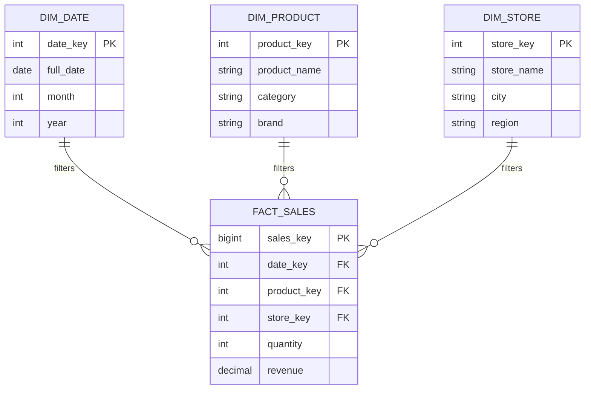

# Mô hình hóa dữ liệu đa chiều - Dimensional Modeling

Hãy tưởng tượng bạn là một chuyên viên phân tích dữ liệu (Data Analyst) hoặc một nhà quản lý kinh doanh. Mỗi sáng thức dậy, câu hỏi đầu tiên xuất hiện trong đầu bạn thường sẽ là: *"Doanh thu tháng này tăng trưởng ra sao so với tháng trước?"*, *"Sản phẩm nào đang bán chạy nhất ở khu vực miền Nam?"*, hay *"Khách hàng thành viên đóng góp bao nhiêu phần trăm vào tổng lợi nhuận?"*. 

Để trả lời những câu hỏi mang tính chất "bức tranh toàn cảnh" này một cách nhanh chóng, chúng ta không thể dựa vào các cấu trúc dữ liệu giao dịch thông thường. Đó là lý do **Dimensional Modeling** (Mô hình hóa dữ liệu đa chiều) ra đời. Đây là một nghệ thuật thiết kế cơ sở dữ liệu chuyên biệt dành cho Kho dữ liệu (Data Warehouse) và Data Mart, giúp biến những bảng dữ liệu phức tạp thành một cấu trúc trực quan, dễ hiểu và cực kỳ nhanh khi truy vấn.

## Tại sao chúng ta cần Dimensional Modeling?

Trước đây, khi các công nghệ lưu trữ còn sơ khai, hầu hết các hệ thống báo cáo đều truy vấn trực tiếp vào cơ sở dữ liệu giao dịch (OLTP). Các cơ sở dữ liệu này được thiết kế theo mô hình ER (Entity-Relationship) chuẩn hóa dạng 3 (3NF) với mục tiêu tối thượng là: **đảm bảo dữ liệu không bị trùng lặp**, từ đó giúp việc ghi dữ liệu (insert, update) diễn ra trơn tru nhất.

Tuy nhiên, khi mang mô hình 3NF này đi làm phân tích dữ liệu (OLAP), các kỹ sư lập tức vấp phải hai "cơn ác mộng":
1. **Mã SQL quá phức tạp**: Để làm một báo cáo doanh thu đơn giản, bạn có thể phải viết một câu lệnh SQL dài dằng dặc với 15 đến 20 phép `JOIN` (từ Hóa đơn qua Chi tiết hóa đơn, nối tiếp đến Sản phẩm, Nhóm sản phẩm, Danh mục, Cửa hàng, v.v.). Chỉ cần viết sai một phép JOIN, số liệu báo cáo sẽ đi tông.
2. **Hiệu năng ì ạch**: Hệ quản trị cơ sở dữ liệu quan hệ (RDBMS) sẽ phải gồng mình để khớp (join) hàng chục bảng chứa hàng triệu dòng dữ liệu cùng lúc. Kết quả là báo cáo chạy mất vài tiếng, thậm chí làm nghẽn luôn cả hệ thống giao dịch đang chạy.

Dimensional Modeling, dưới sự khởi xướng của Ralph Kimball, đã giải quyết triệt để vấn đề này. Bằng cách chấp nhận dư thừa dữ liệu (redundancy) ở một mức độ hợp lý, mô hình này bẻ phẳng (flatten) sự phức tạp, gom các bảng lại và giảm số lượng phép JOIN xuống mức tối thiểu.

## Bản chất cốt lõi: Cuộc chơi giữa Fact và Dimension

Mọi mô hình đa chiều đều xoay quanh hai khái niệm cực kỳ dễ nhớ:

1. **Fact (Chỉ số/Sự kiện - Fact Table)**: Đây là trung tâm của mô hình, nơi lưu giữ những con số đo lường, định lượng được sinh ra từ thực tế kinh doanh. Những con số này thường có thể cộng gộp (additive) được. Ví dụ: số lượng sản phẩm bán ra (`quantity`), doanh thu (`revenue`), hay số tiền chiết khấu (`discount`).
2. **Dimension (Chiều ngữ cảnh - Dimension Table)**: Các bảng chiều đóng vai trò là "ngữ cảnh" bao quanh bảng Fact, trả lời cho các câu hỏi: *Ai*, *Cái gì*, *Ở đâu*, *Khi nào*, và *Như thế nào*. Ví dụ: tên sản phẩm, danh mục, quốc gia của khách hàng, hay thông tin thứ/ngày/tháng/năm.

Cách tổ chức này phản ánh chính xác cách con người suy nghĩ khi phân tích: *"Tôi muốn xem số liệu [Fact] theo các chiều [Dimension] khác nhau"*.

## Kiến trúc Star Schema (Lược đồ hình sao)

Khi chúng ta đặt bảng Fact ở giữa và liên kết trực tiếp với các bảng Dimension xung quanh, chúng ta có một mô hình trông giống như một ngôi sao. Đây chính là **Star Schema** – cấu trúc phổ biến nhất của Dimensional Modeling.



*Nhìn vào sơ đồ trên, bạn sẽ thấy để lọc hoặc gom nhóm dữ liệu doanh thu theo cửa hàng, chúng ta chỉ cần thực hiện đúng một phép JOIN đơn giản từ `FACT_SALES` sang `DIM_STORE`.*

## 4 bước thiết kế "kinh điển" của Kimball

Để thiết kế một mô hình đa chiều chuẩn chỉnh, Ralph Kimball đã đưa ra quy trình 4 bước đơn giản nhưng vô cùng mạnh mẽ:

1. **Chọn Quy trình nghiệp vụ (Business Process)**: Xác định hoạt động cụ thể của doanh nghiệp mà bạn muốn đo lường và phân tích (ví dụ: Quá trình đặt phòng khách sạn, giao dịch bán hàng tại quầy).
2. **Xác định Độ mịn (Grain)**: Đây là bước cực kỳ quan trọng. Bạn phải quyết định một dòng dữ liệu trong bảng Fact đại diện cho cái gì ở mức chi tiết nhất. Ví dụ: *"Mỗi dòng đại diện cho một đêm nghỉ của một phòng"* (Nightly room grain).
3. **Xác định các Chiều (Dimensions)**: Thiết lập các ngữ cảnh xung quanh độ mịn đó. Với mỗi đêm nghỉ, ta có các chiều như: Ngày nghỉ (`dim_date`), Phòng (`dim_room`), Khách hàng (`dim_customer`), Kênh đặt phòng (`dim_channel`).
4. **Xác định các Chỉ số (Facts)**: Xác định các con số đo lường cụ thể cho từng dòng dữ liệu. Ví dụ: số tiền phòng thu được, số lượng khách thực tế, số dịch vụ phát sinh.

## Từ lý thuyết đến thực tế: Ví dụ truy vấn SQL

Hãy xem sự khác biệt rõ rệt khi viết câu lệnh truy vấn giữa hai mô hình chuẩn hóa giao dịch và mô hình đa chiều.

**Với hệ thống OLTP (chuẩn hóa 3NF):**
Bạn phải thực hiện rất nhiều phép JOIN chỉ để lấy tên Danh mục sản phẩm (CategoryName):
```sql
-- Cần JOIN tới 4 bảng để lấy thông tin phân tích
SELECT c.CategoryName, SUM(s.Amount) 
FROM Sales s
JOIN Products p ON s.ProductID = p.ProductID
JOIN SubCategories sc ON p.SubCatID = sc.SubCatID
JOIN Categories c ON sc.CategoryID = c.CategoryID
GROUP BY c.CategoryName;
```

**Với Dimensional Modeling (Star Schema):**
Mọi thông tin phân cấp của sản phẩm đã được "bẻ phẳng" và đưa trực tiếp vào bảng `dim_product`. Câu lệnh SQL trở nên cực kỳ gọn nhẹ:
```sql
-- Dữ liệu CategoryName đã nằm sẵn trong dim_product
SELECT p.CategoryName, SUM(f.Revenue)
FROM fact_sales f
JOIN dim_product p ON f.ProductKey = p.ProductKey
GROUP BY p.CategoryName;
```
Nhờ giảm thiểu số lượng JOIN, database engine (đặc biệt là các hệ quản trị phân tích như BigQuery, Snowflake, Redshift) sẽ xử lý câu lệnh này với tốc độ đáng kinh ngạc.

## Những nguyên tắc vàng và sai lầm dễ mắc phải

### Nguyên tắc vàng (Best Practices)
* **Khóa thay thế (Surrogate Keys)**: Hãy luôn sử dụng các khóa tự tăng (như số nguyên tự tăng hoặc hash keys) làm khóa chính (PK) cho các bảng Dimension, thay vì dùng trực tiếp ID từ hệ thống nguồn (Natural Key). Điều này giúp bảo vệ Data Warehouse khỏi những thay đổi bất ngờ ở hệ thống vận hành.
* **Không để NULL ở khóa ngoại (FK)**: Trong bảng Fact, nếu một dòng dữ liệu chưa xác định được chiều tương ứng, đừng để giá trị NULL. Hãy ánh xạ nó về một dòng mặc định trong bảng Dimension (ví dụ: khóa bằng `-1` đại diện cho "Không xác định" hoặc "N/A").
* **Thống nhất chiều dữ liệu (Conformed Dimensions)**: Nếu bạn thiết kế các Data Mart khác nhau cho phòng Kinh doanh, Nhân sự hay Marketing, hãy chắc chắn rằng họ dùng chung một bảng Dimension cốt lõi (như Dimension Thời gian, Khách hàng). Điều này đảm bảo tính nhất quán dữ liệu trên toàn doanh nghiệp.

### Sai lầm dễ mắc phải (Common Mistakes)
* **Cố gắng chuẩn hóa bảng Dimension**: Việc tách nhỏ các bảng Dimension thành các nhánh chi tiết hơn (gọi là Snowflake Schema) để tiết kiệm bộ nhớ đôi khi lại làm phức tạp hóa mô hình, đi ngược lại tiêu chí đơn giản ban đầu.
* **Lẫn lộn về độ mịn (Grain)**: Nhồi nhét cả dữ liệu tổng hợp (theo tháng) và dữ liệu chi tiết (theo ngày) vào chung một bảng Fact sẽ làm số liệu bị cộng dồn trùng lặp (double-counting). Nhớ giữ vững nguyên tắc: mỗi bảng Fact chỉ có duy nhất một mức Grain rõ ràng.

## Được và mất: Cân nhắc khi lựa chọn

### Điểm mạnh (Pros)
* **Thân thiện với người dùng**: Cấu trúc trực quan giúp các Business Analyst dễ dàng hiểu và tự kéo thả báo cáo trên Power BI, Tableau mà không cần nhờ đến sự trợ giúp của IT.
* **Tối ưu hóa hiệu năng**: Cực kỳ phù hợp cho các truy vấn phân tích dữ liệu lớn.
* **Khả năng mở rộng tốt**: Khi doanh nghiệp muốn bổ sung một chiều phân tích mới (ví dụ: Kênh tiếp thị), bạn chỉ cần tạo thêm bảng Dimension mới và gắn khóa ngoại vào bảng Fact là xong.

### Điểm yếu (Cons)
* **Tốn dung lượng lưu trữ (Redundancy)**: Việc bẻ phẳng dữ liệu khiến các chuỗi văn bản (như tên Quốc gia) bị lặp lại hàng triệu lần trong bảng Dimension rộng.
* **Bảo trì phức tạp khi dữ liệu thay đổi**: Nếu một thuộc tính thay đổi (như tên tỉnh thành bị đổi), hệ thống ETL sẽ phải cập nhật rất nhiều dòng dữ liệu bị trùng lặp. (Để giải quyết, bạn sẽ cần áp dụng kỹ thuật Slowly Changing Dimension - SCD).

## Khi nào nên (và không nên) áp dụng?

**Nên dùng khi:**
* Bạn đang xây dựng Data Warehouse hoặc Data Mart phục vụ báo cáo nội bộ.
* Thiết kế lớp ngữ nghĩa (Semantic Layer) hoặc cấu trúc dữ liệu bên trong các công cụ BI (Power BI, Tableau, Looker).
* Các hệ thống phân tích cần xử lý lượng dữ liệu khổng lồ với độ trễ thấp (OLAP).

**Không nên dùng khi:**
* Thiết kế các hệ thống giao dịch trực tuyến (OLTP) đòi hỏi tần suất ghi đọc cực cao và tính toàn vẹn dữ liệu tuyệt đối (ACID).
* Dữ liệu dạng phi cấu trúc như hình ảnh, âm thanh, video hay text log thô (đối với nhóm này, Data Lake hoặc các giải pháp hồ dữ liệu sẽ phù hợp hơn).

## Khái niệm liên quan

* [Star Schema](/concepts/star-schema)
* [Snowflake Schema](/concepts/snowflake-schema)
* [Fact Table](/concepts/fact-table)
* [Dimension Table](/concepts/dimension-table)

## Góc phỏng vấn

### 1. Tại sao Dimensional Modeling lại tốt hơn Entity-Relationship (ER) Modeling cho mục đích phân tích?
* **Gợi ý trả lời**: ER Modeling (đặc biệt là chuẩn hóa 3NF) ra đời nhằm tối ưu hóa các thao tác ghi dữ liệu (insert/update/delete) của hệ thống OLTP, đảm bảo không trùng lặp và tránh lỗi dữ liệu. Tuy nhiên, để đạt được điều đó, ER Model băm nhỏ dữ liệu thành hàng chục bảng. Khi phân tích (OLAP), chúng ta cần đọc dữ liệu lớn và gom nhóm (GROUP BY), việc JOIN quá nhiều bảng sẽ khiến hiệu năng giảm sút nghiêm trọng. Dimensional Modeling chấp nhận dư thừa dữ liệu ở bảng Dimension để triệt tiêu bớt các phép JOIN phức tạp, giúp các câu lệnh truy vấn diễn ra nhanh hơn và cấu trúc dữ liệu trở nên cực kỳ thân thiện với các công cụ BI kéo-thả.

### 2. Định nghĩa "Grain" trong Dimensional Modeling là gì và tại sao nó lại quan trọng nhất?
* **Gợi ý trả lời**: "Grain" (Độ mịn) đại diện cho mức độ chi tiết sâu nhất của một dòng dữ liệu trong bảng Fact. Việc xác định Grain là bước quan trọng nhất vì nó định hình toàn bộ cấu trúc của cả bảng Fact và bảng Dimension. Nếu bạn thiết kế một bảng Fact chứa các dòng dữ liệu có độ mịn khác nhau (ví dụ: dòng thì lưu doanh thu từng ngày, dòng lại lưu doanh thu tổng hợp của tháng), thì các phép cộng dồn (SUM) của công cụ báo cáo chắc chắn sẽ bị sai lệch hoàn toàn.

## Tài liệu tham khảo

1. **The Data Warehouse Toolkit** - Ralph Kimball (Cuốn sách gối đầu giường về Dimensional Modeling).
2. **Microsoft Power BI Documentation** (Tài liệu hướng dẫn thiết kế Star Schema tối ưu cho DAX).

## Tóm tắt bằng tiếng Anh (English Summary)

Dimensional Modeling is a specialized database design technique developed primarily by Ralph Kimball for Data Warehouses and Business Intelligence. Unlike the highly normalized Entity-Relationship (3NF) models used in OLTP systems, Dimensional Modeling deliberately denormalizes data into a simplified, easy-to-understand structure consisting of Fact Tables (containing quantitative metrics) and Dimension Tables (containing descriptive context). This approach, most commonly manifested as a Star Schema, significantly reduces complex table joins, thereby providing exceptional query performance for analytical workloads (OLAP) and intuitive data navigation for business users.
