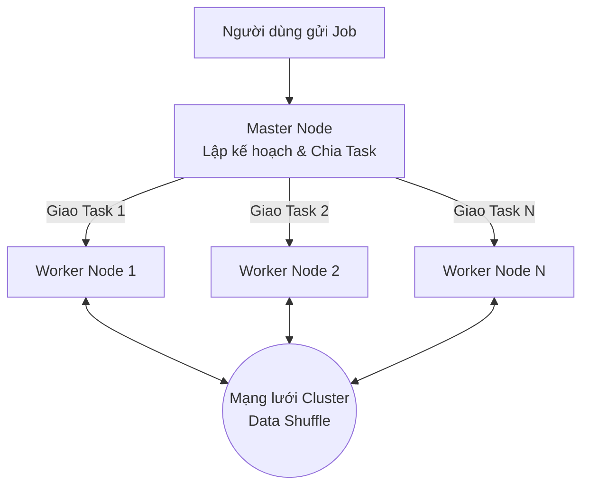

# Xử lý phân tán - Distributed Processing

## Summary

Xử lý phân tán (Distributed Processing) là mô hình tính toán trong đó một công việc lớn (task) được chia nhỏ và phân phối cho nhiều máy tính (nodes) trong một cụm (cluster) để thực hiện song song. Các máy tính này giao tiếp với nhau qua mạng để điều phối công việc và tổng hợp kết quả cuối cùng. Đây là triết lý lõi tạo nên kỷ nguyên Big Data, cho phép mở rộng khả năng xử lý từ gigabytes lên đến petabytes dữ liệu.

---

## Definition

**Distributed Processing** là quá trình thực thi các tính toán trên một tập hợp các máy tính vật lý hoặc máy ảo độc lập, nhưng chúng hoạt động cùng nhau để tạo ra cảm giác như một máy tính duy nhất cực mạnh đối với người dùng cuối. 

Hệ thống phân tán sử dụng phương pháp **chia để trị** (Divide and Conquer), thay vì nâng cấp phần cứng của một máy chủ (Scale Up / Vertical Scaling), nó cho phép lắp ghép vô số các máy chủ giá rẻ thông thường (Commodity Hardware) lại với nhau (Scale Out / Horizontal Scaling).

---

## Why it exists

Trong quá khứ, khi dữ liệu tăng lên, các doanh nghiệp thường giải quyết bằng cách mua những máy chủ "khủng" hơn (thêm RAM, thêm CPU). Tuy nhiên, cách tiếp cận này (Scale Up) có giới hạn vật lý và chi phí tăng theo cấp số nhân. Một cỗ máy với 128 core CPU và 2TB RAM có giá hàng trăm nghìn USD, trong khi dữ liệu có thể vượt ngưỡng 10TB rất nhanh.

Bên cạnh đó:
1. **Rủi ro điểm mù (Single Point of Failure)**: Nếu một máy chủ duy nhất bị hỏng, toàn bộ hệ thống tê liệt.
2. **Thời gian thực thi kéo dài**: Dù CPU mạnh đến đâu, việc đọc/ghi liên tục hàng chục TB dữ liệu qua một hệ thống I/O duy nhất tạo ra điểm nghẽn vật lý (Bottleneck).

Mô hình Xử lý phân tán ra đời (tiên phong bởi Google MapReduce, sau đó là Hadoop, Spark) giải quyết bằng cách mua 100 máy chủ nhỏ lẻ kết nối với nhau. Khi một máy chết, hệ thống tự động gán công việc sang máy khác mà không làm gián đoạn tiến trình.

---

## How it works

Hệ thống xử lý phân tán thường hoạt động theo mô hình **Master-Worker** (hoặc Driver-Executor):



1. **Master Node (Node điều khiển)**:
   Nhận yêu cầu của người dùng, phân tích khối lượng công việc, lập kế hoạch thực thi (Execution Plan), và chia nhỏ công việc thành các tác vụ (Tasks) rời rạc.
2. **Worker Nodes (Các node tính toán)**:
   Chứa CPU, RAM của máy trạm. Chúng nhận lệnh (Task) từ Master, lấy dữ liệu cục bộ (hoặc từ Storage qua mạng) và tiến hành tính toán.
3. **Data Locality (Tối ưu hóa dữ liệu cục bộ)**:
   Thay vì đem lượng dữ liệu khổng lồ đến nơi có chương trình tính toán (tốn băng thông mạng), hệ thống đem chương trình tính toán đến cái máy đang chứa dữ liệu đó (Bring compute to data).
4. **Shuffle (Trao đổi dữ liệu)**:
   Trong quá trình tính toán (ví dụ: `GROUP BY`, `JOIN`), các Worker phải gửi dữ liệu trung gian cho nhau qua mạng lưới để gom nhóm dữ liệu có chung Key. Quá trình này gọi là Shuffle.

---

## Practical example

Giả sử bạn có 1 tỷ file text và cần đếm tần suất xuất hiện của từ "Data". 

**Cách tiếp cận đơn máy (Single-node)**:
Máy sẽ đọc từng file một, duyệt qua từng từ, cộng vào biến đếm. Mất 100 giờ.

**Cách tiếp cận phân tán (Distributed MapReduce với Apache Spark):**
* Có cụm 100 máy tính.
* **Bước Map**: Master giao cho mỗi máy đọc 10 triệu file. Từng máy đếm song song và tạo ra kết quả cục bộ: Máy 1: `(Data: 500)`, Máy 2: `(Data: 600)`, v.v.
* **Bước Reduce**: Master tập hợp kết quả của 100 máy và tính tổng: `500 + 600 + ...`. Tổng thời gian hoàn thành rút xuống còn 1 giờ.

Sử dụng PySpark, ta có thể viết vài dòng code để Master node tự động chia nhỏ công việc trên cụm Cluster:

```python
from pyspark.sql import SparkSession

spark = SparkSession.builder.appName("WordCount").getOrCreate()

# Master chỉ đạo các Worker đọc song song 1 tỷ file text
text_file = spark.sparkContext.textFile("hdfs://cluster/data/1_billion_files/*.txt")

# Worker thực hiện chia tách từ (Map) và cộng dồn (Reduce)
counts = text_file.flatMap(lambda line: line.split(" ")) \
             .map(lambda word: (word, 1)) \
             .reduceByKey(lambda a, b: a + b)

# Thu thập kết quả về Master (Chỉ hiển thị từ 'Data')
data_word_count = counts.filter(lambda x: x[0] == "Data").collect()
print(f"Từ 'Data' xuất hiện: {data_word_count[0][1]} lần")
```

---

## Best practices

* **Mở rộng theo chiều ngang (Horizontal Scaling)**: Thay vì mua một siêu máy tính, hãy ưu tiên kiến trúc phân tán dựa trên nhiều máy tính tầm trung.
* **Giảm thiểu Network Shuffle**: Thiết kế thuật toán sao cho các phép tính có thể độc lập xử lý cục bộ trên từng node càng nhiều càng tốt, vì truyền dữ liệu qua mạng luôn là điểm nghẽn (bottleneck) lớn nhất.
* **Chịu lỗi (Fault Tolerance)**: Luôn thiết kế job để có thể chạy lại từ các điểm khôi phục (checkpoint/lineage) thay vì chạy lại từ đầu khi một node bị hỏng.

---

## Common mistakes

* **Áp dụng Distributed Processing cho dữ liệu nhỏ**: Overhead (chi phí điều phối, khởi động node) thường làm cho hệ thống phân tán chạy chậm hơn cả script Python chạy trên laptop nếu dữ liệu chỉ ở mức vài trăm Megabytes.
* **Phân phối dữ liệu không đều (Data Skew)**: Node 1 chỉ xử lý 1MB dữ liệu, nhưng Node 2 bị kẹt xử lý 100GB dữ liệu, khiến cả hệ thống phải chờ Node 2 hoàn tất.

---

## Trade-offs

### Ưu điểm
* **Khả năng mở rộng (Scalability)**: Không có giới hạn về dung lượng và sức mạnh, chỉ cần thêm node.
* **Tính sẵn sàng cao (High Availability)**: Tự động phục hồi lỗi máy tính vật lý.
* **Tiết kiệm chi phí**: Tận dụng cơ sở hạ tầng đám mây (Cloud) để thuê máy chủ tính toán rẻ mạt theo giờ (Spot instances).

### Nhược điểm
* **Độ phức tạp khổng lồ**: Mã nguồn khó viết, khó gỡ lỗi (debug) và khó quản lý hơn hệ thống đơn máy chủ.
* **Chi phí khởi tạo (Cold start)**: Mất thời gian để cấp phát tài nguyên và điều phối cụm trước khi bắt đầu tính toán thực sự.

---

## When to use

* Dữ liệu đủ lớn (hàng trăm GB, hàng TB, PB) khiến máy chủ đơn lẻ không thể lưu trữ vào RAM hoặc mất quá nhiều thời gian để tính toán.
* Phân tích Log, huấn luyện mô hình Machine Learning quy mô lớn.

## When not to use

* Dữ liệu vừa và nhỏ (dưới 10GB). Bạn có thể dùng Pandas hoặc DuckDB trên một máy chủ duy nhất có sức mạnh CPU và RAM khá, tốc độ sẽ nhanh hơn Spark hoặc Hadoop rất nhiều do không bị overhead mạng.

---

## Related concepts

* [Apache Spark](/concepts/apache-spark)
* [Shuffle](/concepts/shuffle)
* [Data Skew](/concepts/data-skew)
* MapReduce

---

## Interview questions

### 1. Sự khác biệt giữa Scale Up (Vertical Scaling) và Scale Out (Horizontal Scaling) là gì?
* **Người phỏng vấn muốn kiểm tra**: Tư duy lựa chọn kiến trúc hệ thống dữ liệu.
* **Gợi ý trả lời**: Scale Up là nâng cấp sức mạnh vật lý (CPU, RAM) cho 1 máy chủ, chi phí tốn kém theo cấp số nhân và bị giới hạn vật lý, tồn tại rủi ro Single Point of Failure. Scale Out là thêm nhiều máy chủ vật lý vừa/nhỏ vào cụm (cluster), kết hợp bằng phần mềm quản lý phân tán, chi phí tăng tuyến tính và linh hoạt, tính chịu lỗi cao. Mọi nền tảng Big Data đều đi theo Scale Out.

### 2. "Bring compute to data" (Mang tính toán đến nơi có dữ liệu) mang lại lợi ích gì trong kiến trúc phân tán?
* **Gợi ý trả lời**: Thay vì gửi luồng dữ liệu 10TB từ Storage Node qua đường truyền mạng đến Compute Node để tính toán (gây quá tải băng thông mạng), hệ thống sẽ gửi mã nguồn thuật toán (chỉ vài Kilobytes) đến chính Storage Node để nó tự tính toán cục bộ. Điều này loại bỏ điểm nghẽn I/O mạng, giúp tối đa hóa tốc độ thực thi.

---

## References

* **Designing Data-Intensive Applications** - Martin Kleppmann (Chương thảo luận về Batch Processing và MapReduce).
* **Hadoop: The Definitive Guide** - Tom White.

---

## English summary

Distributed Processing refers to the architecture and methodology of distributing massive computational workloads across a cluster of interconnected machines (nodes) that work in parallel. By embracing horizontal scaling (scale-out) and utilizing frameworks like Hadoop MapReduce or Apache Spark, organizations can process petabytes of data, overcoming the physical limitations and single-point-of-failure vulnerabilities associated with single-machine vertical scaling (scale-up). It typically employs a master-worker architecture where computation is brought closer to the data to minimize network I/O bottlenecks.
