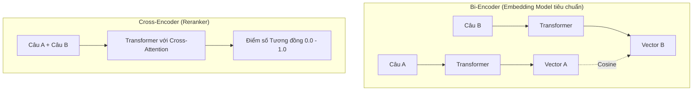

# Mô hình nhúng - Embedding Model

## Summary

Một **Mô hình nhúng (Embedding Model)** độc lập là một kiến trúc mạng nơ-ron học sâu (Deep Neural Network) chuyên làm nhiệm vụ ánh xạ đầu vào phi cấu trúc thành các vectơ dày đặc (dense vectors). Mặc dù các loại mô hình này đã được trình bày tổng quan trong bài *Các mô hình nhúng*, bài viết này sẽ đi sâu vào kỹ thuật huấn luyện (Contrastive Learning), cách thiết kế hàm mất mát (Loss Function) và kiến trúc bên trong của một mô hình nhúng hiện đại như Bi-Encoder.

---

## Definition

Trong khía cạnh kiến trúc sâu (architecture-level), **Embedding Model** là một hàm toán học phi tuyến tính $f(x) \rightarrow \mathbb{R}^d$, trong đó $x$ là dữ liệu đầu vào (một chuỗi tokens) và $\mathbb{R}^d$ là không gian vectơ $d$ chiều. Mô hình này sở hữu hàng triệu hoặc hàng tỷ tham số (weights) được tối ưu hóa thông qua quá trình lan truyền ngược (backpropagation) để đảm bảo rằng khoảng cách giữa $f(x_1)$ và $f(x_2)$ tỉ lệ nghịch với độ tương đồng ngữ nghĩa giữa $x_1$ và $x_2$.

---

## Why it exists

Khởi nguyên của Deep Learning cho NLP, người ta dùng chung một mạng nơ-ron khổng lồ để làm mọi việc (dịch thuật, sinh văn bản, phân loại). Tuy nhiên, việc trích xuất đặc trưng (Feature Extraction) cho các hệ thống tìm kiếm ở quy mô hàng chục triệu tài liệu yêu cầu một giải pháp nhẹ hơn, có khả năng tính toán trước (pre-compute) biểu diễn của tài liệu.

Embedding Model tách biệt ra thành một mô hình chuyên biệt, chỉ nhận đầu vào và nhả ra vectơ tĩnh. Điều này cho phép chúng ta tính toán vectơ của toàn bộ tài liệu một lần duy nhất (Offline Indexing) và lưu vào Vector DB, khi truy vấn chỉ cần chạy mô hình một lần duy nhất cho câu hỏi, giảm độ phức tạp từ $O(N)$ xuống $O(1)$ cho việc suy luận mô hình.

---

## Core idea

* **Học đối chiếu (Contrastive Learning)**: Cách tốt nhất để dạy mô hình hiểu ý nghĩa không phải là dạy nó định nghĩa của từ, mà là dạy nó phân biệt: "Kéo x và y lại gần nhau vì chúng giống nhau, đẩy x và z ra xa nhau vì chúng khác nhau".
* **Triplet Loss / InfoNCE Loss**: Các hàm mất mát (Loss functions) được thiết kế đặc biệt để tối ưu hóa trực tiếp khoảng cách Cosine hoặc khoảng cách Euclidean giữa các điểm dữ liệu trong không gian.
* **Bi-Encoder Architecture**: Kiến trúc mạng Siamese (Sinh đôi) phổ biến nhất hiện nay, trong đó Câu A và Câu B được đưa qua mạng nơ-ron độc lập để lấy ra 2 vectơ, sau đó mới so sánh.

---

## How it works (Huấn luyện Mô hình)

Để tạo ra một Embedding Model như `all-MiniLM` hoặc `text-embedding-ada-002`, các nhà nghiên cứu thực hiện:

1. **Chuẩn bị dữ liệu**: Tạo ra hàng trăm triệu cặp (Pairs) hoặc bộ ba (Triplets) dữ liệu.
   * *Anchor (Neo)*: "Làm sao để nấu phở?"
   * *Positive (Tích cực)*: "Công thức nấu phở bò ngon."
   * *Negative (Tiêu cực)*: "Dự báo thời tiết Hà Nội hôm nay."

2. **Truyền thuận (Forward Pass)**: Cả 3 câu được đưa qua cùng một mạng Transformer (ví dụ BERT). Mạng xuất ra 3 vectơ nhúng: $V_A, V_P, V_N$.

3. **Tính Loss**: Sử dụng Triplet Loss: 
   $L = \max(0, \text{Distance}(V_A, V_P) - \text{Distance}(V_A, V_N) + \text{margin})$
   Thuật toán sẽ phạt mô hình nếu khoảng cách từ câu Neo tới câu Tiêu cực nhỏ hơn khoảng cách tới câu Tích cực cộng với một lề (margin).

4. **Cập nhật trọng số**: Sử dụng Gradient Descent để cập nhật các trọng số của lớp Attention trong Transformer, sao cho vòng lặp sau, $V_A$ và $V_P$ sẽ bị hút lại gần nhau, còn $V_N$ bị đẩy ra xa.

---

## Architecture / Flow: Bi-Encoder vs Cross-Encoder



---

## Practical example

Thay vì dùng mô hình đóng của OpenAI, ta có thể tự fine-tune (huấn luyện tinh chỉnh) một Embedding Model bằng thư viện `sentence-transformers` trên dữ liệu chuyên ngành nội bộ:

```python
from sentence_transformers import SentenceTransformer, InputExample, losses
from torch.utils.data import DataLoader

# 1. Load mô hình cơ sở pre-trained
model = SentenceTransformer('distilbert-base-nli-mean-tokens')

# 2. Tạo tập dữ liệu nội bộ (Anchor, Positive)
train_examples = [
    InputExample(texts=['Lỗi 404', 'Không tìm thấy trang web']),
    InputExample(texts=['Lỗi 500', 'Máy chủ gặp sự cố nội bộ']),
]
train_dataloader = DataLoader(train_examples, shuffle=True, batch_size=2)

# 3. Chọn hàm Loss (MultipleNegativesRankingLoss rất hiệu quả cho việc huấn luyện)
train_loss = losses.MultipleNegativesRankingLoss(model=model)

# 4. Huấn luyện (Fine-tune)
model.fit(train_objectives=[(train_dataloader, train_loss)], epochs=3, warmup_steps=10)

# Mô hình giờ đã học được "Lỗi 404" và "Không tìm thấy trang" là rất giống nhau
```

---

## Best practices

* **Ưu tiên Pooling `MEAN` hoặc `CLS`**: Trong Transformer có rất nhiều token đầu ra. Để gộp chúng thành 1 vectơ tĩnh, ta thường dùng trung bình cộng của tất cả các token (Mean Pooling) hoặc lấy riêng vectơ của token `[CLS]` đứng đầu. Hãy kiên định với phương pháp Pooling mà mô hình được thiết kế.
* **Sử dụng Cross-Encoder để tinh chỉnh**: Embedding Model (Bi-Encoder) chạy rất nhanh nhưng độ chính xác không tuyệt đối. Quy trình chuẩn (RAG Pipeline) là: Dùng Bi-Encoder tìm ra Top-100 kết quả từ Vector DB (siêu nhanh). Sau đó dùng mô hình **Cross-Encoder** đánh giá lại Top-100 này để lấy ra Top-5 (chậm hơn nhưng cực kỳ chính xác vì Cross-Encoder cho phép các từ của 2 câu Attention lẫn nhau).

---

## Common mistakes

* **Sử dụng mô hình phân loại (Classification Layer) làm Embedding**: Lấy lớp cuối cùng của mạng ResNet (sau hàm Softmax) làm vectơ nhúng thay vì lấy lớp áp chót (Penultimate layer). Lớp Softmax chỉ chứa xác suất phân loại, không chứa không gian tiềm ẩn (Latent space) đa chiều về đặc trưng vật lý của ảnh.
* **Huấn luyện không có Hard Negatives**: Nếu tập dữ liệu huấn luyện chỉ chứa những câu Negative quá dễ (không liên quan chút nào), mô hình sẽ không học được những tiểu tiết. Phải thêm "Hard Negatives" (Ví dụ: Anchor="Nấu phở gà", Positive="Cách làm phở gà", Hard Negative="Cách làm phở bò") để ép mô hình phân biệt sự khác biệt nhỏ xíu.

---

## Trade-offs

### Bi-Encoder (Embedding Model)
* **Ưu điểm**: Tính toán trước (Pre-computable). Tốc độ so sánh ở runtime cực nhanh (tính bằng milli-giây cho hàng triệu bản ghi thông qua Vector DB).
* **Nhược điểm**: Hai câu văn không được "nhìn thấy nhau" trong quá trình truyền qua mạng nơ-ron (không có cross-attention), nên đôi lúc bỏ lỡ các ý nghĩa tương tác sâu.

### Cross-Encoder
* **Ưu điểm**: Độ chính xác cao nhất. Thường được dùng làm Re-ranker.
* **Nhược điểm**: Không thể tạo ra Vector để lưu vào Database. Mọi so sánh phải chạy trực tiếp qua mạng nơ-ron tại thời điểm query. Độ phức tạp $O(N)$, không thể dùng để tìm kiếm trên hàng triệu tài liệu.

---

## When to use

* Tự huấn luyện (Fine-tune) mô hình nhúng riêng khi dữ liệu của bạn có quá nhiều từ lóng, mã sản phẩm hoặc ngôn ngữ đặc thù mà các mô hình mã nguồn mở trên HuggingFace không hiểu được.

---

## Related concepts

* [Các mô hình nhúng (Embedding Models)](/concepts/embedding-models)
* [Tìm kiếm ngữ nghĩa (Semantic Search)](/concepts/semantic-search)
* [Vectơ nhúng (Embeddings)](/concepts/embeddings)

---

## Interview questions

### 1. Giải thích sự khác biệt kiến trúc giữa Bi-Encoder và Cross-Encoder. Tại sao trong Vector Database chúng ta chỉ dùng Bi-Encoder?
* **Người phỏng vấn muốn kiểm tra**: Hiểu biết sâu về thiết kế hệ thống tìm kiếm hiện đại.
* **Gợi ý trả lời (Strong Answer)**: Bi-Encoder nạp độc lập câu A và câu B qua mạng nơ-ron để nhả ra 2 vectơ riêng biệt. Vectơ này là "tĩnh" đối với văn bản, do đó có thể chạy trước cho toàn bộ CSDL và lưu vào Vector DB. Khi tìm kiếm, ta chỉ cần so sánh bằng Cosine Similarity rất nhẹ nhàng. Cross-Encoder nạp *cùng lúc* câu A và câu B nối liền nhau vào mạng nơ-ron, cho phép cơ chế Attention của câu A đánh giá chéo (cross-attention) với câu B. Nó xuất ra một điểm số chính xác, nhưng **không sinh ra vectơ độc lập**. Vì không có vectơ tĩnh để lưu trữ, ta không thể dùng Cross-Encoder với Vector DB. Thay vào đó, Cross-Encoder được dùng ở bước Re-ranking sau khi Vector DB đã lọc ra top kết quả.

### 2. Contrastive Learning và Triplet Loss hoạt động như thế nào để huấn luyện Embedding Model?
* **Người phỏng vấn muốn kiểm tra**: Hiểu biết về toán học và hàm mất mát trong huấn luyện AI.
* **Gợi ý trả lời (Strong Answer)**: Contrastive Learning là phương pháp học qua sự so sánh. Thay vì học đoán từ tiếp theo như LLM, nó học cách gom cụm. Bằng cách sử dụng Triplet Loss, mô hình nhận vào 1 bộ 3: Anchor (câu gốc), Positive (câu tương đồng), Negative (câu không liên quan). Hàm mất mát sẽ tính Gradient để cập nhật trọng số mạng nơ-ron sao cho trong không gian vectơ, khoảng cách (Anchor - Positive) ngày càng co hẹp lại, trong khi khoảng cách (Anchor - Negative) bị đẩy dãn ra xa quá một khoảng Margin nhất định. Trải qua hàng triệu bước lặp, mô hình sẽ tự động sắp xếp không gian ngữ nghĩa một cách trật tự.

---

## References

1. **Sentence-BERT: Sentence Embeddings using Siamese BERT-Networks** - Reimers & Gurevych (2019).
2. **Supervised Learning of Universal Sentence Representations from Natural Language Inference Data** - Conneau et al. (2017).

---

## English summary

While Embedding Models generally refer to the models mapping text to dense vectors, diving into an individual Embedding Model reveals an architecture often based on Siamese Networks (Bi-Encoders) optimized via Contrastive Learning (e.g., Triplet Loss or InfoNCE). By training the model to minimize the distance between conceptually similar anchor-positive pairs and maximize the distance from negative samples, the network learns an intrinsic geometric representation of semantics. Unlike Cross-Encoders which evaluate pairs jointly for high accuracy at a steep computational cost, Bi-Encoders produce independent, pre-computable vectors, making them the strictly required architecture for indexing massive datasets in Vector Databases.
