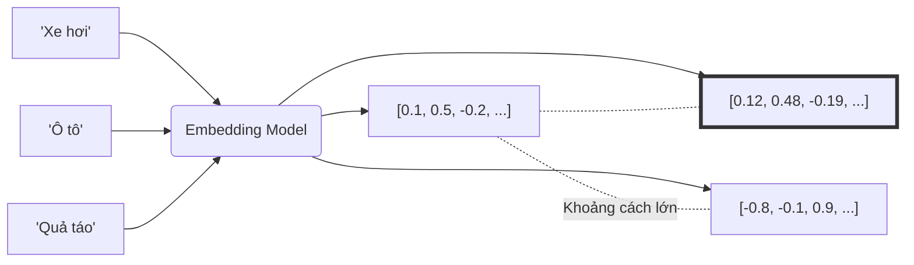

# Vectơ nhúng - Embeddings

## Summary

Vectơ nhúng (Embeddings) là các mảng (arrays) chứa các số thực (ví dụ: `[0.12, -0.45, 0.88, ...]`) biểu diễn ngữ nghĩa của dữ liệu phi cấu trúc như từ ngữ, câu văn, hình ảnh hoặc âm thanh. Các vectơ này tồn tại trong một không gian toán học đa chiều (thường từ hàng trăm đến hàng nghìn chiều), nơi mà khoảng cách giữa hai vectơ phản ánh mức độ tương đồng về mặt ý nghĩa giữa hai đối tượng dữ liệu đó.

---

## Definition

**Embeddings** là một dạng biểu diễn dữ liệu dày đặc (dense representation). Thay vì lưu trữ từ vựng dưới dạng các chuỗi ký tự (strings) rời rạc, máy học sử dụng Embedding Models để chuyển đổi chúng thành các vectơ trong không gian Euclid n-chiều. Mỗi chiều trong vectơ không có ý nghĩa cụ thể đối với con người, nhưng tổ hợp của tất cả các chiều sẽ mã hóa các thuộc tính về ngữ pháp, ngữ nghĩa, cảm xúc, hoặc tính chất của đối tượng.

---

## Why it exists

Thuật toán máy tính, đặc biệt là mạng nơ-ron (Neural Networks), chỉ có thể xử lý các con số toán học, không thể hiểu trực tiếp văn bản như chữ "vua" hay "hoàng hậu".
Trước khi có embeddings, người ta dùng:
1. **One-Hot Vectors**: Mỗi từ là một mảng có độ dài bằng toàn bộ từ vựng, chứa toàn số 0 và một số 1. Yếu điểm: kích thước cực kỳ lớn, lãng phí bộ nhớ và quan trọng nhất là "vua" và "hoàng hậu" sẽ có khoảng cách toán học bằng hệt "vua" và "máy tính" (trực giao, dot product = 0).
2. Tần suất từ (TF-IDF): Mất ngữ cảnh, không bắt được từ đồng nghĩa (Ví dụ "xe hơi" và "ô tô").

Embeddings khắc phục tất cả: Chúng có kích thước cố định (ví dụ 768 hoặc 1536 chiều, nhỏ hơn nhiều so với từ điển) và quan trọng nhất, chúng bảo tồn **mối quan hệ ngữ nghĩa**.

---

## Core idea

* **Sự tương đồng về hình học = Sự tương đồng về ngữ nghĩa**: Nếu hai từ đồng nghĩa (ví dụ: "chó" và "cún"), vectơ của chúng sẽ nằm sát nhau trong không gian. Từ "mèo" cũng sẽ nằm gần đó, trong khi từ "ô tô" sẽ nằm cách rất xa.
* **Các phép toán đại số với ý nghĩa**: Đặc tính nổi tiếng nhất của embeddings là khả năng làm toán với từ ngữ: 
  $\vec{Vua} - \vec{Đàn\_ông} + \vec{Phụ\_nữ} \approx \vec{Nữ\_hoàng}$.
* **Dense Vectors (Vectơ đặc)**: Hầu hết mọi giá trị trong mảng đều khác 0 (khác với sparse vector của One-Hot), giúp nén được một lượng thông tin khổng lồ vào các con số thập phân.

---

## How it works

Dữ liệu thô trải qua một mô hình nhúng (Embedding Model). Cụ thể, kiến trúc học sâu (Deep Learning) sẽ liên tục điều chỉnh các con số trong vectơ thông qua hàng triệu văn bản mẫu. 
Nó học được rằng các từ xuất hiện trong cùng một bối cảnh (ví dụ: "uống ___" thường đi với "nước", "trà", "cà phê") sẽ có ý nghĩa tương tự nhau, do đó nó cập nhật trọng số để kéo các vectơ của "nước", "trà", "cà phê" lại gần nhau.

Sự tương đồng giữa hai vectơ được đo bằng các hàm toán học:
* **Cosine Similarity**: Đo góc giữa hai vectơ (từ -1 đến 1). Góc càng hẹp (gần 1) thì ngữ nghĩa càng giống nhau. Đây là chuẩn phổ biến nhất.
* **Dot Product**: Tích vô hướng của hai vectơ.
* **L2 (Euclidean Distance)**: Khoảng cách đường thẳng nối 2 ngọn vectơ.

---

## Architecture / Flow



Trong đó, `[0.1, 0.5, -0.2, ...]` và `[0.12, 0.48, -0.19, ...]` có các giá trị rất sát nhau, minh họa cho việc "Xe hơi" và "Ô tô" đồng nghĩa.

---

## Practical example

Một ví dụ hình tượng hóa (trong không gian 2 chiều để con người dễ hiểu, thực tế là nghìn chiều). Giả sử chiều x là mức độ "Thú cưng" và chiều y là mức độ "Dã thú":

* Mèo = [0.9, 0.1]
* Hổ = [0.1, 0.9]
* Sư tử = [0.1, 0.85]
* Cún = [0.95, 0.1]

Khoảng cách Cosine giữa Mèo và Cún rất gần nhau. Hổ và Sư tử ở thành một cụm khác.

Trong code Python tính Cosine Similarity:
```python
import numpy as np
from numpy.linalg import norm

vec_meo = np.array([0.9, 0.1])
vec_ho = np.array([0.1, 0.9])

cosine = np.dot(vec_meo, vec_ho) / (norm(vec_meo) * norm(vec_ho))
print(f"Cosine Similarity: {cosine:.2f}") 
# Kết quả rất thấp (khoảng 0.19), nghĩa là không giống nhau.
```

---

## Best practices

* **Lưu trữ chuẩn**: Embeddings là các mảng dữ liệu cực kỳ nặng. Cần sử dụng các Hệ quản trị Cơ sở dữ liệu Vectơ (Vector Databases) chuyên dụng như Pinecone, Milvus, Qdrant, hoặc pgvector để lưu trữ và lập chỉ mục (index) thay vì dùng CSDL quan hệ thông thường.
* **Chuẩn hóa (Normalization)**: Luôn chuẩn hóa (normalize độ dài vectơ về 1) các embeddings để việc tính toán khoảng cách Dot Product tương đương với Cosine Similarity, giúp các thuật toán tìm kiếm chạy nhanh hơn theo cấp số nhân (đặc biệt khi dùng chip GPU).

---

## Common mistakes

* **Trộn lẫn các nguồn Embedding**: Các vectơ sinh ra từ các mô hình khác nhau (ví dụ: OpenAI `ada-002` và Google `text-embedding-gecko`) tồn tại ở các không gian hoàn toàn khác biệt. Không thể tính toán khoảng cách hoặc độ tương đồng giữa hai vectơ sinh ra từ hai mô hình khác nhau.
* **Chỉnh sửa thủ công**: Cố gắng thay đổi thủ công một con số ở chiều thứ 5 của vectơ để mong đợi kết quả tốt hơn. Các chiều này là thông tin ẩn (latent), con người không thể giải mã được ý nghĩa trực tiếp của chúng.

---

## Trade-offs

### Ưu điểm
* Đại diện hoàn hảo cho ý nghĩa (ngữ nghĩa) của dữ liệu.
* Cho phép thực hiện các phép tìm kiếm mờ (Fuzzy/Semantic Search), tìm từ đồng nghĩa tự động.
* Là cầu nối đa phương thức (Multimodal): Có thể nhúng cả chữ và hình ảnh vào cùng một không gian (mô hình CLIP), giúp tìm kiếm hình ảnh bằng câu văn.

### Nhược điểm
* Rất "khát" phần cứng để sinh và tính toán.
* Mất tính diễn giải (Interpretability).
* Cần cơ sở hạ tầng đặc biệt (Vector DB) để mở rộng quy mô.

---

## When to use

* Xây dựng lõi của Retrieval-Augmented Generation (RAG).
* Recommendation systems (đưa user, item về cùng một không gian vectơ để xem khoảng cách).
* Phân tích cảm xúc, gom cụm (Clustering), phát hiện bất thường (Anomaly detection) ở dữ liệu text.

## When not to use

* Dữ liệu dạng bảng (Tabular data, số liệu tài chính) – không cần nhúng ngữ nghĩa vì bản thân chúng đã là các giá trị toán học định lượng rõ ràng.

---

## Related concepts

* [Mô hình nhúng (Embedding Models)](/concepts/embedding-models)
* [Tìm kiếm ngữ nghĩa (Semantic Search)](/concepts/semantic-search)
* [Vector Database](/concepts/vector-database)

---

## Interview questions

### 1. Tại sao One-Hot Encoding lại gặp vấn đề về "Curse of Dimensionality" (Bùng nổ số chiều), và Embeddings giải quyết nó như thế nào?
* **Người phỏng vấn muốn kiểm tra**: Hiểu biết căn bản về cách máy tính biểu diễn dữ liệu thô.
* **Gợi ý trả lời (Strong Answer)**: Trong One-Hot Encoding, kích thước của mỗi vectơ bằng chính kích thước của từ vựng (ví dụ 100,000 từ). Điều này tạo ra một ma trận cực kỳ khổng lồ nhưng thưa thớt (Sparse - toàn số 0), gây cạn kiệt RAM và không biểu diễn được mối liên hệ giữa các từ vì khoảng cách giữa mọi cặp từ đều trực giao (như nhau). Embeddings giải quyết bằng cách nén không gian này thành Dense Vectors (số chiều cố định nhỏ, ví dụ 768), thông qua quá trình học sâu, các giá trị số thực trong 768 chiều này chứa đặc trưng tiềm ẩn, không bị phình to khi thêm từ mới, và bảo toàn được quan hệ hình học (từ đồng nghĩa ở gần nhau).

### 2. Sự khác biệt giữa Dot Product và Cosine Similarity là gì? Khi nào chuẩn hóa (normalize) vectơ có lợi?
* **Người phỏng vấn muốn kiểm tra**: Kiến thức toán học cơ bản áp dụng trong AI.
* **Gợi ý trả lời (Strong Answer)**: Cosine Similarity chỉ đo "góc" giữa hai vectơ (chỉ quan tâm hướng), trong khi Dot Product đo sự kết hợp giữa cả "góc" và "độ dài" (magnitude) của vectơ. Khi ta chia vectơ cho chính độ dài của nó (L2 Normalization), độ dài vectơ trở thành 1. Lúc này, tính Dot Product sẽ cho ra kết quả hoàn toàn giống với Cosine Similarity. Điều này mang lại lợi ích khổng lồ về mặt điện toán: phép Dot Product chạy nhanh và dễ tối ưu phần cứng (như matrix multiplication ở GPU/TPU) hơn phép chia căn bậc hai phức tạp trong công thức Cosine.

---

## References

1. **Word2Vec Parameter Learning Explained** - Xin Rong.
2. **Deep Learning for Natural Language Processing** - Jason Brownlee.

---

## English summary

Embeddings are dense, numerical vectors residing in a high-dimensional continuous space, representing the latent semantic features of unstructured data (text, images, audio). Created by deep learning models, they replace inefficient one-hot encoding by capturing context and synonyms—words with similar meanings are mapped geometrically close to one another. The similarity between embeddings is typically calculated using Cosine Similarity or Dot Product. They are the backbone of modern NLP, forming the foundation for Semantic Search, Retrieval-Augmented Generation (RAG), and Recommender Systems.
