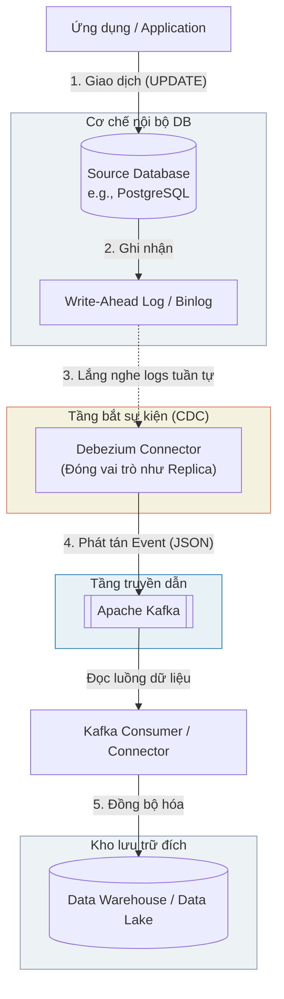

Trong thế giới dữ liệu hiện đại, việc đưa ra quyết định dựa trên dữ liệu cũ của ngày hôm qua đã không còn đủ sức cạnh tranh. Các doanh nghiệp cần biết ngay lập tức khi nào một giao dịch mới được tạo, khi nào một đơn hàng bị hủy, hay khi nào người dùng thay đổi thông tin cá nhân. **Change Data Capture (CDC - Thu thập dữ liệu thay đổi)** chính là "chìa khóa vàng" giúp biến đổi các hệ thống cơ sở dữ liệu tĩnh lặng thành những dòng chảy sự kiện thời gian thực sống động.

## Change Data Capture (CDC): Hơi thở thời gian thực của hệ thống dữ liệu

Nói một cách ngắn gọn, **CDC** là một tập hợp các công nghệ và mẫu thiết kế phần mềm được sử dụng để theo dõi, phát hiện và nắm bắt mọi biến động về dữ liệu (như Insert, Update, Delete) diễn ra ở cơ sở dữ liệu nguồn, sau đó truyền tải các thay đổi này dưới dạng một chuỗi sự kiện liên tục `(event stream)` tới các hệ thống đích trong thời gian thực.

Mặc dù về mặt lý thuyết, bất kỳ quy trình nào chỉ lọc lấy phần dữ liệu mới thay đổi đều có thể gọi là CDC, nhưng trong giới [Data Engineering](/concepts/foundation/data-engineering/) ngày nay, khi nói đến CDC, chúng ta đang ngầm hiểu về **Log-based CDC (CDC dựa trên nhật ký hệ thống)**. 

Thay vì bắt database phải gồng mình chạy các câu lệnh SQL truy vấn định kỳ kiểu `SELECT * FROM table WHERE updated_at > X` (vừa tốn tài nguyên vừa làm chậm ứng dụng), các công cụ CDC hiện đại (như Debezium) sẽ hoạt động ở tầng sâu hơn. Chúng âm thầm "lắng nghe" các tệp nhật ký giao dịch ẩn bên dưới `(Transaction Logs)` của cơ sở dữ liệu – nơi ghi lại từng chuyển động vật lý nhỏ nhất của dữ liệu. Bằng cách dịch các dòng nhật ký thô này thành các thông điệp JSON rõ ràng, CDC giúp tạo ra một dòng chảy thông tin mượt mà đổ thẳng vào [Data Warehouse](/concepts/data-warehouse/data-warehouse/) hay [Data Lake](/concepts/data-lake-lakehouse/data-lake/).

## Tại sao chúng ta cần CDC?

Nếu bạn đã từng xây dựng các đường ống dữ liệu kiểu cũ sử dụng cơ chế [Incremental Load](/concepts/etl-elt/incremental-load/) (quét dữ liệu dựa trên cột mốc thời gian), bạn sẽ hiểu rõ 3 "nỗi đau" chí mạng sau:

1. **Gây nghẽn và sập hệ thống (Performance Hit)**: Việc liên tục gửi lệnh `SELECT` để quét qua hàng triệu bản ghi mỗi 5-10 phút trên cơ sở dữ liệu Production (nơi phục vụ thanh toán trực tiếp của khách hàng) giống như một quả bom nổ chậm, sẵn sàng làm tê liệt hệ thống bất cứ lúc nào.
2. **"Mù lòa" trước các lệnh xóa dữ liệu (The Delete Problem)**: Khi một bản ghi bị xóa vật lý khỏi Database `(DELETE)`, nó biến mất hoàn toàn. Câu lệnh `SELECT` định kỳ tiếp theo sẽ không tìm thấy dấu vết gì, và hệ thống Data Warehouse của bạn sẽ không bao giờ biết được bản ghi đó đã bị xóa, dẫn đến dữ liệu giữa hai bên bị lệch nhau.
3. **Đánh mất lịch sử thay đổi (State Loss)**: Giả sử trong vòng 1 tiếng, số dư tài khoản của một khách hàng biến động liên tục từ 10\$ -> 20\$ -> 50\$. Khi job [ETL](/concepts/etl-elt/etl/) chạy theo giờ quét qua, nó chỉ nhìn thấy con số cuối cùng là 50\$. Toàn bộ hành vi thay đổi trung gian (10\$ và 20\$) đã bị xóa sạch dấu vết. Điều này khiến các mô hình Machine Learning phát hiện gian lận mất đi những dữ liệu cực kỳ đắt giá.

CDC ra đời để giải quyết trọn vẹn cả 3 vấn đề trên: Nó không dùng lệnh SELECT nên hoàn toàn không ảnh hưởng hiệu năng database nguồn, nó bắt trọn các sự kiện DELETE, và ghi nhận từng bước biến động dữ liệu theo đúng trình tự thời gian.

## Ý tưởng cốt lõi: Lắng nghe nhịp đập từ sâu trong Database

Để làm được điều kỳ diệu này, Log-based CDC đã tận dụng chính kiến trúc tự phục hồi của các hệ cơ sở dữ liệu quan hệ (RDBMS).

Mọi cơ sở dữ liệu tin cậy như MySQL, PostgreSQL hay Oracle đều sở hữu một thành phần gọi là **Write-Ahead Log (WAL)** hoặc **Binlog**. Trước khi bất kỳ thay đổi nào thực sự được ghi vào bảng dữ liệu trên đĩa cứng, database buộc phải ghi một dòng nhật ký ngắn gọn mô tả giao dịch đó (ví dụ: *"Bảng Users, dòng 5: chuyển cột Name từ 'Anna' thành 'Bella'"*). Dòng nhật ký này cực kỳ quan trọng, giúp database khôi phục lại trạng thái chính xác nếu chẳng may bị mất điện đột ngột.

Các công cụ CDC như Debezium sẽ kết nối vào database nguồn và đóng vai trò như một cơ sở dữ liệu dự phòng `(Slave Replica)`. Cơ sở dữ liệu gốc `(Master)` sẽ liên tục gửi toàn bộ các file nhật ký Binlog/WAL sang cho Debezium. Tại đây, Debezium dịch các byte thông tin thô thành định dạng JSON dễ hiểu và đẩy trực tiếp vào các hàng đợi tin nhắn `(Message Broker)` như [Apache Kafka](/concepts/streaming-processing/apache-kafka/).

## Luồng đi của dữ liệu diễn ra như thế nào?

Chúng ta có thể hình dung luồng di chuyển của dữ liệu từ nguồn tới đích qua sơ đồ đơn giản dưới đây:


Cụ thể, quy trình này diễn ra qua 5 bước:
1. **Giao dịch phát sinh**: Người dùng cập nhật tên từ "Anna" thành "Bella" trên ứng dụng. Hệ thống gửi câu lệnh `UPDATE users SET name = 'Bella' WHERE id = 1` vào Postgres.
2. **Ghi nhật ký WAL**: Postgres lập tức ghi nhận vào file WAL: `Row ID=1, OldValue='Anna', NewValue='Bella', Op=Update`.
3. **Debezium bắt tín hiệu**: Nhờ kết nối trực tiếp vào cổng Replication, Debezium lập tức nhận được dòng WAL này từ Postgres mà không cần truy vấn.
4. **Phát tán sự kiện**: Debezium đóng gói dữ liệu thành một JSON Payload chứa đầy đủ thông tin trạng thái cũ (`before`) và mới (`after`), sau đó gửi vào Kafka Topic `postgres.users`.
5. **Đồng bộ đích**: Các ứng dụng tiêu thụ (Consumer) ở đầu ra liên tục đọc từ Kafka, nhận diện sự kiện và cập nhật trực tiếp vào Data Warehouse.

## Định dạng một bản tin CDC thực tế

Dưới đây là một JSON Payload điển hình do Debezium tạo ra khi có sự kiện cập nhật dữ liệu. Hãy chú ý cách nó lưu giữ cả trạng thái trước và sau khi thay đổi:
```json
{
  "op": "u",  // Toán tử (Operation): 'c' (create/insert), 'u' (update), 'd' (delete)
  "ts_ms": 1656608542000, // Thời điểm giao dịch xảy ra ở hệ thống nguồn
  "before": {
    "id": 1001,
    "name": "Anna",
    "email": "anna@test.com"
  },
  "after": {
    "id": 1001,
    "name": "Bella",  // Sự thay đổi thực tế
    "email": "anna@test.com"
  },
  "source": {
    "db": "production",
    "table": "users",
    "lsn": 348574895 // Mã số định danh dòng Log (Log Sequence Number)
  }
}
```

Với cấu trúc chi tiết như thế này, hệ thống nhận dữ liệu có thể dễ dàng xử lý mọi tình huống, kể cả khi gặp mã hành động xóa (`op = d`), nó chỉ việc thực hiện lệnh xóa tương ứng ở kho đích.

## Thiết kế hệ thống CDC sao cho chuẩn? (Best Practices)

* **Sử dụng Message Broker làm vùng đệm**: Tuyệt đối không nên cấu hình công cụ CDC ghi trực tiếp vào Data Warehouse mà không có bộ đệm. Nếu Data Warehouse cần tạm dừng để bảo trì, luồng dữ liệu CDC sẽ bị nghẽn và bạn có nguy cơ mất mát dữ liệu. Việc đặt Kafka ở giữa làm vùng đệm giúp lưu trữ các sự kiện một cách an toàn cho đến khi Data Warehouse hoạt động trở lại.
* **Quy trình Snapshot ban đầu**: CDC chỉ ghi nhận những gì thay đổi từ thời điểm nó được kích hoạt. Nó không biết những gì đã xảy ra trước đó. Vì vậy, trong lần đầu tiên chạy, hệ thống cần thực hiện một bản chụp `(Initial Snapshot)` để lấy toàn bộ dữ liệu lịch sử hiện tại, sau đó mới chuyển sang chế độ stream WAL. Các công cụ chuyên nghiệp như Debezium thường tự động xử lý quy trình này.
* **Cấu hình thời gian lưu giữ WAL hợp lý**: Database nguồn cần được thiết lập để không xóa các file log giao dịch quá nhanh. Nếu hệ thống CDC gặp sự cố và phải dừng hoạt động vài ngày, trong khi database nguồn đã tự động xóa sạch các file Binlog cũ, luồng CDC sẽ bị đứt gãy hoàn toàn và bạn buộc phải chạy lại Snapshot ban đầu – một quá trình vô cùng tốn kém thời gian và tài nguyên.

## Những "hố đen" dễ sa chân khi triển khai CDC

* **Bảng dữ liệu thiếu Khóa chính (Primary Key)**: Nhật ký database sẽ không thể ghi nhận đầy đủ thông tin định danh nếu bảng không có khóa chính. Khi đẩy dữ liệu đi, hệ thống đích sẽ hoàn toàn bối rối không biết bản ghi JSON này dùng để cập nhật cho dòng nào ở kho đích. Hãy luôn đảm bảo mọi bảng nguồn đều có Primary Key trước khi áp dụng CDC.
* **Xử lý sai lệch thứ tự sự kiện (Out-of-order)**: Trong môi trường phân tán (như các partition của Kafka), một sự kiện xảy ra sau (Update B) có thể được truyền đến đích nhanh hơn sự kiện xảy ra trước (Update A). Nếu hệ thống đích cập nhật một cách mù quáng, dữ liệu sẽ bị ghi đè bởi thông tin cũ. Để giải quyết, hệ thống đích cần luôn so sánh trường timestamp `ts_ms` và chỉ chấp nhận cập nhật nếu sự kiện mới có `ts_ms` lớn hơn dữ liệu hiện tại.

## Bức tranh hai mặt: Ưu điểm & Thách thức

### Ưu điểm vượt trội
* **Độ trễ tiệm cận thời gian thực**: Dữ liệu được đồng bộ gần như ngay lập tức (thường dưới 1 giây).
* **Bảo vệ hệ thống nguồn**: Gần như không gây ảnh hưởng đến hiệu năng của Database Production do không sử dụng câu lệnh SELECT.
* **Toàn vẹn dữ liệu tuyệt đối**: Không bỏ sót bất kỳ hành động nào, kể cả các lệnh xóa cứng (hard deletes) hay các biến động nhanh trong tích tắc.

### Thách thức đi kèm
* **Hạ tầng phức tạp**: Việc vận hành và giám sát một hệ thống kết hợp giữa Debezium, Kafka và các Consumer đòi hỏi đội ngũ kỹ sư dữ liệu phải có kiến thức chuyên sâu về hệ thống và DevOps.
* **Yêu cầu quyền truy cập sâu**: Đòi hỏi phải thay đổi các cấu hình hệ thống ở mức cơ bản của database nguồn (như chuyển `wal_level` sang `logical` trong Postgres). Điều này thường gặp nhiều rào cản về quy trình bảo mật tại các doanh nghiệp lớn.

## Khi nào nên (và không nên) đưa CDC vào dự án?

**CDC là lựa chọn hoàn hảo khi:**
* Bạn đang xây dựng kiến trúc Data [Lakehouse](/concepts/data-lake-lakehouse/lakehouse/) thời gian thực.
* Cần dữ liệu cập nhật tức thì phục vụ cho việc phát hiện gian lận thẻ tín dụng, hệ thống cảnh báo hoặc theo dõi chuỗi cung ứng.
* Database Production của bạn đang quá tải và không thể chịu đựng thêm các truy vấn quét dữ liệu định kỳ của ETL.

**Nên tránh dùng CDC khi:**
* Doanh nghiệp chỉ cần các báo cáo phân tích tĩnh cập nhật một lần mỗi ngày. Khi đó, phương pháp Incremental Load truyền thống qua SQL là quá đủ và tiết kiệm chi phí hơn nhiều.
* Nguồn dữ liệu của bạn đến từ các API bên thứ ba (như Hubspot, Salesforce, Google Analytics). Bạn không thể can thiệp vào tầng vật lý chứa log của họ, vì thế CDC là bất khả thi.

## Góc phỏng vấn: Những câu hỏi thực chiến

### 1. Phân biệt Log-based CDC và Query-based CDC (Incremental query). Tại sao Log-based được coi là kiến trúc tối ưu hơn?
* **Mục đích câu hỏi**: Đánh giá hiểu biết bản chất hệ thống và tư duy thiết kế kiến trúc của ứng viên.
* **Gợi ý trả lời**:
  * *Query-based CDC* sử dụng các câu lệnh SQL kiểu `SELECT * WHERE updated_at > X`. Phương pháp này gây áp lực tải trực tiếp lên CPU/RAM của DB nguồn, dễ bỏ sót các thay đổi diễn ra quá nhanh giữa các chu kỳ quét, và hoàn toàn bất lực trước các hành động xóa vật lý `(DELETE)`.
  * *Log-based CDC* đọc trực tiếp từ các file nhật ký giao dịch ở cấp độ hệ thống tệp (Binlog/WAL). Nó hoàn toàn bỏ qua engine xử lý SQL của database, giúp loại bỏ ảnh hưởng hiệu năng lên ứng dụng. Nó ghi nhận mọi thay đổi ở mức độ byte (bao gồm cả trạng thái trước-sau của dòng dữ liệu và thao tác Delete). Vì thế, đây là chuẩn mực thiết kế (industry standard) cho các pipeline streaming hiện nay.

### 2. Debezium đọc Log và ném vào Kafka. Làm thế nào để đảm bảo thứ tự (Ordering) của các sự kiện trên một bản ghi? Ví dụ: Lệnh INSERT phải đến Data Warehouse trước lệnh UPDATE.
* **Mục đích câu hỏi**: Kiểm tra kiến thức chuyên sâu về xử lý luồng phân tán và cơ chế hoạt động của Apache Kafka.
* **Gợi ý trả lời**:
  * Trong Kafka, thứ tự tin nhắn chỉ được bảo toàn tuyệt đối bên trong cùng một Phân vùng (Partition). Để đảm bảo các sự kiện của cùng một dòng dữ liệu (ví dụ cùng một User) đi đúng thứ tự thời gian, công cụ CDC (Debezium) sẽ chọn **Khóa Chính (Primary Key)** của bảng nguồn làm **Message Key** khi gửi tin nhắn vào Kafka. 
  * Thuật toán băm (hashing) của Kafka sẽ đảm bảo mọi tin nhắn có chung Message Key sẽ luôn được phân bổ vào cùng một Partition duy nhất. Nhờ đó, Consumer ở đầu ra sẽ luôn đọc và xử lý các sự kiện theo đúng trình tự thời gian tuyến tính đã diễn ra tại database nguồn.

## Tài liệu tham khảo

1. [Debezium Documentation: Architecture](https://debezium.io/documentation/reference/stable/architecture.html) - Official reference explaining Debezium connectors, snapshotting process, and Kafka integration.
2. [Designing Data-Intensive Applications](https://www.oreilly.com/library/view/designing-data-intensive-applications/9781491903063/) - Book by Martin Kleppmann discussing write-ahead logs, replication logs, and change data capture.
3. [AWS Database Migration Service (DMS): Using Change Data Capture](https://docs.aws.amazon.com/dms/latest/userguide/CHAP_Task.CDC.html) - AWS guide on enabling CDC for continuous replication from source databases to target endpoints.
4. Google Cloud Datastream Documentation: Change Data Capture Overview - Official GCP documentation on serverless, log-based CDC architecture and replication.
5. [Confluent Blog: What is Change Data Capture?](https://www.confluent.io/learn/change-data-capture/) - An industry-verified engineering resource by Confluent explaining log-based CDC patterns, Kafka Connect, and stream processing.


## English Summary

Change Data Capture (CDC) is an advanced architectural pattern used to track and replicate data changes (Insert, Update, Delete) from an operational database to analytical systems in real-time. Modern CDC heavily relies on Log-based replication (using tools like Debezium reading Write-Ahead Logs / Binlogs) rather than traditional SQL polling. This approach creates a real-time event stream of data changes with near-zero performance impact on the source operational systems. CDC is highly effective at capturing transient intermediate states and physical hard-deletes, solving the biggest flaws of incremental batch queries, and serves as the backbone for modern streaming pipelines and Data Lakehouse architectures.