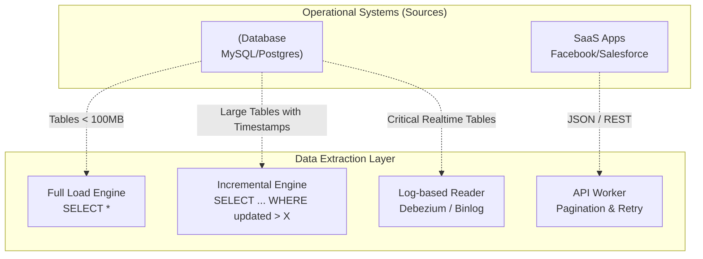

Trong quy trình ETL/ELT kinh điển, chữ cái đầu tiên "**E**" chính là đại diện cho **Extraction (Trích xuất dữ liệu)**. Đây là bước đi chập chững đầu tiên nhưng lại đóng vai trò quyết định: làm thế nào để kết nối, đọc và rút dữ liệu thô ra khỏi các hệ thống nguồn (như cơ sở dữ liệu vận hành, hệ thống SaaS của bên thứ ba, hay các tệp nhật ký hoạt động) rồi mang về nhà kho trung tâm.

Một thách thức lớn đặt ra cho các kỹ sư dữ liệu là: hệ thống nguồn vô cùng đa dạng và liên tục thay đổi. Nhiệm vụ của chúng ta không chỉ đơn thuần là viết code kết nối, mà phải tìm ra câu trả lời cho bài toán hóc búa: *“Làm sao lấy được đúng và đủ dữ liệu cần thiết mà không làm quá tải hay làm sập hệ thống đang trực tiếp phục vụ khách hàng?”*

---

## Dữ liệu phân mảnh - Lý do Data Extraction tồn tại

Trong thực tế, dữ liệu của doanh nghiệp không bao giờ nằm tập trung một nơi sạch sẽ cho chúng ta khai thác. Chúng phân tán ở khắp mọi ngóc ngách:
* Hệ quản trị cơ sở dữ liệu như Postgres, MySQL (nơi lưu trữ thông tin giao dịch, đơn hàng, khách hàng).
* Các nền tảng SaaS như Salesforce, Hubspot, Zendesk (nơi vận hành các hoạt động CRM, chăm sóc khách hàng).
* Các tệp tin CSV, Excel thô sơ được đối tác gửi định kỳ qua máy chủ SFTP.
* Hệ thống lưu trữ Log hoạt động (nơi ghi lại từng cú click chuột, lượt xem trang của người dùng).

Mỗi nguồn này sử dụng một ngôn ngữ truy vấn, một giao thức truyền tin (HTTP, TCP, FTP) và các cơ chế bảo mật hoàn toàn khác nhau. Data Extraction sinh ra để đóng vai trò như một thông dịch viên đa năng, giao tiếp trôi chảy với từng nguồn này theo đúng quy tắc của chúng nhằm đưa dữ liệu ra ngoài một cách an toàn.

---

## Kiến trúc và Các phương pháp trích xuất dữ liệu

Để trích xuất dữ liệu, chúng ta thường phải cân nhắc lựa chọn giữa các phương pháp từ đơn giản đến phức tạp, tùy thuộc vào kích thước dữ liệu và yêu cầu hệ thống.



### 1. Trích xuất toàn bộ (Full Extraction)
* **Cơ chế hoạt động**: Gửi câu lệnh đơn giản nhất `SELECT * FROM table`.
* **Cách thực hiện**: Định kỳ (ví dụ mỗi đêm), hệ thống sẽ kết nối đến cơ sở dữ liệu và tải về toàn bộ nội dung của bảng (ví dụ bảng `products` có 10 triệu dòng). Ở kho lưu trữ đích, bảng cũ sẽ bị xóa sạch hoàn toàn (`TRUNCATE`) và nạp đè bằng dữ liệu mới tải về.
* **Đánh giá**: Cách này cực kỳ dễ viết code, không cần logic theo dõi phức tạp và đảm bảo dữ liệu ở kho lưu trữ luôn khớp 100% với nguồn. Tuy nhiên, nó cực kỳ lãng phí băng thông và gây áp lực lớn lên ổ cứng (I/O) cũng như CPU của cơ sở dữ liệu nguồn. Do đó, phương pháp này chỉ nên áp dụng cho các bảng danh mục nhỏ, ít biến động (như danh sách tỉnh thành, mã trạng thái).

### 2. Trích xuất gia tăng (Incremental Extraction)
* **Cơ chế hoạt động**: Sử dụng câu lệnh lọc theo mốc thời gian: `SELECT * FROM table WHERE updated_at > {last_run_time}`.
* **Cách thực hiện**: Ở lần chạy đầu tiên, hệ thống sẽ lấy toàn bộ dữ liệu. Ở các lần chạy tiếp theo, hệ thống sẽ ghi nhớ thời điểm cuối cùng đã trích xuất thành công (gọi là mốc chặn - *High Watermark*) và chỉ yêu cầu lấy những dòng dữ liệu có cột `updated_at` lớn hơn mốc này.
* **Đánh giá**: Phương pháp này rất nhanh và tiết kiệm băng thông. Tuy nhiên, điểm yếu chí mạng của nó là **"bị mù" trước các lệnh xóa dữ liệu vật lý (Hard deletes)**. Nếu một bản ghi bị xóa hoàn toàn ở cơ sở dữ liệu nguồn, bản ghi đó biến mất nên cột `updated_at` cũng không còn tồn tại để báo cho pipeline biết. Kết quả là kho dữ liệu đích vẫn giữ bản ghi cũ đó mãi mãi (tạo ra dữ liệu ma - *Ghost data*).

### 3. Trích xuất dựa trên Nhật ký (Log-based Extraction / Change Data Capture - CDC)
* **Cơ chế hoạt động**: Hệ thống trích xuất sẽ đóng vai trò như một bản sao (replica) của cơ sở dữ liệu và đọc trực tiếp tệp nhật ký giao dịch ghi trên đĩa cứng (như Binlog của MySQL hoặc WAL của Postgres).
* **Cách thực hiện**: Mọi hành động ghi dữ liệu (INSERT, UPDATE, DELETE) đều được ghi nhận vào file log trước khi cập nhật vào bảng. Hệ thống CDC sẽ liên tục đọc file log này và đẩy các sự kiện thay đổi đi dưới dạng luồng sự kiện (stream).
* **Đánh giá**: Phương pháp này giải quyết triệt để bài toán Hard Deletes và hỗ trợ cập nhật dữ liệu theo thời gian thực (real-time). Tuy nhiên, việc cài đặt và vận hành hệ thống CDC (như Debezium kết hợp Kafka) lại cực kỳ phức tạp và đòi hỏi quyền quản trị cao nhất (Admin) trên cơ sở dữ liệu nguồn.

### 4. Trích xuất qua cổng API (API Extraction)
* **Cơ chế hoạt động**: Gửi yêu cầu HTTP GET đến dịch vụ (ví dụ: `GET https://api.stripe.com/v1/charges`).
* **Cách thực hiện**: Đối với các ứng dụng SaaS bên thứ ba, chúng ta không thể truy cập trực tiếp vào cơ sở dữ liệu của họ mà bắt buộc phải đi qua cổng API do họ cung cấp.
* **Đánh giá**: Việc viết code trích xuất qua API khá phức tạp vì phải xử lý:
  - **Phân trang (Pagination)**: Dữ liệu lớn phải được chia nhỏ ra thành nhiều trang. Code phải tự động lặp để lấy từng trang thông qua các tham số như Limit, Offset hoặc Token.
  - **Giới hạn lượt gọi (Rate Limiting)**: Nếu gọi API quá tần suất cho phép, hệ thống nguồn sẽ chặn kết nối và trả về lỗi `429 Too Many Requests`. Bạn phải thiết kế cơ chế tự động chờ đợi (Backoff) và thử lại (Retry).

---

## Ví dụ thực tế: Code trích xuất phân trang từ API bằng Python

Dưới đây là một đoạn code Python minh họa cách trích xuất dữ liệu từ một API có phân trang, đồng thời xử lý lỗi giới hạn lượt gọi (Rate Limit):

```python
import requests
import time

def extract_users_from_api(api_key):
    url = "https://api.example.com/v1/users"
    headers = {"Authorization": f"Bearer {api_key}"}
    users_data = []
    
    # Tham số phân trang
    params = {"limit": 100, "offset": 0}
    
    while True:
        response = requests.get(url, headers=headers, params=params)
        
        # Xử lý Rate Limit
        if response.status_code == 429:
            print("Rate limit hit. Sleeping for 10 seconds...")
            time.sleep(10)
            continue
            
        response.raise_for_status()
        data = response.json()
        
        users_data.extend(data['results'])
        
        # Kiểm tra nếu hết dữ liệu (Pagination kết thúc)
        if not data['has_more']:
            break
            
        params['offset'] += 100
        
    return users_data
```

---

## Sai lầm thường gặp và Best Practices

### Các nguyên tắc vàng (Best Practices)
* **Ưu tiên phương pháp Incremental và CDC**: Ngoại trừ các bảng cấu hình nhỏ, hãy cố gắng áp dụng trích xuất gia tăng hoặc CDC để giảm tải tối đa cho hệ thống nguồn và tiết kiệm tài nguyên mạng.
* **Đọc dữ liệu từ bản sao (Read Replica)**: Luôn kết nối công cụ trích xuất dữ liệu đến máy chủ Read Replica thay vì máy chủ chính (Primary DB) nhằm tránh nguy cơ làm chậm hoặc sập hệ thống ứng dụng đang chạy thực tế.
* **Kiểm tra Khóa chính (Primary Key)**: Đảm bảo bảng nguồn có các khóa chính rõ ràng để ở bước nạp dữ liệu (Load), hệ thống đích có thể thực hiện so khớp dữ liệu (`Upsert/Merge`), tránh tình trạng trùng lặp bản ghi.

### Những sai lầm thường gặp (Common Pitfalls)
* **Quá tin tưởng vào cấu trúc API bên thứ ba**: Cấu trúc dữ liệu JSON trả về từ các API (như Facebook hay Shopify) có thể thay đổi bất ngờ mà không báo trước (`Schema drift`). Nếu viết code bóc tách quá cứng nhắc, pipeline sẽ bị lỗi ngay lập tức. Cách tiếp cận tốt hơn là trích xuất và nạp nguyên bản chuỗi JSON thô vào Data Warehouse, sau đó mới dùng SQL để xử lý ở bước Transform sau (mô hình ELT).
* **Bỏ quên việc xử lý xóa dữ liệu (Hard Deletes)**: Sử dụng Incremental dựa vào mốc `updated_at` nhưng lại không xử lý trường hợp người dùng xóa tài khoản trên hệ thống. Hậu quả là tài khoản bị xóa trên nguồn nhưng báo cáo phân tích vẫn hiển thị họ tạo ra doanh thu vì hệ thống trích xuất không nhận biết được hành động xóa.

---

## Ưu nhược điểm và Đánh đổi (Pros & Cons)

| Phương pháp | Ưu điểm | Nhược điểm | Trường hợp sử dụng |
| :--- | :--- | :--- | :--- |
| **Full Extraction** | Đơn giản, an toàn, xử lý Hard Deletes triệt để. | Chậm, tốn băng thông, không khả thi với dữ liệu lớn. | Bảng cấu hình, danh mục nhỏ (< 100MB). |
| **Incremental Extraction** | Nhanh, nhẹ, dễ cài đặt bằng các câu lệnh SQL. | "Mù" trước Hard Deletes, phụ thuộc vào cột timestamp nguồn. | Bảng dữ liệu lớn có cột thời gian rõ ràng. |
| **Log-based CDC** | Tốc độ thời gian thực, bắt được mọi hành vi bao gồm cả Delete. | Cài đặt và vận hành rất phức tạp, đòi hỏi quyền Admin DB. | Hệ thống giao dịch lớn cần độ trễ thấp. |

---

## Góc phỏng vấn: Những câu hỏi thường gặp

### 1. Nêu 3 chiến lược chính để trích xuất dữ liệu từ một cơ sở dữ liệu quan hệ. Bạn sẽ chọn chiến lược nào cho một bảng có 500 triệu dòng?
* **Mục đích của người phỏng vấn**: Đánh giá hiểu biết tổng quan về Data Extraction và khả năng lựa chọn kiến trúc phù hợp cho các bài toán dữ liệu lớn.
* **Gợi ý trả lời**: Ba chiến lược chính là Full Load (Lấy toàn bộ), Incremental Load qua cột thời gian (Watermark), và Log-based CDC. Đối với một bảng có kích thước lên đến 500 triệu dòng, **tuyệt đối không dùng Full Load** vì việc quét toàn bộ bảng mỗi ngày sẽ làm tê liệt cơ sở dữ liệu nguồn. Tùy thuộc vào yêu cầu nghiệp vụ: Nếu chỉ cần cập nhật dữ liệu dạng lô (batch) hàng ngày, tôi chọn Incremental Load dựa trên cột mốc `updated_at`. Nếu hệ thống yêu cầu độ trễ cực thấp (near real-time) hoặc có nhiều thao tác xóa vật lý (hard delete), tôi sẽ triển khai Log-based CDC (như Debezium) để đọc trực tiếp file nhật ký giao dịch.

### 2. API Pagination là gì và tại sao nó lại là thử thách lớn đối với kỹ sư dữ liệu?
* **Mục đích của người phỏng vấn**: Kiểm tra kinh nghiệm thực tế khi làm việc với các hệ thống SaaS API bên ngoài.
* **Gợi ý trả lời**: Phân trang (Pagination) là cơ chế các nhà cung cấp API chia nhỏ lượng dữ liệu khổng lồ thành nhiều trang kết quả nhỏ hơn (ví dụ 100 dòng mỗi trang) để tránh làm quá tải máy chủ của họ. Thách thức lớn nhất là kỹ sư dữ liệu phải viết một vòng lặp theo dõi con trỏ trang kế tiếp (next cursor/offset). Nếu trong lúc vòng lặp đang chạy ở trang thứ 50 mà kết nối mạng bị ngắt quãng, nếu code xử lý trạng thái (state management) không tốt, hệ thống sẽ phải chạy lại từ trang 1, gây ra trùng lặp dữ liệu hoặc bị khóa tài khoản do vượt giới hạn Rate Limit.

### 3. Làm thế nào để bạn phát hiện sự thay đổi cấu trúc bảng (Schema Drift) từ hệ thống nguồn khi thực hiện Data Extraction?
* **Gợi ý trả lời**:
  * **Giải pháp 1 (Schema Validation)**: Sử dụng một lớp Schema Validation (như JSON Schema hoặc Great Expectations) để kiểm tra tính hợp lệ của schema trước khi tải. Nếu phát hiện trường dữ liệu mới hoặc kiểu dữ liệu bị thay đổi, hệ thống sẽ gửi cảnh báo (Alert) cho kỹ sư dữ liệu hoặc tự động cách ly (Quarantine) các bản ghi lỗi.
  * **Giải pháp 2 (ELT Pattern)**: Áp dụng mô hình ELT bằng cách trích xuất dữ liệu thô (Raw Data) dưới định dạng bán cấu trúc như JSON/semi-structured, lưu trữ nguyên trạng vào Landing Zone (Data Lake hoặc Stage Table của DWH). Việc phân tích cấu trúc cụ thể sẽ được trì hoãn và xử lý bằng các công cụ biến đổi dữ liệu (như dbt) trong Data Warehouse. Điều này giúp Pipeline trích xuất không bị gián đoạn khi có Schema Drift nhẹ.

## Tài liệu tham khảo

1. [Fundamentals of Data Engineering](https://www.oreilly.com/library/view/fundamentals-of-data/9781098108298/) - Book by Joe Reis and Matt Housley detail-oriented on the extraction layer, source systems, and connectivity.
2. [Airbyte Documentation: Connection Sync Modes](https://docs.airbyte.com/understanding-airbyte/connections/) - Official guide explaining sync modes such as Full Refresh, Incremental Append, and Incremental Deduped History.
3. [AWS Glue: Working with Incremental Ingestion](https://docs.aws.amazon.com/glue/latest/dg/glue-incremental-ingestion.html) - AWS documentation explaining how to design incremental data extraction pipelines using job bookmarks.
4. [Stripe API Reference: Pagination](https://stripe.com/docs/api/pagination) - Verified SaaS API documentation illustrating how pagination, cursors, and limits work in practice for data extraction.
5. [Microsoft Learn: Extract, Transform, and Load (ETL)](https://learn.microsoft.com/en-us/azure/architecture/data-guide/relational-data/etl) - Reference architecture on building secure, resilient data extraction flows in cloud environments.


---

## Tóm tắt bằng tiếng Anh (English Summary)

**Data Extraction** is the initial phase in the ETL/ELT pipeline where raw data is pulled from source systems (Databases, SaaS APIs, Logs) to a centralized storage. Depending on data volume and latency requirements, engineers choose between Full Extraction (replicating the entire table, suitable for small reference data), Incremental Extraction (querying only new/updated rows using timestamps, efficient but misses hard deletes), and Log-based Change Data Capture (CDC) (reading database transaction logs for real-time, exact replica streams). Working with external APIs presents additional extraction challenges such as pagination and rate-limiting.
