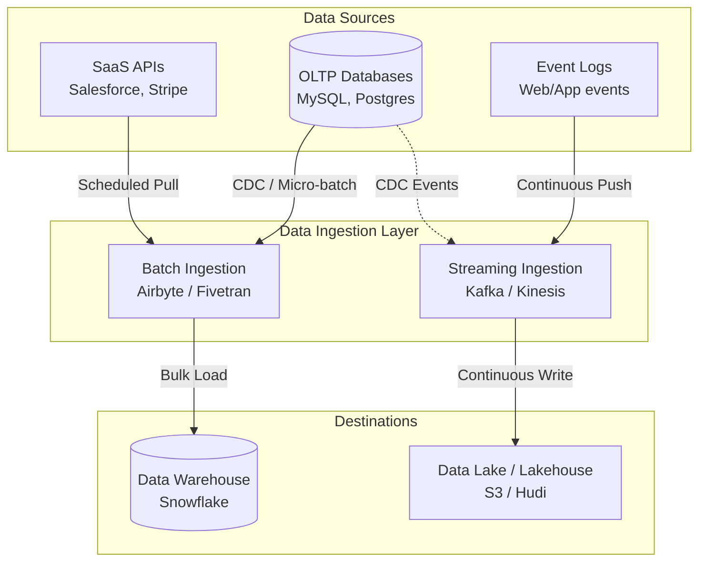

Trong vòng đời của dữ liệu (`Data Lifecycle`), **Data Ingestion (Thu nạp dữ liệu)** là bước đi chập chững đầu tiên nhưng vô cùng quan trọng. Hãy tưởng tượng doanh nghiệp của bạn sở hữu một kho dữ liệu trung tâm hiện đại, nhưng nếu không có hệ thống "đường ống dẫn nước" để hút dữ liệu thô từ các nguồn sông hồ (cơ sở dữ liệu ứng dụng, log server, API bên thứ ba) về kho, thì mọi công cụ phân tích hay trí tuệ nhân tạo (AI) đều trở nên vô dụng. 

Data Ingestion chính là việc thiết kế và vận hành hệ thống đường ống vận chuyển huyết mạch đó.

---

## Thu nạp dữ liệu (Data Ingestion) thực chất là gì?

**Data Ingestion** là quá trình thu thập, vận chuyển và nạp dữ liệu từ các nguồn phát sinh ban đầu (hệ thống nguồn) vào một kho lưu trữ tập trung (như Data Lake hoặc Data Warehouse) để sẵn sàng cho các công đoạn biến đổi và phân tích tiếp theo.

Trong mô hình ETL/ELT kinh điển, Data Ingestion bao hàm toàn bộ hai giai đoạn **E** (Extract - Trích xuất) và **L** (Load - Nạp). Điểm cốt lõi cần lưu ý là: quá trình này không tập trung vào việc áp dụng các quy tắc logic nghiệp vụ phức tạp để thay đổi dữ liệu, mà đặt ưu tiên hàng đầu vào **độ tin cậy (reliability)**, **khả năng mở rộng (scalability)** và **đảm bảo dữ liệu không bị thất thoát** trong quá trình vận chuyển.

---

## Tại sao chúng ta cần một hệ thống Ingestion chuyên biệt?

Dữ liệu của một doanh nghiệp là huyết mạch, nhưng chúng lại được sinh ra ở những hòn đảo hoàn toàn cô lập:
* Thông tin đăng ký và hồ sơ người dùng lưu ở cơ sở dữ liệu PostgreSQL của ứng dụng.
* Nhật ký hành vi click chuột, lướt màn hình lưu ở dạng các tệp log trên máy chủ Web/App.
* Dữ liệu thanh toán và hóa đơn được lấy qua REST API của các dịch vụ như Stripe hay Paypal.

Bản thân các hệ thống nguồn này chỉ được thiết kế để phục vụ việc vận hành ứng dụng chứ không có nhiệm vụ phân tích hay đẩy dữ liệu đi. Hệ thống Data Ingestion hoạt động giống như một đơn vị logistics chuyên nghiệp: tự động đến nhận dữ liệu, đóng gói an toàn và chở về kho tổng mà không gây ảnh hưởng đến hoạt động kinh doanh bình thường tại nguồn.

---

## Hai mô hình thu nạp dữ liệu kinh điển

Dựa trên yêu cầu về thời gian và độ trễ, Data Ingestion được chia thành hai trường phái chính:

### 1. Thu nạp theo lô (Batch Ingestion)
* **Cơ chế**: Gom dữ liệu thành một lô lớn rồi định kỳ vận chuyển về kho (ví dụ: chạy mỗi đêm lúc 1h sáng, hoặc chạy 4 tiếng một lần).
* **Ứng dụng**: Phù hợp cho các báo cáo tài chính hàng ngày, đồng bộ dữ liệu CRM tĩnh hoặc các tác vụ phân tích không đòi hỏi độ trễ thấp.
* **Đặc điểm**: Đơn giản, dễ kiểm soát lỗi, tối ưu hóa băng thông mạng và chi phí vận hành thấp.

### 2. Thu nạp theo luồng thời gian thực (Streaming Ingestion)
* **Cơ chế**: Dữ liệu được thu thập và đẩy đi ngay lập tức theo từng bản ghi (record-by-record) ngay khi sự kiện vừa xảy ra (tính bằng mili-giây).
* **Ứng dụng**: Phù hợp cho hệ thống phát hiện gian lận thẻ tín dụng, đề xuất sản phẩm tức thì cho người dùng đang lướt web, hoặc theo dõi trạng thái các thiết bị IoT.
* **Đặc điểm**: Phản ứng cực nhanh trước các biến động dữ liệu. Tuy nhiên, kiến trúc hệ thống cực kỳ phức tạp, đắt đỏ và yêu cầu hệ thống phải luôn ở trạng thái hoạt động (always-on).

---

## Quy trình hoạt động của một công cụ Ingestion tự động

Dưới đây là sơ đồ kiến trúc tổng quan của luồng thu nạp dữ liệu:



Khi sử dụng một công cụ Ingestion hiện đại (như Airbyte hoặc Fivetran) chạy theo chế độ Batch Incremental, quy trình sẽ diễn ra như sau:
1. **Thiết lập kết nối**: Công cụ kết nối vào cơ sở dữ liệu nguồn bằng tài khoản chỉ đọc (`Read-only`).
2. **Ghi nhận mốc chặn (State/Cursor)**: Hệ thống ghi nhớ mốc thời gian của lần chạy thành công gần nhất (ví dụ: `2026-06-06 10:00:00`).
3. **Trích xuất**: Gửi câu lệnh lấy dữ liệu mới phát sinh kể từ mốc đó: `SELECT * FROM users WHERE updated_at > '2026-06-06 10:00:00'`.
4. **Vận chuyển**: Nén dữ liệu thu được (thường dùng định dạng JSONL/Gzip) và truyền tải qua mạng.
5. **Nạp dữ liệu**: Ghi khối dữ liệu thô này vào bảng chứa dữ liệu thô (`raw_users`) tại Data Warehouse.
6. **Cập nhật mốc chặn**: Lưu lại mốc thời gian mới để chuẩn bị cho chu kỳ tiếp theo.

---

## Ví dụ thực tế: Code Ingest dữ liệu thời tiết bằng Python

Đoạn code Python dưới đây minh họa việc thu nạp dữ liệu thời tiết từ một API nguồn (chạy theo lô) và ghi trực tiếp dữ liệu thô đó vào Data Lake (Amazon S3):

```python
import requests
import boto3
import json
from datetime import datetime

# BƯỚC EXTRACT (Trích xuất từ API nguồn)
api_url = "https://api.weather.com/v1/current?city=Hanoi"
response = requests.get(api_url)
weather_data = response.json()

# Đóng gói dữ liệu kèm theo Metadata thời gian thu nạp
payload = {
    "ingestion_timestamp": datetime.utcnow().isoformat(),
    "source": "weather_api",
    "data": weather_data
}

# BƯỚC LOAD (Nạp dữ liệu thô vào Data Lake)
s3_client = boto3.client('s3')
file_name = f"raw/weather/hanoi_{datetime.utcnow().strftime('%Y%m%d%H%M')}.json"

s3_client.put_object(
    Bucket='my-data-lake-bucket',
    Key=file_name,
    Body=json.dumps(payload)
)
print("Ingestion completed.")
```

---

## Kinh nghiệm thực chiến khi xây dựng hệ thống Ingestion

* **Hạn chế việc tự viết code kết nối (Custom Connectors)**: Cấu trúc API của bên thứ ba (như Facebook Ads hay Google Ads) thay đổi liên tục. Việc tự viết script và bảo trì chúng là một cơn ác mộng. Hãy ưu tiên sử dụng các dịch vụ thu nạp dữ liệu tự động (như Airbyte hoặc Fivetran) vì họ có đội ngũ chuyên cập nhật các thay đổi này, đồng thời xử lý tốt các bài toán giới hạn lượt gọi (Rate Limit) hay tự động thử lại khi mất mạng.
* **Luôn đính kèm Siêu dữ liệu (Metadata)**: Khi nạp dữ liệu thô vào đích, hãy luôn tạo thêm ít nhất hai cột hệ thống: `_ingested_at` (thời điểm nạp) và `_source_file` (nguồn gốc của file/lô dữ liệu). Điều này sẽ giúp bạn dễ dàng truy vết và sửa lỗi khi phát hiện dữ liệu bất thường.
* **Thiết kế cơ chế tự phục hồi (Resilience)**: Đường truyền mạng có thể mất kết nối, hệ thống nguồn có thể bị sập đột ngột. Hãy đảm bảo hệ thống Ingestion có cơ chế tự động thử lại (`Retries`), hàng đợi xử lý lỗi (`Dead-letter Queue` để cách ly các dòng dữ liệu lỗi định dạng) và cảnh báo tức thì qua Slack/Teams.

---

## Những sai lầm phổ biến

* **Bỏ qua giới hạn lượt gọi API (Rate Limits)**: Kéo dữ liệu quá nhanh khiến máy chủ nguồn bị quá tải và tiến hành chặn địa chỉ IP của bạn. Hãy thiết kế cơ chế tự động giãn cách nhịp độ gọi API (`Backoff mechanism`).
* **Biến Data Lake thành "đầm lầy dữ liệu" (Data Swamp)**: Việc nạp dữ liệu thô quá dễ dàng khiến các kỹ sư thường lạm dụng, đổ mọi thứ lên cloud mà không phân chia thư mục (Partitioning) rõ ràng. Sau một thời gian, dữ liệu thô sẽ nằm lộn xộn và không ai có thể truy vấn hay tìm kiếm nổi.

---

## Ưu điểm và nhược điểm (Trade-offs)

| Tiêu chí | Thu nạp theo lô (Batch) | Thu nạp theo luồng (Streaming) |
| :--- | :--- | :--- |
| **Độ trễ** | Cao (vài giờ đến 1 ngày). | Cực thấp (mili-giây đến vài giây). |
| **Chi phí** | Rẻ hơn (chỉ tính tiền khi chạy tác vụ). | Đắt đỏ (hạ tầng phải chạy 24/7). |
| **Độ phức tạp** | Thấp, dễ cài đặt và khôi phục khi lỗi. | Rất cao, đòi hỏi các công cụ như Kafka, Flink. |
| **Trường hợp áp dụng** | Báo cáo KPI ngày, báo cáo tài chính, tổng kết tuần. | Phát hiện gian lận thẻ, gợi ý theo thời gian thực, IoT. |

---

## Góc phỏng vấn: Những câu hỏi thường gặp

### 1. Làm thế nào để đảm bảo quá trình thu nạp dữ liệu (Data Ingestion) không gây ảnh hưởng đến hiệu năng hoạt động của cơ sở dữ liệu nguồn (nơi đang phục vụ người dùng)?
* **Mục đích của người phỏng vấn**: Đánh giá tư duy thiết kế hệ thống thực tế và sự thấu hiểu về hiệu năng của ứng dụng gốc.
* **Gợi ý trả lời**: Chúng ta có 3 giải pháp chính để giải quyết bài toán này:
  1) Chỉ chạy các tác vụ Ingest lớn theo lô (batch) vào khung giờ thấp điểm (đêm muya) khi lượng truy cập của người dùng ở mức thấp nhất.
  2) Cấu hình hệ thống Ingestion đọc dữ liệu từ máy chủ bản sao chỉ đọc (`Read-Replica`) thay vì truy vấn trực tiếp lên máy chủ chính (`Master Database`).
  3) Sử dụng công nghệ Change Data Capture (CDC - như Debezium). CDC đọc trực tiếp từ các tệp nhật ký ghi đĩa (transaction logs) của cơ sở dữ liệu nguồn, do đó gần như không gây ra áp lực tính toán lên CPU hay RAM của DB nguồn.

### 2. Sự khác biệt giữa việc nạp dữ liệu trực tiếp vào Data Lake dưới dạng tệp tin và nạp qua một Message Broker (như Kafka) là gì?
* **Mục đích của người phỏng vấn**: Kiểm tra sự hiểu biết sâu sắc về kiến trúc Batch/Micro-batch so với kiến trúc Streaming.
* **Gợi ý trả lời**:
  * Việc nạp dữ liệu trực tiếp dưới dạng tệp tin (như CSV/Parquet) lên Data Lake là mô hình theo lô. Các hệ thống hạ nguồn phải đợi tệp được ghi xong hoàn toàn mới có thể đọc và xử lý, tạo ra độ trễ nhất định.
  * Việc nạp dữ liệu qua Kafka theo mô hình Pub/Sub (Publish/Subscribe) biến dữ liệu thành các luồng sự kiện liên tục. Nó giúp tách rời (`Decouple`) hệ thống cực tốt: nhiều ứng dụng hạ nguồn khác nhau (như hệ thống phân tích thời gian thực, hệ thống phát hiện lỗi, hoặc kho lưu trữ thô) có thể cùng lúc đăng ký lắng nghe luồng sự kiện này và xử lý độc lập ngay lập tức mà không cần phải chờ đợi tệp tin.

---

## Tài liệu tham khảo

1. [Fundamentals of Data Engineering](https://www.oreilly.com/library/view/fundamentals-of-data/9781098108298/) - Book by Joe Reis and Matt Housley detail-oriented on the ingestion phase, batch vs. streaming ingestion, and decoupling.
2. [Designing Data-Intensive Applications](https://www.oreilly.com/library/view/designing-data-intensive-applications/9781491903063/) - Book by Martin Kleppmann explaining stream processing, message brokers, and bulk data loading patterns.
3. [AWS Whitepaper: Streaming Data Ingestion Patterns](https://docs.aws.amazon.com/whitepapers/latest/streaming-data-solutions-amazon-kinesis/streaming-data-solutions-amazon-kinesis.html) - Official AWS architectural guidance on stream ingestion using Amazon Kinesis and Apache Kafka.
4. [Airbyte Documentation: Data Ingestion Architecture](https://docs.airbyte.com/understanding-airbyte/high-level-architecture/) - Guide explaining Airbyte's scheduler, source/destination adapters, and data replication process.
5. [Confluent: What is Data Ingestion?](https://www.confluent.io/learn/data-ingestion/) - Comprehensive overview of real-time vs. batch ingestion, event streaming, and architectural best practices.


---

## Tóm tắt bằng tiếng Anh (English Summary)

**Data Ingestion** is the foundational process of acquiring and moving data from various disparate sources (databases, APIs, logs) into a centralized storage target (Data Lake or Data Warehouse) for downstream analysis. In the context of modern ELT, it focuses purely on secure, scalable transportation (Extract and Load) without applying heavy business logic. Ingestion strategies generally fall into two categories: Batch Ingestion (moving large chunks of data at scheduled intervals, suitable for daily reporting) and Streaming Ingestion (continuously flowing record-by-record, suitable for real-time analytics like fraud detection). Efficient ingestion architectures heavily utilize managed replication tools, event brokers (like Kafka), or CDC to minimize load on operational source systems.
