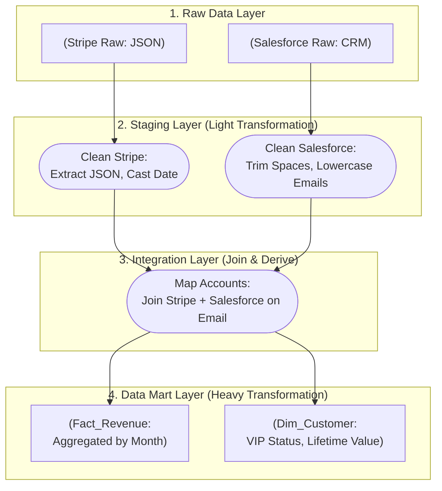

Nếu coi dữ liệu thô (raw data) giống như dầu thô vừa được khai thác từ lòng đất, thì **Data Transformation (Biến đổi dữ liệu)** chính là quá trình lọc dầu trong nhà máy. Dầu thô chưa thể đổ trực tiếp vào động cơ xe để chạy, cũng giống như dữ liệu thô chưa thể đưa trực tiếp lên báo cáo hay mô hình AI để phân tích. 

Data Transformation chính là chữ **"T"** quan trọng trong quy trình [ETL](/concepts/etl-elt/etl/)/[ELT](/concepts/etl-elt/elt/) — giai đoạn biến đống dữ liệu hỗn độn thành những tài sản thông tin giá trị, chuẩn mực và sẵn sàng cho các quyết định kinh doanh.

## Data Transformation là gì?

Nói một cách chính xác, **Data Transformation** là quá trình thay đổi định dạng, cấu trúc hoặc giá trị của dữ liệu từ trạng thái nguồn (khi vừa thu thập) thành trạng thái đích (phù hợp để tiêu thụ).

Quy trình này thường bao gồm một chuỗi các thao tác kỹ thuật:
* Lọc bỏ dữ liệu rác, các dòng trùng lặp hoặc không hợp lệ.
* Chuẩn hóa kiểu dữ liệu, định dạng chuỗi và đồng bộ múi giờ.
* Tính toán các chỉ số phái sinh (Derived Metrics) phục vụ nghiệp vụ.
* Kết hợp (Join) và gộp (Aggregate) dữ liệu từ nhiều nguồn khác nhau.
* Thiết kế mô hình dữ liệu (như [Dimensional Modeling](/concepts/data-warehouse/dimensional-modeling/) với các bảng Fact và Dimension).

## Sự thật phũ phàng về dữ liệu thô

Nếu bạn được hứa hẹn rằng dữ liệu nguồn sẽ luôn sạch sẽ và hoàn hảo, thì đó là một lời nói dối. Dữ liệu thô từ các ứng dụng (CRM, ERP, Web logs) thường là một "đầm lầy" (Data Swamp):
1. **Thiếu nhất quán**: Cùng là thông tin giới tính, hệ thống này lưu là `M`/`F`, hệ thống kia lưu là `Male`/`Female`, còn cơ sở dữ liệu cũ lại lưu là `1`/`0`.
2. **Sai lệch định dạng**: Người dùng nhập tên không chuẩn hóa (như `nguyen van a`), số điện thoại lúc có mã vùng lúc không, thậm chí chứa cả chữ cái do lỗi nhập liệu.
3. **Phân tán rải rác**: Để tính toán được chỉ số "Giá trị vòng đời khách hàng" (LTV), bạn phải kết nối chéo dữ liệu chi phí quảng cáo (Facebook/Google Ads), lịch sử đơn hàng (MySQL) và lịch sử hỗ trợ (Zendesk).

Nếu bạn bỏ qua bước biến đổi và phân tích trực tiếp trên đống dữ liệu thô này, kết quả nhận được chắc chắn sẽ sai lệch. Đúng như nguyên lý **"Garbage In, Garbage Out" (Rác vào thì Rác ra)**.

## Kiến trúc nhiều lớp trong Transformation hiện đại

Trong các hệ thống dữ liệu hiện đại (đặc biệt khi kết hợp với công cụ như **[dbt](/concepts/transformation-analytics/dbt/)**), chúng ta không cố gắng thực hiện mọi phép biến đổi trong một bước duy nhất. Thay vào đó, dữ liệu được chuyển dịch qua một kiến trúc nhiều lớp (Multi-layered Architecture) để dễ dàng kiểm soát và truy vết:



1. **Lớp Raw (Dữ liệu thô)**: Đây là lớp lưu trữ dữ liệu nguyên bản được chép trực tiếp từ nguồn. Lớp này giống như một bằng chứng lịch sử và tuyệt đối không được chỉnh sửa.
2. **Lớp Staging (Làm sạch cơ bản)**: Thực hiện các phép biến đổi nhẹ (Light transformations) như: Đổi tên cột cho dễ hiểu, ép kiểu dữ liệu (Casting), cắt khoảng trắng thừa (Trimming) và chuẩn hóa múi giờ. Độ chi tiết của dữ liệu ở lớp này vẫn giữ nguyên như ở nguồn.
3. **Lớp Integration / Intermediate (Kết hợp)**: Nối (Join) các bảng Staging lại với nhau để định hình các thực thể nghiệp vụ hoàn chỉnh (ví dụ: kết hợp thông tin tài khoản và thông tin thanh toán của khách hàng).
4. **Lớp Mart / Curated (Trình bày)**: Thực hiện các phép biến đổi nặng (Heavy transformations) như gom nhóm (`GROUP BY`), tạo các bảng Fact và Dimension đẹp đẽ để phục vụ trực tiếp cho các công cụ BI (Tableau, Power BI).

## Các kỹ thuật biến đổi dữ liệu phổ biến

* **Làm sạch (Cleansing)**: Loại bỏ các bản ghi lỗi, ví dụ như đơn hàng có ID khách hàng bị NULL hoặc email không đúng cấu trúc quy chuẩn.
* **Ép kiểu & Định dạng (Casting / Formatting)**: Chuyển đổi cột số tiền từ dạng chuỗi ký tự (`"$1,000"`) sang dạng số (`DECIMAL(10,2)`) và quy đổi tất cả các mốc thời gian về múi giờ chuẩn (UTC).
* **Tính toán dẫn xuất (Derivation)**: Tạo cột mới dựa trên logic nghiệp vụ. Từ ngày sinh, tính ra tuổi hiện tại. Hoặc dựa vào số lượng đơn hàng để phân loại khách hàng (`Active`, `VIP`).
* **Kết hợp (Joining)**: Sử dụng SQL để JOIN bảng đơn hàng với bảng khách hàng nhằm xác định hành vi mua sắm của từng cá nhân.
* **Gom nhóm (Aggregation)**: Tính tổng doanh thu theo ngày, theo tháng để tạo các bảng dữ liệu tổng hợp giúp tăng tốc truy vấn cho báo cáo.

---

## Ví dụ thực tế: Biến đổi dữ liệu sang lớp Integration

Dưới đây là một đoạn code SQL (viết theo chuẩn dbt) để chuyển đổi dữ liệu từ lớp Staging sang lớp Integration nhằm phân tích hành vi của khách hàng:

```sql
-- Dữ liệu nguồn: stg_orders (đã làm sạch ngày tháng và ép kiểu dữ liệu)
WITH orders AS (
    SELECT 
        customer_id,
        order_id,
        order_date,
        total_amount
    FROM {{ ref('stg_orders') }}
    WHERE status = 'completed'
),

-- Dữ liệu nguồn: stg_customers (đã làm sạch tên, email)
customers AS (
    SELECT 
        customer_id,
        email,
        country
    FROM {{ ref('stg_customers') }}
),

-- BƯỚC TRANSFORM NGHIỆP VỤ (Gộp dữ liệu và tạo Metric phái sinh)
customer_behavior AS (
    SELECT 
        c.customer_id,
        c.email,
        c.country,
        MIN(o.order_date) AS first_order_date,
        MAX(o.order_date) AS latest_order_date,
        COUNT(o.order_id) AS total_orders_count,
        SUM(o.total_amount) AS lifetime_value
    FROM customers c
    LEFT JOIN orders o ON c.customer_id = o.customer_id
    GROUP BY 1, 2, 3
)

-- Phân loại phân khúc khách hàng
SELECT 
    *,
    CASE 
        WHEN total_orders_count > 10 AND lifetime_value > 1000 THEN 'Gold'
        WHEN total_orders_count > 0 THEN 'Active'
        ELSE 'Churned'
    END AS customer_segment
FROM customer_behavior
```

---

## "Bí kíp" thực chiến & Những sự đánh đổi

### Các thói quen tốt cần áp dụng (Best Practices)
* **Quản lý logic biến đổi bằng code (Data as Code)**: Hãy viết các quy tắc biến đổi dưới dạng code (SQL/Python) và quản lý bằng Git. Tránh xa các công cụ ETL kéo thả bằng giao diện (GUI) cho các logic nghiệp vụ phức tạp, vì chúng cực kỳ khó theo dõi lịch sử thay đổi (Version Control) khi có sự cố xảy ra.
* **Tách nhỏ các bước (Decoupling)**: Đừng viết một câu truy vấn SQL dài hàng ngàn dòng vừa JOIN 10 bảng vừa tính toán đủ loại KPIs. Điều đó sẽ biến code của bạn thành một "khối bê tông" không thể debug khi số liệu bị sai. Hãy chia nhỏ nó thành các Common Table Expressions (CTEs) hoặc các bảng trung gian.
* **Kiểm thử liên tục**: Đặt các bài test tự động ngay sau các bước transform quan trọng để chắc chắn không có lỗi logic nào lọt qua (ví dụ: đảm bảo khóa chính không bị trùng lặp).

### Những sai lầm thường gặp
* **Chạy logic biến đổi trên CSDL vận hành ([OLTP](/concepts/database-storage/oltp/))**: Chạy các câu lệnh JOIN và SORT nặng nề trực tiếp trên database của ứng dụng đang chạy sẽ làm chậm hệ thống, thậm chí gây treo app của khách hàng. Hãy đưa dữ liệu ra [Data Warehouse](/concepts/data-warehouse/data-warehouse/) rồi mới thực hiện biến đổi (mô hình ELT).
* **Sửa đè lên dữ liệu gốc (Data Loss)**: Thấy dữ liệu thô có lỗi, bạn dùng lệnh `UPDATE` sửa thẳng vào bảng Raw. Đây là một sai lầm nghiêm trọng vì bạn đã xóa mất dấu vết lỗi của hệ thống nguồn. Hãy luôn giữ nguyên lớp Raw và chỉ áp dụng các quy tắc làm sạch ở lớp Staging.

### Lựa chọn công cụ: SQL (ELT) hay Python/Spark (ETL)?
* **Sử dụng SQL (ELT)**:
  * *Ưu điểm*: Đơn giản, dễ học, tận dụng được năng lực tính toán cực mạnh và tối ưu của các Cloud Data Warehouse hiện đại (như BigQuery, [Snowflake](/concepts/cloud-data-platform/snowflake/)).
  * *Nhược điểm*: Khó xử lý các tác vụ phức tạp như bóc tách văn bản tự do, xử lý JSON lồng nhau nhiều cấp, hoặc tích hợp các mô hình Machine Learning.
* **Sử dụng Python/Spark (ETL)**:
  * *Ưu điểm*: Cực kỳ linh hoạt, có thể xử lý mọi loại cấu trúc dữ liệu phức tạp (như hình ảnh, âm thanh, tệp XML) và dễ dàng tích hợp các thư viện AI.
  * *Nhược điểm*: Yêu cầu kỹ năng lập trình phần mềm tốt và chi phí vận hành, bảo trì cụm máy chủ Spark tương đối lớn.

---

## Góc phỏng vấn

### 1. Sự khác biệt giữa làm sạch dữ liệu (Data Cleansing) và định dạng dữ liệu (Data Shaping/Modeling) trong quá trình Transformation là gì?
* **Gợi ý trả lời**: 
  * **Data Cleansing** tập trung vào khía cạnh chất lượng kỹ thuật của dữ liệu (Data Quality) ở cấp độ dòng và cột. Các công việc bao gồm: Loại bỏ khoảng trắng thừa, ép kiểu dữ liệu, chuẩn hóa chữ hoa/chữ thường, xử lý giá trị NULL. Bước này thường được thực hiện sớm ở lớp Staging.
  * **Data Shaping/Modeling** tập trung vào cấu trúc và ngữ nghĩa nghiệp vụ. Các công việc bao gồm: Xoay bảng (Pivot), gom nhóm tính toán chỉ số (Aggregation), phân chia bảng thành Fact và Dimension để phục vụ trực tiếp cho phân tích. Bước này được thực hiện muộn hơn ở lớp Data Mart.

### 2. Khi chạy một đoạn SQL Transformation có chứa phép JOIN giữa bảng Users và Orders, kết quả trả về số lượng đơn hàng (orders) nhiều gấp đôi so với thực tế. Nguyên nhân có thể là gì và khắc phục thế nào?
* **Gợi ý trả lời**: Đây là lỗi **Fan-out (nhân bản dòng)** cực kỳ phổ biến khi JOIN dữ liệu. Nguyên nhân là do khóa JOIN ở bảng Users không phải là duy nhất (Unique), dẫn đến quan hệ JOIN thực tế trở thành Nhiều-Nhiều thay vì Một-Nhiều. Ví dụ, bảng Users có hai bản ghi trùng lặp cho cùng một `user_id`. Khi thực hiện JOIN với bảng Orders, mỗi đơn hàng của user đó sẽ bị nhân đôi thành hai dòng.
  * *Cách khắc phục*: Trước khi JOIN, tôi sẽ kiểm tra và làm sạch bảng Users bằng cách dùng `GROUP BY` hoặc hàm cửa sổ (như `ROW_NUMBER()`) để đảm bảo mỗi `user_id` chỉ tương ứng với một dòng duy nhất trong bảng Users.

---

## Tài liệu tham khảo

1. [Designing Data-Intensive Applications](https://www.oreilly.com/library/view/designing-data-intensive-applications/9781491903063/) - Book by Martin Kleppmann explaining [batch processing](/concepts/batch-processing/batch-processing/), dataflows, and [schema evolution](/concepts/data-lake-lakehouse/schema-evolution/) during transformations.
2. [dbt Documentation: How we structure our dbt projects](https://docs.getdbt.com/best-practices/how-we-structure/1-guide-overview) - Best practices on staging, intermediate, and marts layers for SQL-based transformations.
3. [Fundamentals of Data Engineering](https://www.oreilly.com/library/view/fundamentals-of-data/9781098108298/) - Book by Joe Reis and Matt Housley describing data transformation types (structural, semantic) and technologies (SQL, Spark).
4. [Databricks: Medallion Architecture](https://www.databricks.com/glossary/medallion-architecture) - Architectural guide defining Bronze (raw), Silver (cleaned), and Gold (curated) data transformation layers.
5. [AWS Glue: Transforming Data](https://docs.aws.amazon.com/glue/latest/dg/transforming-data.html) - Technical documentation explaining ETL operations, schema mapping, and script generation in AWS.


## English Summary

Data Transformation is the pivotal "T" phase in ETL/ELT, where messy, disparate raw data is cleaned, structured, and enriched with business logic to make it suitable for analytics. Modern [data engineering](/concepts/foundation/data-engineering/) typically breaks transformation into multiple modular layers (Raw, Staging, Integration, Data Marts) using tools like dbt and SQL. Techniques range from basic data cleansing (casting, trimming, handling NULLs) to complex joining, aggregation, and dimensional modeling. Adopting "Data as Code" practices, implementing rigorous [data testing](/concepts/data-quality/data-testing/), and avoiding transformations that alter immutable raw source data are essential best practices for a reliable pipeline.
