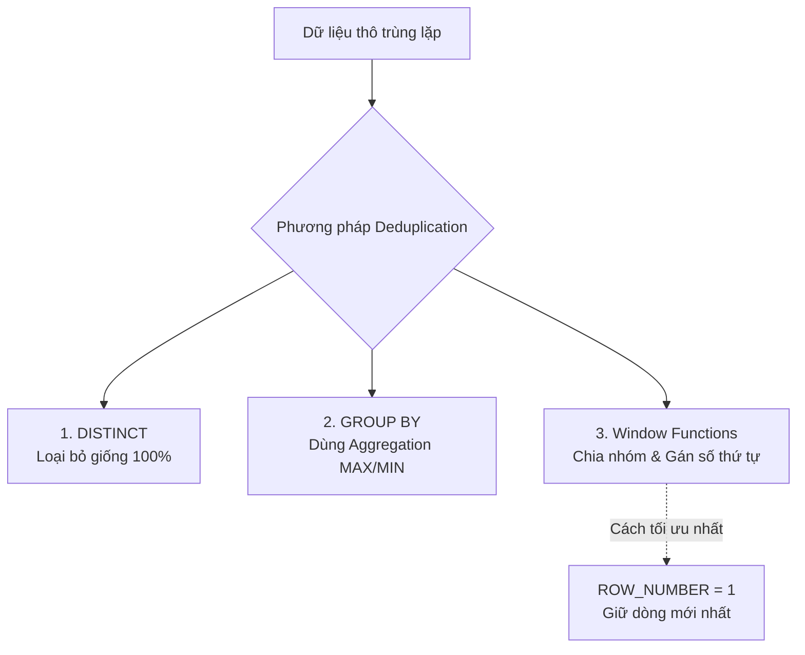

Hãy tưởng tượng bạn đang chạy một chiến dịch gửi mã giảm giá tri ân khách hàng thân thiết. Do một lỗi kỹ thuật nào đó, thông tin của khách hàng tên Bob bị trùng lặp thành 5 dòng trong cơ sở dữ liệu. Kết quả là Bob nhận được 5 email chứa 5 mã giảm giá khác nhau, còn báo cáo gửi sếp thì ghi nhận số lượng khách hàng hoạt động tăng vọt gấp nhiều lần thực tế.

Trong ngành kỹ thuật dữ liệu, hiện tượng này được gọi là dữ liệu bị trùng lặp (Duplicate Data). Để bảo vệ hệ thống báo cáo khỏi những số liệu ảo này, chúng ta cần áp dụng **Deduplication (Khử trùng lặp dữ liệu)**.

## Deduplication là gì?

**Deduplication (Khử trùng lặp)** là quá trình nhận diện và loại bỏ các bản ghi trùng lặp trong một tập dữ liệu. Mục tiêu cuối cùng là đảm bảo tính duy nhất (Uniqueness) của các thực thể ở một mức độ chi tiết (Granularity) nhất định.

Khi phát hiện nhiều dòng dữ liệu mô tả cùng một sự kiện hoặc đối tượng, quy trình khử trùng lặp sẽ tìm cách chọn ra duy nhất một bản ghi "chuẩn vàng" (Golden Record) đại diện tốt nhất và loại bỏ hoặc bỏ qua tất cả các dòng còn lại.

## Tại sao "rác" trùng lặp lại xuất hiện trong hệ thống của bạn?

Dữ liệu bị trùng lặp không tự nhiên sinh ra, nó thường là kết quả của các lỗi hệ thống hoặc đặc thù kiến trúc:

1. **Lỗi từ phía ứng dụng nguồn (Application Errors)**: Người dùng nhấn nút mua hàng hoặc nút đăng ký liên tiếp hai lần do mạng lag. Hoặc ứng dụng di động tự động thử lại (Retry) việc gọi API khi gặp sự cố timeout, vô tình tạo ra nhiều bản ghi giống hệt nhau trên server.
2. **Cơ chế truyền tin của Ingestion (Message Queues)**: Các hệ thống phân phối tin nhắn lớn như [Apache Kafka](/concepts/streaming-processing/apache-kafka/) hay Google Pub/Sub thường sử dụng cơ chế phân phối **At-least-once** (đảm bảo tin nhắn được gửi đi ít nhất một lần). Điều này có nghĩa là việc một tin nhắn bị gửi lặp lại 2-3 lần trong điều kiện mạng chập chờn là hành vi bình thường của hệ thống.
3. **Lỗi thiết kế pipeline (Non-idempotent Pipelines)**: Đường ống dẫn dữ liệu bị lỗi giữa chừng và khi chạy lại, do thiết kế không tuân thủ tính lũy đẳng ([Idempotency](/concepts/etl-elt/idempotency/)), hệ thống tiếp tục ghi đè/nạp thêm (Append) đè lên tập dữ liệu cũ đã nạp trước đó.

## 3 Con đường khử trùng lặp dữ liệu

Tùy vào công cụ và cấu trúc dữ liệu, các kỹ sư dữ liệu thường sử dụng 3 kỹ thuật SQL cơ bản để làm sạch trùng lặp:


1. **Sử dụng toán tử `DISTINCT`**: Đây là cách đơn giản nhất. Nó quét qua toàn bộ các dòng và loại bỏ những dòng giống nhau 100% trên tất cả các cột. Tuy nhiên, cách này cực kỳ kém linh hoạt vì chỉ cần một cột (như timestamp) lệch nhau 1 mili-giây, `DISTINCT` sẽ không nhận diện được trùng lặp.
2. **Sử dụng gom nhóm `GROUP BY`**: Nhóm dữ liệu theo các cột khóa chính (Key) và sử dụng các hàm gom nhóm như `MAX(updated_at)` hay `MIN(created_at)` để chọn ra dòng mong muốn.
3. **Sử dụng hàm cửa sổ (Window Functions)**: Đây là phương thức chuẩn mực và mạnh mẽ nhất. Chúng ta sử dụng hàm `ROW_NUMBER()` để phân mảnh dữ liệu theo khóa (`PARTITION BY`) và sắp xếp theo tiêu chí ưu tiên (`ORDER BY updated_at DESC`), sau đó chỉ lấy những dòng có số thứ tự bằng `1`.

---

## Ví dụ thực tế: Chọn bản ghi "chuẩn vàng" bằng SQL

Xét một bảng dữ liệu người dùng (`users`) ở vùng Staging đang bị trùng lặp thông tin của Bob như sau:

| user_id | email            | status   | updated_at          |
|---------|------------------|----------|---------------------|
| 1       | bob@gmail.com    | pending  | 2026-06-07 10:00:00 |
| 1       | bob@gmail.com    | active   | 2026-06-07 10:05:00 |
| 2       | alice@gmail.com  | active   | 2026-06-07 09:00:00 |

Mục tiêu của chúng ta là lọc bỏ dòng trạng thái cũ (`pending`) của Bob và giữ lại dòng trạng thái mới nhất (`active`) dựa trên mốc thời gian `updated_at`.

### Câu lệnh SQL sử dụng hàm cửa sổ `ROW_NUMBER()````sql
WITH ranked_users AS (
    SELECT 
        user_id,
        email,
        status,
        updated_at,
        ROW_NUMBER() OVER (
            PARTITION BY user_id 
            ORDER BY updated_at DESC
        ) AS rn
    FROM staging_users
)
SELECT 
    user_id,
    email,
    status,
    updated_at
FROM ranked_users
WHERE rn = 1;
```

Sau khi thực thi, kết quả trả về sẽ chỉ còn duy nhất 2 dòng: Bản ghi của Bob lúc `10:05:00` (trạng thái active) và bản ghi của Alice. Dòng dữ liệu cũ của Bob đã được loại bỏ hoàn hảo.

---

## "Bí kíp" thực chiến & Những sự đánh đổi

### Kinh nghiệm bỏ túi (Best Practices)
* **Khử trùng lặp càng sớm càng tốt (Shift Left)**: Hãy cố gắng thực hiện lọc trùng lặp ngay tại cửa ngõ vào (như tầng Staging hoặc tầng Silver trong Data [Lakehouse](/concepts/data-lake-lakehouse/lakehouse/)) để ngăn không cho rác dữ liệu lan truyền xuống các bảng báo cáo phía sau.
* **Xác định rõ ràng khóa duy nhất (Unique Key)**: Bạn phải hiểu sâu sắc về nghiệp vụ dữ liệu để biết chính xác tập hợp các cột nào sẽ tạo thành một khóa duy nhất. Việc chọn sai cột `PARTITION BY` sẽ dẫn đến việc xóa nhầm dữ liệu hợp lệ.
* **Luôn có tiêu chí sắp xếp rõ ràng**: Khi khử trùng lặp, bắt buộc phải có cột sắp xếp tất định (như `updated_at`, `timestamp` hoặc số phiên bản `version_id`) để [dbt](/concepts/transformation-analytics/dbt/)/SQL luôn chọn đúng bản ghi mới nhất. Tránh sắp xếp theo các cột ngẫu nhiên vì nó sẽ làm mất đi tính nhất quán của dữ liệu sau mỗi lần chạy pipeline.

### Những sai lầm phổ biến cần tránh
* **Lạm dụng `SELECT DISTINCT` vô tội vạ**: `DISTINCT` buộc hệ thống phải so sánh mọi giá trị của tất cả các cột trên từng dòng. Việc này cực kỳ tốn tài nguyên và dễ bỏ sót các bản ghi trùng lặp có sai lệch nhẹ về mặt thời gian.
* **Bẫy giá trị NULL**: Nếu bạn thực hiện `PARTITION BY` trên một cột chứa nhiều giá trị NULL, hệ thống sẽ gom toàn bộ các dòng NULL này vào chung một nhóm và chỉ giữ lại một dòng duy nhất, vô tình xóa mất các dữ liệu quan trọng khác.

### Đánh đổi (Trade-offs)
* **Tài nguyên tính toán**: Việc thực hiện chia nhóm (`PARTITION BY`) và sắp xếp (`ORDER BY`) trên các bảng dữ liệu khổng lồ (hàng tỷ dòng) sẽ ép hệ thống tính toán phân tán (như Spark hay BigQuery) thực hiện thao tác **[Shuffle](/concepts/batch-processing/shuffle/)** truyền tải dữ liệu qua mạng lưới các node. Việc này cực kỳ ngốn CPU/RAM và chi phí cloud.
* **Độ trễ của pipeline**: Thêm các bước khử trùng lặp phức tạp sẽ làm tăng thời gian chạy của các job [ETL](/concepts/etl-elt/etl/)/[ELT](/concepts/etl-elt/elt/).
* **Trường hợp dữ liệu Event Logs**: Đối với các luồng dữ liệu clickstream khổng lồ, việc khử trùng lặp chính xác 100% đôi khi quá đắt đỏ và không cần thiết. Trong trường hợp đó, người ta chấp nhận một tỷ lệ sai số cực nhỏ và sử dụng các thuật toán ước lượng như HyperLogLog để tiết kiệm chi phí.

---

## Góc phỏng vấn

### 1. Phân biệt `RANK()`, `DENSE_RANK()`, và `ROW_NUMBER()` trong việc loại bỏ trùng lặp?
* **Gợi ý trả lời**:
  * **`ROW_NUMBER()`**: Luôn gán một số thứ tự duy nhất và tăng dần (1, 2, 3...) cho từng dòng trong nhóm, kể cả khi các dòng đó có giá trị sắp xếp giống hệt nhau. Đây là hàm an toàn nhất và được sử dụng nhiều nhất để khử trùng lặp (lọc lấy dòng có `rn = 1`).
  * **`RANK()`**: Sẽ gán cùng một số thứ tự cho các dòng đồng hạng, nhưng sẽ nhảy số ở dòng tiếp theo (ví dụ: 1, 1, 3). Nếu dùng hàm này để khử trùng lặp, bạn có nguy cơ lấy ra nhiều hơn 1 bản ghi nếu chúng trùng mốc thời gian sắp xếp.
  * **`DENSE_RANK()`**: Tương tự như `RANK()`, gán cùng số thứ tự cho các dòng đồng hạng nhưng không nhảy số (ví dụ: 1, 1, 2). Hàm này cũng gặp rủi ro tương tự như `RANK()` khi dùng để khử trùng lặp.

### 2. Làm thế nào để xử lý trùng lặp trong luồng dữ liệu thời gian thực (Streaming) với hàng triệu sự kiện mỗi giây?
* **Gợi ý trả lời**: Trong hệ thống thời gian thực (Streaming), chúng ta không thể dùng các câu lệnh `GROUP BY` hay Window Functions trên toàn bộ bảng vì dữ liệu chưa kết thúc. Thay vào đó, chúng ta phải sử dụng một bộ lưu trữ trạng thái (State Store - ví dụ như RocksDB trong Apache Flink hoặc Spark Structured Streaming) kết hợp với cơ chế **Watermark** (cửa sổ thời gian). Hệ thống sẽ chỉ lưu lại các khóa duy nhất (Unique Keys) trong bộ nhớ trong một khoảng thời gian giới hạn (ví dụ 10 phút) để đối chiếu chéo. Nếu một sự kiện trùng lặp rơi vào đúng cửa sổ 10 phút đó, nó sẽ bị loại bỏ. Sau khi cửa sổ đóng lại, trạng thái cũ trong bộ nhớ sẽ được giải phóng để tiết kiệm RAM.

---

## Tài liệu tham khảo

1. [Designing Data-Intensive Applications](https://www.oreilly.com/library/view/designing-data-intensive-applications/9781491903063/) - Book by Martin Kleppmann explaining at-least-once message delivery, message deduplication, and idempotency.
2. [SQL Cookbook](https://www.oreilly.com/library/view/sql-cookbook-2nd/9781492077435/) - Book by Anthony Molinaro and Robert de Graaf containing recipe patterns for finding and removing duplicate records in SQL.
3. [Apache Spark](/concepts/batch-processing/apache-spark/) Documentation: dropDuplicates - Official API reference for PySpark's dropDuplicates method, a standard [data engineering](/concepts/foundation/data-engineering/) tool for row deduplication.
4. [Delta Lake Documentation: Upserting data using merge](https://docs.delta.io/latest/delta-update.html#upsert-into-a-table-using-merge) - Official [Delta Lake](/concepts/data-lake-lakehouse/delta-lake/) guide showing how to deduplicate and merge CDC records.
5. [Dedupe Python Library Documentation](https://github.com/dedupeio/dedupe) - Open-source library documentation for Dedupe.io, demonstrating machine-learning-based deduplication and entity resolution.


## English Summary

**Deduplication** is the process of identifying and removing duplicate records in a dataset to ensure uniqueness. It is highly critical for maintaining [data quality](/concepts/data-quality/data-quality/), avoiding issues like double-counting in analytical reports. Often required due to "at-least-once" delivery semantics from upstream [source systems](/concepts/foundation/source-systems/), deduplication is typically implemented via SQL window functions (`ROW_NUMBER()`) prioritizing the most recent record. While it ensures accuracy, it introduces computational overhead associated with sorting and shuffling large volumes of data.