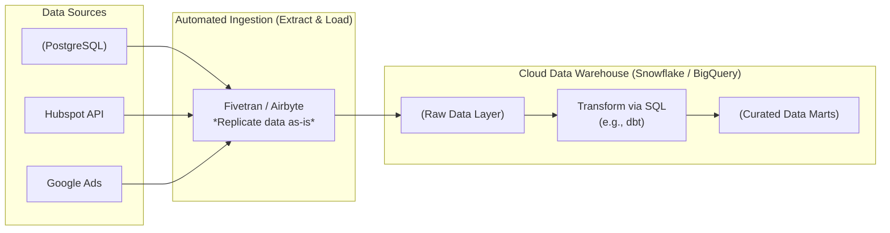

Trong thế giới kỹ thuật dữ liệu, chắc hẳn bạn đã quen thuộc với thuật ngữ ETL (Extract - Transform - Load) vốn đã thống trị suốt nhiều thập kỷ. Thế nhưng, trong khoảng 5-7 năm trở lại đây, một trật tự mới đã được thiết lập. Các cụm từ như "Modern Data Stack" (Ngăn xếp dữ liệu hiện đại) xuất hiện ở khắp mọi nơi, và đi kèm với nó là sự lên ngôi mạnh mẽ của **ELT (Extract - Load - Transform)**. 

Thay vì biến đổi dữ liệu trên đường truyền, ELT đảo ngược quy trình: trích xuất dữ liệu, nạp thẳng vào kho lưu trữ, rồi mới tiến hành biến đổi. Tại sao sự thay đổi thứ tự tưởng chừng đơn giản này lại tạo ra một cuộc cách mạng lớn đến vậy? Hãy cùng đi sâu vào tìm hiểu.

## Sự trỗi dậy của cuộc cách mạng "Nạp trước, xử lý sau"

Để hiểu được ELT, hãy nhìn vào 3 bước cấu thành nên nó:

1. **Extract (Trích xuất)**: Thu thập dữ liệu thô từ các nguồn khác nhau như cơ sở dữ liệu ứng dụng (PostgreSQL, MongoDB), dữ liệu từ các bên thứ ba qua API (Google Ads, Hubspot), hoặc các file log hệ thống.
2. **Load (Nạp)**: Đây là điểm khác biệt mấu chốt. Dữ liệu thô sau khi trích xuất sẽ được nạp thẳng 100% vào kho lưu trữ đích (Cloud Data Warehouse như Snowflake, BigQuery, Redshift hoặc Data Lake) mà không hề qua bất kỳ bộ lọc hay bước biến đổi logic nghiệp vụ nào. Dữ liệu ở đây thường được lưu dưới dạng nguyên bản như JSON hoặc các bảng thô.
3. **Transform (Biến đổi)**: Khi dữ liệu thô đã nằm yên vị trong kho lưu trữ, chúng ta mới sử dụng sức mạnh tính toán của chính kho lưu trữ đó để chạy các câu lệnh SQL nhằm làm sạch, kết hợp (join) và tổng hợp dữ liệu thành các bảng phân tích (Data Marts) sẵn sàng phục vụ cho báo cáo.

Triết lý chủ đạo của ELT là: **"Load first, figure it out later"** (Cứ nạp vào đi, xử lý sau).

## Sự dịch chuyển từ ETL truyền thống sang ELT hiện đại

Trong quá khứ, các hệ thống lưu trữ dữ liệu cục bộ (On-premise) có chi phí đĩa cứng vô cùng đắt đỏ, đồng thời năng lực tính toán cũng hạn chế. Do đó, các kỹ sư bắt buộc phải dùng mô hình ETL: lọc sạch dữ liệu thô, loại bỏ các phần rác ngay trên đường truyền trước khi đưa vào kho lưu trữ để tiết kiệm dung lượng đĩa.

Tuy nhiên, sự phát triển của điện toán đám mây (Cloud Computing) đã thay đổi hoàn toàn luật chơi:
* **Không gian lưu trữ siêu rẻ**: Việc lưu trữ hàng Terabyte dữ liệu thô trên Amazon S3 hay Google Cloud Storage giờ đây chỉ tốn của doanh nghiệp vài USD mỗi tháng. Chúng ta không cần phải vứt bỏ bất kỳ dữ liệu thô nào nữa, vì biết đâu trong tương lai sẽ cần đến chúng.
* **Tách rời Tính toán và Lưu trữ (Separation of Compute and Storage)**: Các hệ quản trị dữ liệu đám mây hiện đại như Snowflake hay BigQuery cho phép bạn mở rộng hàng trăm cụm máy chủ xử lý (Compute Node) chỉ trong vài giây để thực hiện các phép toán nặng, sau đó tắt đi ngay lập tức để tiết kiệm chi phí.

Nếu tiếp tục sử dụng ETL truyền thống, máy chủ ETL trung gian (nơi diễn ra bước Transform trước khi Load) sẽ trở thành nút thắt cổ chai kìm hãm toàn bộ hệ thống. Tại sao phải đầu tư một máy chủ ETL cồng kềnh để xử lý dữ liệu, khi chúng ta có thể nạp thẳng tất cả vào BigQuery và để cỗ máy SQL khổng lồ của Google làm việc đó chỉ trong tích tắc?

## Analytics Engineer: Ngôn ngữ SQL lên ngôi

Nhờ đưa bước biến đổi (Transform) vào bên trong Data Warehouse, ngôn ngữ chính được sử dụng để định hình mô hình dữ liệu giờ đây là **SQL** – ngôn ngữ phổ biến nhất trong thế giới dữ liệu. 

Sự thay đổi này đã khai sinh ra một vai trò mới trong các doanh nghiệp: **Analytics Engineer**. Họ là những người nằm ở giao lộ giữa Data Engineer và Data Analyst. Họ không cần phải thành thạo các kỹ thuật lập trình hệ thống phức tạp như Python, Java hay Scala. Chỉ với kỹ năng SQL thượng thừa và sự am hiểu sâu sắc về nghiệp vụ kinh doanh, họ hoàn toàn có thể tự mình xây dựng toàn bộ luồng chuyển đổi dữ liệu thông qua các công cụ hỗ trợ như **dbt (data build tool)**.

## Một chu trình ELT hoạt động như thế nào trong thực tế?

Hãy cùng xem luồng đi của dữ liệu từ nguồn đến đích thông qua kiến trúc ELT:



1. **Giai đoạn Ingestion (Extract & Load)**: Bạn sử dụng các công cụ tự động hóa như Airbyte hoặc Fivetran để kết nối trực tiếp vào cơ sở dữ liệu nguồn. Các công cụ này sẽ tự động sao chép nguyên trạng 1:1 các bảng dữ liệu (ví dụ: `users`, `orders`) vào vùng dữ liệu thô (`raw_data`) trên Cloud Data Warehouse theo định kỳ mà không cần bạn phải viết một dòng code nào.
2. **Giai đoạn Transformation**: Sau khi dữ liệu thô đã được nạp thành công, công cụ quản lý biến đổi (như dbt) sẽ kích hoạt các tập lệnh SQL để tổng hợp dữ liệu và lưu vào lớp phân tích cuối cùng (`analytics`).

## Ví dụ thực tế: Biến đổi dữ liệu thông qua dbt

Dưới đây là ví dụ minh họa cách viết các file SQL trong dbt để thực hiện bước Transform ngay trong Data Warehouse.

Đầu tiên, chúng ta tạo một file `stg_customers.sql` để làm sạch dữ liệu từ bảng thô:
```sql
WITH raw_customers AS (
    SELECT * FROM {{ source('raw_postgres', 'customers') }}
)
SELECT 
    id AS customer_id,
    UPPER(TRIM(first_name)) AS first_name, -- Chuẩn hóa định dạng tên
    email,
    CAST(created_at AS DATE) AS signup_date
FROM raw_customers
WHERE email IS NOT NULL
```

Sau đó, chúng ta tạo file `dim_customers.sql` để định hình bảng chiều phân tích cuối cùng:
```sql
SELECT 
    customer_id,
    first_name,
    signup_date
FROM {{ ref('stg_customers') }}
```
Toàn bộ logic biến đổi này hoàn toàn được viết bằng SQL và được thực thi trực tiếp bằng tài nguyên tính toán của chính Data Warehouse.

## Những quy tắc vàng để vận hành ELT hiệu quả

### Quy tắc vàng (Best Practices)
* **Bảo vệ tính toàn vẹn của dữ liệu thô (Raw Data)**: Tuyệt đối không bao giờ chạy các câu lệnh `UPDATE` hay `DELETE` để thay đổi dữ liệu trực tiếp trong vùng Raw. Vùng Raw phải được coi là "bất biến" (immutable) để làm điểm tựa đối chiếu khi xảy ra lỗi. Mọi thao tác làm sạch dữ liệu chỉ được phép thực hiện bằng cách tạo ra các View hoặc Bảng mới ở các lớp tiếp theo.
* **Tự động hóa tối đa bước E và L**: Đừng cố gắng tự viết code Python để kết nối và cào dữ liệu từ API của các bên thứ ba (như Facebook Ads hay Google Analytics). Các API này thay đổi cấu trúc rất thường xuyên. Hãy để các dịch vụ chuyên biệt (như Airbyte, Fivetran) tự động lo liệu phần việc này, giúp bạn tiết kiệm thời gian bảo trì.
* **Áp dụng tư duy Software Engineering**: Vì bước Transform giờ đây hoàn toàn là các mã lệnh SQL, hãy quản lý chúng trên Git (GitHub/GitLab), thực hiện Code Review nghiêm chỉnh và thiết lập pipeline CI/CD để tự động kiểm thử mỗi khi có thay đổi.

### Sai lầm dễ mắc phải (Common Mistakes)
* **Pha trộn logic Transform vào bước Load**: Tự chèn thêm các script lọc dữ liệu phức tạp trong quá trình nạp dữ liệu thô. Điều này làm mất đi tính minh bạch của ELT. Khi số liệu bị sai lệch, bạn sẽ cực kỳ khó khăn để biết lỗi xảy ra do quá trình kéo dữ liệu từ nguồn (Extract) hay do logic biến đổi (Transform).
* **Viết Spaghetti SQL**: Lợi dụng sự linh hoạt của SQL để viết những câu lệnh gom nhóm, liên kết cồng kềnh dài hàng nghìn dòng với hàng chục lớp subquery lồng nhau. Hãy chia nhỏ logic thành các bước trung gian (Staging) để mã nguồn dễ đọc và dễ bảo trì.

## Được và mất: Cân nhắc bài toán chi phí

### Ưu điểm vượt trội
* **Dân chủ hóa dữ liệu (Data Democratization)**: Sử dụng SQL làm ngôn ngữ cốt lõi giúp các nhà phân tích dữ liệu (Data Analysts) có thể chủ động tham gia xây dựng và chỉnh sửa luồng dữ liệu mà không cần phụ thuộc hoàn toàn vào đội ngũ Data Engineers.
* **Tính linh hoạt cực cao**: Nếu phát hiện logic tính toán báo cáo bị sai, bạn chỉ cần chỉnh sửa lại câu lệnh SQL trong dbt và chạy lại (refill) dữ liệu ngay lập tức. Trong ETL truyền thống, bạn sẽ phải chạy lại toàn bộ quy trình kéo dữ liệu từ nguồn qua mạng rất mất thời gian.
* **Khả năng chịu tải tốt**: Tận dụng tối đa sức mạnh xử lý song song phân tán của các Cloud Data Warehouse hiện đại.

### Điểm yếu cần lưu ý
* **Rủi ro chi phí tính toán tăng vọt**: Vì mọi tác vụ biến đổi đều chạy trên Data Warehouse, hóa đơn sử dụng dịch vụ đám mây (Snowflake/BigQuery) có thể tăng chóng mặt nếu bạn viết SQL không tối ưu (ví dụ: thực hiện các phép join vô tội vạ hoặc chạy Full Refresh quá thường xuyên).
* **Hạn chế đối với dữ liệu thời gian thực (Streaming)**: SQL trên Data Warehouse hoạt động hiệu quả nhất ở dạng Batch (theo lô). Đối với các bài toán yêu cầu xử lý luồng dữ liệu thời gian thực với độ trễ cực thấp dưới 1 giây, các framework như Apache Flink hoặc Apache Spark Streaming vẫn là những lựa chọn tối ưu hơn.

## Khi nào nên (và không nên) áp dụng?

**Nên áp dụng khi:**
* Bạn xây dựng hệ thống phân tích dữ liệu trên môi trường Cloud (Modern Data Stack).
* Đội ngũ của bạn có nhiều Data Analyst am hiểu nghiệp vụ và giỏi SQL nhưng hạn chế về lập trình phần mềm hệ thống.
* Bạn cần sự linh hoạt cao để liên tục thay đổi và cập nhật các logic báo cáo kinh doanh.

**Không nên áp dụng khi:**
* Doanh nghiệp có các quy định bảo mật khắt khe (như ngân hàng, y tế) yêu cầu phải che giấu hoặc mã hóa thông tin cá nhân nhạy cảm (PII) trước khi nạp vào hệ thống lưu trữ tập trung. Trong trường hợp này, bạn buộc phải dùng ETL để lọc bỏ dữ liệu nhạy cảm ngay trên đường truyền.
* Yêu cầu phân tích thời gian thực với độ trễ cực kỳ thấp.

## Khái niệm liên quan

* [ETL](/concepts/etl-elt/etl/)
* [Data Warehouse](/concepts/data-warehouse/data-warehouse/)
* [Data Ingestion](/concepts/etl-elt/data-ingestion/)

## Góc phỏng vấn

### 1. Tại sao kiến trúc ELT lại trở nên phổ biến mạnh mẽ trong khoảng 5-7 năm trở lại đây? Động lực công nghệ nào đằng sau sự thay đổi đó?
* **Gợi ý trả lời**: Sự bùng nổ của ELT được thúc đẩy bởi sự ra đời của các Cloud Data Warehouse hiện đại (như Snowflake, BigQuery) với kiến trúc tách biệt hoàn toàn giữa tính toán và lưu trữ. Chi phí lưu trữ trên mây (S3/Google Cloud Storage) giảm mạnh, cho phép doanh nghiệp thoải mái lưu trữ dữ liệu thô mà không phải lo lắng về chi phí ổ đĩa như thời chạy On-premise. Đồng thời, năng lực xử lý song song khổng lồ của các Cloud Data Warehouse giúp việc xử lý các phép JOIN và tính toán phức tạp trực tiếp bằng SQL diễn ra trong vài giây thay vì vài giờ. Sự ra đời của các công cụ như dbt đã chuẩn hóa quy trình phát triển SQL, giúp việc triển khai ELT trở nên an toàn và dễ quản lý hơn bao giờ hết.

### 2. Theo bạn, nhược điểm lớn nhất về mặt quản trị chi phí khi sử dụng mô hình ELT với Snowflake/BigQuery là gì?
* **Gợi ý trả lời**: Nhược điểm lớn nhất chính là rủi ro phát sinh chi phí tính toán đột biến (bẫy chi phí). Do ELT chuyển toàn bộ gánh nặng xử lý dữ liệu (Transform) lên Data Warehouse, mọi truy vấn SQL kém tối ưu (như thực hiện Cross Join trên bảng lớn, thiếu phân vùng Partition) hoặc việc cấu hình dbt chạy Full Refresh quá thường xuyên sẽ tiêu tốn rất nhiều tài nguyên tính toán. Vì các nền tảng Cloud tính phí theo lượng tài nguyên tiêu thụ thực tế (Pay-as-you-go), hóa đơn dịch vụ hàng tháng có thể tăng vọt ngoài tầm kiểm soát nếu không được giám sát và tối ưu hóa tốt.

## Tài liệu tham khảo

1. [Fundamentals of Data Engineering](https://www.oreilly.com/library/view/fundamentals-of-data/9781098108298/) - Book by Joe Reis and Matt Housley detail-oriented on the evolution of ETL into ELT and the Modern Data Stack.
2. [dbt Labs Blog: What is the Modern Data Stack?](https://www.getdbt.com/blog/what-is-the-modern-data-stack) - Verified engineering resource detailing the role of ELT and SQL-based transformations.
3. [Fivetran: ETL vs. ELT - The Complete Guide](https://www.fivetran.com/blog/etl-vs-elt) - Extensive industry blog comparing operational architectures, performance, and scaling between ETL and ELT.
4. [Snowflake: Extract, Load, Transform (ELT) Resource Guide](https://www.snowflake.com/guides/elt) - Official guide on loading raw data and leveraging Snowflake's virtual warehouses for in-database transformation.
5. [AWS: What's the Difference Between ETL and ELT?](https://aws.amazon.com/compare/the-difference-between-etl-and-elt/) - AWS comparison guide detailing performance, security, and storage trade-offs in cloud environments.


## Tóm tắt bằng tiếng Anh (English Summary)

ELT (Extract, Load, Transform) reverses the traditional data integration process by loading raw data directly into the destination storage (such as a Cloud Data Warehouse or Data Lake) before applying any transformations. Capitalizing on the cheap storage and massively parallel SQL processing power of modern cloud platforms like Snowflake and BigQuery, ELT allows data teams (often Analytics Engineers using tools like dbt) to perform all business logic transformations using standard SQL. This paradigm shift, forming the core of the Modern Data Stack, dramatically improves agility and democratizes data engineering, though it requires careful management of cloud compute costs.
