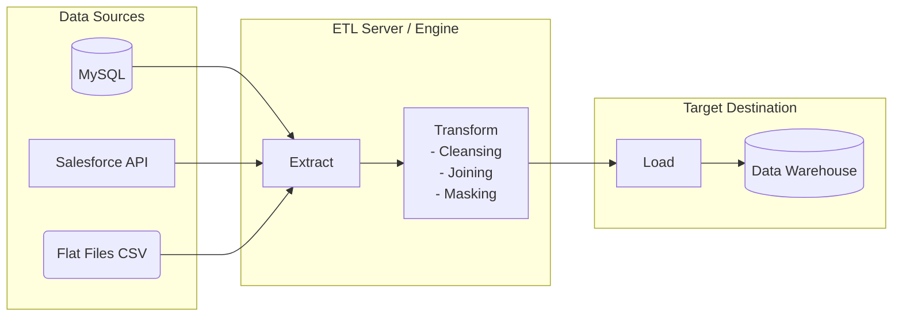

Trong ngành Kỹ thuật dữ liệu (Data Engineering), nếu có một khái niệm được coi là nền móng, xuất hiện trong mọi cuộc thảo luận từ xưa đến nay, thì đó chính là **ETL (Extract - Transform - Load)**. 

Dù bạn đang làm việc với các hệ thống báo cáo tài chính truyền thống hay các ứng dụng phân tích dữ liệu lớn trên đám mây, việc hiểu rõ bản chất của ETL là bước đi đầu tiên bắt buộc. Hãy cùng bóc tách xem quy trình tích hợp dữ liệu kinh điển này hoạt động như thế nào và tại sao nó vẫn giữ một vị trí quan trọng trong kiến trúc dữ liệu hiện đại.

## Quy trình tích hợp dữ liệu truyền thống nhưng chưa bao giờ lỗi thời

Về cơ bản, **ETL** là quy trình tự động hóa giúp kết nối nhiều nguồn dữ liệu khác nhau, xử lý làm sạch chúng trên một máy chủ trung gian, rồi nạp kết quả hoàn chỉnh vào một kho dữ liệu trung tâm (Data Warehouse) để phục vụ phân tích. Quy trình này gồm 3 bước tuần tự:

1. **Extract (Trích xuất)**: Kết nối và "hút" dữ liệu thô ra khỏi các hệ thống vận hành (Database ứng dụng như PostgreSQL, MySQL, hệ thống CRM, ERP, các file log, API bên thứ ba).
2. **Transform (Biến đổi)**: Đây là trái tim của quy trình. Dữ liệu thô sau khi lấy ra sẽ được đưa vào bộ nhớ của một máy chủ ETL chuyên dụng để làm sạch (loại bỏ giá trị trống, chuẩn hóa định dạng ngày tháng), kết hợp (join) các bảng, ẩn danh dữ liệu nhạy cảm và áp dụng các quy tắc nghiệp vụ (business logic) để định hình lại dữ liệu.
3. **Load (Nạp)**: Đẩy toàn bộ dữ liệu đã được làm sạch và định hình hoàn chỉnh vào hệ thống đích (thường là Data Warehouse) để lưu trữ dài hạn và sẵn sàng cho các công cụ BI (Power BI, Tableau) truy vấn.

## Tại sao dữ liệu thô cần phải qua "nhà máy chế biến" ETL?

Hãy tưởng tượng bạn đang vận hành một chuỗi cửa hàng bán lẻ. Dữ liệu bán hàng được ghi nhận từ nhiều nguồn khác nhau: hệ thống POS tại quầy, website bán hàng trực tuyến, ứng dụng di động. 
* Mỗi hệ thống lại lưu trữ định dạng ngày tháng khác nhau (nơi dùng `DD/MM/YYYY`, nơi dùng `YYYY-MM-DD`).
* Dữ liệu thô luôn tồn tại những sai sót nhập liệu (ví dụ: ngày sinh khách hàng ghi là `9999-01-01`).
* Nếu bạn cố tình chạy các câu lệnh SQL phân tích nặng nề trực tiếp trên cơ sở dữ liệu đang vận hành của ứng dụng (OLTP), hệ thống có thể bị quá tải và làm sập ứng dụng mà khách hàng đang mua sắm.

Quy trình ETL sinh ra để đóng vai trò là một "nhà máy chế biến" trung gian: thu gom dữ liệu rải rác, gột rửa các lỗi sai, tạo ra một nguồn sự thật duy nhất (Single Source of Truth) và đưa vào một nơi lưu trữ an toàn dành riêng cho việc phân tích.

## Triết lý "Làm việc nặng trước khi cất trữ"

Ý tưởng cốt lõi của ETL truyền thống là **"Heavy lifting before loading"** (Giải quyết mọi việc nặng nhọc trước khi nạp dữ liệu vào kho).

Sở dĩ có triết lý này là vì trong quá khứ, các hệ thống Data Warehouse đời đầu (như Oracle hay Teradata chạy cục bộ On-premise) có chi phí lưu trữ và tính toán vô cùng đắt đỏ. Các kỹ sư không muốn lãng phí bất kỳ chu kỳ xử lý nào của Data Warehouse để làm những việc cơ bản như định dạng chuỗi hay lọc dữ liệu lỗi. 

Vì vậy, họ xây dựng một máy chủ ETL riêng biệt (chạy các công cụ như Talend, Informatica hoặc chạy script Python/Spark) để gánh hết các công việc "tay chân" này. Khi dữ liệu chạm đến cửa Data Warehouse, nó đã ở trạng thái hoàn hảo nhất và chỉ việc lưu thẳng xuống đĩa cứng.

## Giải phẫu một chu trình ETL điển hình

Dưới đây là sơ đồ luồng đi của dữ liệu thông qua kiến trúc ETL:



Hãy hình dung một Job ETL chạy vào lúc 2 giờ sáng mỗi ngày:
1. **Extract**: Hệ thống kết nối vào MySQL để lấy ra danh sách các đơn hàng mới phát sinh trong ngày hôm qua. Dữ liệu thô này được tải lên RAM của máy chủ ETL.
2. **Transform**: Trên máy chủ ETL, đoạn script sẽ tự động kiểm tra: loại bỏ các dòng bị khuyết mã khách hàng, quy đổi trạng thái đơn hàng từ ký hiệu viết tắt sang văn bản rõ nghĩa, đồng thời nhân tổng tiền đơn hàng với tỷ giá ngoại tệ để quy đổi toàn bộ doanh thu sang đơn vị USD.
3. **Load**: Mở kết nối đến Data Warehouse và tiến hành ghi (Bulk Insert) toàn bộ lượng dữ liệu sạch này vào bảng sự kiện `fact_sales`.

## Ví dụ thực tế: Dựng pipeline ETL bằng Python Pandas

Bạn hoàn toàn có thể tự tay xây dựng một luồng ETL cơ bản bằng thư viện `pandas` trong Python:

```python
import pandas as pd
import sqlite3

# 1. EXTRACT: Đọc dữ liệu thô từ file CSV nguồn
df_sales = pd.read_csv("raw_sales.csv")

# 2. TRANSFORM: Xử lý dữ liệu trực tiếp trên bộ nhớ (RAM) của máy chủ
# - Loại bỏ các dòng dữ liệu bị khuyết thông tin khách hàng quan trọng
df_sales = df_sales.dropna(subset=['customer_id'])
# - Chuẩn hóa lại định dạng ngày tháng thống nhất
df_sales['date'] = pd.to_datetime(df_sales['date'], format='%d-%m-%Y')
# - Tự động tính toán thêm cột thuế VAT 10%
df_sales['tax_amount'] = df_sales['amount'] * 0.1

# 3. LOAD: Nạp dữ liệu sạch vào Database phân tích đích
conn = sqlite3.connect('data_warehouse.db')
df_sales.to_sql('fact_sales', conn, if_exists='append', index=False)
conn.close()
```

## Những nguyên tắc thiết kế sống còn để hệ thống không bị sập

### Nguyên tắc thiết kế (Best Practices)
* **Tính lũy đẳng (Idempotency)**: Hãy thiết kế các Job ETL sao cho nếu nó gặp sự cố giữa chừng và bạn phải nhấn nút chạy lại 10 lần, kết quả cuối cùng ghi nhận trong Data Warehouse vẫn chính xác và giống hệt như chỉ chạy thành công 1 lần duy nhất. Tránh tuyệt đối việc chèn trùng lặp dữ liệu (duplication) khi chạy lại.
* **Sử dụng vùng đệm Staging**: Đừng cố gắng thực hiện biến đổi dữ liệu trực tiếp trên đường truyền (on-the-fly). Hãy trích xuất dữ liệu thô và lưu tạm thời vào một vùng đệm (Staging area - ví dụ như một thư mục lưu trữ file). Nếu bước Transform phía sau bị lỗi, bạn chỉ cần chạy lại từ Staging mà không cần kết nối lại để làm phiền database nguồn.
* **Cảnh báo lỗi tự động**: Các Job ETL thường chạy ngầm vào ban đêm. Bạn phải thiết lập hệ thống ghi log chi tiết (số dòng kéo về, số dòng lỗi bị loại bỏ) và tự động bắn cảnh báo (qua Slack, Teams hoặc Email) nếu Job bị thất bại ở bất kỳ bước nào.

### Sai lầm dễ mắc phải (Common Mistakes)
* **Quá tải hệ thống nguồn (Full Load vô tội vạ)**: Viết câu lệnh trích xuất dữ liệu mà thiếu điều kiện lọc thời gian (`WHERE updated_at`), dẫn đến việc mỗi ngày chạy Job hệ thống đều kéo hàng triệu bản ghi từ thuở khai sinh của database nguồn. Hãy áp dụng cơ chế nạp tăng trưởng (Incremental Load) – chỉ kéo phần dữ liệu mới thay đổi.
* **Nghẽn bộ nhớ khi Transform bảng lớn**: Thực hiện phép `JOIN` hai bảng dữ liệu lớn trực tiếp trên RAM của máy chủ ETL. Khi lượng dữ liệu tăng lên, máy chủ sẽ lập tức bị sập vì lỗi tràn bộ nhớ (Out of Memory - OOM). Khi dữ liệu lớn lên, bạn cần chuyển sang các giải pháp xử lý phân tán (như Apache Spark) hoặc chuyển đổi sang mô hình ELT.

## Ưu và nhược điểm: Cân nhắc bài toán thực tế

### Điểm mạnh
* Giải phóng gánh nặng tính toán dọn dẹp dữ liệu cho Data Warehouse phân tích.
* **Tính bảo mật cao**: Cho phép lọc bỏ, mã hóa (masking) các thông tin nhạy cảm của người dùng (PII như số thẻ, số định danh cá nhân) ngay trên máy chủ ETL trung gian trước khi nạp vào kho lưu trữ chung, đảm bảo tính tuân thủ bảo mật dữ liệu.
* Xử lý tốt các định dạng dữ liệu thô phức tạp (như JSON, XML lồng nhau nhiều lớp) nhờ sức mạnh của các ngôn ngữ lập trình đa năng (Python, Java) trên máy chủ ETL.

### Điểm yếu
* **Nút thắt cổ chai hiệu năng**: Máy chủ ETL đứng ở giữa phải gánh toàn bộ tải trọng tính toán. Khi dữ liệu của doanh nghiệp tăng theo cấp số nhân, việc nâng cấp cấu hình máy chủ ETL trở nên cực kỳ tốn kém.
* **Độ trễ trong cập nhật**: Dữ liệu thường được xử lý theo mẻ (Batch) định kỳ (ví dụ mỗi ngày một lần), do đó không phù hợp cho các bài toán phân tích thời gian thực cần số liệu ngay lập tức.

## Khi nào nên áp dụng?

* Tích hợp dữ liệu từ các hệ thống cũ (Legacy) hoặc các API bên ngoài có cấu trúc dữ liệu không ổn định, cần dọn dẹp và tiền xử lý rất nặng.
* Khi doanh nghiệp vận hành hệ thống Data Warehouse cục bộ (On-premise) có năng lực tính toán giới hạn và cần bảo vệ tài nguyên này.
* Yêu cầu bảo mật dữ liệu khắt khe, bắt buộc phải che giấu thông tin nhạy cảm trước khi lưu xuống đĩa.

Nếu bạn đang xây dựng một hệ thống dữ liệu hiện đại hoàn toàn trên đám mây (Cloud Data Warehouse như Snowflake, BigQuery) với khả năng mở rộng không giới hạn và chi phí lưu trữ rẻ, hãy ưu tiên lựa chọn mô hình **ELT** (Extract - Load - Transform) để tối đa hóa hiệu năng và sự linh hoạt.

## Khái niệm liên quan

* [ELT](/concepts/etl-elt/elt/)
* [Data Warehouse](/concepts/data-warehouse/data-warehouse/)
* [Data Extraction](/concepts/etl-elt/data-extraction/)

## Góc phỏng vấn

### 1. Phân biệt sự khác biệt cơ bản về kiến trúc giữa ETL và ELT.
* **Gợi ý trả lời**: Sự khác biệt cốt lõi nằm ở vị trí thực hiện bước Biến đổi dữ liệu (Transform - chữ T). Trong mô hình ETL truyền thống, bước Transform được thực hiện trên một máy chủ trung gian riêng biệt (ETL engine) trước khi dữ liệu được Load (nạp) vào Data Warehouse. Trong mô hình ELT hiện đại, dữ liệu thô được Load trực tiếp vào Data Warehouse trước, sau đó hệ thống sẽ tận dụng chính sức mạnh tính toán phân tán khổng lồ của Data Warehouse (như chạy các câu lệnh SQL trên Snowflake hoặc BigQuery) để thực hiện bước Transform. ELT hiện nay được ưa chuộng hơn trong các kiến trúc đám mây vì lưu trữ rẻ và khả năng mở rộng của SQL engine tốt hơn máy chủ ETL độc lập.

### 2. Làm thế nào để đảm bảo tính Idempotent (Lũy đẳng) khi thiết kế một pipeline ETL load dữ liệu hàng ngày?
* **Gợi ý trả lời**: Để đảm bảo tính lũy đẳng (chạy lại nhiều lần vẫn cho ra một kết quả chính xác duy nhất), chúng ta cần tránh việc dùng lệnh `INSERT` đơn thuần vì sẽ gây trùng lặp dữ liệu. Có hai phương pháp phổ biến:
  1. **Delete-then-Insert**: Trước khi nạp dữ liệu mới của ngày hôm đó, job ETL sẽ thực hiện lệnh xóa dữ liệu cũ của ngày tương ứng: `DELETE FROM target_table WHERE date = 'ngày_chạy_job'`, sau đó mới thực hiện chèn dữ liệu mới vào.
  2. **Upsert/Merge**: Sử dụng cú pháp `MERGE INTO` dựa trên một Khóa chính (Primary Key). Nếu bản ghi đã tồn tại trong bảng đích, hệ thống sẽ thực hiện cập nhật (Update) thông tin mới; nếu chưa tồn tại, hệ thống mới tiến hành chèn (Insert) bản ghi mới. Cách này giúp chạy lại job nhiều lần một cách an toàn.

## Tài liệu tham khảo

1. **Fundamentals of Data Engineering** - Joe Reis, Matt Housley.
2. **The Data Warehouse Toolkit** - Ralph Kimball.

## Tóm tắt bằng tiếng Anh (English Summary)

ETL (Extract, Transform, Load) is a traditional data integration process used to pull data out of diverse source systems, clean and reshape it on a dedicated processing server, and finally load it into a centralized Data Warehouse for analysis. The core idea is "heavy lifting before loading," ensuring that only curated, high-quality data reaches the destination, thereby saving expensive storage and compute resources on legacy data warehouses. While crucial for data masking and handling complex unstructured sources, traditional ETL often faces scaling bottlenecks, leading to the rise of ELT in modern cloud architectures.
