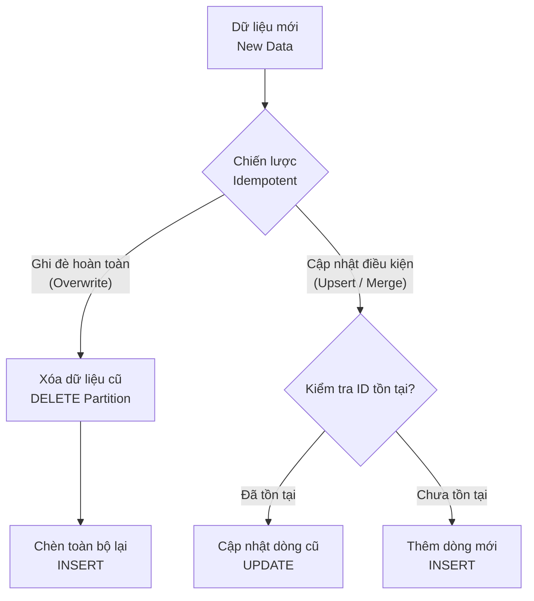

Trong cuộc sống hàng ngày, nếu bạn bấm nút thang máy nhiều lần, thang máy vẫn chỉ đón bạn một lần duy nhất. Nếu bạn nhấn nút gửi một tin nhắn ngân hàng nhiều lần, tài khoản của bạn lý tưởng nhất cũng chỉ được trừ tiền một lần. Trong khoa học máy tính và kỹ thuật dữ liệu, thuộc tính kỳ diệu giúp ngăn chặn các tác vụ bị thực thi thừa thãi này được gọi là **Tính lũy đẳng** (Idempotency). Đây là một trong những tiêu chuẩn vàng để xây dựng nên những đường ống dữ liệu (Data Pipeline) kiên cố, có khả năng tự phục hồi lỗi cực kỳ mạnh mẽ.

## Khi việc chạy lại không gây ra tai họa

Về mặt định nghĩa toán học, **Idempotency** chỉ một hành động hoặc một hàm số mà nếu bạn áp dụng nó nhiều lần liên tiếp, kết quả thu được vẫn hoàn toàn trùng khớp với lần thực thi thành công đầu tiên.

Biểu diễn bằng công thức toán học:

$$f(f(x)) = f(x)$$

Trong bối cảnh hệ thống phân tán và thiết kế đường ống dữ liệu ETL/ELT, một pipeline có tính lũy đẳng cho phép các kỹ sư dữ liệu thoải mái chạy lại (rerun hoặc backfill) các tác vụ bị lỗi hoặc bị trễ mà không cần phải lo lắng về việc dữ liệu bị hỏng, bị ghi đè sai lệch hay sinh ra các bản ghi trùng lặp (duplicates).

## Tại sao chúng ta cần tính lũy đẳng trong hệ thống dữ liệu?

Trong thế giới thực tế của Data Engineering, các đường ống dữ liệu thường xuyên phải đối mặt với vô vàn sự cố ngoài ý muốn:
* Hệ thống nguồn (Source Database) bất ngờ bị sập hoặc mất kết nối.
* Mạng chập chờn gây mất gói tin giữa chừng.
* Máy chủ tính toán (Compute Cluster/Spark) bị cạn kiệt tài nguyên dẫn đến tắt đột ngột khi đang ghi dữ liệu.

Khi các sự cố này xảy ra, hành động khắc phục phổ biến nhất của các kỹ sư là: *"Hãy thử chạy lại job này xem sao"*.

Biết trước lỗi sẽ xảy ra, nhưng nếu đường ống dữ liệu của bạn không được thiết kế có tính lũy đẳng, thảm họa sẽ bắt đầu:
* Ở lần chạy thứ nhất, job ghi được 50% dữ liệu rồi sập.
* Ở lần chạy thứ hai, job tiếp tục ghi đè hoặc ghi nối tiếp từ đầu, dẫn đến việc 50% dữ liệu đầu tiên bị lặp lại hai lần.
* Kết quả là số liệu trên các Dashboard báo cáo bị sai lệch (ví dụ doanh thu bị nhân đôi), làm xói mòn hoàn toàn lòng tin của người dùng kinh doanh đối với hệ thống dữ liệu.

Tính lũy đẳng ra đời để giải phóng các kỹ sư dữ liệu khỏi công việc dọn dẹp dữ liệu rác thủ công (Manual Cleanup). Nếu một job gặp lỗi, cách giải quyết an toàn nhất và duy nhất bạn cần làm là: **Bấm nút chạy lại**.

## Hai thanh gươm báu để đạt được tính lũy đẳng

Để đảm bảo tính lũy đẳng cho hệ thống, các kỹ sư thường áp dụng hai chiến lược chính dưới đây:



### 1. Cơ chế Ghi đè hoàn toàn (Overwrite / Replace)
Thay vì sử dụng lệnh chèn thêm (`INSERT` append) dữ liệu một cách mù quáng, hệ thống sẽ thực hiện xóa bỏ hoàn toàn (DELETE hoặc DROP) phân vùng (partition) dữ liệu của khoảng thời gian đó, sau đó tiến hành ghi đè dữ liệu mới được tính toán lại lên trên.

### 2. Cơ chế Cập nhật có điều kiện (Upsert / Merge)
Hệ thống sẽ tiến hành kiểm tra sự tồn tại của các khóa chính (Primary Keys). Nếu bản ghi đã tồn tại trong database, hệ thống sẽ thực hiện lệnh cập nhật (`UPDATE`). Nếu chưa tồn tại, hệ thống thực hiện lệnh chèn mới (`INSERT`). Quy trình này thường được gọi dưới thuật ngữ chuyên ngành là UPSERT hoặc MERGE.

## Thực chiến: Viết SQL lũy đẳng thế nào cho đúng?

Giả sử bạn có một đường ống dữ liệu chạy định kỳ hàng ngày vào lúc nửa đêm để tải dữ liệu giao dịch của ngày `2026-06-07` vào kho dữ liệu.

### Cách viết tồi (Không lũy đẳng - Tránh sử dụng):
```sql
-- Lệnh chạy lúc nửa đêm ngày 07/06/2026
INSERT INTO sales_warehouse
SELECT * FROM source_sales WHERE date = '2026-06-07';
```
*Nếu câu lệnh này đang chạy được một nửa thì gặp sự cố mạng và dừng lại, khi bạn bấm chạy lại lần hai, toàn bộ dữ liệu giao dịch của ngày hôm đó sẽ bị chèn thêm một lần nữa, tạo ra dữ liệu trùng lặp.*

### Cách viết lũy đẳng bằng phương pháp Overwrite (Delete-Write):
```sql
-- Bước 1: Chủ động xóa sạch dữ liệu của ngày hôm đó trước
DELETE FROM sales_warehouse WHERE date = '2026-06-07';

-- Bước 2: Nạp lại toàn bộ dữ liệu sạch
INSERT INTO sales_warehouse
SELECT * FROM source_sales WHERE date = '2026-06-07';
```
*Dù bạn có chạy lại câu lệnh này 100 lần, dữ liệu của ngày 07/06/2026 trong kho vẫn luôn sạch sẽ và chính xác.*

### Cách viết lũy đẳng bằng phương pháp MERGE (Upsert):
```sql
MERGE INTO sales_warehouse AS target
USING (SELECT * FROM source_sales WHERE date = '2026-06-07') AS source
ON target.order_id = source.order_id
WHEN MATCHED THEN
  UPDATE SET target.amount = source.amount, target.status = source.status
WHEN NOT MATCHED THEN
  INSERT (order_id, date, amount, status) VALUES (source.order_id, source.date, source.amount, source.status);
```

## Quy tắc "vàng" cho kỹ sư dữ liệu

* **Luôn thiết lập Phân vùng dữ liệu (Partitioning)**: Hãy phân vùng bảng dữ liệu theo thời gian (ví dụ: ngày tạo `created_at` hoặc ngày xử lý `execution_date`). Việc này giúp thao tác xóa và ghi đè (Overwrite) chỉ diễn ra trên một phân vùng nhỏ, tối ưu hiệu năng và tốc độ truy vấn đáng kể.
* **Đảm bảo các giao dịch mang tính Nguyên tử (Atomic Transactions)**: Hãy chắc chắn rằng quá trình xóa dữ liệu cũ và ghi dữ liệu mới diễn ra như một khối thống nhất (hoặc tất cả thành công, hoặc không có gì thay đổi). Các định dạng dữ liệu hiện đại như Delta Lake, Apache Iceberg hay Apache Hudi hỗ trợ tính năng ACID này một cách tự nhiên.
* **Tách biệt logic xử lý khỏi trạng thái hệ thống**: Tuyệt đối tránh sử dụng các hàm thời gian động như `CURRENT_DATE()` trong câu lệnh SQL ETL. Thay vào đó, hãy sử dụng các tham số thời gian cố định được truyền vào từ công cụ lập lịch (ví dụ tham số `ds` trong Apache Airflow) để đảm bảo kết quả luôn đồng nhất khi chạy lại.

## Những sai lầm tai hại thường gặp

* **Lạm dụng lệnh `INSERT` append một cách mù quáng**: Thói quen chèn dữ liệu không kiểm tra khóa trùng lặp là nguyên nhân hàng đầu khiến kho dữ liệu chứa đầy rác khi có nhu cầu chạy lại dữ liệu lịch sử (Backfill).
* **Xóa nhầm phạm vi dữ liệu**: Viết lệnh xóa sử dụng điều kiện động. Giả sử một job của ngày hôm qua bị lỗi, sáng nay bạn mới chạy lại nhưng câu lệnh lại dùng hàm `CURRENT_DATE()`, dẫn đến việc hệ thống xóa nhầm dữ liệu của ngày hôm nay thay vì ngày hôm qua.
* **Bỏ qua tính lũy đẳng khi gọi các API nguồn**: Nếu luồng ETL của bạn gọi các API bên ngoài qua phương thức `POST` để lấy dữ liệu, việc gọi đi gọi lại API đó khi rerun có thể kích hoạt các hành động tạo mới tài nguyên không mong muốn ở hệ thống đối tác.

## Cân đo đong đếm giữa chi phí và độ an toàn (Trade-offs)

### Điểm mạnh
* **Khả năng chịu lỗi xuất sắc**: Sửa lỗi đường ống dữ liệu cực kỳ nhàn hạ, chỉ cần nhấn nút "Rerun".
* **Hỗ trợ Backfill mượt mà**: Cho phép chạy lại dữ liệu lịch sử của nhiều năm trước một cách an toàn bằng cách lập lịch chạy lại các job cũ.
* **Bảo vệ tính toàn vẹn của dữ liệu**: Triệt tiêu hoàn toàn lỗi trùng lặp dữ liệu trên các báo cáo phân tích.

### Điểm yếu
* **Ảnh hưởng đến hiệu năng hệ thống**: Các thao tác `MERGE`, `UPSERT` hay `DELETE` đòi hỏi cơ sở dữ liệu phải thực hiện nhiều phép tính toán và so sánh hơn rất nhiều so với việc chỉ ghi tiếp (`APPEND`) dữ liệu.
* **Độ phức tạp khi lập trình tăng cao**: Đòi hỏi các kỹ sư dữ liệu phải thiết kế bảng chặt chẽ, quản lý tốt Khóa chính (Primary Keys) và các Phân vùng (Partitions).

## Khi nào nên dùng và khi nào không?

**Nên dùng khi:**
* Bắt buộc phải áp dụng trong mọi hệ thống xử lý dữ liệu theo lô (Batch Processing) định kỳ hàng ngày, hàng giờ.
* Khi thiết kế các luồng điều phối công việc bằng các công cụ như Apache Airflow hay Dagster.

**Không nên dùng khi:**
* Trong các hệ thống xử lý dữ liệu dòng chảy thời gian thực (Streaming), việc đảm bảo tính lũy đẳng tuyệt đối (Exactly-Once processing) đòi hỏi chi phí tài nguyên rất lớn và có thể gây tăng độ trễ (latency). Thay vào đó, người ta thường chấp nhận cơ chế At-Least-Once (dữ liệu có thể trùng lặp nhẹ) và tiến hành lọc trùng sau (downstream deduplication).

## Các khái niệm liên quan

* [Lọc trùng dữ liệu (Deduplication)](/concepts/etl-elt/deduplication/)
* [Data Pipeline (Đường ống dữ liệu)](/concepts/foundation/data-pipeline/)
* [Batch Processing (Xử lý dữ liệu theo lô)](/concepts/batch-processing/batch-processing/)

## Góc phỏng vấn: Trả lời tự tin trước nhà tuyển dụng

### 1. Bạn định nghĩa thế nào là Tính lũy đẳng (Idempotency) và tại sao nó lại là thuộc tính sống còn của quy trình ETL?
* **Mục đích câu hỏi**: Đánh giá hiểu biết nền tảng của ứng viên về thiết kế hệ thống dữ liệu có khả năng chịu lỗi tốt.
* **Gợi ý trả lời**: Tính lũy đẳng có nghĩa là cho dù chúng ta thực thi một hành động bao nhiêu lần với cùng một đầu vào, trạng thái và kết quả cuối cùng thu được vẫn hoàn toàn giống hệt như lần chạy thành công đầu tiên. Trong quy trình ETL, lỗi hệ thống là điều chắc chắn sẽ xảy ra (do sập mạng, lỗi tài nguyên, lỗi API). Nếu không có tính lũy đẳng, việc chạy lại các job bị lỗi sẽ gây ra hiện tượng nhân đôi số liệu, làm sai lệch báo cáo và mất thời gian dọn dẹp thủ công. Thiết kế pipeline lũy đẳng giúp chúng ta khôi phục hệ thống tự động và an toàn chỉ bằng việc chạy lại.

### 2. Làm thế nào để đảm bảo tính lũy đẳng khi tiến hành ghi lượng lớn dữ liệu từ Apache Spark vào một Data Lake lưu trữ trên Amazon S3?
* **Mục đích câu hỏi**: Đánh giá kiến thức thực chiến của ứng viên về tối ưu hóa lưu trữ và xử lý dữ liệu lớn.
* **Gợi ý trả lời**: Khi ghi dữ liệu từ Spark vào S3, tôi sẽ áp dụng các kỹ thuật sau:
  * Sử dụng cơ chế ghi đè phân vùng (Partition Overwrite) thay vì ghi đè toàn bộ bảng: `spark.write.mode("overwrite").partitionBy("date").save(path)`.
  * Thay vì ghi trực tiếp các file thô (Parquet/CSV) dễ bị lỗi ghi dở dang, tôi sẽ sử dụng các định dạng bảng hiện đại hỗ trợ thuộc tính ACID như Delta Lake hoặc Apache Iceberg. Các định dạng này quản lý dữ liệu bằng transaction log, cho phép thực thi lệnh `MERGE` và thay thế phân vùng một cách nguyên tử (Atomic), đảm bảo nếu ghi lỗi thì toàn bộ tiến trình sẽ rollback và không ảnh hưởng đến dữ liệu cũ.

## Tài liệu tham khảo

1. [Making retries safe with idempotent APIs](https://aws.amazon.com/builders-library/making-retries-safe-with-idempotent-APIs/) - AWS Builder's Library article on designing systems with safe retries and idempotency keys.
2. [Designing Robust APIs with Idempotency](https://stripe.com/blog/idempotency) - Stripe Engineering Blog post explaining how they implement and handle idempotency in API requests.
3. [Transactions in Apache Kafka: Exactly-Once Semantics](https://www.confluent.io/blog/idempotence-exactly-once-semantics-apache-kafka/) - Confluent Blog post on idempotence and exactly-once processing in Kafka.
4. [SQL MERGE Statement](https://docs.databricks.com/en/sql/language-manual/sql-ref-syntax-dml-merge.html) - Databricks SQL reference documentation for performing idempotent upserts.
5. [What is Idempotency?](https://docs.getdbt.com/terms/idempotency) - dbt Labs definition and explanation of idempotency in data modeling.

## English Summary

Idempotency is an essential property of data pipelines ensuring that running a specific operation or job multiple times with the same input yields the exact same state without producing duplicate data or unintended side effects. It provides fault tolerance by enabling engineers to safely rerun failed or delayed batch jobs. Implementation typically relies on atomic partition overwrites (Delete-Write) or logical UPSERTs/MERGE operations.
