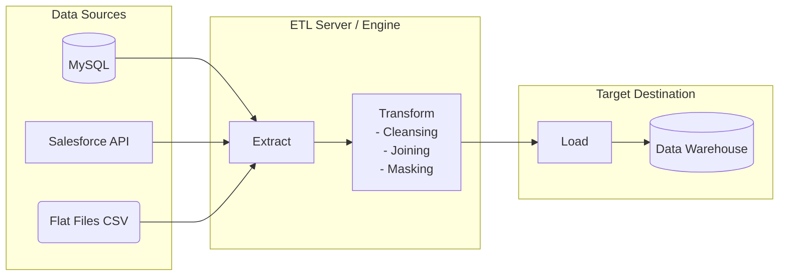

# ETL (Extract, Transform, Load)

## Summary

ETL (Extract, Transform, Load) là một quy trình tích hợp dữ liệu truyền thống và phổ biến nhất trong Kỹ thuật dữ liệu (Data Engineering). Nó mô tả ba bước tuần tự để lấy dữ liệu từ nhiều nguồn khác nhau, thực hiện làm sạch và chuẩn hóa dữ liệu trên một máy chủ trung gian (ETL Server), trước khi nạp dữ liệu đã xử lý hoàn chỉnh vào một kho dữ liệu trung tâm (Data Warehouse) để phục vụ cho mục đích phân tích và báo cáo nghiệp vụ.

---

## Definition

**ETL** là từ viết tắt của 3 giai đoạn:
1. **E - Extract (Trích xuất)**: Quá trình kết nối tới các hệ thống nguồn (Database OLTP, ERP, CRM, APIs, Logs) để lấy dữ liệu thô ra ngoài.
2. **T - Transform (Biến đổi)**: Quá trình xử lý dữ liệu thô. Các thao tác bao gồm làm sạch (loại bỏ null, chuẩn hóa ngày tháng), kết hợp (join), mã hóa dữ liệu nhạy cảm, và áp dụng các quy tắc nghiệp vụ (business logic) để định hình lại dữ liệu cho phù hợp với lược đồ (schema) của hệ thống đích. Bước này diễn ra trên bộ nhớ của một máy chủ/công cụ ETL chuyên dụng.
3. **L - Load (Nạp)**: Đẩy dữ liệu đã được làm sạch và biến đổi hoàn tất vào hệ thống đích (thường là Data Warehouse) để lưu trữ vĩnh viễn và phục vụ người dùng cuối.

---

## Why it exists

Dữ liệu sinh ra trong hệ thống vận hành hàng ngày (ví dụ: một ứng dụng thương mại điện tử) không ở trạng thái sẵn sàng để phân tích:
* Nó nằm rải rác ở nhiều cơ sở dữ liệu khác nhau.
* Dữ liệu chứa nhiều lỗi nhập liệu (ví dụ: ngày sinh `9999-01-01`).
* Việc chạy các câu lệnh SQL phức tạp trên cơ sở dữ liệu đang vận hành có thể làm "sập" ứng dụng của người dùng.

Vì vậy, doanh nghiệp cần một quy trình tự động để "hút" dữ liệu đó ra, làm sạch nó thành một nguồn sự thật duy nhất (Single Source of Truth), và cất nó ở một nơi an toàn dành riêng cho phân tích. ETL ra đời như một chiếc cầu nối không thể thiếu để biến dữ liệu thô (Raw Data) thành Dữ liệu có giá trị (Information).

---

## Core idea

Ý tưởng cốt lõi của ETL truyền thống xoay quanh khái niệm **"Heavy lifting before loading" (Làm việc nặng nhọc trước khi nạp)**.

Bởi vì các hệ thống Data Warehouse cổ điển (như Oracle, Teradata) được thiết kế nguyên khối (on-premise), tài nguyên lưu trữ và tính toán của chúng cực kỳ đắt đỏ. Người ta không muốn lãng phí sức mạnh xử lý của Data Warehouse để làm những việc như lọc chuỗi hay đổi định dạng ngày. Thay vào đó, một công cụ/máy chủ thứ ba (như Informatica, Talend, hoặc một server chạy Python/Spark) sẽ đứng ở giữa, thực hiện toàn bộ công việc "tay chân" này. Khi dữ liệu đến cửa của Data Warehouse, nó đã ở trạng thái hoàn hảo nhất (Gold/Curated data) và chỉ việc lưu xuống đĩa.

---

## How it works

Quy trình ETL điển hình:

1. **Extract**: Job ETL chạy vào lúc 2:00 sáng. Nó kết nối vào hệ thống MySQL nguồn. Dùng truy vấn `SELECT * FROM orders WHERE updated_at > 'hôm qua'` để lấy ra 10,000 đơn hàng mới. Dữ liệu này được kéo về RAM của máy chủ ETL.
2. **Transform**: 
   * Máy chủ ETL chạy code để kiểm tra: Nếu `customer_id` bị trống, đánh dấu là lỗi.
   * Ánh xạ cột `status`: Đổi `'P'` thành `'Pending'`, `'C'` thành `'Completed'`.
   * Tra cứu tỷ giá ngoại tệ từ một file CSV khác và nhân với tổng tiền đơn hàng để quy đổi toàn bộ doanh thu sang USD.
3. **Load**: Mở kết nối đến Data Warehouse (ví dụ Redshift). Thực hiện lệnh `INSERT / COPY` hàng loạt (Bulk Load) 10,000 dòng dữ liệu đã đẹp đẽ kia vào bảng `fact_orders`.

---

## Architecture / Flow



---

## Practical example

Sử dụng thư viện `pandas` trong Python để minh họa một luồng ETL đơn giản:

```python
import pandas as pd
import sqlite3

# 1. EXTRACT: Đọc dữ liệu từ file CSV nguồn
df_sales = pd.read_csv("raw_sales.csv")

# 2. TRANSFORM: Xử lý dữ liệu trên memory
# - Loại bỏ các dòng thiếu ID khách hàng
df_sales = df_sales.dropna(subset=['customer_id'])
# - Chuẩn hóa định dạng ngày
df_sales['date'] = pd.to_datetime(df_sales['date'], format='%d-%m-%Y')
# - Thêm cột tính toán (Thuế 10%)
df_sales['tax_amount'] = df_sales['amount'] * 0.1

# 3. LOAD: Ghi dữ liệu sạch vào Database đích (Data Warehouse)
conn = sqlite3.connect('data_warehouse.db')
df_sales.to_sql('fact_sales', conn, if_exists='append', index=False)
conn.close()
```

---

## Best practices

* **Idempotency (Tính lũy đẳng)**: Viết các Job ETL sao cho nếu nó bị lỗi giữa chừng và chạy lại 10 lần, kết quả cuối cùng trong Data Warehouse vẫn phải giống hệt như chạy 1 lần. Tránh việc dữ liệu bị nhân đôi (duplication) khi chạy lại lỗi.
* **Sử dụng Staging Area**: Đừng Transform dữ liệu ngay trên đường truyền (on-the-fly). Hãy lưu dữ liệu Extract được vào một vùng đệm (Staging folder) dưới dạng tệp tin. Nếu bước Transform bị lỗi, bạn không cần phải quay lại Database nguồn để Extract lại, giúp giảm tải cho hệ thống đang vận hành.
* **Ghi log và Alerting**: Các job ETL thường chạy nền. Phải có hệ thống ghi lại số dòng trích xuất, số dòng biến đổi thành công, số dòng lỗi và tự động gửi tin nhắn (Slack/Email) nếu job thất bại.

---

## Common mistakes

* **Quá tải hệ thống nguồn**: Ghi các câu lệnh Extract không có bộ lọc thời gian (`WHERE updated_at`), dẫn đến việc mỗi ngày đều kéo toàn bộ hàng triệu bảng ghi (Full Load) từ đầu làm sập Database vận hành. Cần áp dụng chiến lược Incremental Load.
* **Transform quá phức tạp trên bộ nhớ**: Đưa hàng chục triệu dòng dữ liệu vào RAM của một máy chủ để JOIN. Khi dữ liệu lớn lên, máy chủ sẽ gặp lỗi OutOfMemory (OOM). Khi đó cần chuyển sang các công cụ tính toán phân tán (như Spark) hoặc chuyển sang mô hình ELT.

---

## Trade-offs

### Ưu điểm
* Bảo vệ tài nguyên quý giá của Data Warehouse đích, không để hệ thống phân tích phải gánh vác các phép toán dọn dẹp dữ liệu.
* An toàn bảo mật: Dữ liệu nhạy cảm (PII như số thẻ tín dụng) có thể được mã hóa (masking) ngay trên máy chủ ETL trước khi nó chạm vào Data Warehouse để lưu trữ lâu dài.
* Hỗ trợ dữ liệu đầu vào phức tạp (XML, JSON lồng nhau) tốt hơn nhờ các ngôn ngữ lập trình mạnh mẽ như Python/Java trước khi đưa vào Database.

### Nhược điểm
* **Nghẽn cổ chai (Bottleneck)**: Máy chủ ETL phải mua phần cứng đủ lớn để gánh chịu toàn bộ khối lượng tính toán. Khi dữ liệu tăng theo cấp số nhân (Big Data), nâng cấp phần cứng máy chủ ETL trở nên cực kỳ đắt đỏ.
* **Chậm trễ trong phát triển**: Kỹ sư dữ liệu (người viết code ETL) và nhà phân tích (người dùng dữ liệu) bị tách rời. Mỗi khi cần thêm một cột dữ liệu mới, nhà phân tích phải đợi kỹ sư sửa code ETL.

---

## When to use

* Tích hợp dữ liệu từ các hệ thống Legacy (hệ thống cũ) hoặc API nơi mà dữ liệu thô không có cấu trúc và cần làm sạch rất nặng trước khi lưu.
* Yêu cầu bảo mật cao: Cần lọc bỏ, xóa mã hóa dữ liệu người dùng (ẩn danh) ngay trong đường truyền trước khi lưu xuống đĩa cứng (compliance).
* Doanh nghiệp sử dụng Data Warehouse truyền thống (On-premise) có dung lượng và khả năng tính toán hạn chế.

## When not to use

* Với kỷ nguyên Cloud Data Warehouse hiện tại (như Snowflake, BigQuery) nơi khả năng lưu trữ cực rẻ và khả năng tính toán (SQL) được mở rộng vô hạn. Lúc này, mô hình **ELT** (Extract, Load, Transform) tỏ ra ưu việt và nhanh chóng hơn nhiều.

---

## Related concepts

* [ELT](/concepts/elt)
* [Data Warehouse](/concepts/data-warehouse)
* [Data Extraction](/concepts/data-extraction)
* [Incremental Load](/concepts/incremental-load)

---

## Interview questions

### 1. Phân biệt sự khác biệt cơ bản về kiến trúc giữa ETL và ELT.
* **Người phỏng vấn muốn kiểm tra**: Hiểu biết về sự dịch chuyển công nghệ trong ngành Kỹ thuật dữ liệu (từ On-prem sang Cloud).
* **Gợi ý trả lời (Strong Answer)**: 
  Sự khác biệt nằm ở vị trí nơi xảy ra chữ T (Transform). Trong ETL truyền thống, Transform diễn ra tại một **máy chủ trung gian** (ETL engine) trước khi nạp. Trong ELT hiện đại, dữ liệu thô được Load (nạp) **trực tiếp** vào Data Warehouse hoặc Data Lake, sau đó tận dụng chính sức mạnh tính toán phân tán (như SQL Engine của Snowflake, BigQuery) của kho dữ liệu đích đó để thực hiện Transform. ELT hiện tại phổ biến hơn vì lưu trữ cloud rẻ và SQL Engine scale tốt hơn máy chủ ETL rời.

### 2. Làm thế nào để đảm bảo tính Idempotent (Lũy đẳng) khi thiết kế một job ETL load dữ liệu hàng ngày (daily)?
* **Người phỏng vấn muốn kiểm tra**: Kỹ năng xử lý lỗi và xây dựng pipeline bền bỉ (robust).
* **Gợi ý trả lời (Strong Answer)**:
  Để một job ETL có tính lũy đẳng (chạy lại n lần vẫn ra 1 kết quả đúng), cần tránh dùng phương pháp `INSERT` ngây thơ. Có hai cách xử lý:
  1. (Theo phương pháp truyền thống): Ở đầu bước Load, thực hiện lệnh `DELETE FROM target_table WHERE date = 'ngày_chạy_job'`, sau đó mới thực hiện `INSERT` lô dữ liệu của ngày hôm đó vào. Nhờ đó nếu chạy lại, nó sẽ tự xóa dữ liệu thừa của lần chạy lỗi trước đó.
  2. (Theo phương pháp hiện đại): Sử dụng cú pháp `UPSERT` (hoặc `MERGE INTO`), dựa vào Khóa chính (Primary Key). Nếu bản ghi đã tồn tại thì Cập nhật (Update), nếu chưa thì Thêm mới (Insert). Việc chạy lại ngàn lần cũng chỉ update lại trạng thái.

---

## References

1. **Fundamentals of Data Engineering** - Joe Reis, Matt Housley (Chương so sánh vòng đời dữ liệu ETL vs ELT).
2. **The Data Warehouse Toolkit** - Ralph Kimball (Phần The ETL Subsystem).

---

## English summary

ETL (Extract, Transform, Load) is a traditional data integration process used to pull data out of diverse source systems, clean and reshape it on a dedicated processing server, and finally load it into a centralized Data Warehouse for analysis. The core idea is "heavy lifting before loading," ensuring that only curated, high-quality data reaches the destination, thereby saving expensive storage and compute resources on legacy data warehouses. While crucial for data masking and handling complex unstructured sources, traditional ETL often faces scaling bottlenecks, leading to the rise of ELT in modern cloud architectures.
