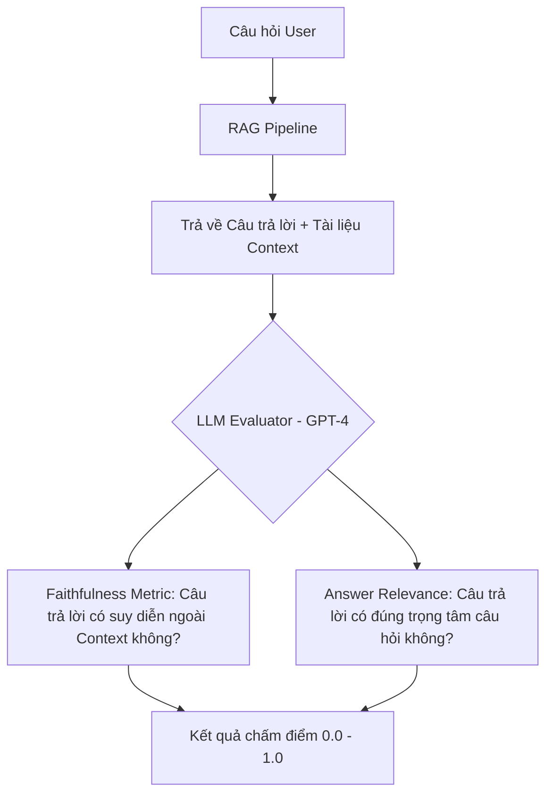

# Chỉ số đánh giá - Evaluation Metric

## Summary

Chỉ số đánh giá (Evaluation Metric) là các thước đo toán học định lượng được sử dụng để đánh giá hiệu suất, độ chính xác và độ tin cậy của một mô hình Machine Learning (ML), hệ thống RAG hoặc Mô hình ngôn ngữ lớn (LLM). Việc chọn đúng chỉ số đánh giá là bước quyết định để biết được mô hình có thực sự giải quyết được bài toán kinh doanh hay không.

---

## Definition

**Evaluation Metric** là các công thức toán học tính toán sự sai lệch (hoặc độ khớp) giữa **kết quả dự đoán (predictions)** của hệ thống AI và **kết quả thực tế (ground truth/labels)**. Khác với hàm mất mát (Loss Function) dùng để tối ưu hóa trong quá trình huấn luyện, Chỉ số đánh giá được tính toán trên tập dữ liệu kiểm thử (Test set) để cung cấp cho con người một góc nhìn trực quan về mức độ hiệu quả của mô hình.

---

## Why it exists

"Bạn không thể cải thiện thứ mà bạn không thể đo lường".
Trong AI, việc chạy thử mô hình và thấy kết quả "có vẻ đúng" là chưa đủ để đưa lên môi trường Production. Cần có một hệ thống chấm điểm khách quan.
Đặc biệt, trong các bài toán dữ liệu mất cân bằng (Imbalanced Data) – ví dụ: dự đoán giao dịch lừa đảo (chỉ chiếm 0.1% tổng giao dịch) – nếu mô hình luôn dự đoán "Không lừa đảo", nó vẫn đạt độ chính xác (Accuracy) 99.9%. Nếu chỉ nhìn vào Accuracy, ta sẽ nghĩ mô hình hoàn hảo, nhưng thực tế nó vô dụng. Do đó, các Metrics khác nhau ra đời để đo lường các khía cạnh khác nhau của hệ thống.

---

## Core idea

Mỗi loại bài toán AI yêu cầu một nhóm Evaluation Metrics đặc thù:
* **Bài toán Phân loại (Classification)**: Đo lường việc mô hình đoán trúng nhãn. (VD: Nhận diện thư rác).
* **Bài toán Hồi quy (Regression)**: Đo lường khoảng cách sai số giữa số dự đoán và số thực tế. (VD: Dự đoán giá nhà).
* **Tìm kiếm và Truy xuất (Information Retrieval / RAG)**: Đo lường hệ thống có mang lên đúng và đủ tài liệu liên quan hay không.
* **Sinh văn bản (Text Generation / LLM)**: Đo lường độ trôi chảy, tính hữu ích và tính không "ảo giác" của câu trả lời.

---

## How it works (Các chỉ số phổ biến)

### 1. Phân loại (Classification)
* **Accuracy (Độ chính xác tổng thể)**: Tỷ lệ đoán đúng trên tổng số dữ liệu. (Chỉ dùng khi dữ liệu cân bằng).
* **Precision (Độ chuẩn xác)**: Trong số những trường hợp mô hình đoán là "Positive", có bao nhiêu % thực sự là Positive. (Quan trọng khi *Sai lầm Positive* gây hậu quả lớn).
* **Recall (Độ bao phủ)**: Trong tổng số những trường hợp thực tế là "Positive", mô hình đã tìm ra được bao nhiêu %. (Quan trọng khi *Bỏ sót Positive* gây hậu quả lớn, ví dụ: chẩn đoán ung thư).
* **F1-Score**: Trung bình điều hòa của Precision và Recall, dùng để cân bằng giữa hai chỉ số này.

### 2. Tìm kiếm / RAG (Retrieval)
* **Precision@K**: Trong K kết quả đầu tiên trả về, có bao nhiêu kết quả thực sự liên quan.
* **Recall@K**: K kết quả đầu tiên trả về đã bao phủ được bao nhiêu % tổng số kết quả liên quan có trong CSDL.
* **MRR (Mean Reciprocal Rank)**: Đo lường thứ hạng của kết quả đúng *đầu tiên* xuất hiện ở vị trí thứ mấy (Hạng 1 được 1 điểm, Hạng 2 được 1/2 điểm...).
* **NDCG (Normalized Discounted Cumulative Gain)**: Tương tự MRR nhưng đánh giá toàn bộ thứ hạng, vị trí càng cao điểm càng lớn.

### 3. Sinh văn bản LLM
* **ROUGE / BLEU**: Đo độ trùng lặp từ vựng (n-grams) giữa câu máy viết và câu người viết. (Phương pháp cũ, ít dùng cho LLM hiện đại).
* **LLM-as-a-Judge**: Dùng một LLM mạnh hơn (như GPT-4) để chấm điểm câu trả lời của LLM yếu hơn dựa trên các tiêu chí: Faithfulness (Tính trung thực), Answer Relevance (Sự liên quan), và Context Precision (Độ chính xác ngữ cảnh) - Tiêu biểu là framework **RAGAS**.

---

## Architecture / Flow (Quy trình đánh giá LLM-as-a-Judge)



---

## Practical example

Tính Precision và Recall trong bài toán tìm thư rác (Spam):

Thực tế có 100 email: 10 email Spam, 90 email Bình thường.
Mô hình dự đoán 12 email là Spam (Trong đó có 8 email Spam thật, và 4 email Bình thường bị nhận diện nhầm).

* **True Positive (Đoán Spam và đúng)**: 8
* **False Positive (Đoán Spam nhưng sai - nhận nhầm)**: 4
* **False Negative (Đoán Bình thường nhưng sai - bỏ sót Spam)**: 2

```python
precision = 8 / (8 + 4) = 0.66 (66%) 
# Khi mô hình báo Spam, chỉ có 66% khả năng nó thực sự là Spam.

recall = 8 / 10 = 0.8 (80%) 
# Mô hình đã tóm được 80% tổng số lượng Spam thực tế.
```

---

## Best practices

* **Không bao giờ dùng Accuracy cho dữ liệu lệch (Imbalanced Data)**: Nếu dữ liệu có 99% lớp A và 1% lớp B, hãy dùng F1-Score, AUC-ROC thay cho Accuracy.
* **Luôn đo lường Retrieval trong RAG trước Generation**: Nếu hệ thống RAG trả lời sai, hãy kiểm tra các chỉ số `Precision@K` và `Hit Rate` của Vector DB trước. Nếu Vector DB tìm không ra tài liệu đúng, LLM không thể nào trả lời đúng. Lỗi thường nằm ở bước Retrieval.
* **Sử dụng RAGAS hoặc TruLens cho GenAI**: Đừng dùng BLEU/ROUGE để đánh giá LLM vì hai câu có từ vựng hoàn toàn khác nhau vẫn có thể mang cùng một ngữ nghĩa hoàn hảo. Hãy dùng `LLM-as-a-Judge`.

---

## Common mistakes

* **Tối ưu hóa mù quáng (Goodhart's Law)**: "Khi một chỉ số trở thành mục tiêu, nó không còn là một chỉ số tốt nữa". Việc ép mô hình phải đạt 100% Recall bằng mọi giá có thể khiến mô hình dự đoán mọi thứ đều là Positive (Precision rớt xuống 0).
* **Đánh giá trên tập Huấn luyện (Data Leakage)**: Tính toán Metric trên chính dữ liệu đã dùng để huấn luyện mô hình. Kết quả sẽ cao ngất ngưởng nhưng mô hình sụp đổ hoàn toàn trên thực tế.

---

## Trade-offs

### Precision vs Recall Trade-off
* Tăng Precision (chỉ dự đoán khi thực sự chắc chắn) sẽ làm giảm Recall (bỏ sót nhiều trường hợp).
* Tăng Recall (bắt lầm hơn bỏ sót) sẽ làm giảm Precision (báo động giả nhiều).
* Tùy nghiệp vụ: Xét duyệt cho vay (Cần Precision cao để không mất tiền). Tầm soát ung thư (Cần Recall cao để không ai bị bỏ sót bệnh).

---

## When to use

* Bắt buộc phải có trong mọi quy trình MLOps, thử nghiệm (A/B Testing), và giám sát (Monitoring) mô hình trong production.
* Khi cần so sánh khách quan để chọn xem nên dùng GPT-3.5 hay Llama-3 cho dự án.

---

## Related concepts

* [Mô hình ngôn ngữ lớn (LLMs)](/concepts/llm)
* [Tìm kiếm ngữ nghĩa (Semantic Search)](/concepts/semantic-search)

---

## Interview questions

### 1. Sự khác biệt giữa Precision và Recall là gì? Trong bài toán lọc Video bạo lực cho trẻ em, bạn sẽ ưu tiên chỉ số nào?
* **Người phỏng vấn muốn kiểm tra**: Khả năng áp dụng toán học thống kê vào Product/Nghiệp vụ thực tế.
* **Gợi ý trả lời (Strong Answer)**: Precision đo lường độ chính xác trong những gì mô hình cảnh báo (tỉ lệ báo động giả thấp). Recall đo lường khả năng tóm gọn toàn bộ rủi ro (tỉ lệ bỏ sót thấp). Trong bài toán lọc video bạo lực cho trẻ em (hậu quả của việc lọt một video bạo lực là cực kỳ nghiêm trọng về mặt đạo đức và pháp lý), em sẽ tối ưu hóa **Recall**. Hệ thống thà bắt nhầm một video hoạt hình bình thường (giảm Precision) còn hơn là bỏ sót một video bạo lực hiển thị lên màn hình của trẻ em. 

### 2. Tại sao không nên dùng ROUGE hoặc BLEU score để đánh giá hệ thống RAG hoặc LLM hiện đại?
* **Người phỏng vấn muốn kiểm tra**: Cập nhật kiến thức về NLP truyền thống vs GenAI.
* **Gợi ý trả lời (Strong Answer)**: ROUGE và BLEU là các metric đếm sự trùng lặp từ vựng (n-gram overlap) giữa câu máy sinh ra và câu đáp án chuẩn (Ground Truth). LLM hiện đại có khả năng sáng tạo ngôn ngữ rất cao, nó có thể viết lại một câu hoàn toàn bằng từ đồng nghĩa và cấu trúc khác nhưng ngữ nghĩa vẫn hoàn hảo 100%. Nếu dùng ROUGE/BLEU, điểm số sẽ rất thấp vì không khớp từ vựng. Để đánh giá LLM, ta phải dùng các metric đo lường "ngữ nghĩa" như LLM-as-a-Judge (sử dụng GPT-4 để chấm điểm) hoặc BERTScore.

---

## References

1. **Pattern Recognition and Machine Learning** - Christopher M. Bishop.
2. **RAGAS: Automated Evaluation of Retrieval Augmented Generation** - Es et al. (2023).

---

## English summary

Evaluation Metrics are quantifiable mathematical measures used to assess the performance, accuracy, and reliability of AI models. In classification, metrics like Precision, Recall, and F1-Score handle imbalanced datasets far better than standard Accuracy. In Search and RAG systems, metrics like Precision@K, MRR, and NDCG evaluate the retrieval ranking quality. For modern Generative AI, traditional lexical overlap metrics (like BLEU or ROUGE) are obsolete due to their inability to capture semantic equivalence; instead, the industry employs "LLM-as-a-Judge" frameworks (like RAGAS) to evaluate faithfulness and contextual relevance. Understanding the trade-off between metrics (e.g., Precision vs. Recall) is critical to aligning models with business objectives.
