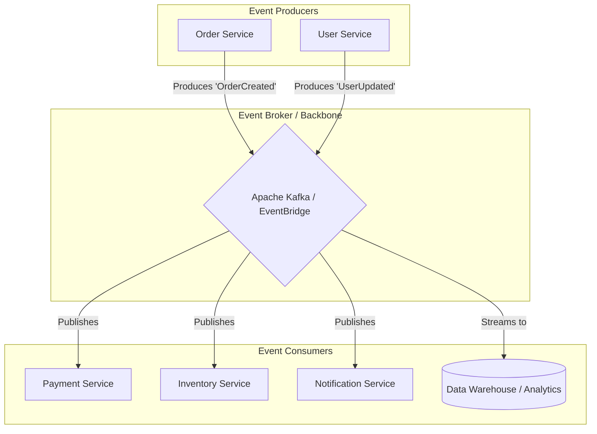

# Event-Driven Architecture (Kiến trúc hướng sự kiện)

## Summary

Kiến trúc hướng sự kiện (Event-Driven Architecture - EDA) là một mô hình thiết kế phần mềm trong đó các dịch vụ và thành phần hệ thống giao tiếp với nhau bằng cách sinh ra (produce) và phản ứng (consume) với các "sự kiện" (events). Thay vì các dịch vụ gọi trực tiếp cho nhau một cách tuần tự (synchronous), chúng trao đổi thông qua một người đưa thư trung gian (Event Broker) một cách bất đồng bộ (asynchronous), mang lại khả năng mở rộng tuyệt vời và tính lỏng lẻo (loose coupling) cho hệ thống Microservices.

---

## Definition

Trong phần mềm, một **sự kiện (Event)** là bản ghi về một sự thay đổi trạng thái có ý nghĩa đã diễn ra trong quá khứ (ví dụ: "Đơn hàng #123 đã được tạo", "Người dùng A vừa thay đổi mật khẩu"). 

**Kiến trúc hướng sự kiện** thiết kế hệ thống quanh việc bắt (capture), giao tiếp (communicate) và xử lý (process) các sự kiện này. Hệ thống A sinh ra một sự kiện và "quảng bá" nó. Hệ thống A không cần biết ai sẽ nhận nó. Hệ thống B, C, D nhận được sự kiện và tự định đoạt hành động tiếp theo của mình.

---

## Why it exists

Trước đây, trong kiến trúc Request-Driven truyền thống (ví dụ qua REST API):
Khi một khách hàng ấn nút "Mua hàng", service (dịch vụ) Đơn hàng sẽ phải gọi API (gọi điện thoại trực tiếp) cho service Thanh toán. Thanh toán xong, service Đơn hàng lại gọi API cho service Tồn kho, rồi gọi tiếp cho service Gửi Email.
Điều này dẫn đến 3 "tử huyệt":
1. **Chờ đợi đồng bộ (Latency/Block)**: Nếu service Gửi Email bị chậm, người dùng sẽ phải nhìn vòng tròn tải trang (loading) suốt 10 giây dù họ đã thanh toán xong.
2. **Sập dây chuyền (Cascading failures)**: Nếu service Tồn kho bị sập chết, việc đặt hàng thất bại hoàn toàn.
3. **Phụ thuộc chặt chẽ (Tight coupling)**: Service Đơn hàng phải biết và quản lý địa chỉ của mọi service khác trong công ty. Thêm một service "Tích điểm" mới vào, ta lại phải sửa code của service Đơn hàng.

EDA ra đời giải quyết mọi rắc rối trên. Service Đơn hàng chỉ cần hét lên: "Có đơn hàng mới!". Xong việc của nó. Còn lại kệ hệ thống Broker lo liệu việc đưa tin cho các services khác tự giải quyết.

---

## Core idea

Ý tưởng cốt lõi của EDA gồm:
* **Asynchronous (Bất đồng bộ)**: Người gửi không bao giờ phải chờ người nhận trả lời để đi tiếp.
* **Choreography thay vì Orchestration (Tự biên đạo thay vì Chỉ huy)**: Thay vì một người nhạc trưởng (Central Orchestrator) chỉ huy mọi người phải làm gì bước 1, 2, 3; trong EDA mỗi service tự nhảy theo nhạc (Choreography) dựa trên tín hiệu sự kiện chúng nghe được.
* **Event Broker**: "Bưu điện" trung tâm (như Kafka, RabbitMQ, EventBridge). Đảm bảo không bao giờ làm rơi mất thư và có thể phát lại thư (replay) nếu người nhận bị hỏng.

---

## How it works

Hệ thống hoạt động qua 3 vai trò:
1. **Producer (Người phát hành)**: Dịch vụ có sự thay đổi trạng thái. Nó đóng gói thông tin này vào một gói tin JSON (Ví dụ: `{"event": "UserSignedUp", "userId": 5}`). Nó gửi gói tin này vào một Kênh/Chủ đề (Topic) trên Event Broker.
2. **Event Broker / Router (Trạm trung chuyển)**: Một phần mềm cơ sở hạ tầng cực kỳ bền bỉ (Ví dụ Kafka). Nhiệm vụ của nó là nhận sự kiện, lưu xuống đĩa cứng (persist) và phân phối (publish) cho bất kỳ ai đang đăng ký theo dõi (subscribe).
3. **Consumer (Người tiêu thụ)**: Các dịch vụ độc lập đăng ký (subscribe) Kênh đó. Khi Broker có sự kiện mới, nó lập tức đẩy cho Consumer. Consumer nhận gói tin và thực hiện logic của riêng mình. Có thể có 0, 1 hoặc 1000 Consumer cùng tiêu thụ 1 gói tin mà không ảnh hưởng gì tới Producer.

---

## Architecture / Flow

---

## Practical example

Hệ thống ứng dụng gọi xe (Ride Hailing).
1. **Producer**: Khi tài xế ấn nút "Hoàn thành chuyến đi", Driver_Service tạo sự kiện `TripCompleted(TripId=99)`.
2. **Broker**: Sự kiện đưa vào Kafka topic `trip_events`.
3. **Consumers**:
   - `Payment_Service` nghe thấy, lập tức tự động trừ tiền trong thẻ tín dụng khách hàng.
   - `Rating_Service` nghe thấy, gửi Push Notification lên điện thoại khách yêu cầu đánh giá sao.
   - `Driver_Reward_Service` nghe thấy, cộng 1 điểm thi đua cho tài xế.
   - `Data_Lake_Ingestion` nghe thấy, ghi lại dòng log này xuống Data Lake để Data Scientist phân tích.

Mọi thứ chạy độc lập, song song, cực kỳ nhanh. Nếu `Rating_Service` đang bị sập bảo trì 1 tiếng, sự kiện vẫn nằm an toàn trên Kafka. Khi nó bật lên lại, nó sẽ lấy sự kiện ra xử lý bù.

---

## Best practices

* **Thiết kế Sự kiện chứa đủ thông tin (Event-carried State Transfer)**: Thay vì sự kiện chỉ có mỗi ID `{"orderId": 123}`, buộc các Consumers phải gọi API ngược lại Order_Service để hỏi thông tin chi tiết (lại gây ra thắt cổ chai), hãy đưa đủ trạng thái vào sự kiện `{"orderId": 123, "status": "paid", "amount": 50, "items": [...]}`.
* **Lược đồ sự kiện (Schema Registry)**: Dữ liệu sự kiện JSON rất dễ bị vỡ cấu trúc nếu Producer đổi tên cột (ví dụ từ `userId` sang `user_id`). Hãy dùng các công cụ Schema Registry (AvRO, Protobuf) để thiết lập "hợp đồng" cấu trúc dữ liệu, báo lỗi ngay khi có code sai lệch schema.
* **Xử lý Idempotency (Chống trùng lặp)**: Trong mạng máy tính, rủi ro gửi đúp sự kiện (At-least-once delivery) rất hay xảy ra. Code ở Consumer buộc phải tự kiểm tra xem "Sự kiện ID 123 này tao đã xử lý chưa?" trước khi trừ tiền để tránh trừ 2 lần.

---

## Common mistakes

* **Biến Kafka thành Database**: Kafka là hệ thống lưu chuyển sự kiện, không phải là Data Warehouse. Việc lưu dữ liệu vĩnh viễn trên Event Broker làm tốn kém cực kỳ chi phí ổ đĩa đắt đỏ.
* **God Events (Sự kiện "Chúa tể")**: Đóng gói mọi thứ (bao gồm cả lịch sử giao dịch 10 năm) vào trong một cục Event 10MB và gửi đi. Sự kiện nên tinh gọn và chỉ mang thông tin của sự thay đổi hiện tại.
* **Bỏ qua Distributed Tracing (Dấu vết phân tán)**: Trong một hệ thống hàng trăm services bắn sự kiện qua lại, khi có một lỗi xảy ra (ví dụ đơn hàng bị hủy mà không biết ai hủy), việc debug là cực hình nếu không gắn `correlation_id` vào mọi sự kiện để theo dõi đường đi của nó qua các logs.

---

## Trade-offs

### Ưu điểm
* **Loose Coupling tuyệt đối**: Các team (Sales, Marketing, Payments) có thể viết code bằng bất cứ ngôn ngữ nào (Java, Go, Python), deploy bất cứ khi nào, không cần phải xin phép nhau miễn là tuân thủ định dạng sự kiện (Schema).
* **Khả năng chịu lỗi (Resilience)**: Nếu một dịch vụ phụ trợ sập, luồng chính của khách hàng không bị ảnh hưởng (khách vẫn thao tác web mượt mà), dữ liệu đợi trên Broker để xử lý sau.
* **Hiệu năng Scale tốt nhất**: Phù hợp cho lưu lượng truy cập thay đổi đột ngột cực lớn (Flash sales, Black Friday) vì Broker đóng vai trò "Giảm xóc" (Buffer) giữ hộ các truy vấn.

### Nhược điểm
* **Độ phức tạp não bộ (Mental Complexity)**: Rất khó để một lập trình viên mới vào công ty vẽ được bản đồ toàn cảnh hệ thống đang hoạt động ra sao vì logic nằm rải rác.
* **Sự nhất quán cuối cùng (Eventual Consistency)**: Hệ thống không còn nhất quán tức thì (ACID). Nếu người dùng vừa đổi mật khẩu (sinh event) rồi lập tức đăng nhập lại ở một thiết bị khác, họ có thể vẫn vào được bằng mật khẩu cũ trong vòng 2 giây nếu sự kiện chưa tới kịp hệ thống Xác thực. Rất đau đầu khi giải quyết bài toán giao dịch tài chính.

---

## When to use

* Kiến trúc Microservices có quy mô lớn, nhiều team phát triển độc lập (như Uber, Netflix, Tiki, Shopee).
* Hệ thống yêu cầu khả năng tích hợp linh hoạt (plug-and-play), dễ dàng thêm/bớt tính năng mà không phải đập đi xây lại core system.
* Các luồng nghiệp vụ không yêu cầu người dùng phải chờ kết quả ngay lập tức (ví dụ: Tạo tài khoản, Upload video, Xử lý ảnh...).

## When not to use

* Các ứng dụng nội bộ nhỏ, Monolith (nguyên khối) đơn giản (Ví dụ: Web quản lý nhân sự công ty).
* Quy trình nghiệp vụ bắt buộc phải tuân theo ACID Transaction nghiêm ngặt (Ví dụ: Chuyển khoản liên ngân hàng 2 phase commit - Rút bên A phải có bên B nhận ngay lập tức nếu không phải Rollback). Dùng Request-Driven hoặc Database Transaction ở đây an toàn hơn.

---

## Related concepts

* [Real-time Architecture](/concepts/real-time-architecture)
* [Lambda Architecture](/concepts/lambda-architecture)
* [Data Mesh](/concepts/data-mesh)

---

## Interview questions

### 1. Phân biệt Choreography và Orchestration trong giao tiếp Microservices. Event-Driven Architecture phù hợp với mô hình nào?
* **Người phỏng vấn muốn kiểm tra**: Kiến thức thiết kế hệ thống cấp độ Architect.
* **Gợi ý trả lời (Strong Answer)**: Orchestration (Chỉ huy) là khi có một Service trung tâm (Orchestrator) ra lệnh tuần tự: "Service A làm việc 1 đi, xong rồi báo tôi; tôi gọi tiếp Service B làm việc 2". Nó tốt cho quy trình cần kiểm soát chặt rẽ nhưng tạo ra Single Point of Failure (nút thắt cổ chai) ở trung tâm. Choreography (Biên đạo múa) là các service không ai chỉ huy ai cả, mỗi người làm tốt việc của mình, khi xong thì "bắn" ra sự kiện. EDA là biểu hiện hoàn hảo nhất của Choreography. Sự kiểm soát phân tán làm hệ thống linh hoạt hơn rất nhiều.

### 2. Sự kiện "Event Notification" và "Event-carried State Transfer" khác nhau thế nào?
* **Người phỏng vấn muốn kiểm tra**: Kỹ năng tối ưu Payload của thông điệp (Message).
* **Gợi ý trả lời (Strong Answer)**: Event Notification là các sự kiện rất nhỏ, chỉ chứa tín hiệu thông báo (ví dụ `{"event": "UserAddressChanged", "id": 12}`). Khi Consumer nhận được, nó PHẢI gọi API về User Service để lấy địa chỉ mới. Điều này làm mất đi tính lỏng lẻo (loose coupling) vì Consumer lại gọi đồng bộ vào Producer. Trái lại, Event-carried State Transfer gắn kèm tất cả thông tin thay đổi vào sự kiện (`{"id": 12, "old_address": "X", "new_address": "Y"}`). Nó làm gói tin to hơn chút, nhưng giải phóng hoàn toàn sự phụ thuộc (Zero API calls back to Producer), đây là phương pháp tối ưu nhất cho thiết kế EDA thực thụ.

---

## References

1. **Designing Event-Driven Systems** - Ben Stopford (Confluent).
2. **Building Microservices** - Sam Newman (Chương về Asynchronous Collaboration).

---

## English summary

Event-Driven Architecture (EDA) is an asynchronous software design pattern where decoupled services communicate by producing and consuming events—records of state changes—via an event broker (like Kafka). By replacing synchronous API calls with event choreography, EDA prevents cascading failures, eliminates rigid service dependencies, and acts as a shock-absorber during traffic spikes. While it provides unmatched scalability and organizational flexibility (enabling teams to develop and deploy independently), it introduces challenges such as eventual consistency, the necessity for robust idempotency handling, and the complexity of debugging distributed workflows without centralized control.
