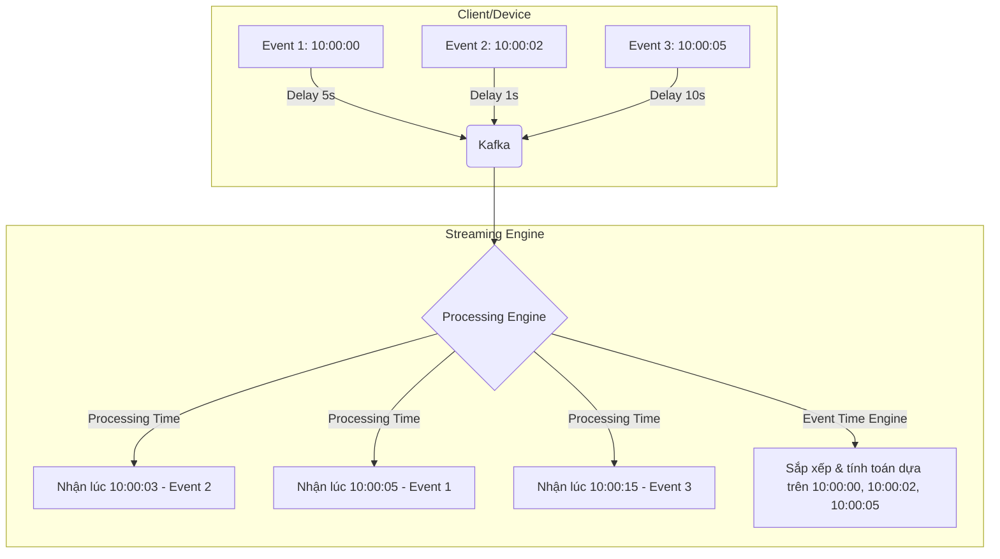

# Thời gian sự kiện và Thời gian xử lý - Event Time vs Processing Time

## Summary

Trong xử lý dữ liệu luồng (Streaming Processing), việc định nghĩa "thời gian" là vô cùng quan trọng. **Event Time** (Thời gian sự kiện) là thời điểm thực tế mà một sự kiện xảy ra tại thiết bị nguồn, trong khi **Processing Time** (Thời gian xử lý) là thời điểm mà sự kiện đó được máy chủ streaming xử lý. Sự chênh lệch giữa hai mốc thời gian này tạo ra những thách thức lớn trong việc đảm bảo tính chính xác của dữ liệu, đặc biệt là trong các bài toán phân nhóm dữ liệu theo thời gian (windowing) hoặc dữ liệu đến muộn (late data).

---

## Definition

* **Event Time**: Là mốc thời gian (timestamp) được thiết bị hoặc hệ thống sinh ra sự kiện đính kèm vào dữ liệu tại thời điểm sự kiện thực sự diễn ra. Ví dụ: thời điểm người dùng bấm nút "Mua hàng" trên điện thoại lúc 10:00:00.
* **Processing Time**: Là mốc thời gian của đồng hồ hệ thống trên máy chủ đang chạy engine xử lý luồng (như Apache Flink, Spark Streaming) tại thời điểm nó thực sự nhận và xử lý sự kiện đó. Ví dụ: do nghẽn mạng, sự kiện "Mua hàng" ở trên đến server và được xử lý lúc 10:00:15.

---

## Why it exists

Sự phân biệt này tồn tại vì **độ trễ mạng (network latency)** và **sự cố gián đoạn kết nối (disconnects)**. Trong thế giới thực, dữ liệu không bao giờ đến hệ thống xử lý ngay lập tức và theo đúng thứ tự.
1. **Dữ liệu đến muộn (Late Data)**: Một thiết bị di động mất mạng có thể gửi các sự kiện của ngày hôm qua lên server vào ngày hôm nay khi có mạng trở lại.
2. **Sai lệch thứ tự (Out-of-order Data)**: Do độ trễ định tuyến mạng khác nhau, sự kiện B xảy ra sau sự kiện A nhưng có thể đến server và được xử lý trước sự kiện A.

Nếu hệ thống tính toán doanh thu theo giờ dựa vào Processing Time, các sự kiện của ngày hôm qua gửi bù sẽ bị tính nhầm vào doanh thu của ngày hôm nay, làm sai lệch hoàn toàn kết quả phân tích.

---

## Core idea

Ý tưởng cốt lõi của việc hỗ trợ Event Time trong các engine streaming là tách rời hoàn toàn kết quả tính toán khỏi thời điểm dữ liệu được xử lý. 
* Khi xử lý theo **Processing Time**: Hệ thống chạy nhanh, độ trễ thấp, không cần chờ đợi, nhưng kết quả không mang tính tất định (non-deterministic) và không chính xác nếu có độ trễ.
* Khi xử lý theo **Event Time**: Hệ thống đảm bảo tính chính xác tuyệt đối và kết quả tất định bất kể sự kiện đến trễ bao lâu, nhưng bù lại phải quản lý trạng thái (state) phức tạp hơn và dùng cơ chế Watermark để biết khi nào nên chốt sổ tính toán.

---

## How it works

1. **Gắn Timestamp**: Mỗi bản ghi (record) ngay từ lúc sinh ra (tại client/sensor) sẽ được gắn một trường thời gian (ví dụ: `event_timestamp`).
2. **Trích xuất (Extraction)**: Engine streaming (như Flink) sẽ có một bộ giải mã để đọc trường `event_timestamp` này và coi đó là mốc thời gian hợp lệ cho bản ghi.
3. **Phân nhóm (Windowing)**: Các dữ liệu sẽ được phân vào các cửa sổ thời gian dựa trên Event Time thay vì đồng hồ server.
4. **Theo dõi tiến trình (Watermarking)**: Hệ thống sử dụng Watermark để ước lượng xem liệu còn dữ liệu nào của quá khứ chưa đến hay không, từ đó quyết định đóng cửa sổ thời gian và xuất kết quả.

---

## Architecture / Flow



---

## Practical example

Xét bài toán tính tổng số lượt click quảng cáo mỗi phút. Dưới đây là cách định nghĩa Event Time trong Apache Flink (Java):

```java
DataStream<ClickEvent> clicks = env.addSource(new KafkaSource());

DataStream<ClickEvent> withEventTime = clicks.assignTimestampsAndWatermarks(
    WatermarkStrategy
        .<ClickEvent>forBoundedOutOfOrderness(Duration.ofSeconds(5))
        .withTimestampAssigner((event, timestamp) -> event.getClickTimestamp()) // Trích xuất Event Time
);

// Tính toán dựa trên Event Time Window
withEventTime
    .keyBy(event -> event.getAdId())
    .window(TumblingEventTimeWindows.of(Time.minutes(1)))
    .process(new CountClicksProcessFunction());
```

Nếu dùng Processing Time, đoạn code window sẽ đổi thành `TumblingProcessingTimeWindows.of(Time.minutes(1))`, và hệ thống sẽ không quan tâm đến `getClickTimestamp()` nữa.

---

## Best practices

* **Ưu tiên Event Time cho phân tích kinh doanh**: Luôn sử dụng Event Time cho mọi báo cáo, tính toán metics cần tính chính xác lịch sử (doanh thu, số lượt truy cập).
* **Sử dụng Processing Time cho giám sát hệ thống**: Khi cần tính toán các metrics của hệ thống như "Số requests server nhận được trong 1 phút qua" để cảnh báo tải, Processing Time là lựa chọn tốt nhất vì độ trễ thấp và không bị block bởi late data.
* **Xử lý cẩn thận Late Data**: Luôn đi kèm cấu hình side-output để hứng các dữ liệu đến quá trễ (vượt qua giới hạn Watermark) thay vì vứt bỏ chúng âm thầm.

---

## Common mistakes

* **Dùng Processing Time cho Data Warehouse/BI**: Nạp dữ liệu vào các bảng tính toán doanh thu hàng ngày dựa trên Processing Time, dẫn đến số liệu biến động không thể tái lập (non-reproducible) nếu hệ thống ETL bị chết và phải chạy lại dữ liệu ngày hôm trước.
* **Không đồng bộ đồng hồ thiết bị nguồn (NTP)**: Thiết bị di động của người dùng bị sai đồng hồ hệ thống (chạy trước/sau giờ chuẩn), dẫn đến Event Time bị sai lệch nghiêm trọng. Cần có cơ chế đối chiếu hoặc sử dụng thời gian server tại thời điểm nhận (Ingestion Time) làm fallback nếu Event Time lệch quá xa thực tế.

---

## Trade-offs

### Event Time
* **Ưu điểm**: Kết quả chính xác tuyệt đối, tất định, phản ánh đúng thực tế, có thể tái lập lại (recompute) kết quả cũ nếu chạy lại dữ liệu.
* **Nhược điểm**: Phải chờ đợi dữ liệu đến muộn (tăng độ trễ tính toán), tốn nhiều bộ nhớ hơn để duy trì trạng thái (state) cho các cửa sổ thời gian đang chờ.

### Processing Time
* **Ưu điểm**: Độ trễ cực thấp (có dữ liệu là tính ngay), tốn ít bộ nhớ state, triển khai đơn giản không cần Watermark.
* **Nhược điểm**: Kết quả không chính xác nếu có nghẽn mạng, không thể tái lập lại kết quả nếu chạy lại dữ liệu trong quá khứ.

---

## When to use

* **Event Time**: Thanh toán, tính toán doanh thu, user session analysis, tái hiện chuỗi sự kiện người dùng (funnel analysis).
* **Processing Time**: Dashboard giám sát hạ tầng (CPU/RAM/Traffic), cảnh báo lỗi hệ thống theo thời gian thực.

## When not to use

* Không dùng Event Time khi hệ thống nguồn không đáng tin cậy về mặt đồng hồ (ví dụ thiết bị IoT không có Internet để cập nhật giờ chuẩn) và độ chính xác của timestamp là vô nghĩa.

---

## Related concepts

* [Watermark](/concepts/watermark)
* [Windowing](/concepts/windowing)
* [Exactly-Once Semantics](/concepts/exactly-once-semantics)
* [Apache Kafka](/concepts/apache-kafka)

---

## Interview questions

### 1. Sự khác biệt cốt lõi giữa Event Time và Processing Time là gì?
* **Người phỏng vấn muốn kiểm tra**: Sự hiểu biết về khái niệm thời gian trong hệ thống phân tán.
* **Gợi ý trả lời (Strong Answer)**: Event Time là thời gian sự kiện thực sự xảy ra ở nguồn phát sinh, còn Processing Time là thời gian đồng hồ của máy chủ xử lý khi nó nhận được sự kiện. Processing Time bị ảnh hưởng bởi độ trễ mạng và thứ tự thông điệp không được đảm bảo, dẫn đến kết quả tính toán không tất định. Event Time giải quyết triệt để vấn đề này bằng cách neo tính toán vào đúng mốc thời gian xảy ra, dùng kèm Watermark để quản lý dữ liệu đến trễ, đảm bảo kết quả chính xác tuyệt đối nhưng phải hi sinh một chút độ trễ tính toán (latency).
* **Lỗi cần tránh**: Giải thích lấp lửng và không nhắc đến các từ khóa như "độ trễ mạng" (network latency) hay "tính tất định" (determinism).

### 2. Nếu một hệ thống chạy lại (re-process) dữ liệu của ngày hôm qua, điều gì xảy ra nếu dùng Processing Time?
* **Người phỏng vấn muốn kiểm tra**: Hiểu biết về khả năng tái tạo dữ liệu (Reproducibility).
* **Gợi ý trả lời (Strong Answer)**: Nếu dùng Processing Time, mọi sự kiện của ngày hôm qua sẽ bị hệ thống gán cho mốc thời gian của ngày hôm nay (thời điểm đang chạy lại dữ liệu). Kết quả là dữ liệu của ngày hôm qua sẽ bị tính nhầm vào các cửa sổ thời gian của ngày hôm nay, làm hỏng hoàn toàn logic nghiệp vụ. Chỉ Event Time mới đảm bảo kết quả re-process giống hệt như chạy realtime.
* **Lỗi cần tránh**: Trả lời sai rằng hệ thống vẫn nhận biết được dữ liệu cũ.

### 3. Ingestion Time là gì và nó đứng ở đâu giữa Event Time và Processing Time?
* **Người phỏng vấn muốn kiểm tra**: Kiến thức sâu hơn về các mốc thời gian trung gian.
* **Gợi ý trả lời (Strong Answer)**: Ingestion Time là thời điểm sự kiện đi vào hệ thống luồng dữ liệu (ví dụ: thời điểm Kafka broker nhận được message). Nó là mức trung gian: chính xác và ổn định hơn Processing Time vì nó được sinh ra gần nguồn hơn và không phụ thuộc vào độ trễ của worker xử lý, nhưng vẫn không chính xác bằng Event Time nếu mạng từ client lên Kafka bị trễ. Thường dùng khi client không thể tự tạo timestamp đáng tin cậy.

### 4. Làm sao để xử lý tình trạng Event Time từ thiết bị người dùng (Client) bị sai (Clock Skew)?
* **Người phỏng vấn muốn kiểm tra**: Kinh nghiệm xử lý dữ liệu thực tế (Real-world data messiness).
* **Gợi ý trả lời (Strong Answer)**: Đây là vấn đề rất phổ biến. Cách giải quyết là ở tầng Ingestion (như API Gateway), ta ghi nhận Ingestion Time. Sau đó, so sánh Event Time do client gửi lên với Ingestion Time. Nếu độ lệch vượt quá một ngưỡng cho phép (ví dụ: lệch quá 24 giờ do user chỉnh giờ điện thoại), ta có thể bác bỏ Event Time của client và dùng fallback là Ingestion Time, hoặc loại bỏ bản ghi đó vào một Dead Letter Queue để điều tra thêm.

### 5. Sự đánh đổi lớn nhất khi sử dụng Event Time so với Processing Time là gì?
* **Người phỏng vấn muốn kiểm tra**: Hiểu biết về trade-off trong thiết kế hệ thống.
* **Gợi ý trả lời (Strong Answer)**: Sự đánh đổi lớn nhất là giữa Độ chính xác (Accuracy) và Độ trễ (Latency) cùng với Chi phí bộ nhớ (State size). Event Time đảm bảo tính chính xác nhưng buộc hệ thống phải "chờ đợi" dữ liệu đến muộn thông qua Watermark, làm chậm quá trình chốt kết quả và phải giữ state của các Window trong bộ nhớ lâu hơn. Processing Time tính ra kết quả ngay lập tức nhưng có thể sai lệch logic kinh doanh.

---

## References

1. **Streaming Systems** - Tyler Akidau (Sách cực kỳ chuyên sâu về Event Time và cơ chế Dataflow Model).
2. **Apache Flink Documentation** - Event Time and Watermarks.
3. **Google Cloud Dataflow Documentation** - Handling Late Data.

---

## English summary

In stream processing, understanding the concept of time is critical. **Event Time** is the timestamp assigned to an event when it actually occurs at the source device. **Processing Time** is the system clock time of the streaming engine when it processes the event. Due to network latency and disconnections, events often arrive out-of-order or late. Using Processing Time yields low latency but non-deterministic and inaccurate results for business logic. Event Time guarantees correctness and reproducibility by placing events into their correct temporal context, albeit requiring mechanisms like Watermarks to handle late data and increasing state memory usage.
