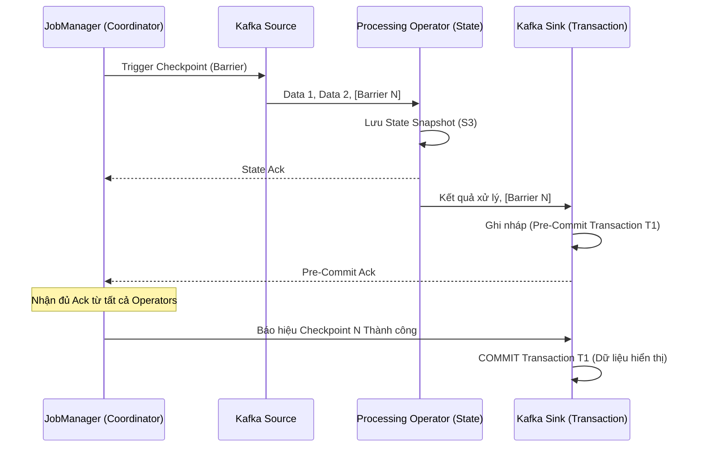

# Exactly-Once Semantics (EOS) - Xử lý chính xác một lần

## Summary

Trong hệ thống xử lý dữ liệu phân tán, mạng có thể rớt, server có thể chết, và phần mềm có thể crash bất kỳ lúc nào. Câu hỏi đặt ra là: Điều gì xảy ra với dữ liệu đang bay trên đường truyền?
**Exactly-Once Semantics (EOS)** là mức bảo chứng (guarantee) tối cao trong hệ thống Streaming, đảm bảo rằng ngay cả trong trường hợp thảm họa (lỗi node, rớt mạng), mỗi một thông điệp (message) đi vào hệ thống sẽ ảnh hưởng đến trạng thái hoặc kết quả đầu ra **chính xác một lần duy nhất**, không thừa (bị lặp) và không thiếu (bị mất). 

---

## Definition

Trong lý thuyết xử lý thông điệp luồng, có 3 mức độ bảo chứng ngữ nghĩa phân phối:
1. **At-most-once (Tối đa một lần)**: Gửi thông điệp đi và quên nó đi. Nếu lỗi, thông điệp sẽ bị mất. Kết quả tính toán có thể bị thiếu.
2. **At-least-once (Ít nhất một lần)**: Gửi thông điệp, nếu không nhận được xác nhận (ACK) sẽ gửi lại. Đảm bảo không mất dữ liệu, nhưng có thể bị trùng lặp. Kết quả tính toán có thể bị dư thừa (overshoot).
3. **Exactly-once (Chính xác một lần)**: Kết hợp kỹ thuật lưu trạng thái (State) và Giao dịch (Transactions) để đảm bảo thông điệp có thể bị gửi lại nội bộ nhiều lần khi có lỗi, nhưng ảnh hưởng của nó lên kết quả cuối cùng (End-to-End) được áp dụng đúng một lần.

---

## Why it exists

Thử tưởng tượng bạn đang viết ứng dụng Stream Processing để xử lý giao dịch ngân hàng hoặc trừ tiền trong ví điện tử.
* Nếu dùng **At-most-once**: Khách hàng nạp 100$, server sập giữa chừng, mất dữ liệu, khách mất tiền. (Không thể chấp nhận).
* Nếu dùng **At-least-once**: Khách nạp 100$, server lưu thành công nhưng mạng rớt lúc gửi phản hồi. Hệ thống nguồn tưởng lỗi nên thử gửi lại lệnh nạp 100$. Tài khoản khách được cộng 200$. (Công ty phá sản).

Chính vì vậy, đối với các bài toán liên quan đến tài chính, thanh toán, hoặc tính toán metrics chính xác (Billing), **Exactly-Once** là yêu cầu bắt buộc phải có để giữ tính toàn vẹn dữ liệu.

---

## Core idea

Để đạt được End-to-End Exactly-Once, toàn bộ quy trình từ Nguồn (Source) -> Xử lý (Processor) -> Đích đến (Sink) phải phối hợp chặt chẽ với nhau. Ý tưởng cốt lõi dựa trên hai kỹ thuật:

1. **State Snapshots (Chụp trạng thái)**: Động cơ xử lý (ví dụ: Flink) liên tục chụp lại trạng thái của toàn bộ hệ thống (Checkpointing) kèm theo vị trí đọc (Offset) của nguồn dữ liệu một cách đồng bộ. Nếu có lỗi xảy ra, hệ thống quay ngược (rollback) lại bản chụp gần nhất và phát lại dữ liệu từ offset đó. Việc này xử lý vế "không thiếu".
2. **Idempotency (Tính lũy đẳng) hoặc Transactional Sinks (Giao dịch 2 pha)**: Để tránh ghi trùng lặp khi phát lại dữ liệu từ bản chụp cũ, hệ thống đích (Sink) phải hỗ trợ tính chất ghi đè an toàn (Idempotent: ghi $x=5$ nhiều lần vẫn là 5) hoặc sử dụng Two-Phase Commit (2PC) để chỉ chốt kết quả (commit) cùng thời điểm với lúc tạo Checkpoint. Việc này xử lý vế "không thừa".

---

## How it works (Apache Flink & Kafka Example)

Apache Flink là hệ thống tiên phong trong việc cung cấp Exactly-Once. Cơ chế hoạt động của nó sử dụng thuật toán Chandy-Lamport kết hợp Two-Phase Commit:

1. **Bắt đầu Checkpoint**: Bộ điều phối (JobManager) gửi một rào chắn đặc biệt gọi là **Checkpoint Barrier** vào luồng dữ liệu tại Source (Kafka). Barrier này chạy xuôi theo dòng dữ liệu.
2. **Lưu State**: Khi Barrier đi qua bất kỳ Operator nào (ví dụ: hàm SUM), operator đó tạm dừng xử lý, lưu trạng thái tính toán hiện tại (ví dụ: `sum = 1000`) vào hệ thống lưu trữ bền vững (HDFS/S3), sau đó nhả Barrier đi tiếp xuống Sink.
3. **Pre-Commit tại Sink**: Khi Barrier tới Sink (nơi ghi dữ liệu ra ngoài, ví dụ ghi vào Kafka đích), Sink sẽ mở một giao dịch (transaction) mới và bắt đầu ghi nháp (Pre-commit) những dữ liệu của chu trình vừa rồi. Những dữ liệu này vẫn "vô hình" với người dùng cuối.
4. **Commit**: Sau khi TẤT CẢ operators xác nhận đã lưu State thành công, JobManager ra lệnh báo "Checkpoint thành công". Lúc này Sink mới chuyển trạng thái giao dịch từ Pre-commit sang **Commit**. Dữ liệu chính thức được chốt.

Nếu hệ thống sập ở bước 3, Flink khởi động lại, phục hồi State về Checkpoint cũ, và Sink sẽ **hủy bỏ (abort)** giao dịch nháp bị gián đoạn. Dữ liệu được phát lại và xử lý lại từ đầu một cách hoàn hảo.

---

## Architecture / Flow



---

## Practical example

Để kích hoạt Exactly-Once Semantics từ Kafka $\rightarrow$ Flink $\rightarrow$ Kafka trong Java API:

```java
StreamExecutionEnvironment env = StreamExecutionEnvironment.getExecutionEnvironment();

// Kích hoạt cơ chế Checkpointing định kỳ mỗi 10 giây (Cốt lõi của Exactly-Once nội bộ Flink)
env.enableCheckpointing(10000, CheckpointingMode.EXACTLY_ONCE);

KafkaSource<String> source = KafkaSource.<String>builder()
    .setBootstrapServers("broker:9092")
    .setTopics("input-topic")
    .setGroupId("my-group")
    .setValueOnlyDeserializer(new SimpleStringSchema())
    .build();

DataStream<String> stream = env.fromSource(source, WatermarkStrategy.noWatermarks(), "Kafka Source");

// Xử lý dữ liệu...
DataStream<String> result = stream.map(s -> "Processed: " + s);

KafkaSink<String> sink = KafkaSink.<String>builder()
    .setBootstrapServers("broker:9092")
    .setRecordSerializer(KafkaRecordSerializationSchema.builder()
        .setTopic("output-topic")
        .setValueSerializationSchema(new SimpleStringSchema())
        .build()
    )
    // CẤU HÌNH QUAN TRỌNG: Giao thức Exactly Once (kích hoạt Two-Phase Commit)
    .setDeliveryGuarantee(DeliveryGuarantee.EXACTLY_ONCE)
    .setTransactionalIdPrefix("my-txn-id-prefix-")
    .build();

result.sinkTo(sink);
```

**Phía người dùng cuối (Kafka Consumer)**: Cần cấu hình `isolation.level = read_committed` để Consumer chỉ đọc những thông điệp đã được chốt (Commit), phớt lờ các thông điệp đang trong giai đoạn nháp (Pre-commit).

---

## Best practices

* **Idempotent Sink là lựa chọn dễ dàng nhất**: Nếu hệ thống đích (như Redis, Cassandra, Elasticsearch) hỗ trợ ghi đè theo Key, hãy thiết kế kiến trúc theo hướng Idempotent. (Ví dụ: Thay vì lệnh `UPDATE balance = balance - 10`, hãy dùng lệnh `SET balance = 90`). Với Idempotent Sink, bạn chỉ cần Flink chạy "At-least-once" vẫn thu được kết quả đầu ra "Exactly-once" mà không phải tốn chi phí cho Two-Phase Commit.
* **Theo dõi Checkpoint Duration**: Two-Phase Commit và Checkpointing rất đắt đỏ. Phải giám sát chặt chẽ thời gian chạy Checkpoint. Nếu State quá lớn, thời gian lưu ảnh chụp sẽ chậm, gây trễ hệ thống (Latency spike). Hãy dùng RocksDB làm State Backend và kích hoạt Incremental Checkpoints (Chỉ backup phần thay đổi).
* **Tăng timeout cho Transaction**: Khi ghi Exactly-once vào Kafka, hãy đảm bảo `transaction.timeout.ms` lớn hơn khoảng thời gian giữa các lần Checkpoint, nếu không giao dịch sẽ bị Kafka hủy sớm trước khi Flink kịp Commit.

---

## Common mistakes

* **Quên cấu hình Sink hoặc Consumer**: Đã bật Checkpointing EXACTLY_ONCE trong Flink, nhưng quên cấu hình Transactional Producer (Kafka Sink) hoặc quên cấu hình `read_committed` ở Consumer đầu cuối. Dẫn đến ảo tưởng hệ thống là EOS, nhưng khi lỗi xảy ra, DB đích vẫn bị duplicate dữ liệu.
* **Sử dụng API gọi ngoại vi trong Operator (External Call)**: Gọi HTTP REST API trừ tiền trực tiếp bên trong vòng lặp xử lý `map()` của Flink. Các hệ thống ngoại vi (HTTP) thường không tham gia vào luồng Checkpoint và Two-Phase commit. Nếu Flink lỗi và phát lại luồng, HTTP Call sẽ bị gọi 2 lần. Phải cẩn trọng dùng cơ chế Async I/O hoặc ghi qua một topic Kafka trung gian.

---

## Trade-offs

### Ưu điểm
* Giải phóng kỹ sư khỏi việc tự viết code xử lý dữ liệu trùng lặp (deduplication logic) phức tạp ở tầng ứng dụng.
* Đảm bảo tính toán tài chính, billing chính xác tuyệt đối ngay cả khi rớt điện cả Data Center.

### Nhược điểm
* **Hiệu năng và Độ trễ (Performance Penalty)**: Hệ thống phải dừng lại (khóa nhẹ) để tạo rào chắn snapshot và tốn I/O mạng để lưu trữ State. Độ trễ end-to-end tăng cao do kết quả ở Sink không được "hiển thị" (commit) cho đến khi Checkpoint hoàn thành (có thể mất vài giây đến vài phút).
* **Độ phức tạp vận hành**: Debug hệ thống có Two-Phase Commit rất ác mộng khi các giao dịch bị kẹt trong trạng thái lấp lửng (Dangling transactions).

---

## When to use

* Hệ thống tính tiền, Billing, Payment Gateway, tính toán lương thưởng.
* Hệ thống Data Warehouse yêu cầu metrics chính xác tuyệt đối (không bị chênh lệch số lượng view, click quảng cáo - AdTech).

## When not to use

* Hệ thống phân tích log web, đếm số lượt xem bài viết thông thường (lệch vài view do At-least-once không ảnh hưởng tới kinh doanh).
* Hệ thống IoT cảnh báo nhiệt độ tức thời: Cần độ trễ tính bằng mili-giây, không thể chờ Checkpoint 10 giây để chốt dữ liệu (Nên dùng At-most-once hoặc At-least-once).

---

## Related concepts

* State Management
* [Apache Kafka](/concepts/apache-kafka)
* Apache Flink

---

## Interview questions

### 1. Phân biệt At-most-once, At-least-once và Exactly-once.
* **Người phỏng vấn muốn kiểm tra**: Khái niệm cơ bản của Message Delivery Semantics.
* **Gợi ý trả lời (Strong Answer)**: 
  * At-most-once: Gửi và không chờ phản hồi. Nhanh nhất nhưng có thể mất dữ liệu (thích hợp gửi log không quan trọng).
  * At-least-once: Gửi và chờ ACK. Nếu timeout sẽ gửi lại. Đảm bảo không mất dữ liệu nhưng có thể bị nhân đôi (duplicate) nếu ACK bị rớt mạng. Tốt cho hầu hết báo cáo không cần độ chính xác tuyệt đối.
  * Exactly-once: Cơ chế đảm bảo mỗi sự kiện dù có gửi lại nội bộ bao nhiêu lần do lỗi, nó cũng chỉ làm thay đổi trạng thái hệ thống cuối cùng đúng 1 lần. Chậm nhất, đắt đỏ nhất nhưng cần thiết cho nghiệp vụ tài chính.

### 2. End-to-End Exactly Once có nghĩa là gì? Tại sao chỉ Flink đảm bảo Exactly-once thôi là chưa đủ?
* **Người phỏng vấn muốn kiểm tra**: Hiểu biết về ranh giới hệ thống (System Boundaries).
* **Gợi ý trả lời (Strong Answer)**: End-to-end EOS yêu cầu toàn bộ pipeline: Source $\rightarrow$ Processor (Flink) $\rightarrow$ Sink phải hợp tác với nhau. Flink có Checkpoint chỉ đảm bảo trạng thái nội bộ của nó (Internal State) là Exactly-once. Nếu Flink gửi dữ liệu ra MySQL bằng lệnh INSERT thông thường (Sink), khi rớt mạng, Flink rollback và chạy lại quá trình xử lý, nó sẽ gửi lại lệnh INSERT đó lần 2 vào MySQL, gây trùng lặp. Vì vậy, để đạt End-to-End, Sink (như Kafka hoặc DB) phải hỗ trợ tính Lũy đẳng (Idempotent) hoặc Giao dịch phân tán 2 pha (2PC) đồng bộ hóa cùng Checkpoint của Flink.

### 3. Idempotent Sink là gì? Làm thế nào nó giúp đạt được Exactly-once một cách đơn giản?
* **Người phỏng vấn muốn kiểm tra**: Tư duy giải quyết vấn đề đơn giản hóa (KISS principle).
* **Gợi ý trả lời (Strong Answer)**: Idempotent (Lũy đẳng) là tính chất mà một phép toán áp dụng nhiều lần vẫn cho ra cùng một kết quả như áp dụng 1 lần. Ví dụ: Lệnh gán $x = 10$. Nếu ta dùng một CSDL dạng Key-Value (Redis, Cassandra), và Sink ghi dữ liệu theo dạng Cập nhật/Upsert với một Khóa chính (Primary Key) cụ thể được băm từ bản ghi gốc. Dù engine Streaming (chạy chế độ At-least-once) có lỡ gửi bản ghi đó đi 5 lần do lỗi rớt mạng, CSDL đích vẫn chỉ thực hiện ghi đè giá trị vào cùng một khóa đó, giữ kết quả cuối cùng không bị nhân lên. Cách này nhẹ nhàng hơn nhiều so với việc dùng Two-Phase Commit.

### 4. Giao thức Two-Phase Commit (2PC) trong Flink-Kafka hoạt động như thế nào ở mức trừu tượng?
* **Người phỏng vấn muốn kiểm tra**: Kiến thức sâu về tích hợp Transactional.
* **Gợi ý trả lời (Strong Answer)**: Nó chia làm 2 pha: Pre-commit và Commit. Giữa hai kỳ Checkpoint (Snapshot), Flink ghi dữ liệu nháp vào Kafka Sink kèm theo một định danh giao dịch (Txn_ID). Kafka sẽ lưu nhưng đánh dấu là Uncommitted (Ẩn với người dùng). Khi Flink hoàn tất việc chụp Snapshot State toàn hệ thống (Pha 1), JobManager ra lệnh Commit (Pha 2) đến Sink. Sink gửi lệnh xác nhận đến Kafka, đổi trạng thái Txn_ID thành Committed. Nếu Flink crash ở Pha 1, Snapshot thất bại, khi phục hồi nó sẽ gửi lệnh Abort để hủy Txn_ID nháp ở Kafka, đảm bảo không có rác tồn tại.

### 5. Nếu hệ thống yêu cầu độ trễ cực thấp (Sub-millisecond) nhưng lại đòi hỏi Exactly-Once, bạn sẽ thiết kế thế nào?
* **Người phỏng vấn muốn kiểm tra**: Khả năng phân tích Trade-off.
* **Gợi ý trả lời (Strong Answer)**: Đây là một yêu cầu mâu thuẫn (oxymoron) trong hệ thống phân tán. Exactly-Once thông qua Checkpointing/2PC buộc phải đánh đổi bằng Độ trễ (thường ở mức vài giây để commit batch giao dịch). Không thể có End-to-End EOS ở độ trễ sub-millisecond bằng 2PC. Giải pháp thực tế là nới lỏng yêu cầu: Thiết kế pipeline Streaming ở chế độ At-least-once để đạt độ trễ cực thấp, sau đó bù đắp bằng một Job Batch định kỳ (vài phút/giờ một lần) dùng kĩ thuật Idempotent Deduplication (khử trùng lặp) dưới Data Warehouse để ra kết quả tài chính chính xác cuối cùng (Kiến trúc Lambda).

---

## References

1. **Designing Data-Intensive Applications** - Martin Kleppmann (Chương 11: Stream Processing - Lỗi và Exactly-once semantics).
2. **Apache Flink Documentation** - Fault Tolerance Guarantees & Two-Phase Commit.
3. **Kafka The Definitive Guide** - Exactly Once Semantics (KIP-98).

---

## English summary

**Exactly-Once Semantics (EOS)** is the highest message delivery guarantee in distributed streaming systems. It ensures that despite node failures, network partitions, or crashes, every message in the source is processed and affects the final output state exactly one time (no data loss, no duplicates). End-to-End EOS is achieved by combining the processing engine's coordinated state snapshots (like Flink's Checkpointing via the Chandy-Lamport algorithm) with specialized output mechanisms—either an Idempotent Sink (where overwriting the same key yields the same result) or a Transactional Sink employing a Two-Phase Commit (2PC) protocol. While EOS is mandatory for financial and billing applications, it introduces complexity and performance latency trade-offs.
