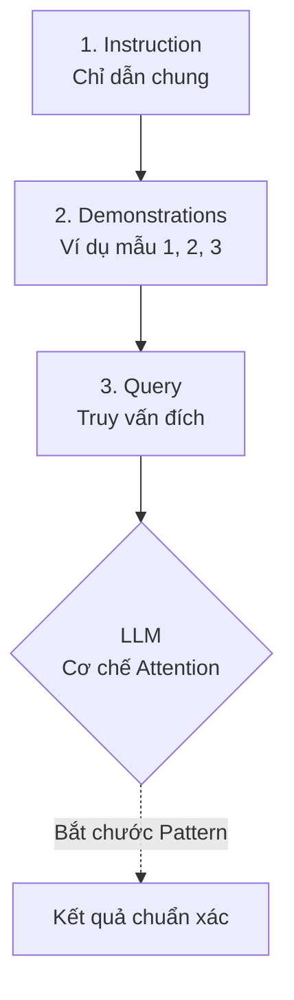

# Học qua vài ví dụ - Few-shot Prompting

## Summary

**Few-shot Prompting** (Học qua vài ví dụ) là một kỹ thuật viết Prompt cho Mô hình Ngôn ngữ Lớn (LLM) trong đó người dùng cung cấp một số lượng nhỏ các cặp đầu vào - đầu ra mẫu (demonstrations/examples) ngay bên trong câu lệnh trước khi đưa ra câu hỏi thực sự. Kỹ thuật này kích hoạt khả năng **In-Context Learning (Học trong ngữ cảnh)** của mô hình, giúp nó nắm bắt được định dạng (format), giọng điệu (tone) và logic mong muốn mà không cần phải trải qua bất kỳ quá trình huấn luyện lại (fine-tuning) nào.

---

## Definition

Nếu *Zero-shot Prompting* là việc yêu cầu mô hình làm bài kiểm tra mà không cho ôn tập mẫu, thì **Few-shot Prompting** giống như việc cung cấp cho nó 2-3 bài giải mẫu để nó hình dung ra cách chấm điểm.

Trong Few-shot Prompting, bạn chèn trực tiếp các cặp bài toán và lời giải (thường từ 1 đến 5 ví dụ) vào chuỗi văn bản gửi cho LLM. Mô hình sẽ phân tích các điểm tương đồng, quy luật cấu trúc từ các ví dụ này, và khi gặp phần đầu vào chưa có đầu ra ở cuối prompt, nó sẽ tự động hoàn thành theo đúng mô thức đã học được. Kỹ thuật này phụ thuộc vào cửa sổ ngữ cảnh (Context Window) thay vì làm thay đổi các trọng số (weights) của mạng nơ-ron.

---

## Why it exists

Mặc dù LLM ngày càng thông minh ở khả năng Zero-shot, chúng vẫn đối mặt với 2 vấn đề lớn trong các bài toán thực tiễn của doanh nghiệp:
1. **Tuân thủ định dạng nghiêm ngặt (Strict Formatting)**: Nếu bạn muốn kết quả xuất ra là một chuỗi JSON có đúng 3 field cụ thể, việc chỉ ra lệnh bằng ngôn từ (Zero-shot) thường dẫn đến việc mô hình tự ý chèn thêm văn bản thừa (như "Here is the JSON..."). Một vài ví dụ Few-shot giải quyết vấn đề này ngay lập tức.
2. **Xử lý các bài toán ngữ nghĩa đặc thù (Domain-specific tasks)**: Cảm xúc của một câu có thể bị hiểu lầm. Ví dụ: "Đôi giày này đi sướng vãi!" có thể bị phân loại là Negative (do từ vãi - lóng). Cung cấp ví dụ Few-shot giúp mô hình "cập nhật" bộ từ vựng và tư duy logic đặc thù của riêng bạn trong thời gian thực.
3. **Thay thế Fine-Tuning giá rẻ**: Thu thập 10,000 mẫu để train LoRA/Fine-tune rất mất công. Soạn 5 mẫu nhét vào prompt tốn đúng 2 phút mà chất lượng đôi khi đạt được mức chấp nhận được ngay lập tức.

---

## Core idea

Cơ sở khoa học của Few-shot Prompting nằm ở khái niệm **In-Context Learning (ICL)**, một đặc tính "bộc phát" (emergent capability) chỉ xuất hiện ở các mô hình ngôn ngữ có quy mô cực lớn (hàng tỷ tham số).

Khi nhận được các ví dụ mẫu, các lớp Transformer không hề tiến hành cập nhật tham số thuật toán Gradient Descent như cách học máy truyền thống. Thay vào đó, qua cơ chế **Attention**, nó ngầm định xây dựng một không gian mapping (ánh xạ tuyến tính nội bộ) giữa không gian Input và Output, tạo ra một rãnh trượt (groove) ngữ nghĩa. Khi từ khóa câu hỏi cuối cùng xuất hiện, xác suất dự đoán các token tiếp theo sẽ bị uốn nắn mạnh mẽ đi vào quỹ đạo cấu trúc của các ví dụ phía trên.

---

## How it works

Cấu trúc của một Few-shot Prompt tiêu chuẩn gồm 3 phần:



1. **Instruction (Chỉ dẫn)**: Định nghĩa rõ vai trò và yêu cầu chung.
2. **Demonstrations (Ví dụ mẫu)**: Các cặp `Input - Output` chuẩn xác (thường từ 1 đến 5 cặp). Cần có dấu phân cách rõ ràng giữa các ví dụ (như `---` hoặc `\n\n`).
3. **Query (Truy vấn đích)**: Input thực tế cần mô hình giải quyết, để trống phần Output cho LLM sinh ra.

---

## Practical example

**Tác vụ**: Rút trích (Extract) thực thể từ tin nhắn đặt hàng của khách sang định dạng JSON.

**Prompt (Few-shot)**:
```text
Trích xuất Món ăn và Số lượng từ tin nhắn. Chỉ trả về JSON, không thêm chữ nào khác.

---
Tin nhắn: Cho mình 2 cốc trà sữa trân châu đường đen và một ly trà đào cam sả nhé.
Output:
{
  "items": [
    {"name": "trà sữa trân châu đường đen", "quantity": 2},
    {"name": "trà đào cam sả", "quantity": 1}
  ]
}

---
Tin nhắn: Lấy 3 bát bún bò Huế đầy đủ, không lấy giá.
Output:
{
  "items": [
    {"name": "bún bò Huế", "quantity": 3}
  ]
}

---
Tin nhắn: Em ơi cho 5 phần cơm sườn nướng và 2 lon coca giao qua quận 1.
Output:
```

**Kết quả (LLM tự điền)**:
```json
{
  "items": [
    {"name": "cơm sườn nướng", "quantity": 5},
    {"name": "coca", "quantity": 2}
  ]
}
```
Nhờ ví dụ, LLM hiểu ngay lập tức việc bỏ qua thông tin rác (không lấy giá, giao qua quận 1) và trả về JSON chuẩn xác 100%.

Dưới đây là cách triển khai Few-shot Prompting chuẩn mực trong mã nguồn Python bằng thư viện **LangChain**:

```python
from langchain.prompts import FewShotPromptTemplate, PromptTemplate

# 1. Khai báo các ví dụ mẫu
examples = [
  {"input": "Cho mình 2 cốc trà sữa trân châu và một ly trà đào.", "output": '{"items": [{"name": "trà sữa trân châu", "quantity": 2}, {"name": "trà đào", "quantity": 1}]}'},
  {"input": "Lấy 3 bát bún bò Huế đầy đủ, không lấy giá.", "output": '{"items": [{"name": "bún bò Huế", "quantity": 3}]}'}
]

# 2. Định dạng cho mỗi ví dụ
example_prompt = PromptTemplate(
    input_variables=["input", "output"],
    template="Tin nhắn: {input}\nOutput:\n{output}"
)

# 3. Tổng hợp thành Few-shot Prompt
few_shot_prompt = FewShotPromptTemplate(
    examples=examples,
    example_prompt=example_prompt,
    prefix="Trích xuất Món ăn và Số lượng từ tin nhắn. Chỉ trả về JSON, không thêm chữ nào khác.",
    suffix="Tin nhắn: {user_input}\nOutput:\n",
    input_variables=["user_input"]
)

# 4. In thử Prompt với Input thực tế
print(few_shot_prompt.format(user_input="Cho 5 phần cơm sườn và 2 lon coca giao quận 1"))
```

---

## Best practices

* **Đa dạng hóa ví dụ (Diversity)**: Chọn các ví dụ đại diện cho mọi trường hợp có thể xảy ra (câu ngắn, câu dài, trường hợp thành công, trường hợp ngoại lệ). Đừng đưa 5 ví dụ y hệt nhau về cấu trúc câu.
* **Format thống nhất**: Nếu trong ví dụ bạn dùng `Tin nhắn:`, hãy chắc chắn ở phần truy vấn cuối cùng bạn cũng dùng `Tin nhắn:`. Bất kỳ sự xô lệch nào về dấu câu, chữ hoa/thường cũng làm giảm hiệu năng của mô hình.
* **Trật tự nhãn ngẫu nhiên**: Nếu làm bài toán phân loại (Tích cực/Tiêu cực/Trung lập), đừng xếp 3 câu Tích cực lên đầu rồi 2 câu Tiêu cực xuống dưới. Hãy trộn ngẫu nhiên. LLM có tính "Recency bias" (Thiên kiến gần), nó dễ bị ám ảnh bởi nhãn của ví dụ cuối cùng sát với câu truy vấn.
* **Kết hợp Chain-of-Thought (CoT)**: Đối với bài toán toán học hoặc logic, đừng chỉ đưa `[Câu hỏi] -> [Đáp án]`. Hãy đưa `[Câu hỏi] -> [Bước giải thích 1 -> 2 -> 3] -> [Đáp án]`. Mô hình sẽ bắt chước cách "suy nghĩ" từng bước một.

---

## Common mistakes

* **Quá tải Context Window (Prompt rác)**: Nhồi nhét 50 ví dụ vào prompt. Lợi ích của số lượng ví dụ thường chững lại (plateau) sau khoảng 5-8 ví dụ. Càng nhét nhiều, tốn tiền API, tăng độ trễ và mô hình có thể bị "Lost in the middle".
* **Ví dụ mẫu bị sai (Mislabeled data)**: Đưa ví dụ mà câu trả lời mẫu bị sai kiến thức hoặc sai format. ICL mạnh đến mức LLM sẽ lặp lại hoàn hảo cái sự "ngu ngốc" hoặc sai lầm mà bạn vô tình cung cấp ở trên.
* **Không có nhãn cho trường hợp ngoài lề (Edge Cases)**: Nếu mô hình gặp input không liên quan, nó sẽ cố ép đầu ra vào ví dụ. Cần có ít nhất 1 ví dụ dạy nó cách từ chối (ví dụ: `Output: "Không liên quan"`).

---

## Trade-offs

### Ưu điểm
* **Dễ dàng điều khiển Output**: Định hướng định dạng (JSON, XML) và hành vi của mô hình cực kỳ tin cậy mà không tốn chi phí và thời gian huấn luyện.
* **Agile & Nhanh chóng**: Fix bug của AI lập tức chỉ bằng cách thêm 1 ví dụ (One-shot) minh họa cho trường hợp lỗi trực tiếp vào prompt.
* **Nâng cao độ chính xác**: Cải thiện rõ rệt (có thể lên tới 10-20%) độ chính xác của LLM trên các bài toán phân loại và rút trích so với Zero-shot.

### Nhược điểm
* **Tốn Token (Chi phí/Độ trễ cao)**: Việc gửi kèm ví dụ trong mọi API call làm tăng số lượng Input Token đáng kể (ví dụ tăng từ 50 token lên 1500 token), kéo theo chi phí vận hành (operation cost) tăng cao.
* **Giới hạn Context**: Với các bài toán có Input rất dài (phân tích tài liệu PDF 50 trang), việc nhét thêm ví dụ Few-shot sẽ vượt quá sức chứa context của mô hình (ví dụ 8K hoặc 16K tokens đối với các mô hình nhỏ).

---

## When to use

* Bài toán phân tích, phân loại dữ liệu (sentiment analysis, intent classification).
* Yêu cầu bắt buộc đầu ra là JSON chuẩn (cho việc gọi API/hàm tiếp theo).
* Khi mô hình Zero-shot liên tục trả về kết quả lạc đề hoặc diễn đạt sai văn phong (tone of voice) mà bạn mong muốn.
* Xây dựng Agent / Công cụ định tuyến truy vấn (Router).

## When not to use

* Với các tác vụ mà LLM đã làm quá tốt ở Zero-shot (như tóm tắt cơ bản, dịch thuật Anh-Việt), Few-shot là dư thừa và lãng phí token.
* Có quá nhiều luật logic lằng nhằng (>10 trường hợp). Cửa sổ prompt không đủ sức chứa mọi ví dụ. Hãy nghĩ đến RAG hoặc Fine-tuning (PEFT).

---

## Related concepts

* [Học không cần ví dụ (Zero-shot)](/concepts/zero-shot)
* [System Prompt](/concepts/system-prompt)
* [Tinh chỉnh hiệu quả tham số (PEFT)](/concepts/peft)

---

## Interview questions

### 1. Sự khác biệt cơ chế căn bản giữa In-Context Learning (Few-shot Prompting) và Fine-Tuning là gì?
* **Người phỏng vấn muốn kiểm tra**: Hiểu biết dưới vỏ bọc (under-the-hood) của AI thay vì chỉ biết viết prompt.
* **Gợi ý trả lời (Strong Answer)**: 
  * Fine-Tuning làm thay đổi vĩnh viễn cấu trúc toán học của mô hình (cập nhật các trọng số Weights thông qua thuật toán Backpropagation và Gradient Descent) dựa trên một tập dữ liệu lớn. Sự thay đổi là lưu trú (persistent).
  * In-Context Learning (Few-shot) diễn ra hoàn toàn ở giai đoạn Inference (Suy luận) thông qua tính toán Forward-pass và Attention mechanism. Các trọng số Weights bị đóng băng (frozen). LLM chỉ tạm thời lưu giữ quy luật trong bộ nhớ kích hoạt (Activation memory/KV Cache) trong ngữ cảnh hiện tại. Khi cuộc hội thoại kết thúc, nó quên hết.

### 2. Hiện tượng Recency Bias (Thiên kiến gần) ảnh hưởng thế nào đến Few-shot Prompting trong bài toán phân loại nhiều lớp?
* **Người phỏng vấn muốn kiểm tra**: Kinh nghiệm thực tế khi prompt thất bại và cách debug.
* **Gợi ý trả lời (Strong Answer)**: Recency Bias khiến LLM có xu hướng ưu tiên chọn câu trả lời tương tự như ví dụ mẫu *nằm sát cuối cùng nhất* ngay trước câu hỏi thực tế. Nếu làm bài toán phân loại [A, B, C], và ví dụ Few-shot của bạn được sắp xếp toàn các nhãn A ở dưới cùng, LLM sẽ bị "nhiễm" và dự đoán Input mới là A một cách mù quáng. Giải pháp là cân bằng số lượng nhãn và hoán đổi vị trí ngẫu nhiên các ví dụ mẫu.

### 3. "Dynamic Few-shot Prompting" là gì và tại sao nó kết hợp tốt với Vector Database?
* **Người phỏng vấn muốn kiểm tra**: Hiểu biết về hệ thống Prompting nâng cao quy mô lớn.
* **Gợi ý trả lời (Strong Answer)**: Thay vì gán cứng (hardcode) 3 ví dụ cố định vào prompt cho mọi User. Dynamic Few-shot kết hợp lưu hàng nghìn ví dụ mẫu vào Vector Database. Khi User hỏi, hệ thống sẽ nhúng (embed) câu hỏi đó, tìm trong Vector DB top 3 ví dụ mẫu *tương đồng nhất* về ngữ nghĩa với câu hỏi hiện tại, và chèn linh hoạt 3 ví dụ này vào prompt. Cách này giúp cá nhân hóa ví dụ cho từng ngữ cảnh, tối ưu độ chính xác vượt trội trên tập dữ liệu đa dạng.

---

## References

1. **"Language Models are Few-Shot Learners"** - Brown et al. (OpenAI, 2020) (Nghiên cứu gốc giới thiệu khái niệm In-Context Learning cùng GPT-3).
2. **"Chain-of-Thought Prompting Elicits Reasoning in Large Language Models"** - Wei et al. (Google Brain, 2022) (Bổ sung CoT vào Few-shot để giải quyết bài toán phức tạp).
3. **Anthropic / OpenAI API Best Practices** - Các hướng dẫn kỹ thuật chính thức về cách chèn examples vào message arrays (ví dụ luân phiên User/Assistant).

---

## English summary

**Few-shot Prompting** is a prompt engineering technique that leverages the **In-Context Learning** capabilities of Large Language Models by injecting a small number of input-output demonstrations directly into the prompt before the final user query. This allows the model to infer patterns, formatting constraints, and domain-specific logic dynamically at inference time without requiring any gradient updates or permanent fine-tuning. While it significantly boosts accuracy and strict output formatting (like JSON structure), it increases token consumption and is subject to limitations such as context window limits and recency bias.
