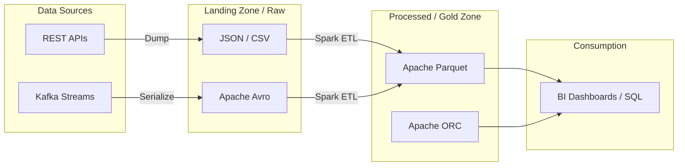

# Định dạng Tệp Dữ liệu - File Formats

## Summary

Trong kiến trúc Data Lake và Big Data, dữ liệu không được che giấu bên trong một hệ quản trị cơ sở dữ liệu khép kín (như MySQL), mà được lưu trữ công khai dưới dạng các tệp tin vật lý trên Object Storage (như Amazon S3). Việc lựa chọn định dạng tệp (File format) như Apache Parquet, ORC, Avro hay CSV quyết định trực tiếp đến dung lượng lưu trữ, tốc độ đọc/ghi dữ liệu và hiệu năng của toàn bộ hệ thống Data Pipeline.

---

## Definition

**File Formats (Định dạng tệp)** trong kỹ thuật dữ liệu quy định cách cấu trúc dữ liệu được mã hóa (encoded) thành các bit nhị phân để lưu trên ổ đĩa.

Định dạng tệp được chia làm 3 nhóm chính:
1. **Định dạng Text (Human-readable)**: Đọc được bằng mắt người (CSV, JSON, XML). Tốc độ chậm, tốn dung lượng.
2. **Định dạng Dòng nhị phân (Binary Row-based)**: Tối ưu cho thao tác ghi tốc độ cao (Apache Avro).
3. **Định dạng Cột nhị phân (Binary Columnar)**: Tối ưu cho thao tác truy vấn phân tích đọc nhiều (Apache Parquet, Apache ORC).

---

## Why it exists

Thử tưởng tượng bạn lưu 1 tỷ dòng dữ liệu log vào file `log.csv`. 
File CSV rất dễ đọc, nhưng nó không có schema (kiểu dữ liệu int hay string là do người lập trình tự đoán), không có khả năng nén tự thân, không thể "nhảy" (seek) tới một dòng bất kỳ mà không đọc các dòng trước nó, và không thể trích xuất 1 cột duy nhất.
Khi thế giới chuyển sang Big Data (Hadoop, Spark), cần có những định dạng tệp tin mới giải quyết các yếu điểm chết người của CSV:
* Phải nén được dữ liệu để giảm chi phí mạng (Network I/O).
* Phải chứa sẵn Schema (Self-describing) bên trong tệp.
* Phải hỗ trợ xử lý song song (Splittable).

---

## Core idea

**1. Apache Parquet**
* **Cấu trúc**: Columnar (Lưu theo cột).
* **Đặc tính**: Nén cực tốt. Hỗ trợ Projection Pushdown (chỉ đọc các cột cần thiết).
* **Ứng dụng**: Là tiêu chuẩn vàng cho các truy vấn OLAP, Data Warehouse.

**2. Apache ORC (Optimized Row Columnar)**
* **Cấu trúc**: Columnar (Giống Parquet).
* **Đặc tính**: Thiết kế ban đầu tối ưu riêng cho hệ sinh thái Hive.
* **Ứng dụng**: Hiệu suất tương đương Parquet, thường dùng trên các hệ thống Hadoop cũ.

**3. Apache Avro**
* **Cấu trúc**: Row-based (Lưu theo dòng).
* **Đặc tính**: Nén tốt hơn CSV. Tốc độ ghi (Write) và cấu trúc lại (Serialization) cực nhanh. Đặc biệt nổi bật với tính năng Schema Evolution (Đổi tên cột, thêm cột mà không làm hỏng file cũ).
* **Ứng dụng**: Hệ thống Streaming (Kafka), lưu log thô (Landing zone).

---

## How it works

Hãy xem tính năng **Schema Evolution** của Avro và Parquet hoạt động ra sao.
Khi tệp tin tự chứa schema (self-describing), phần đầu hoặc cuối của file sẽ chứa một khối Metadata dạng JSON định nghĩa: *"File này có cột A kiểu INT, cột B kiểu VARCHAR"*.

Nếu ngày mai, team Backend quyết định xóa cột B và thêm cột C.
* Với CSV: Pipeline sẽ sụp đổ vì hệ thống không biết cột nào tương ứng với giá trị nào nữa.
* Với Avro/Parquet: Khối xử lý (như Spark) đọc Metadata của file cũ và file mới. Nó tự hiểu rằng file cũ không có cột C (sẽ trả về NULL), và hợp nhất (Merge) chúng lại một cách an toàn mà không bị crash.

---

## Architecture / Flow

Dưới đây là sơ đồ lựa chọn định dạng tệp trong một Data Lake điển hình:



---

## Practical example

Ví dụ dùng Python (thư viện `pandas` và `pyarrow`) để thấy sự khác biệt về kích thước khi lưu 1 triệu bản ghi:

```python
import pandas as pd
import numpy as np

# Tạo 1 triệu dòng dữ liệu giả lập
df = pd.DataFrame({
    'id': range(1000000),
    'status': np.random.choice(['SUCCESS', 'FAIL', 'PENDING'], 1000000),
    'revenue': np.random.random(1000000) * 100
})

# Lưu dưới dạng CSV
df.to_csv('data.csv', index=False)
# Kích thước: ~ 35 MB

# Lưu dưới dạng Parquet (mặc định nén Snappy)
df.to_parquet('data.parquet')
# Kích thước: ~ 4 MB (Nhỏ hơn gần 10 lần do cột 'status' được Dictionary Encoding)
```

---

## Best practices

* **Đừng dùng JSON/CSV cho lớp dữ liệu phục vụ (Serving Layer)**: Việc dùng AWS Athena hay BigQuery truy vấn trực tiếp trên hàng chục GB file JSON sẽ làm bạn phá sản vì chi phí quét dữ liệu không nén. Hãy chuyển chúng thành Parquet.
* **Gom file nhỏ (Small File Problem)**: 10,000 file Parquet kích thước 1MB sẽ truy vấn chậm hơn rất nhiều so với 10 file Parquet kích thước 1GB. Hãy có các job định kỳ để gom (compact) các file nhỏ lại.
* **Chọn đúng thuật toán nén (Compression codec)**: `Snappy` (mặc định của Parquet) cân bằng tốt giữa tốc độ nén/giải nén và dung lượng. `Gzip` nén nhỏ hơn nhưng giải nén tốn nhiều CPU hơn, dùng cho Cold Storage (Archiving).

---

## Common mistakes

* **Mở file Parquet bằng Text Editor**: Kỹ sư mới thường cố dùng Notepad hoặc lệnh `cat` trên Linux để xem nội dung file Parquet, dẫn đến màn hình hiện toàn ký tự rác (binary). Phải dùng thư viện lập trình (như Pandas) hoặc công cụ như `parquet-tools` để đọc.
* **Dùng Parquet cho Data Streaming thời gian thực**: Parquet không tối ưu cho việc chèn (append) từng dòng nhỏ giọt liên tục vì cơ chế gom cột của nó cần bộ nhớ đệm (buffer) lớn. Hệ thống Streaming nên dùng Avro.

---

## Trade-offs

### JSON / CSV
* Ưu điểm: Con người đọc được (Human-readable), tương thích với mọi công cụ trên đời.
* Nhược điểm: Kích thước khổng lồ, parse (đọc) rất chậm, không chứa Schema chặt chẽ.

### Apache Parquet
* Ưu điểm: Phân tích SQL OLAP tốc độ ánh sáng, tiết kiệm 70-90% dung lượng Cloud Storage.
* Nhược điểm: Ghi chậm, không thích hợp cho OLTP hay Streaming.

### Apache Avro
* Ưu điểm: Tốc độ ghi nhanh, hỗ trợ Schema Evolution đỉnh cao (cực tốt cho hệ thống Microservices truyền tin nhắn qua Kafka).
* Nhược điểm: Phân tích SQL chậm hơn Parquet vì là Row-based.

---

## When to use

* **Avro**: Bắt dữ liệu thô (Ingestion), Data Streaming (Kafka), nơi Schema của ứng dụng thay đổi liên tục.
* **Parquet / ORC**: Nền tảng cốt lõi của Data Lake, Data Lakehouse phục vụ truy vấn của Data Analyst và ML models.

## When not to use

* (Đối với Parquet/Avro): Khi cần trao đổi file dữ liệu dung lượng nhỏ (vài KB) với một đối tác kinh doanh (business user) không rành công nghệ, hãy cứ gửi cho họ file CSV hoặc Excel.

---

## Related concepts

* [Columnar Storage](/concepts/columnar-storage)
* [Data Pipeline](/concepts/data-pipeline)

---

## Interview questions

### 1. Tại sao Parquet lại truy vấn nhanh hơn JSON trên Data Lake?
* **Gợi ý trả lời**: Khi có một câu query `SELECT id FROM table`. 
  * Với JSON: Đây là định dạng dòng, engine (như Spark/Athena) phải quét (I/O) và giải mã (parse) toàn bộ file text, sau đó bóc tách từng chuỗi JSON để lấy ra trường `id`, tiêu tốn I/O đĩa và CPU khổng lồ.
  * Với Parquet: Đây là định dạng cột nhị phân (Binary Columnar). Engine đọc Metadata ở cuối file để biết cột `id` nằm chính xác ở vị trí (offset) byte nào. Nó bỏ qua toàn bộ phần còn lại của file, chỉ bốc đúng các byte của cột `id` lên RAM. Hơn nữa dữ liệu đã được nén cực nhỏ, làm giảm thời gian truyền tải I/O.

### 2. Schema Evolution trong Avro có lợi ích gì cho Data Engineering?
* **Gợi ý trả lời**: Trong môi trường thực tế, team Backend thường xuyên đổi tên cột, thêm bớt trường thông tin. Avro nhúng trực tiếp Schema (dạng JSON) vào chung với dữ liệu nhị phân. Khi đọc, hệ thống so sánh Schema của file đang đọc (Writer's schema) với Schema mà hệ thống mong muốn (Reader's schema) và tự động ánh xạ (map) các trường với nhau, tự động điền `null` cho cột thiếu mà không làm sập (crash) Data Pipeline.

---

## References

1. **Apache Parquet Documentation**.
2. **Apache Avro Documentation**.
3. **Designing Data-Intensive Applications** - Martin Kleppmann (Chương 4: Encoding and Evolution).

---

## English summary

In Data Lakes and Big Data architectures, choosing the right file format is crucial for performance and cost. Text formats like CSV and JSON are human-readable but bloated and slow for analytics. Apache Avro, a binary row-based format, excels in fast write operations and robust Schema Evolution, making it ideal for streaming data (e.g., Kafka) and raw data landing. Apache Parquet and ORC are binary columnar formats that offer extreme compression and "Projection Pushdown" capabilities, making them the industry standard for fast, cost-effective read-heavy analytical workloads (OLAP) on cloud object storage.
