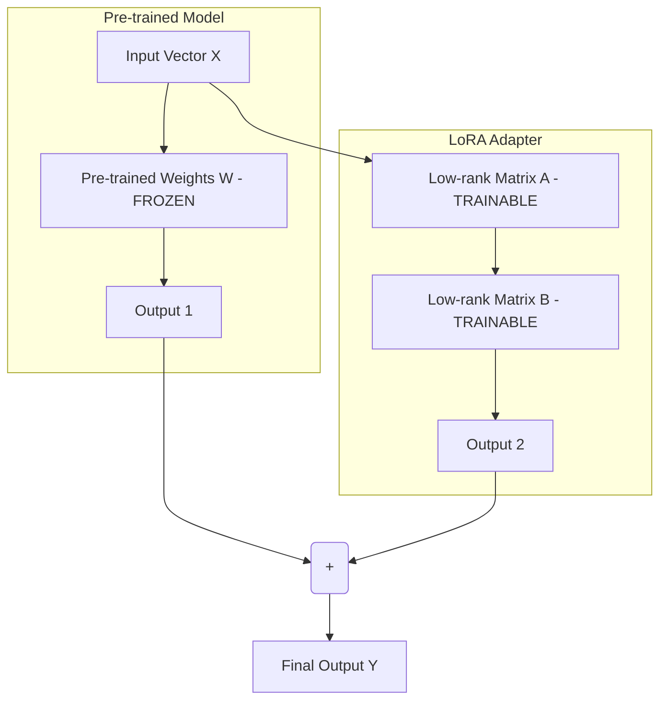

# Tinh chỉnh mô hình - Fine-tuning

## Summary

Fine-tuning (Tinh chỉnh mô hình) là quá trình lấy một mô hình Trí tuệ Nhân tạo đã được huấn luyện trước (Pre-trained Foundation Model) và tiếp tục huấn luyện nó trên một tập dữ liệu nhỏ hơn, mang tính đặc thù chuyên ngành (domain-specific data). Mục đích của Fine-tuning là điều chỉnh trọng số (weights) của mô hình để cải thiện hiệu suất cho một nhiệm vụ cụ thể, học được một giọng điệu (tone/style) mới, hoặc tích hợp kiến thức nghiệp vụ chuyên sâu mà không cần phải huấn luyện lại mô hình từ con số 0 với chi phí hàng chục triệu USD.

---

## Definition

Về mặt toán học và học máy, **Fine-tuning** là ứng dụng cốt lõi của **Transfer Learning (Học chuyển giao)**. 

Thay vì khởi tạo trọng số của mạng nơ-ron bằng các giá trị ngẫu nhiên, Fine-tuning bắt đầu với bộ trọng số (weights & biases) đã hội tụ từ một mô hình lớn (ví dụ: Llama 3, BERT) chứa sẵn nền tảng hiểu biết sâu sắc về ngữ pháp, cú pháp và thế giới quan chung. Sau đó, ta sử dụng thuật toán lan truyền ngược (backpropagation) cùng với tập dữ liệu dán nhãn của riêng doanh nghiệp để cập nhật lại (một phần hoặc toàn bộ) bộ trọng số này, giúp mô hình "chuyên môn hóa" vào một ngách hẹp.

---

## Why it exists

Các Foundation Models (như GPT-4, Llama) được pre-train trên kho dữ liệu khổng lồ của toàn bộ Internet. Do đó, chúng là những "học giả biết tuốt" nhưng thường đưa ra những câu trả lời chung chung (generic). 

Doanh nghiệp đối mặt với 3 vấn đề lớn khi dùng trực tiếp mô hình pre-trained:
1. **Kiến thức chuyên biệt**: Mô hình không hiểu các biệt ngữ y khoa, thuật ngữ nội bộ công ty hay định dạng file log riêng biệt.
2. **Hành vi & Định dạng**: Khó ép mô hình trả về đúng cấu trúc JSON lồng nhau phức tạp hoặc nói chuyện theo đúng "Brand voice" (giọng điệu thương hiệu) nếu chỉ dùng Prompt Engineering.
3. **Chi phí Inference**: Để mô hình trả lời đúng, ta phải nhồi nhét cực nhiều ví dụ (Few-shot) vào Prompt. Việc này làm phình to số lượng token đầu vào, gây tốn kém chi phí API cực lớn ở pha chạy thực tế (Inference).

Fine-tuning ra đời để "nướng" các ví dụ và kiến thức đó trực tiếp vào trong cấu trúc não bộ (trọng số) của mô hình.

---

## Core idea

Cốt lõi của Fine-tuning là cân bằng giữa **việc học cái mới** và **không quên cái cũ (Catastrophic Forgetting)**. 

Có 2 trường phái Fine-tuning chính:
1. **Full Fine-tuning (Tinh chỉnh toàn bộ)**: Cập nhật lại 100% tất cả các tham số (hàng chục tỷ tham số) của mô hình. Tốn kém tài nguyên tính toán (GPU) khổng lồ, dễ làm mô hình mất đi tính tổng quát.
2. **PEFT (Parameter-Efficient Fine-Tuning - Tinh chỉnh hiệu quả tham số)**: Chỉ đóng băng (freeze) phần lớn mạng lưới gốc, và chỉ huấn luyện một số lượng rất nhỏ các tham số bổ sung (dưới 1%). Phương pháp nổi tiếng nhất của PEFT là **LoRA (Low-Rank Adaptation)**.

---

## How it works (với kỹ thuật LoRA)

Vì Full Fine-tuning quá đắt đỏ, ngành công nghiệp hiện nay gần như mặc định sử dụng LoRA khi nói đến Fine-tuning LLM.

**Nguyên lý của LoRA (Low-Rank Adaptation):**
1. **Đóng băng trọng số gốc**: Giữ nguyên toàn bộ ma trận trọng số (Weight Matrix $W$) của mô hình pre-trained gốc. Không update chúng.
2. **Thêm ma trận rank thấp**: Chèn thêm 2 ma trận nhỏ (gọi là $A$ và $B$) song song với ma trận gốc $W$.
3. **Huấn luyện**: Trong quá trình huấn luyện, chỉ có ma trận $A$ và $B$ được phép học và thay đổi (update gradients). Vì $A$ và $B$ có chiều (rank) rất nhỏ nên số lượng tham số cần huấn luyện giảm đi $10,000$ lần.
4. **Gộp trọng số (Merging)**: Khi mang ra phục vụ (inference), ta nhân ma trận $A$ và $B$ lại rồi cộng thẳng vào $W$ gốc ($W_{new} = W + A \times B$). Tốc độ phản hồi (latency) của mô hình vẫn nhanh y như mô hình gốc.

---

## Architecture / Flow (LoRA)

---

## Best practices

* **Chất lượng quan trọng hơn Số lượng**: Dữ liệu Fine-tuning không cần nhiều (đôi khi chỉ cần 500 - 1000 mẫu), nhưng phải cực kỳ chuẩn xác, sạch sẽ, không lỗi chính tả và định dạng đồng nhất. (Nguyên lý: *Quality beats Quantity*).
* **Định dạng Prompt (Chat Template)**: Dữ liệu huấn luyện phải tuân thủ nghiêm ngặt Chat Template của mô hình gốc (ví dụ: ChatML, Llama-3-Instruct template). Nếu lệch template, mô hình sẽ học sai ngữ cảnh.
* **Theo dõi Overfitting**: Nếu hàm Loss của tập train liên tục giảm nhưng tập validation lại tăng, mô hình đang bị học vẹt (overfitting). Cần dừng sớm (Early stopping) hoặc áp dụng Dropout.
* **Sử dụng PEFT/LoRA thay vì Full Fine-tune**: Luôn luôn bắt đầu với LoRA. Chỉ khi bài toán thực sự phức tạp (như dạy LLM học một ngôn ngữ tự nhiên mới hoàn toàn) thì mới nghĩ tới Full Fine-tuning.

---

## Trade-offs

### Ưu điểm
* **Hiệu năng xuất sắc**: Cho kết quả tốt nhất ở các tác vụ ngách. Một mô hình nhỏ (8B tham số) được fine-tune tốt có thể đánh bại mô hình khổng lồ (70B tham số) chưa fine-tune.
* **Tiết kiệm chi phí Inference**: Cho phép cắt bỏ hoàn toàn các ví dụ (Few-shot) dài dòng trong Prompt, tiết kiệm lượng token đầu vào đáng kể trong thời gian dài.
* **Tính bảo mật tuyệt đối**: Doanh nghiệp có thể tải mô hình mã nguồn mở (Open-source) về server nội bộ (On-premise) và fine-tune bằng dữ liệu mật mà không sợ rò rỉ dữ liệu lên API của OpenAI/Google.

### Nhược điểm
* **Dữ liệu tĩnh**: Kiến thức học được qua Fine-tuning bị "đóng băng" ở thời điểm huấn luyện. Không thể trả lời các sự kiện thời sự diễn ra vào ngày hôm sau (Đây là điểm thua kém RAG).
* **Chi phí chuẩn bị dữ liệu lớn**: Cần đội ngũ chuyên gia domain-expert để ngồi dán nhãn, viết câu trả lời chuẩn để tạo tập dữ liệu huấn luyện.
* **Rủi ro quên kiến thức (Catastrophic Forgetting)**: Mô hình có thể trở nên quá xuất sắc ở nhiệm vụ mới nhưng lại ngu đi ở các bài toán suy luận logic chung mà trước đây nó làm rất tốt.

---

## When to use

* Khi cần mô hình có giọng điệu (Tone of Voice) chuyên biệt (ví dụ: Trợ lý ảo cho trẻ em có giọng điệu cổ tích, dễ thương).
* Khi cần mô hình xuất ra cấu trúc dữ liệu cực kỳ phức tạp (XML cấu trúc sâu, SQL query đặc thù của hệ thống nội bộ).
* Tối ưu hóa chi phí: Chuyển đổi (distill) kiến thức từ một mô hình đắt tiền (GPT-4) xuống một mô hình nhỏ giá rẻ tự host (Llama 8B) cho một tác vụ lặp đi lặp lại.

## When not to use

* Để dạy mô hình "nhớ" các sự kiện thực tế mới, tài liệu nội bộ công ty thường xuyên cập nhật. (Hãy dùng RAG!). Việc nhồi nhét sự kiện vào Weights bằng fine-tuning vừa đắt vừa dễ gây ảo giác.
* Bài toán quá đa dụng (General Chatbot) mà doanh nghiệp không có nguồn dữ liệu chất lượng cao đủ lớn để cover mọi trường hợp.

---

## Related concepts

* [RLHF](/concepts/rlhf)
* [RAG (Retrieval-Augmented Generation)](/concepts/rag)
* [Prompt Engineering](/concepts/prompt-engineering)

---

## Interview questions

### 1. Sự khác biệt cốt lõi giữa RAG và Fine-tuning là gì? Khi nào dùng cái nào?
* **Người phỏng vấn muốn kiểm tra**: Hiểu biết toàn cảnh về thiết kế kiến trúc hệ thống GenAI.
* **Gợi ý trả lời (Strong Answer)**:
  * RAG giống như đưa cho học sinh một **"Cuốn sách giáo khoa (Tài liệu nội bộ)"** vào phòng thi và cho phép mở ra xem để trả lời. RAG mạnh về cập nhật kiến thức động, giảm thiểu ảo giác bằng minh chứng, không cần huấn luyện lại.
  * Fine-tuning giống như dạy học sinh một **"Kỹ năng hoặc ngôn ngữ mới"**. Nó đưa kiến thức/hành vi vào thẳng bộ nhớ (trọng số) của não bộ.
  * *Sử dụng RAG*: Khi cần đưa tài liệu, quy trình thay đổi liên tục cho mô hình đọc (Knowledge).
  * *Sử dụng Fine-tuning*: Khi cần mô hình thay đổi hành vi, giọng điệu, định dạng đầu ra (Behavior).
  * Hệ thống hoàn hảo nhất là hệ thống kết hợp cả hai: Fine-tune mô hình nhỏ để nó giỏi trong việc đọc hiểu RAG.

### 2. Giải thích phương pháp PEFT, đặc biệt là LoRA (Low-Rank Adaptation) trong Fine-tuning LLM.
* **Người phỏng vấn muốn kiểm tra**: Kiến thức sâu về Machine Learning tối ưu phần cứng.
* **Gợi ý trả lời (Strong Answer)**:
  * LLM ngày nay quá lớn, Full Fine-tuning yêu cầu cực nhiều VRAM để lưu trữ trọng số, gradients và optimizer states. PEFT (Parameter-Efficient Fine-Tuning) ra đời để giải quyết vấn đề này.
  * LoRA là kỹ thuật PEFT nổi bật nhất. Thay vì cập nhật ma trận trọng số $W$ có kích thước khổng lồ ($d \times d$), LoRA đóng băng $W$ và chèn thêm 2 ma trận phân rã rank thấp $A$ ($d \times r$) và $B$ ($r \times d$) với $r \ll d$. Quá trình huấn luyện chỉ cập nhật $A$ và $B$. Điều này giúp giảm số lượng tham số cần huấn luyện xuống hàng ngàn lần, cho phép fine-tune các mô hình hàng chục tỷ tham số chỉ bằng 1 card đồ họa tiêu dùng (như RTX 3090/4090).

### 3. Catastrophic Forgetting là gì và cách phòng ngừa khi fine-tune?
* **Người phỏng vấn muốn kiểm tra**: Tư duy khắc phục sự cố rủi ro trong quá trình huấn luyện mô hình.
* **Gợi ý trả lời (Strong Answer)**:
  * Catastrophic Forgetting (Quên thảm khốc) là hiện tượng mô hình học quá mức dữ liệu mới (vốn rất hẹp) dẫn đến việc "quên" đi các kiến thức tổng quát và khả năng suy luận logic nền tảng đã học trong giai đoạn Pre-training.
  * *Cách phòng ngừa*: 
    1. Giữ tỷ lệ Learning Rate nhỏ.
    2. Áp dụng kỹ thuật Mix-data: Pha trộn một phần nhỏ dữ liệu tổng quát (dữ liệu pre-training) vào trong tập dữ liệu Fine-tuning.
    3. Dùng LoRA thay vì Full Fine-tuning, vì LoRA giữ nguyên trọng số gốc $W$ và giới hạn không gian biểu diễn mới, giúp mô hình ít bị biến dạng năng lực cốt lõi hơn.

---

## English summary

Fine-tuning is a transfer learning technique in which a pre-trained Foundation Model is further trained on a smaller, domain-specific dataset. This process updates the model's internal weights to adapt to specialized tasks, adhere to strict output formats, or adopt a specific brand voice, going beyond the capabilities of zero-shot prompt engineering. While Full Fine-tuning updates all parameters and is highly resource-intensive, modern approaches primarily utilize Parameter-Efficient Fine-Tuning (PEFT) methods like LoRA (Low-Rank Adaptation). LoRA freezes the original weights and injects trainable low-rank matrices, dramatically reducing memory and computational costs. Fine-tuning excels at altering model behavior and tone but is inferior to RAG for injecting constantly changing factual knowledge.
