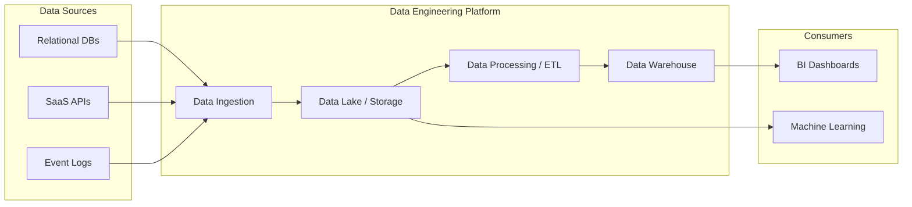

Trong kỷ nguyên số, chúng ta thường nghe nhiều về trí tuệ nhân tạo (AI), học máy (Machine Learning) hay những bảng dashboard phân tích kinh doanh (BI) lung linh sắc màu. Thế nhưng, đằng sau những báo cáo chuẩn xác hay những mô hình AI thông minh đó là một người hùng thầm lặng: **Kỹ thuật Dữ liệu (Data Engineering)**. 

Nếu ví dữ liệu như dòng dầu mỏ quý giá, thì các kỹ sư dữ liệu (Data Engineers) chính là những người thiết kế và vận hành các nhà máy lọc dầu cũng như hệ thống đường ống dẫn dầu khổng lồ, biến nguồn nguyên liệu thô sơ, lẫn tạp chất thành nguồn năng lượng tinh khiết, sẵn sàng đưa vào sử dụng.

---

## Kỹ thuật Dữ liệu thực sự là gì?

**Data Engineering** là một lĩnh vực chuyên môn tập trung vào việc thiết kế, xây dựng, vận hành và duy trì hệ thống kiến trúc dữ liệu quy mô lớn. Đây là sự giao thoa hài hòa giữa Kỹ thuật phần mềm (`Software Engineering`) và Quản trị dữ liệu (`Data Management`). 

Nhiệm vụ cốt lõi của Data Engineering là đảm bảo dòng dữ liệu thô (`raw data`) hỗn độn từ hàng trăm nguồn khác nhau được thu thập, xử lý, làm sạch và phân phối đến đúng nơi một cách bảo mật, ổn định và có khả năng mở rộng tối đa.

---

## Sự trỗi dậy của vai trò Kỹ sư dữ liệu

Tại sao các doanh nghiệp hiện nay lại săn đón Kỹ sư dữ liệu nhiều đến thế? Câu trả lời nằm ở ba đặc tính cốt lõi của Big Data (Velocity - Tốc độ, Volume - Khối lượng, Variety - Sự đa dạng):

1. **Sự phân mảnh dữ liệu**: Dữ liệu của một công ty không nằm yên một chỗ. Chúng rải rác ở khắp nơi: từ cơ sở dữ liệu vận hành ([OLTP](/concepts/database-storage/oltp/)), phần mềm SaaS (như Salesforce, HubSpot) cho đến log hành vi của người dùng trên web/app.
2. **Dữ liệu nhiễu và thiếu nhất quán**: Dữ liệu thô thường cực kỳ "bẩn". Có những dòng bị trùng lặp, thiếu thông tin, sai định dạng hoặc mang giá trị lỗi. Nếu phân tích trực tiếp trên đống dữ liệu này, kết quả nhận được sẽ hoàn toàn sai lệch.
3. **Bài toán hiệu năng**: Việc chạy trực tiếp các câu truy vấn phân tích nặng nề trên cơ sở dữ liệu đang vận hành (như DB của ứng dụng mua sắm) sẽ làm hệ thống bị chậm, thậm chí gây sập web.

Data Engineering xuất hiện để mở ra một "đường cao tốc" kết nối các ngõ hẻm dữ liệu thô, lọc sạch chúng và đưa về một "nhà kho" trung tâm ([Data Warehouse](/concepts/data-warehouse/data-warehouse/) hoặc [Data Lake](/concepts/data-lake-lakehouse/data-lake/)) để phân tích một cách an toàn và tối ưu nhất.

---

## Bốn trụ cột cốt lõi của Data Engineering

Để xây dựng một hệ thống dữ liệu hoàn chỉnh, các kỹ sư cần nắm vững bốn mảnh ghép quan trọng:

* **Thu nạp dữ liệu (Ingestion)**: Quá trình kéo dữ liệu từ các nguồn về. Nó có thể diễn ra theo lô định kỳ (`Batch`) hoặc theo thời gian thực liên tục (`Streaming`).
* **Lưu trữ dữ liệu (Storage)**: Lựa chọn mô hình và công nghệ lưu trữ phù hợp như Data Warehouse, Data Lake hoặc kiến trúc kết hợp Data Lakehouse.
* **Xử lý và Biến đổi dữ liệu (Processing & Transformation)**: Thực hiện các luồng biến đổi ETL (Extract, Transform, Load) hoặc ELT để lọc nhiễu, chuẩn hóa kiểu dữ liệu và tổng hợp thông tin.
* **Điều phối luồng công việc (Orchestration)**: Lên lịch trình chạy tự động và quản lý sự phụ thuộc giữa hàng trăm tác vụ khác nhau (ví dụ: dùng Apache Airflow để đảm bảo bảng A phải chạy xong thì bảng B mới được chạy).

---

## Quy trình xử lý dữ liệu thực tế diễn ra như thế nào?

Một dự án Data Engineering thông thường sẽ đi qua các bước sau:


1. **Khảo sát nhu cầu**: Xác định rõ đội ngũ phân tích (Analysts/Data Scientists) hay các phòng ban kinh doanh cần những dữ liệu gì.
2. **Xây dựng kết nối**: Viết các đoạn mã hoặc cấu hình các cổng kết nối (Connectors) để truy cập vào các hệ thống nguồn.
3. **Chuyển dữ liệu vào vùng đệm**: Vận chuyển dữ liệu thô vào vùng trung gian (Landing/Staging zone) một cách an toàn.
4. **Biến đổi dữ liệu**: Áp dụng các quy tắc nghiệp vụ (Business rules) thông qua SQL, Python hoặc Scala (sử dụng các công cụ mạnh mẽ như Spark).
5. **Cung cấp dữ liệu**: Nạp dữ liệu sạch vào các kho dữ liệu (Data Marts/Serving tables) để sẵn sàng khai thác.
6. **Giám sát chất lượng (Observability)**: Thiết lập hệ thống theo dõi tự động để phát hiện ngay khi luồng dữ liệu bị chậm hoặc gặp lỗi.

---

## Ví dụ thực tế về luồng xử lý dữ liệu

Giả sử bạn cần tính tổng doanh thu mỗi ngày từ một hệ thống bán hàng trực tuyến:

### Bước 1: Thu nạp dữ liệu (Data Ingestion) bằng Python
Đoạn code Python này sẽ lấy dữ liệu giao dịch từ API và lưu trực tiếp vào Data Lake (S3) dưới dạng file Parquet:
```python
import requests
import pandas as pd

response = requests.get("https://api.store.com/v1/sales?date=2026-06-07")
data = response.json()
df_raw = pd.DataFrame(data)
# Lưu raw data vào Data Lake (S3) dưới dạng Parquet
df_raw.to_parquet("s3://data-lake/raw/sales/2026-06-07.parquet")
```

### Bước 2: Biến đổi dữ liệu (Data Transformation) bằng SQL
Sử dụng SQL để làm sạch, lọc các giao dịch thành công và tính tổng doanh thu trên Data Warehouse:
```sql
-- Chạy trên Data Warehouse (ví dụ: BigQuery / Snowflake)
CREATE TABLE data_mart.daily_revenue AS
SELECT 
    DATE(transaction_timestamp) as sales_date,
    store_id,
    SUM(amount) as total_revenue
FROM staging.raw_sales
WHERE status = 'COMPLETED'
GROUP BY 1, 2;
```

---

## Kinh nghiệm đúc kết từ thực tế (Best Practices)

* **Thiết kế tính lũy đẳng ([Idempotency](/concepts/etl-elt/idempotency/))**: Hãy thiết kế sao cho dù bạn chạy lại một pipeline bao nhiêu lần đi chăng nữa, kết quả cuối cùng vẫn không thay đổi và không làm trùng lặp dữ liệu.
* **Quản lý hạ tầng bằng mã (Infrastructure as Code - IaC)**: Sử dụng các công cụ như Terraform để quản lý và định nghĩa tài nguyên máy chủ, cơ sở dữ liệu nhằm dễ dàng kiểm soát phiên bản và khôi phục khi gặp sự cố.
* **Kiểm thử chất lượng tự động**: Đừng đợi đến khi người dùng báo cáo lỗi. Hãy tích hợp sẵn các bài test chất lượng dữ liệu (như kiểm tra giá trị NULL, kiểm tra tính duy nhất) bằng các thư viện như Great Expectations hoặc [dbt](/concepts/transformation-analytics/dbt/) tests.
* **Tách rời Lưu trữ và Tính toán (Decoupling Storage and Compute)**: Giúp bạn linh hoạt mở rộng dung lượng lưu trữ mà không cần trả thêm tiền cho sức mạnh CPU không cần thiết, tối ưu hóa chi phí vận hành.

---

## Những sai lầm thường gặp

* **Quên thiết lập cảnh báo (Alerting)**: Pipeline bị lỗi âm thầm, không ai nhận được thông báo. Kết quả là sếp xem báo cáo với dữ liệu cũ từ 3 ngày trước mà không hề hay biết.
* **Hội chứng "Over-engineering"**: Lạm dụng các công nghệ thời thượng, phức tạp (như Kafka, Spark, Kubernetes) cho những dự án nhỏ, trong khi chỉ cần một đoạn script SQL cơ bản chạy bằng Cron job là đủ.
* **Bỏ quên Quản trị dữ liệu (Data Governance)**: Cứ cắm đầu xây pipeline mà không lưu trữ tài liệu (Metadata), không định nghĩa từ điển dữ liệu (Data Dictionary). Sau một thời gian, kho dữ liệu sẽ biến thành một "đầm lầy dữ liệu" (Data Swamp) không ai hiểu nổi.

---

## Phân tích ưu và nhược điểm (Trade-offs)

### Ưu điểm
* Đặt nền móng đáng tin cậy cho mọi phân tích chuyên sâu và các dự án AI/ML.
* Giải phóng sức lao động thủ công nhờ tự động hóa toàn bộ quy trình thu thập báo cáo.
* Đảm bảo tính nhất quán của dữ liệu trên toàn tổ chức (Single Source of Truth).

### Thách thức
* Đòi hỏi chi phí đầu tư lớn cho hạ tầng đám mây và đội ngũ nhân sự chuyên môn cao.
* Thời gian xây dựng ban đầu dài, giá trị mang lại thường gián tiếp nên khó đo lường ROI (Return on Investment) ngay lập tức.
* Dễ bị động khi các hệ thống nguồn thay đổi cấu trúc bảng ([Schema evolution](/concepts/data-lake-lakehouse/schema-evolution/)) đột ngột.

---

## Góc phỏng vấn: Những câu hỏi thường gặp

### 1. Phân biệt ETL và ELT. Khi nào ta nên dùng mô hình nào?
* **Mục đích của người phỏng vấn**: Đánh giá hiểu biết sâu sắc của bạn về sự dịch chuyển trong kiến trúc dữ liệu hiện đại.
* **Gợi ý trả lời**:
  * **[ETL](/concepts/etl-elt/etl/) (Extract, Transform, Load)**: Biến đổi dữ liệu trên một máy chủ trung gian trước khi nạp vào kho lưu trữ. Đây là lựa chọn tối ưu khi kho lưu trữ hạ nguồn không có khả năng tính toán mạnh, hoặc khi cần mã hóa/che giấu dữ liệu nhạy cảm trước khi lưu trữ.
  * **[ELT](/concepts/etl-elt/elt/) (Extract, Load, Transform)**: Nạp toàn bộ dữ liệu thô vào Data Warehouse trước rồi mới tận dụng sức mạnh tính toán cực khủng của DWH (như BigQuery, [Snowflake](/concepts/cloud-data-platform/snowflake/)) để biến đổi dữ liệu bằng SQL. Đây là xu hướng thịnh hành hiện nay nhờ chi phí lưu trữ đám mây ngày càng rẻ và tốc độ xử lý song song vượt trội của các Cloud DWH.
* **Lỗi cần tránh**: Tránh khẳng định phiến diện rằng ETL đã lỗi thời và ELT luôn tốt hơn. Cả hai đều có vị trí đứng tùy thuộc vào bài toán bảo mật và tài chính của doanh nghiệp.

### 2. Tính lũy đẳng (Idempotency) trong Data Pipeline là gì và tại sao nó lại quan trọng?
* **Mục đích của người phỏng vấn**: Đo lường kinh nghiệm thực chiến của bạn trong việc thiết kế và xử lý lỗi hệ thống.
* **Gợi ý trả lời**: Idempotency là thuộc tính đảm bảo một tác vụ xử lý dữ liệu khi chạy lại nhiều lần vẫn cho ra cùng một kết quả duy nhất. Trong thực tế, pipeline rất dễ bị lỗi giữa chừng do mất mạng hoặc quá tải. Thiết kế pipeline lũy đẳng giúp ta tự tin nhấn nút "Retry" mà không sợ dữ liệu bị nhân đôi (duplicate). Chúng ta thường đạt được điều này bằng cách sử dụng câu lệnh `UPSERT` (`MERGE`) hoặc xóa sạch dữ liệu của ngày cần chạy trước khi ghi đè dữ liệu mới (`Delete-Write` pattern).

## Tài liệu tham khảo

1. [What is Data Engineering?](https://www.ibm.com/topics/data-engineering) - IBM comprehensive topic guide on data engineering definition and lifecycle.
2. [What is Data Engineering?](https://www.databricks.com/glossary/data-engineering) - Databricks Glossary definition of data engineering and modern cloud [lakehouse](/concepts/data-lake-lakehouse/lakehouse/) solutions.
3. [What is Data Engineering?](https://cloud.google.com/discover/what-is-data-engineering) - Google Cloud Learn page for data engineering concepts, tools, and certifications.
4. [Fundamentals of Data Engineering Book](https://www.oreilly.com/library/view/fundamentals-of-data/9781098108298/) - O'Reilly page for the comprehensive guide book by Joe Reis and Matt Housley.
5. [Designing Data-Intensive Applications Book](https://www.oreilly.com/library/view/designing-data-intensive-applications/9781491903063/) - O'Reilly page for Martin Kleppmann's classic book on distributed systems and data design.

## Tóm tắt bằng tiếng Anh (English Summary)

**Data Engineering** focuses on the practical application of data collection and analysis. It involves designing, building, and maintaining the infrastructure and data pipelines (ETL/ELT) that transform raw data into a clean, reliable, and accessible format. This foundational practice enables Data Analysts and Data Scientists to derive insights, build reports, and train machine learning models efficiently, ensuring data scalability, reliability, and security across the organization.