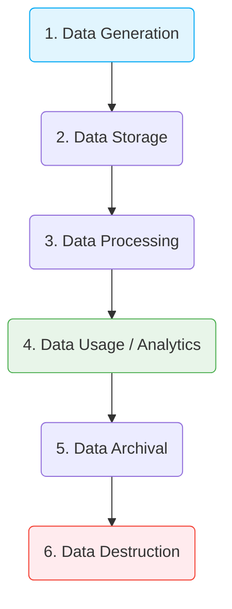

Giống như mọi sinh vật hay sản phẩm trong tự nhiên, dữ liệu cũng có một vòng đời riêng của nó. Nhiều người thường lầm tưởng dữ liệu là thứ tồn tại vĩnh viễn và càng tích lũy nhiều càng tốt. Thế nhưng, trong thực tế vận hành doanh nghiệp, dữ liệu không được quản lý vòng đời rõ ràng sẽ nhanh chóng trở thành gánh nặng tài chính và pháp lý khổng lồ. 

Hiểu rõ **Vòng đời Dữ liệu (Data Lifecycle)** giúp chúng ta biết cách ứng xử phù hợp với dữ liệu ở từng giai đoạn, từ lúc nó được tạo ra cho đến khi bị xóa bỏ hoàn toàn khỏi hệ thống.

---

## Kiến trúc và Vòng đời của dữ liệu

Quản lý Vòng đời Dữ liệu không chỉ là một kỹ thuật lập trình mà là một phần quan trọng của chiến lược Quản trị Dữ liệu (`Data Governance`). Một vòng đời dữ liệu tiêu chuẩn thường trải qua 6 chặng đường:



1. **Khởi tạo dữ liệu (Data Generation)**: Dữ liệu bắt đầu được sinh ra từ hành vi của người dùng trên ứng dụng, các thiết bị IoT, hay từ API của các bên đối tác.
2. **Thu nạp và Lưu trữ (Data Storage)**: Dữ liệu được đưa vào cơ sở dữ liệu hoặc kho lưu trữ thô (Data Lake).
3. **Chế biến dữ liệu (Data Processing)**: Tiến hành làm sạch, loại bỏ lỗi, ETL/ELT và chuẩn hóa dữ liệu sang cấu trúc có thể khai thác được.
4. **Khai thác dữ liệu (Data Usage)**: Giai đoạn mang lại giá trị lớn nhất cho doanh nghiệp. Dữ liệu được dùng để chạy các báo cáo BI, truy vấn phân tích ad-hoc hoặc huấn luyện các mô hình Machine Learning.
5. **Lưu trữ dài hạn (Data Archival)**: Khi dữ liệu đã cũ và rất ít khi được truy cập đến (ví dụ các hóa đơn giao dịch từ 3 năm trước), chúng ta tiến hành "đóng băng" và chuyển chúng sang các hệ thống lưu trữ giá rẻ hơn.
6. **Tiêu hủy dữ liệu (Data Destruction)**: Xóa bỏ vĩnh viễn dữ liệu khỏi tất cả các phương tiện lưu trữ (bao gồm cả các bản sao lưu backup) theo đúng chính sách lưu giữ (`Retention Policy`) của tổ chức.

---

## Tại sao doanh nghiệp phải quản lý vòng đời dữ liệu?

Việc giữ lại tất cả mọi thứ mãi mãi là một tư duy sai lầm và nguy hiểm:

* **Tối ưu hóa chi phí lưu trữ**: Một file log hệ thống ghi nhận lỗi ngày hôm nay là cực kỳ quý giá để lập trình viên sửa lỗi, nhưng 5 năm sau nó hoàn toàn vô giá trị. Quản lý vòng đời giúp di chuyển dữ liệu cũ từ các ổ đĩa SSD đắt đỏ sang các vùng lưu trữ lạnh (Cold Storage) chi phí thấp.
* **Tuân thủ pháp luật (Compliance)**: Các quy định bảo mật quốc tế (như GDPR tại Châu Âu) yêu cầu doanh nghiệp bắt buộc phải xóa thông tin cá nhân của người dùng khỏi toàn bộ hệ thống khi họ yêu cầu, hoặc sau một khoảng thời gian lưu trữ tối đa quy định.
* **Hạn chế rủi ro bảo mật**: Dữ liệu cũ không còn giá trị sử dụng nhưng vẫn nằm trong hệ thống sẽ trở thành miếng mồi ngon cho các hacker. Việc tiêu hủy đúng hạn giúp giảm thiểu diện tích bị tấn công (attack surface) của doanh nghiệp.

---

## Tự động hóa quản lý vòng đời dữ liệu

Trong thực tế, Kỹ sư dữ liệu không thực hiện việc dọn dẹp dữ liệu bằng tay mà thiết lập các quy tắc tự động hóa trên hạ tầng đám mây. 

Ví dụ dưới đây là cấu hình chính sách vòng đời dữ liệu (Lifecycle Rules) trên dịch vụ lưu trữ đối tượng **AWS S3**:

```json
{
    "Rules": [
        {
            "ID": "LogLifecycleRule",
            "Filter": { "Prefix": "app-logs/" },
            "Status": "Enabled",
            "Transitions": [
                {
                    "Days": 30,
                    "StorageClass": "STANDARD_IA"
                },
                {
                    "Days": 90,
                    "StorageClass": "GLACIER"
                }
            ],
            "Expiration": {
                "Days": 365
            }
        }
    ]
}
```

---

## Sai lầm thường gặp và Best Practices

### Các nguyên tắc vàng (Best Practices)
* **Phân loại dữ liệu ngay từ nguồn**: Đánh dấu rõ ràng đâu là thông tin định danh cá nhân nhạy cảm (PII) ngay khi thu nạp để áp dụng các chính sách vòng đời nghiêm ngặt và xóa bỏ sớm hơn dữ liệu thông thường.
* **Tự động hóa tuyệt đối**: Hãy để máy móc và các chính sách đám mây thực hiện việc dịch chuyển và xóa dữ liệu. Việc làm thủ công bằng tay chắc chắn sẽ dẫn đến sai sót và bỏ sót.
* **Mã hóa dữ liệu lưu trữ dài hạn**: Vùng lưu trữ lạnh (Archive) tuy ít truy cập nhưng vẫn phải được mã hóa đầu cuối và giới hạn quyền truy cập tối đa để tránh rò rỉ âm thầm.

### Những sai lầm thường gặp (Common Pitfalls)
* **Thói quen lưu trữ vô thời hạn (Hoarding)**: Tâm lý "cứ giữ lại biết đâu sau này có lúc dùng đến" khiến [Data Lake](/concepts/data-lake-lakehouse/data-lake/) biến thành một đầm lầy dữ liệu hỗn độn, kéo theo hóa đơn chi phí Cloud tăng vọt ngoài tầm kiểm soát.
* **Bỏ sót các bản sao lưu (Backups)**: Khi khách hàng yêu cầu xóa dữ liệu cá nhân theo luật định, đội ngũ kỹ thuật tiến hành xóa trên cơ sở dữ liệu chính nhưng lại quên mất các file sao lưu định kỳ nằm trên các ổ cứng dự phòng. Điều này vẫn bị coi là vi phạm pháp luật.

---

## Ưu nhược điểm và Đánh đổi (Pros & Cons)

### Ưu điểm
* Giảm thiểu hóa đơn chi phí hạ tầng Cloud một cách rõ rệt.
* Tăng tốc độ truy vấn cho hệ thống vì lượng dữ liệu quét (scan) được tinh lọc, chỉ tập trung vào phần dữ liệu "nóng" (Hot data) đang hoạt động.
* Đảm bảo doanh nghiệp an toàn trước các cuộc kiểm tra tuân thủ pháp lý.

### Thách thức
* Đòi hỏi sự thống nhất quy trình phức tạp giữa nhiều phòng ban (Kỹ thuật, Pháp chế, Nghiệp vụ kinh doanh) để đưa ra thời hạn lưu trữ hợp lý.
* Nếu đột xuất cần phân tích lại các dữ liệu quá khứ đã được đóng băng (Archived), quá trình khôi phục dữ liệu từ các vùng lưu trữ lạnh như Glacier có thể mất vài giờ đến vài ngày và phát sinh thêm chi phí truy xuất cao.

---

## Góc phỏng vấn: Những câu hỏi thường gặp

### 1. Phân biệt Hot Data và Cold Data trong Vòng đời dữ liệu?
* **Gợi ý trả lời**: 
  * **Dữ liệu nóng (Hot Data)**: Là dữ liệu mới được sinh ra và được truy cập, cập nhật liên tục. Đòi hỏi tốc độ đọc ghi (I/O) cực nhanh (ví dụ: thông tin giỏ hàng hiện tại, giao dịch trong ngày). Dữ liệu này được lưu trên các ổ SSD hiệu năng cao, bộ nhớ đệm (Cache) hoặc cơ sở dữ liệu chính với chi phí lưu trữ đắt nhất.
  * **Dữ liệu lạnh (Cold Data)**: Là dữ liệu cũ, hiếm khi được sờ tới (ví dụ: lịch sử truy cập web từ 2 năm trước). Tốc độ truy xuất không cần nhanh. Dữ liệu này được nén lại và chuyển sang lưu trữ trên các ổ HDD dung lượng lớn hoặc các dịch vụ lưu trữ đóng băng như S3 Glacier để tiết kiệm chi phí tối đa.
  * *Tóm lại*: Quản trị vòng đời dữ liệu thực chất là quá trình tự động dịch chuyển dữ liệu từ Hot sang Cold theo thời gian sử dụng.

### 2. Quy định GDPR "Right to be forgotten" (Quyền được lãng quên) ảnh hưởng như thế nào đến công việc của một Kỹ sư dữ liệu?
* **Gợi ý trả lời**: Đây là một bài toán hóc búa. Khi người dùng yêu cầu xóa tài khoản và thông tin cá nhân, chúng ta phải định vị và xóa sạch mọi thông tin liên quan đến họ trên toàn bộ hệ thống, bao gồm cả Data Warehouse, Data Lake và các bản backup cũ. Để tránh làm đứt gãy tính toàn vẹn của dữ liệu báo cáo (ví dụ xóa mất ID khách hàng sẽ làm sai lệch tổng doanh thu của tháng cũ), kỹ sư dữ liệu thường sử dụng hai kỹ thuật:
  * **Ẩn danh hóa (Anonymization)**: Thay thế các cột thông tin nhạy cảm (tên, email, số điện thoại) bằng các chuỗi ký tự ngẫu nhiên vô nghĩa, giữ lại dữ liệu giao dịch thuần túy để làm báo cáo tổng hợp.
  * **Xóa khóa giải mã (Crypto-shredding)**: Mã hóa dữ liệu của từng người dùng bằng các khóa mã hóa riêng biệt. Khi họ yêu cầu xóa dữ liệu, ta chỉ cần xóa khóa giải mã tương ứng của họ, khiến dữ liệu đó vĩnh viễn không thể đọc được nữa mà không cần can thiệp xóa vật lý trên ổ đĩa backup.

### 3. Làm thế nào để tự động hóa chính sách vòng đời của các phân vùng bảng (partitions) trong một Cloud Data Warehouse như BigQuery hay Snowflake?
* **Gợi ý trả lời**:
  * Đối với các hệ thống Cloud Data Warehouse, chúng ta có thể thiết lập chính sách phân vùng dựa trên thời gian (Time-partitioned tables) và áp dụng thời hạn hết hạn (Partition expiration).
  * Ví dụ, trong **[Google BigQuery](/concepts/cloud-data-platform/google-bigquery/)**, chúng ta có thể cấu hình thuộc tính `partition_expiration_days` cho bảng (ví dụ đặt là 90 ngày). BigQuery sẽ tự động xóa các phân vùng chứa dữ liệu cũ hơn 90 ngày mà không cần can thiệp thủ công.
  * Trong **[Snowflake](/concepts/cloud-data-platform/snowflake/)**, chúng ta có thể sử dụng chính sách `Time Travel` kết hợp với `Fail-safe` và thiết lập các cron job định kỳ chạy lệnh SQL để lưu trữ (archive) hoặc xóa dữ liệu cũ nhằm tối ưu hóa chi phí lưu trữ Storage.

## Đọc thêm và Tài liệu tham khảo

### Các khái niệm liên quan
* [Data Ingestion (Thu nạp dữ liệu)](/concepts/etl-elt/data-ingestion/) - Giai đoạn nạp dữ liệu vào hệ thống lưu trữ.
* [Data Pipeline (Đường ống dữ liệu)](/concepts/foundation/data-pipeline/) - Quy trình luân chuyển dữ liệu qua các chặng.
* [Data Warehouse (Kho dữ liệu)](/concepts/data-warehouse/data-warehouse/) - Hệ thống lưu trữ và phân tích dữ liệu tập trung.

## Tài liệu tham khảo

1. [DAMA International DMBOK](https://www.dama.org/cpages/dmbok) - Official page for the DAMA-DMBOK guide on [data governance](/concepts/governance-metadata/data-governance/) and lifecycle management.
2. [Amazon S3 Lifecycle Policies](https://docs.aws.amazon.com/AmazonS3/latest/userguide/object-lifecycle-mgmt.html) - AWS documentation on configuring rules to transition or expire objects automatically.
3. [Cloud Storage Object Lifecycle Management](https://cloud.google.com/storage/docs/lifecycle) - Google Cloud documentation on defining lifecycle policies for [cloud storage](/concepts/cloud-data-platform/cloud-storage/) buckets.
4. [Microsoft Purview Data Lifecycle Management](https://learn.microsoft.com/en-us/purview/data-lifecycle-management) - Microsoft official documentation on retention and deletion policies.
5. [Managing BigQuery Tables (Table Expiration)](https://cloud.google.com/bigquery/docs/managing-tables#table-expiration) - Google Cloud BigQuery documentation for setting automatic partition/table time-to-live policies.

## Tóm tắt bằng tiếng Anh (English Summary)

The **Data Lifecycle** represents the sequence of stages that data goes through from its initial generation or capture to its final destruction or archiving. Proper Data Lifecycle Management (DLM) involves setting policies for data retention, shifting older data to cheaper "cold" storage (archiving), and permanently purging data to comply with regulations like GDPR. This systematic approach optimizes cloud storage costs, enhances system performance, and mitigates legal and security risks by preventing indefinite data hoarding.
