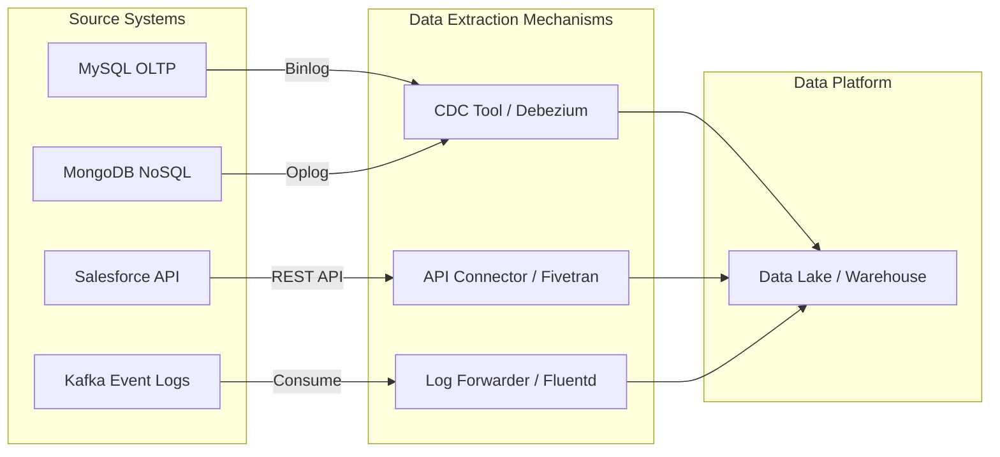

## Summary

Hệ thống Nguồn (Source Systems) là các hệ thống tác nghiệp (operational systems) nơi dữ liệu lần đầu tiên được tạo ra hoặc thu thập trong một tổ chức. Đây là điểm khởi đầu của mọi đường ống dữ liệu (Data Pipeline). Hiểu rõ đặc tính của từng loại hệ thống nguồn là yêu cầu bắt buộc để Data Engineer có thể thiết kế cơ chế trích xuất dữ liệu (Extraction) hiệu quả mà không làm ảnh hưởng đến hoạt động kinh doanh hiện tại.

---

## Definition

Trong ngữ cảnh Kỹ thuật Dữ liệu, **Source System** là bất kỳ ứng dụng, cơ sở dữ liệu, hoặc dịch vụ bên ngoài nào chứa dữ liệu thô (raw data) cần được đưa vào nền tảng dữ liệu trung tâm (Data Warehouse / Data Lake) để phân tích. Hệ thống nguồn thường được tối ưu hóa cho việc vận hành hàng ngày (ví dụ: ghi nhận đơn hàng, theo dõi nhịp tim), không phải để phục vụ các truy vấn báo cáo phức tạp.

---

## Why it exists

Không có dữ liệu, không có phân tích. Hệ thống nguồn sinh ra nhằm phục vụ trực tiếp cho người dùng cuối (User) hoặc thiết bị cuối (Device). 
Ví dụ:
* Một hệ thống bán hàng (Point of Sale - POS) sinh ra để nhân viên siêu thị có thể quét mã vạch và in hóa đơn.
* Một ứng dụng CRM (Salesforce) sinh ra để đội ngũ Sales ghi nhận thông tin khách hàng tiềm năng.
Chúng sinh ra để vận hành, nhưng chính những bản ghi vận hành đó lại là "mỏ vàng" để phân tích, do đó chúng trở thành hệ thống nguồn cho Data Team.

---

## Core idea

Các loại hệ thống nguồn phổ biến nhất bao gồm:
1. **Cơ sở dữ liệu quan hệ (OLTP Relational DBs)**: MySQL, PostgreSQL, SQL Server, Oracle. Chứa dữ liệu giao dịch cấu trúc chặt chẽ (đơn hàng, thông tin user).
2. **Cơ sở dữ liệu NoSQL**: MongoDB, Cassandra. Chứa dữ liệu bán cấu trúc, catalog sản phẩm linh hoạt.
3. **Ứng dụng SaaS (SaaS APIs)**: Salesforce, Zendesk, Shopify, Google Analytics. Dữ liệu nằm ở máy chủ của đối tác thứ ba, trích xuất thông qua REST/GraphQL API.
4. **Event Logs (Nhật ký sự kiện)**: Server logs (Nginx), Application logs, Web clickstreams. Thường lưu dưới dạng file phẳng (JSON/CSV) hoặc đẩy qua message broker (Kafka).
5. **IoT / Thiết bị ngoại vi**: Cảm biến nhiệt độ, thiết bị định vị GPS trên xe tải. Dữ liệu dạng time-series gửi liên tục với tần suất cao.

---

## How it works

Dữ liệu từ hệ thống nguồn có thể được trích xuất (Extract) theo các phương thức khác nhau tùy thuộc vào khả năng của hệ thống đó:
1. **Batch Extraction (Trích xuất theo lô)**:
   * **Full Load**: Đọc toàn bộ bảng dữ liệu mỗi lần. (Dùng cho bảng cấu hình nhỏ).
   * **[Incremental Load](/concepts/etl-elt/incremental-load/)**: Chỉ đọc các dòng mới hoặc vừa cập nhật dựa trên cột `updated_at`.
2. **[Change Data Capture](/concepts/etl-elt/change-data-capture/) (CDC)**: Đọc trực tiếp từ file nhật ký ghi (Transaction Log/Binlog) của database để lấy các thay đổi (INSERT, UPDATE, DELETE) ngay lập tức mà không cần câu lệnh `SELECT` làm nặng hệ thống.
3. **API Polling**: Gọi API định kỳ theo khoảng thời gian (ví dụ: mỗi giờ một lần) để lấy dữ liệu mới từ SaaS.
4. **Push/Streaming**: Hệ thống nguồn chủ động đẩy (push) dữ liệu vào một Message Queue (Kafka/RabbitMQ) mỗi khi có sự kiện xảy ra (Event-driven).

---

## Architecture / Flow


---

## Ví dụ thực tế (Practical example)

Giả sử hệ thống nguồn của bạn là MySQL chứa bảng `orders`. Để không làm chậm hệ thống khi khách hàng đang mua sắm, bạn cấu hình công cụ **Debezium** (một công cụ CDC) để đọc file `binlog` của MySQL.

Khi một đơn hàng mới được tạo (INSERT), Debezium bắt được sự kiện này trong `binlog` ở định dạng JSON:```json
{
  "op": "c",
  "after": {
    "order_id": 1001,
    "customer_id": 45,
    "total_price": 500.0,
    "status": "PENDING"
  }
}
```
Sau đó, sự kiện này được đẩy vào Kafka và cuối cùng lưu vào [Data Lake](/concepts/data-lake-lakehouse/data-lake/). Toàn bộ quá trình này không gửi bất kỳ câu lệnh `SELECT` nào vào MySQL, giúp bảo vệ hệ thống nguồn.

---

## Sai lầm thường gặp và Best Practices

* **Bảo vệ hệ thống nguồn là ưu tiên số 1**: Tuyệt đối không viết các câu lệnh SELECT quá phức tạp (ví dụ: JOIN nhiều bảng) trực tiếp lên hệ thống OLTP để trích xuất dữ liệu. Nếu cần dùng Batch, hãy trích xuất từ bản sao (Read Replica) thay vì Primary DB.
* **Sử dụng CDC thay vì Batch nếu có thể**: CDC giúp giảm thiểu độ trễ dữ liệu (latency) và không gây tải lên CPU/RAM của hệ thống nguồn.
* **Xử lý API Rate Limits**: Khi gọi SaaS API, phải thiết kế cơ chế back-off (chờ đợi và thử lại) để không bị block vì vượt quá giới hạn số lượng request.

* **Quét toàn bảng (Full Table Scan) liên tục**: Dùng lệnh `SELECT * FROM table` chạy mỗi 5 phút trên một bảng có hàng triệu dòng của hệ thống đang chạy. Điều này sẽ làm sập (crash) hệ thống kinh doanh.
* **Tin tưởng tuyệt đối vào hệ thống nguồn**: Mặc định rằng dữ liệu từ hệ thống nguồn luôn sạch. Thực tế, APIs thỉnh thoảng trả về JSON sai định dạng, logs bị thiếu dòng, DB có lỗi nhập liệu do human error.

## Ưu nhược điểm và Đánh đổi (Pros & Cons)

### Ưu điểm
* **Lấy dữ liệu nguyên bản nhất**: Trích xuất trực tiếp giúp lấy được dữ liệu thô, chưa qua xử lý hay biến đổi, đảm bảo tính toàn vẹn thông tin gốc.
* **Hỗ trợ thời gian thực**: Sử dụng cơ chế CDC giúp hệ thống cập nhật dữ liệu với độ trễ cực thấp mà không gây quá tải cho nguồn.

### Nhược điểm & Đánh đổi
* **Rủi ro Schema Drift**: Hệ thống nguồn có thể thay đổi cấu trúc bảng (Schema changes) bất kỳ lúc nào mà không báo trước cho Data Team (ví dụ: đổi tên cột `user_id` thành `customer_id`), làm gãy vỡ (break) các đường ống dữ liệu (Data Pipelines).
* **Quản trị phức tạp**: Cần phải quản lý rất nhiều loại credential (tài khoản đăng nhập, API keys) bảo mật khác nhau cho nhiều hệ thống nguồn khác nhau.

## Khái niệm liên quan

* [OLTP (Hệ thống giao dịch)](/concepts/database-storage/oltp/) - Hệ thống xử lý giao dịch trực tuyến.
* [Data Pipeline (Đường ống dữ liệu)](/concepts/foundation/data-pipeline/) - Đường ống luân chuyển dữ liệu.
* [Schema Drift (Trôi dạt cấu trúc)](/concepts/observability-reliability/schema-drift/) - Hiện tượng thay đổi cấu trúc dữ liệu nguồn.

## Tài liệu tham khảo

1. [Debezium Documentation](https://debezium.io/documentation/reference/stable/) - Red Hat open source platform for monitoring database transaction logs and capturing change data.
2. [Databricks Lakeflow](https://www.databricks.com/product/lakeflow) - Databricks product page explaining managed database replication and source system connectivity.
3. [AWS Database Migration Service Welcome Guide](https://docs.aws.amazon.com/dms/latest/userguide/Welcome.html) - AWS official guide on migrating and replicating data from source databases.
4. [What is Data Integration?](https://www.ibm.com/topics/data-integration) - IBM guide to consolidating and integrating diverse data sources.
5. [What is Change Data Capture (CDC)?](https://www.confluent.io/learn/change-data-capture/) - Confluent learning center article on the mechanics of CDC for streaming [data ingestion](/concepts/etl-elt/data-ingestion/).

## English Summary

Source Systems are the operational applications, databases, APIs, and logs where data originates. In [data engineering](/concepts/foundation/data-engineering/), extracting data safely from these systems is critical. Methods range from periodic batch extraction (Full or Incremental) using API polling or SQL queries, to real-time Change Data Capture (CDC) that reads database transaction logs. Best practices mandate protecting the performance of source systems, often by extracting from read replicas or using log-based CDC rather than heavy direct queries.