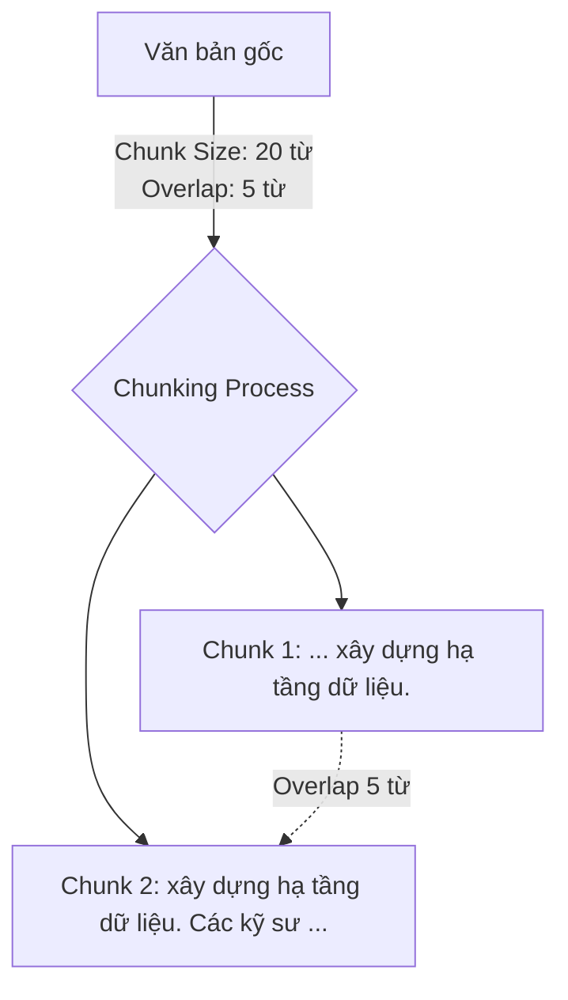

Khi xây dựng các ứng dụng Trí tuệ nhân tạo tạo sinh (GenAI), đặc biệt là các hệ thống trả lời câu hỏi dựa trên tài liệu doanh nghiệp sử dụng kiến trúc RAG (Retrieval-Augmented Generation), chúng ta thường gặp một bài toán: Làm thế nào để AI có thể đọc hiểu và tìm kiếm thông tin nhanh chóng trên những cuốn sách, báo cáo tài chính hay tài liệu kỹ thuật dài hàng trăm trang? Câu trả lời nằm ở một bước tiền xử lý cực kỳ quan trọng: **Chunking Strategy (Chiến lược phân tách văn bản)**.

## Nghệ thuật "chia để trị" văn bản trong kỷ nguyên GenAI

Nói một cách đơn giản, **Chunking** là hành động chia nhỏ một tài liệu văn bản dài thành các đoạn ngắn hơn, có kích thước tối ưu (gọi là các *chunks*). 

Hãy tưởng tượng bạn có một cuốn sách dày 500 trang. Bạn không thể ném toàn bộ cuốn sách này vào mô hình Embedding để chuyển đổi thành vector, bởi vì các mô hình này luôn có một giới hạn nghiêm ngặt về số lượng từ ngữ đầu vào `(Token limit)`. Thay vào đó, bạn cần cắt cuốn sách này thành hàng ngàn mảnh nhỏ. 

**Chunking Strategy** chính là phương pháp và nghệ thuật bạn lựa chọn để thực hiện những nhát cắt đó. Bạn có thể cắt ngẫu nhiên cứ mỗi 500 từ một đoạn, cắt theo từng trang sách, hoặc cắt một cách thông minh dựa trên cấu trúc ngữ nghĩa của văn bản. Mục tiêu tối thượng của chiến lược này là làm sao giữ cho các mảnh nhỏ sau khi cắt ra vẫn giữ nguyên vẹn được ngữ cảnh và ý nghĩa gốc của tác giả.

## Tại sao chúng ta không thể ném cả cuốn sách vào AI?

Có 3 lý do bắt buộc bạn phải thực hiện phân tách văn bản khi xây dựng các hệ thống AI:

1. **Giới hạn vật lý của mô hình Embedding**: Các mô hình nhúng phổ biến (như `text-embedding-ada-002` của OpenAI) có giới hạn đầu vào tối đa là 8192 tokens. Nếu bạn cố nhồi nhét một tài liệu dài hơn thế, mô hình sẽ lặng lẽ vứt bỏ toàn bộ phần nội dung thừa phía sau.
2. **Hiện tượng "loãng" ngữ nghĩa (Semantic Dilution)**: Nếu bạn cố nén toàn bộ một bài báo cáo dài 50 trang thành một vector duy nhất, vector đó sẽ chứa một mớ hỗn độn nhiều ý tưởng khác nhau. Khi người dùng hỏi về một chi tiết nhỏ nằm ở trang 12, thuật toán tìm kiếm khoảng cách Vector sẽ không đủ độ nhạy để nhận diện ra tài liệu đó nữa.
3. **Giới hạn Context Window của LLM**: Khi LLM sinh câu trả lời, việc nhồi nhét cả tập tài liệu khổng lồ vào Prompt không chỉ làm tăng chi phí API một cách chóng mặt mà còn khiến mô hình dễ bị nhiễu thông tin – hiện tượng này được gọi là "Lost in the middle" (AI bị quên mất thông tin nằm ở giữa tài liệu).

## Hai trụ cột cốt lõi: Chunk Size và Chunk Overlap

Mọi chiến lược phân tách văn bản đều xoay quanh hai tham số cơ bản sau:
* **Chunk Size (Kích thước khối)**: Số lượng ký tự `(Character)` hoặc `Token` tối đa được phép xuất hiện trong một khối dữ liệu (ví dụ: 1000 tokens).
* **Chunk Overlap (Độ chồng lấp)**: Số lượng từ hoặc ký tự ở phần cuối của khối trước được giữ lại và lặp lại ở phần đầu của khối tiếp theo (ví dụ: 200 tokens). Độ chồng lấp này cực kỳ quan trọng, đóng vai trò như một chiếc cầu nối ngữ nghĩa, giúp đảm bảo các câu văn dài hoặc các ý nghĩa liên tục không bị chặt đứt làm đôi một cách thô bạo.

## Điểm danh các chiến lược phân tách văn bản phổ biến

### 1. Cắt theo kích thước cố định (Fixed-size Chunking)
Đây là cách tiếp cận thô sơ nhất. Hệ thống cứ đếm đủ số ký tự hoặc token quy định là thực hiện một nhát cắt, bất kể đoạn đó đang nằm ở giữa một câu hay giữa một từ.
* *Cách thực hiện*: Cứ 500 ký tự cắt 1 nhát, chồng lấp 50 ký tự.
* *Ưu điểm*: Cực kỳ nhanh, thuật toán siêu đơn giản.
* *Nhược điểm*: Dễ làm đứt mạch ý nghĩa của câu (ví dụ: từ "Apple" bị chia đôi thành "Ap" ở chunk trước và "ple" ở chunk sau).

### 2. Cắt đệ quy theo ký tự (Recursive Character Text Splitting)
Đây được coi là "tiêu chuẩn vàng" và là lựa chọn mặc định trong các thư viện lớn như LangChain hay LlamaIndex.
* *Cách thực hiện*: Thuật toán sẽ cố gắng cắt văn bản dựa trên các dấu phân cách lớn nhất trước (như dấu xuống dòng kép `\n\n` đại diện cho kết thúc đoạn văn). Nếu đoạn đó vẫn dài hơn cấu hình `Chunk Size`, nó sẽ tìm các dấu phân cách nhỏ hơn như dấu xuống dòng đơn `\n`, rồi đến dấu chấm câu `.`, khoảng trắng giữa các từ, và cuối cùng mới là ký tự thô.
* *Ưu điểm*: Tôn trọng tối đa cấu trúc ngữ pháp tự nhiên của con người, giữ cho các câu văn và đoạn văn được trọn vẹn nhất có thể.

### 3. Cắt theo cấu trúc tài liệu (Structural Chunking)
Chiến lược này phân tích cấu trúc định dạng của file để thực hiện phân tách.
* *Cách thực hiện*: Sử dụng code để đọc các thẻ tiêu đề HTML (`<h1>`, `<h2>`) hoặc tiêu đề Markdown (`#`, `##`) để cắt nhỏ tài liệu.
* *Ưu điểm*: Rất thích hợp cho tài liệu kỹ thuật, hướng dẫn sử dụng, nơi mỗi mục tiêu đề lớn nhỏ đã tự đóng gói một chủ đề ngữ nghĩa riêng biệt.

### 4. Cắt theo ngữ nghĩa (Semantic Chunking)
Đây là phương pháp nâng cao, sử dụng AI để tìm điểm cắt.
* *Cách thực hiện*: Sử dụng một mô hình nhúng nhỏ để tính toán vector cho từng câu văn. Khi khoảng cách vector giữa hai câu liên tiếp vượt quá một ngưỡng nhất định (tức là chủ đề nói chuyện đã chuyển sang hướng khác), thuật toán sẽ tạo ra nhát cắt tại đó.
* *Ưu điểm*: Tạo ra các khối văn bản có tính nhất quán về mặt nội dung cực kỳ cao.
* *Nhược điểm*: Tốn thời gian tính toán và chi phí gọi API cao vì phải tạo vector cho từng câu một.

## Trực quan hóa quy trình Recursive Chunking với Overlap

Hãy xem ví dụ đơn giản dưới đây khi chúng ta cắt một đoạn văn bản với cấu hình **Chunk Size: 20 từ** và **Overlap: 5 từ**:

```text
Văn bản gốc: "Data Engineering là một ngành phát triển mạnh. Nó tập trung vào việc xây dựng hạ tầng dữ liệu. Các kỹ sư dữ liệu sử dụng Spark và Kafka."

Chunk 1: "Data Engineering là một ngành phát triển mạnh. Nó tập trung vào việc xây dựng hạ tầng dữ liệu."
Chunk 2 (chứa Overlap): "xây dựng hạ tầng dữ liệu. Các kỹ sư dữ liệu sử dụng Spark và Kafka."
```

Quy trình này được mô tả qua sơ đồ sau:



## Cài đặt thực tế với Python và LangChain

Dưới đây là đoạn code Python minh họa cách cấu hình và chạy thử chiến lược `RecursiveCharacterTextSplitter` quen thuộc:

```python
from langchain.text_splitter import RecursiveCharacterTextSplitter

text = """Data Engineering là một ngành phát triển mạnh. Nó tập trung vào việc xây dựng hạ tầng dữ liệu. 
Các kỹ sư dữ liệu sử dụng Spark và Kafka. RAG kết hợp LLM với Vector Database để tạo ra hệ thống thông minh."""

# Khởi tạo bộ chia văn bản
text_splitter = RecursiveCharacterTextSplitter(
    chunk_size=100,
    chunk_overlap=20,
    length_function=len,
    separators=["\n\n", "\n", " ", ""]
)

# Tiến hành chia nhỏ văn bản
chunks = text_splitter.split_text(text)

for i, chunk in enumerate(chunks):
    print(f"Chunk {i+1}: {chunk}")
```

## Nghệ thuật tinh chỉnh hiệu năng (Best Practices)

* **Bắt đầu với cấu hình an toàn**: Nếu chưa biết chọn gì, hãy bắt đầu với `RecursiveCharacterTextSplitter`, đặt `chunk_size = 1000` tokens và `chunk_overlap = 200` tokens. Đây là cấu hình tối ưu cho phần lớn các tài liệu văn bản thông thường.
* **Luôn chú ý đến giới hạn của mô hình Embedding**: Nếu bạn dùng các mô hình mã nguồn mở thế hệ cũ (thường giới hạn 512 tokens), bạn bắt buộc phải cấu hình chunk size dưới 500. Nếu đặt quá lớn, phần đuôi của chunk sẽ bị cắt bỏ một cách thầm lặng và làm hỏng chất lượng vector.
* **Cấu hình dựa trên hành vi truy vấn của người dùng**:
  * *Hỏi đáp chi tiết (Factoid)*: Nếu người dùng thường hỏi các câu hỏi rất cụ thể (ví dụ: "Doanh thu quý 2 năm 2025 là bao nhiêu?"), hãy chọn Chunk size nhỏ (250-500 tokens). Điều này giúp Vector Database tìm kiếm đúng vị trí và chính xác nhất.
  * *Hỏi đáp tổng quát (Synthesis)*: Nếu người dùng yêu cầu tóm tắt hoặc so sánh (ví dụ: "Tóm tắt các điểm chính của chương này"), bạn cần chọn Chunk size lớn (1000-2000 tokens) để cung cấp đủ ngữ cảnh bao quát cho LLM.

## Sự đánh đổi giữa Lớn và Nhỏ (Trade-offs)

### Khi chọn Chunk Size Lớn (ví dụ: 2000 tokens)
* **Ưu điểm**: Cung cấp bối cảnh toàn diện và đầy đủ, giúp LLM hiểu được các mối liên kết thông tin phức tạp để sinh câu trả lời chất lượng.
* **Nhược điểm**: Làm loãng thông tin trong vector (Recall kém cho các câu hỏi chi tiết), tiêu tốn nhiều token khi gửi prompt đến LLM, làm tăng chi phí vận hành.

### Khi chọn Chunk Size Nhỏ (ví dụ: 250 tokens)
* **Ưu điểm**: Tìm kiếm vector cực kỳ nhạy và chính xác, truy xuất nhanh, tiết kiệm tối đa chi phí token cho LLM.
* **Nhược điểm**: Đoạn thông tin gửi cho LLM quá ngắn và cụt lủn, khiến mô hình dễ bị mất góc nhìn toàn cảnh dẫn đến hiện tượng "ảo giác" (hallucination).

## Khi nào cần và không cần áp dụng Chunking?

**Cần áp dụng khi:**
* Xây dựng hệ thống RAG xử lý các tài liệu phi cấu trúc như sách, file PDF hướng dẫn, tài liệu kỹ thuật, trang web.

**Không áp dụng khi:**
* Dữ liệu đầu vào của bạn đã có cấu trúc rõ ràng (như các dòng trong Database SQL, các hàng trong file CSV). Với loại dữ liệu này, hãy chuyển đổi trực tiếp mỗi hàng thành một đoạn văn bản hoặc định dạng JSON rồi mang đi nhúng toàn bộ, tuyệt đối không nên chia nhỏ tiếp.

## Góc phỏng vấn: Thử thách tư duy thực chiến

### 1. Tại sao Chunk Overlap (Độ chồng lấp) lại quan trọng trong Chunking Strategy?
* **Mục đích câu hỏi**: Kiểm tra mức độ am hiểu thực tế về kỹ thuật xử lý ngôn ngữ tự nhiên (NLP) của ứng viên.
* **Gợi ý trả lời**:
  * Nếu không có overlap (hoặc cắt cứng nhắc), điểm cắt có thể rơi vào ngay giữa một câu chứa thông tin quan trọng. Việc chia cắt chủ ngữ ở chunk trước và vị ngữ ở chunk sau sẽ khiến cả hai chunk đó mất đi ý nghĩa trọn vẹn khi chuyển đổi sang vector.
  * Overlap đóng vai trò như một cửa sổ trượt giữ lại ngữ cảnh liên kết. Nó đảm bảo các thông tin liền mạch ở vùng giáp ranh được giữ lại đầy đủ ở cả hai khối kề nhau, giúp mô hình embedding tạo ra các vector phản ánh chính xác ý nghĩa của văn bản.

### 2. Sự khác biệt giữa việc đếm Chunk size bằng "Character" (Ký tự) và "Token" là gì? Cái nào tốt hơn?
* **Mục đích câu hỏi**: Đánh giá sự hiểu biết của ứng viên về cách các mô hình ngôn ngữ lớn xử lý văn bản đầu vào.
* **Gợi ý trả lời**:
  * Ký tự là đếm từng chữ cái đơn lẻ (A, B, C). Token là đơn vị ngôn ngữ mà LLM thực sự tiếp nhận (có thể là một từ hoặc một phần của từ). Thông thường, 1 token tiếng Anh tương đương với khoảng 4 ký tự. Tuy nhiên, với các ngôn ngữ có dấu phức tạp như tiếng Việt, một từ có thể bị phân tách thành nhiều tokens nhỏ hơn.
  * Sử dụng đơn vị **Token** luôn luôn tốt hơn. Lý do là giới hạn đầu vào của cả mô hình Embedding và LLM đều được tính bằng Token. Việc đếm theo Token (thông qua các thư viện như `tiktoken` của OpenAI) giúp chúng ta kiểm soát chính xác dung lượng dữ liệu truyền đi, tránh việc vượt quá giới hạn của mô hình một cách vô tình.

### 3. Kỹ thuật Parent-Child Chunking (hay Auto-merging Retriever) hoạt động thế nào và nó giải quyết bài toán đánh đổi nào?
* **Mục đích câu hỏi**: Kiểm tra kiến thức về các kỹ thuật RAG nâng cao (Advanced RAG).
* **Gợi ý trả lời**:
  * Kỹ thuật này giải quyết nghịch lý: *"Chunk nhỏ thì tìm kiếm vector chính xác nhưng thiếu ngữ cảnh cho LLM, trong khi chunk lớn thì nhiều ngữ cảnh nhưng tìm kiếm kém nhạy"*.
  * Cách hoạt động: Tài liệu ban đầu được cắt thành các khối lớn (Parent Chunks), sau đó mỗi Parent Chunk tiếp tục được chia nhỏ thành các khối con (Child Chunks).
  * Chúng ta chỉ mang các Child Chunks đi tạo vector và lưu vào Vector Database. Khi người dùng đặt câu hỏi, hệ thống sẽ thực hiện tìm kiếm vector trên các Child Chunks nhỏ này để đạt độ chính xác cao nhất. Tuy nhiên, trước khi gửi thông tin cho LLM sinh câu trả lời, hệ thống sẽ tự động tra cứu ngược lại để lấy toàn bộ nội dung của Parent Chunk tương ứng. Nhờ đó, LLM có đầy đủ bối cảnh rộng để trả lời mà không lo bị cụt thông tin.

## Khái niệm liên quan & Tài liệu tham khảo

**Khái niệm liên quan:**
* [Vector Database](/concepts/genai-ml/vector-store/)
* [Embeddings](/concepts/genai-ml/embeddings/)
* [RAG (Retrieval-Augmented Generation)](/concepts/genai-ml/rag/)

## Tài liệu tham khảo

1. [Chunking Strategies for LLM Applications](https://www.pinecone.io/learn/chunking-strategies/) - Pinecone Learning Center guide to text splitting methods and parameters.
2. [LangChain Text Splitters Concept Guide](https://python.langchain.com/docs/concepts/text_splitters/) - LangChain documentation explaining character and token splitters.
3. [LlamaIndex Node Parsers and Text Splitters](https://docs.llamaindex.ai/en/stable/module_guides/loading/node_parsers/) - LlamaIndex guide on transforming documents into searchable nodes.
4. Effective Chunking Strategies for RAG - Cohere official documentation explaining best practices for text chunking.
5. [How to count tokens with tiktoken](https://cookbook.openai.com/examples/how_to_count_tokens_with_tiktoken) - OpenAI Cookbook guide for precise token counting when preprocessing text.

## English Summary

Chunking Strategy is the fundamental text preprocessing step in Retrieval-Augmented Generation (RAG) pipelines. It involves breaking down lengthy unstructured documents into smaller, manageable segments (chunks) prior to vector embedding. This is necessary because embedding models and LLMs have strict token limits and suffer from semantic dilution if applied to overly long texts. While fixed-size chunking is simple, Recursive Character Splitting combined with an optimal "Chunk Overlap" is the industry standard, ensuring sentences remain intact and semantic continuity is preserved across chunks. Balancing chunk size is crucial: smaller chunks yield higher retrieval precision, whereas larger chunks provide richer context for the LLM to generate comprehensive answers.
