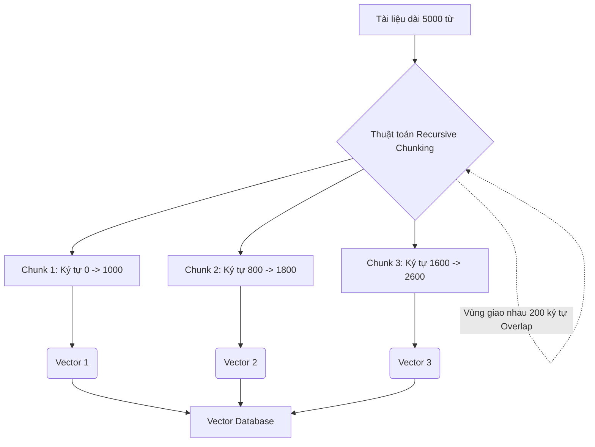

Nếu bạn đang bước chân vào thế giới của Trí tuệ nhân tạo tạo sinh (GenAI) hoặc đang xây dựng các hệ thống tìm kiếm thông minh dựa trên dữ liệu doanh nghiệp ([RAG](/concepts/genai-ml/rag/)), có một thuật ngữ bạn sẽ nghe thấy hàng ngày: **Chunking (Phân tách văn bản)**. Mặc dù nghe có vẻ đơn giản là "cắt nhỏ văn bản", nhưng đây lại là bước tiền xử lý mang tính quyết định đến việc AI của bạn trả lời thông minh hay ngây ngô.

## Chunking: Nghệ thuật "chẻ nhỏ" văn bản cho trí tuệ nhân tạo

Trong bối cảnh hệ thống tìm kiếm ngữ nghĩa `(Semantic Search)` và các mô hình ngôn ngữ lớn (LLM), **Chunking** là thuật toán phân chia nhỏ các nguồn dữ liệu phi cấu trúc (như sách, file PDF, trang web) thành các đoạn văn ngắn gọn hơn, có kích thước vừa phải và hợp lý (gọi là các *chunks*).

Mỗi mảnh nhỏ (chunk) sau khi được cắt ra sẽ đại diện cho một ý tưởng cụ thể và được gửi qua mô hình Embedding để chuyển đổi thành một vector độc lập trước khi lưu vào [Vector Database](/concepts/genai-ml/vector-database/). Khi người dùng đặt câu hỏi, hệ thống sẽ chỉ tìm kiếm và trả về các đoạn thông tin nhỏ liên quan trực tiếp đến câu hỏi đó, thay vì cố gắng đọc toàn bộ tài liệu khổng lồ.

## Tại sao không thể nhồi nhét tài liệu nguyên bản vào Vector DB?

Có hai lý do vật lý và kỹ thuật cốt lõi buộc chúng ta phải thực hiện bước chia nhỏ này:

1. **Giới hạn đầu vào của mô hình Embedding**: Hầu hết các mô hình nhúng (như BERT hay các dòng Sentence-Transformers) đều có một giới hạn cứng về độ dài chuỗi ký tự đầu vào `(Max Sequence Length)`, thường dao động từ 512 đến 8192 tokens. Nếu bạn đưa vào một bài báo dài 10.000 từ, mô hình sẽ tự động cắt bỏ phần đuôi mà không hề báo trước, gây mất mát dữ liệu nghiêm trọng.
2. **Hiện tượng "loãng" ngữ nghĩa (Semantic Dilution)**: Một vector nhúng (ví dụ 768 chiều) giống như một cái bình nước. Bạn có thể đổ đầy thông tin của một câu ngắn: *"Cách đổi mật khẩu Wi-Fi"* và bình nước sẽ giữ nguyên vị ngọt đậm đà của ý tưởng đó. Nhưng nếu bạn cố ép mô hình nhúng cả một cuốn sách hướng dẫn IT dài 50 trang vào đúng một vector đó, hương vị ban đầu sẽ bị hòa tan hoàn toàn. Câu hỏi truy vấn của người dùng về mật khẩu Wi-Fi sẽ bị chìm nghịch giữa hàng ngàn chủ đề khác và không thể tìm thấy.

## Những nguyên tắc vàng để tạo nên một Chunk chất lượng

Để chia nhỏ tài liệu một cách hiệu quả, bạn cần ghi nhớ ba quy tắc vàng sau:

* **Nguyên tắc Goldilocks (Sự cân bằng)**: Đừng cắt chunk quá to, vì ngữ nghĩa sẽ bị loãng và tìm kiếm kém chính xác. Nhưng cũng đừng cắt chunk quá nhỏ (ví dụ chỉ 1 câu đơn), vì khi đó đoạn văn sẽ bị mất bối cảnh ngữ cảnh `(Context)` cần thiết để LLM có thể đọc hiểu và trả lời trôi chảy.
* **Vùng đệm gối đầu (Overlap/Stride)**: Khi chia cắt tài liệu, luôn giữ lại một phần cuối của đoạn trước để lặp lại ở đầu đoạn sau. Cơ chế này giống như một dải keo dính giúp nối liền các mạch ý tưởng bị cắt ngang, bảo vệ ngữ cảnh ở ranh giới vết cắt.
* **Tôn trọng cấu trúc ngữ pháp**: Một thuật toán chia cắt thông minh sẽ luôn ưu tiên cắt ở dấu xuống dòng, dấu chấm câu, thay vì cắt ngang xương giữa một từ hoặc một cụm từ.

## Các lát cắt điển hình: Bạn sẽ chia nhỏ văn bản như thế nào?

* **Cắt theo kích thước cố định (Fixed-size Chunking)**: Thuật toán cứ đếm đủ số lượng ký tự hoặc token cấu hình sẵn là cắt. Rất nhanh và đơn giản, nhưng điểm trừ lớn là dễ cắt ngang giữa một câu đang dang dở.
* **Cắt đệ quy (Recursive Character Chunking)**: Thuật toán thông minh thử cắt ở các ranh giới lớn như dấu xuống dòng kép `\n\n` (để giữ nguyên cấu trúc đoạn văn). Nếu đoạn văn vẫn quá lớn, nó chuyển sang cắt ở dấu xuống dòng đơn `\n`, rồi dấu chấm `. `, khoảng trắng ` `, và cuối cùng mới là ký tự thô. Đây là cách làm chuẩn mực và hiệu quả nhất hiện nay.
* **Cắt theo cấu trúc tài liệu (Document/Semantic Chunking)**: Thích hợp với các file Markdown, HTML hay PDF. Hệ thống sẽ phát hiện các thẻ tiêu đề (H1, H2, H3) để thực hiện vết cắt, đảm bảo mỗi chunk chứa trọn vẹn một tiểu mục nội dung.

## Sơ đồ hóa quy trình cắt và lưu trữ Vector

Dưới đây là mô hình minh họa cách một tài liệu dài được cắt nhỏ thành các chunk có overlap, sau đó chuyển hóa thành vector và lưu trữ:



## Bắt tay vào code với Python và LangChain

Hãy cùng xem cách hiện thực hóa chiến lược `RecursiveCharacterTextSplitter` bằng Python với thư viện LangChain:

```python
from langchain.text_splitter import RecursiveCharacterTextSplitter

text = """... (Một bài viết siêu dài của bạn ở đây) ..."""

text_splitter = RecursiveCharacterTextSplitter(
    chunk_size=1000,     # Giới hạn tối đa 1000 ký tự cho mỗi chunk
    chunk_overlap=200,   # Giữ lại 200 ký tự giao nhau để bảo toàn bối cảnh
    length_function=len, # Đo độ dài bằng số ký tự
    separators=["\n\n", "\n", ".", " ", ""] # Mức độ ưu tiên cắt từ lớn đến nhỏ
)

chunks = text_splitter.split_text(text)

print(f"Tổng số chunks tạo ra: {len(chunks)}")
print(f"Kích thước chunk đầu tiên: {len(chunks[0])} ký tự")
```

## Kinh nghiệm thực chiến khi làm việc với Chunking (Best Practices)

* **Thiết lập dựa trên [Context Window](/concepts/genai-ml/context-window/) của LLM**: Nếu ứng dụng RAG của bạn cần tổng hợp ý kiến từ nhiều tài liệu khác nhau, hãy chọn kích thước chunk nhỏ (256-512 tokens) để có thể nhồi được nhiều chunk khác nhau vào prompt của LLM. Ngược lại, nếu cần LLM phân tích sâu một chủ đề phức tạp, hãy chọn chunk lớn (1000-2000 tokens).
* **Đừng quên cài đặt Overlap**: Tỉ lệ overlap an toàn và hiệu quả nhất thường dao động trong khoảng **10% - 20%** kích thước chunk. Ví dụ, với kích thước chunk là 500 tokens, bạn nên đặt overlap từ 50 đến 100 tokens.
* **Gắn kèm Metadata**: Khi chia cắt tài liệu lớn thành hàng trăm mảnh nhỏ, hãy luôn đính kèm các thông tin bổ sung (siêu dữ liệu) cho từng chunk như `{"source": "tai_lieu_ky_thuat.pdf", "page": 15, "chapter": 3}`. Điều này giúp bạn dễ dàng lọc kết quả hoặc truy ngược lại nguồn gốc văn bản khi cần thiết.

## Những sai lầm kinh điển dễ làm sập pipeline

* **Đếm size bằng ký tự nhưng mô hình đọc bằng token**: Đây là lỗi cực kỳ phổ biến. Các mô hình nhúng chỉ hiểu khái niệm token. Nếu bạn đặt `chunk_size = 2000` ký tự cho văn bản tiếng Việt, do đặc thù ngôn ngữ có dấu, số lượng token thực tế có thể vượt quá 1000 tokens, làm tràn giới hạn của các mô hình BERT cũ (giới hạn 512 tokens) và gây ra lỗi. Hãy sử dụng các thư viện như `tiktoken` để đếm chính xác số token trước khi cắt.
* **Mất kết nối thông tin toàn cục**: Việc cắt nhỏ làm đứt mạch liên kết các đại từ. Ví dụ, chunk 1 viết: *"Google đã phát hành mô hình AI mới"*, chunk 2 bị cắt ra chỉ còn câu: *"Họ hy vọng nó sẽ thay đổi cuộc chơi"*. Nếu Vector DB chỉ tìm thấy chunk 2, LLM sẽ hoàn toàn chịu thua không biết "Họ" và "nó" ở đây là ai. Để khắc phục, bạn nên tham khảo kỹ thuật *Parent Document Retrieval* để liên kết các chunk nhỏ với tài liệu mẹ chứa nó.

## Bức tranh hai mặt: Được gì và mất gì?

### Điểm cộng
* **Độ tập trung ngữ nghĩa tối đa**: Giúp Vector Database tìm đúng phân đoạn trả lời chính xác cho câu hỏi của người dùng.
* **Tiết kiệm chi phí**: Chỉ gửi các phần văn bản liên quan nhất cho LLM thay vì bắt nó đọc cả cuốn sách dày cộp, giúp giảm đáng kể chi phí gọi API.

### Điểm trừ
* **Chia cắt cấu trúc tổng thể**: Các mối quan hệ mang tính hệ thống bắc cầu nằm rải rác ở đầu và cuối tài liệu sẽ bị chặt đứt.
* **Tăng gánh nặng cơ sở dữ liệu**: Một tài liệu gốc duy nhất có thể biến thành hàng ngàn bản ghi vector, đòi hỏi dung lượng lưu trữ lớn hơn cho Vector DB.

## Khi nào cần ứng dụng và khi nào nên bỏ qua?

* **Nên dùng**: Khi bạn đang xây dựng các pipeline nạp dữ liệu ([Data Ingestion](/concepts/etl-elt/data-ingestion/)) cho các ứng dụng hỏi đáp tài liệu RAG, hoặc chuẩn bị lập chỉ mục tìm kiếm ngữ nghĩa cho Vector DB.
* **Nên tránh**: Đừng áp dụng cho các dữ liệu bảng biểu có cấu trúc rõ ràng (như Database SQL, file CSV). Với loại dữ liệu này, hãy chuyển đổi nguyên vẹn từng dòng thành một đoạn văn bản hoặc JSON và mang đi tạo vector, không nên chia nhỏ thêm.

## Góc phỏng vấn: Thử thách kiến thức hệ thống

### 1. Tại sao chúng ta cần tham số "Chunk Overlap" khi phân tách văn bản? Điều gì xảy ra nếu Overlap = 0?
* **Mục đích câu hỏi**: Kiểm tra hiểu biết thực tế và tư duy xử lý dữ liệu NLP của ứng viên.
* **Gợi ý trả lời**:
  * Chunk Overlap tạo ra một vùng đệm giao nhau giữa hai khối văn bản kế tiếp. Vì ngôn ngữ con người có tính liên kết chặt chẽ, việc đặt Overlap = 0 có thể dẫn đến việc các câu văn quan trọng bị chia cắt cơ học làm đôi. Khi đó, chủ ngữ nằm ở chunk 1 còn vị ngữ lại nằm ở chunk 2, làm mất đi ý nghĩa trọn vẹn của cả hai chunk khi chuyển đổi thành vector. 
  * Overlap giúp bảo toàn mạch ngữ cảnh liền mạch tại các điểm cắt, đảm bảo khi Vector DB tìm kiếm độc lập từng chunk, bối cảnh thông tin vẫn đầy đủ để LLM trả lời tốt nhất.

### 2. Kỹ thuật "Parent Document Retrieval" khắc phục nhược điểm gì của Fixed-size Chunking?
* **Mục đích câu hỏi**: Đánh giá kiến thức về các kiến trúc RAG nâng cao (Advanced RAG).
* **Gợi ý trả lời**:
  * Kỹ thuật này giải quyết nghịch lý về kích thước chunk: Chunk nhỏ thì tìm kiếm vector chính xác nhưng thiếu bối cảnh cho LLM, chunk lớn thì giàu ngữ cảnh nhưng tìm kiếm vector kém nhạy.
  * Parent Document Retrieval khắc phục bằng cách tách biệt hai quá trình: Chúng ta cắt nhỏ tài liệu thành các Child Chunks để lập chỉ mục và tìm kiếm vector hiệu quả. Nhưng khi gửi dữ liệu cho LLM, hệ thống sẽ tự động đối chiếu ID của Child Chunk tìm được để lấy toàn bộ đoạn văn lớn gốc chứa nó (Parent Document). Kết quả là chúng ta đạt được cả hai mục tiêu: tìm kiếm cực nhạy và trả lời cực kỳ đầy đủ bối cảnh.

## Khái niệm liên quan & Tài liệu tham khảo

**Khái niệm liên quan:**
* [Token (Đơn vị từ vựng)](/concepts/genai-ml/token/)
* [Tìm kiếm ngữ nghĩa (Semantic Search)](/concepts/genai-ml/semantic-search/)
* [Mô hình ngôn ngữ lớn (LLMs)](/concepts/genai-ml/llm/)

## Tài liệu tham khảo

1. [How to partition documents for vector search](https://learn.microsoft.com/en-us/azure/search/vector-search-how-to-chunk-documents) - Microsoft Azure guide to document chunking strategies in AI Search.
2. [Databricks Vector Search](https://docs.databricks.com/en/generative-ai/vector-search.html) - Databricks documentation on preparing and chunking datasets for managed vector databases.
3. [Use RAG in Vertex AI](https://cloud.google.com/vertex-ai/docs/generative-ai/agent-engine/use-rag) - Google Cloud official guide on document chunking and vector [indexing](/concepts/database-storage/indexing/) configuration.
4. [LangChain How-To: Text Splitters](https://python.langchain.com/docs/how_to/#text-splitters) - LangChain official guides on utilizing document text splitters.
5. [Chunking Strategies for LLM Applications](https://www.pinecone.io/learn/chunking-strategies/) - Pinecone guide on the impact of chunk size and overlap on vector database search.

## English Summary

Chunking is a critical data preprocessing step in NLP and RAG pipelines where large documents are split into smaller, manageable segments (chunks) prior to being passed into an [Embedding Model](/concepts/genai-ml/embedding-model/). This is mandatory because [embedding models](/concepts/genai-ml/embedding-models/) have strict maximum sequence lengths (token limits) and embedding a massive document into a single vector leads to "semantic dilution," severely harming search accuracy. Modern chunking strategies (like Recursive Character Splitting) rely on natural separators (paragraphs, sentences) and employ a "chunk overlap" to preserve local context at the boundaries. Advanced architectures decouple the retrieval chunk size from the generation context size via techniques like Parent Document Retrieval.
