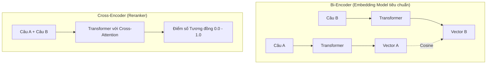

Khi làm việc với các hệ thống Trí tuệ Nhân tạo hiện đại, đặc biệt là các ứng dụng [RAG](/concepts/genai-ml/rag/) (Retrieval-Augmented Generation) hay tìm kiếm ngữ nghĩa (Semantic Search), chúng ta thường nghe rất nhiều về thuật ngữ "nhúng" (embedding). Nhưng dưới góc nhìn của một kỹ sư thiết kế hệ thống, một **Mô hình nhúng (Embedding Model)** thực chất hoạt động như thế nào ở tầng kiến trúc sâu (architecture-level)? 

Làm sao để một mạng nơ-ron học sâu (Deep Neural Network) có thể biến những đoạn văn bản phi cấu trúc, những bức ảnh hay âm thanh thành các vectơ số học nhưng vẫn giữ nguyên vẹn "ý nghĩa" của chúng? Chúng ta hãy cùng bóc tách kiến trúc bên trong, phương pháp huấn luyện cũng như cách tối ưu hóa các mô hình này.

## Bản chất toán học của một mô hình nhúng

Về mặt toán học, một **Embedding Model** là một hàm số phi tuyến tính $f(x) \rightarrow \mathbb{R}^d$. Trong đó, đầu vào $x$ là một chuỗi các ký tự (tokens) và đầu ra là một không gian vectơ dày đặc (dense vector) có số chiều cố định $d$ (thường là 384, 768 hoặc 1536 chiều tùy mô hình).

Mô hình này sở hữu hàng triệu hoặc hàng tỷ tham số (weights) được tối ưu hóa thông qua quá trình lan truyền ngược (backpropagation). Mục tiêu tối thượng của quá trình này là đảm bảo rằng: nếu hai đoạn văn bản $x_1$ và $x_2$ có nội dung tương đồng về mặt ngữ nghĩa, thì khoảng cách hình học giữa hai vectơ đầu ra $f(x_1)$ và $f(x_2)$ trong không gian đa chiều phải cực kỳ gần nhau. Ngược lại, nếu chúng không liên quan, chúng sẽ bị đẩy ra xa nhau.

## Tại sao chúng ta cần tách biệt Embedding Model thành một thành phần độc lập?

Vào thời kỳ đầu của NLP (Xử lý ngôn ngữ tự nhiên) sử dụng Deep Learning, người ta thường dùng chung một mạng nơ-ron khổng lồ để làm mọi tác vụ từ dịch thuật, phân loại cho đến sinh văn bản. Tuy nhiên, khi đối mặt với bài toán tìm kiếm thông tin trong một kho tài liệu khổng lồ lên tới hàng chục triệu bản ghi, cách tiếp cận này vấp phải rào cản hiệu năng vô cùng lớn. 

Việc chạy một mô hình ngôn ngữ lớn ([LLM](/concepts/genai-ml/llm/)) để so sánh câu hỏi của người dùng với từng tài liệu trong database là điều không tưởng vì chi phí tính toán ($O(N)$ độ phức tạp) quá lớn và độ trễ quá cao.

Để giải quyết bài toán này, Embedding Model được tách ra thành một thành phần độc lập. Nó chỉ làm đúng một nhiệm vụ duy nhất: nhận đầu vào và nhả ra một vectơ tĩnh đại diện cho nội dung đó. Nhờ vậy, chúng ta có thể:
1. Tính toán trước (pre-compute) vectơ cho toàn bộ tài liệu trong hệ thống (gọi là *Offline [Indexing](/concepts/database-storage/indexing/)*) và lưu trữ chúng vào một [Vector Database](/concepts/genai-ml/vector-database/).
2. Khi người dùng nhập câu hỏi, hệ thống chỉ cần chạy Embedding Model đúng một lần duy nhất để lấy vectơ câu hỏi.
3. Sau đó, việc tìm kiếm tài liệu tương thích chỉ đơn giản là các phép toán so sánh vectơ (như Cosine Similarity) diễn ra với tốc độ micro-giây trực tiếp trên Vector DB.

## Contrastive Learning và nghệ thuật "học từ sự đối chiếu"

Làm thế nào để dạy cho một mô hình nơ-ron biết rằng "quả táo" thì gần gũi với "trái cây" hơn là "điện thoại" (hoặc ngược lại, tùy ngữ cảnh hãng Apple)? Cách tốt nhất không phải là dạy cho nó định nghĩa của từng từ, mà là áp dụng phương pháp **Học đối chiếu (Contrastive Learning)**.

Triết lý của Contrastive Learning rất đơn giản: *"Dạy mô hình bằng cách kéo những thứ giống nhau lại gần và đẩy những thứ khác nhau ra xa"*. 

Để làm được điều này, chúng ta sử dụng các hàm mất mát (loss functions) đặc biệt như **Triplet Loss** hoặc **InfoNCE Loss**. Quá trình huấn luyện mô hình sẽ trải qua các bước sau:

1. **Chuẩn bị dữ liệu dạng bộ ba (Triplets)**:
   * **Anchor (Neo)**: Câu gốc cần so sánh (ví dụ: *"Làm sao để nấu phở?"*).
   * **Positive (Tích cực)**: Câu có cùng ý nghĩa (ví dụ: *"Công thức nấu phở bò ngon tại nhà."*).
   * **Negative (Tiêu cực)**: Câu không liên quan (ví dụ: *"Dự báo thời tiết Hà Nội hôm nay."*).
2. **Truyền thuận (Forward Pass)**: Cả 3 câu này được đưa qua cùng một mạng Transformer (như BERT). Mạng sẽ xuất ra 3 vectơ nhúng tương ứng: $V_A$, $V_P$, và $V_N$.
3. **Tính toán Loss**: Sử dụng công thức Triplet Loss:
   $$L = \max(0, \text{Distance}(V_A, V_P) - \text{Distance}(V_A, V_N) + \text{margin})$$
   Hàm này sẽ phạt nặng mô hình nếu khoảng cách giữa câu Neo ($V_A$) và câu Tiêu cực ($V_N$) nhỏ hơn khoảng cách giữa câu Neo ($V_A$) và câu Tích cực ($V_P$) cộng với một khoảng biên an toàn (`margin`).
4. **Cập nhật trọng số**: Thuật toán Gradient Descent sẽ cập nhật các trọng số của mạng Transformer sao cho ở các vòng lặp tiếp theo, $V_A$ và $V_P$ xích lại gần nhau hơn, còn $V_N$ bị đẩy xa hơn.

## So sánh kiến trúc: Bi-Encoder vs Cross-Encoder

Trong thực tế thiết kế hệ thống tìm kiếm thông tin, chúng ta thường phân biệt hai loại kiến trúc mô hình chính: **Bi-Encoder** (Mô hình nhúng tiêu chuẩn) và **Cross-Encoder** (Mô hình chấm điểm tương tác chéo).



* **Bi-Encoder**: Xử lý độc lập Câu A và Câu B qua mạng nơ-ron để tạo ra hai vectơ tĩnh, sau đó mới tính độ tương đồng bằng Cosine Similarity. Đây chính là kiến trúc của các Embedding Model. Nó cực kỳ nhanh vì có thể tính toán trước và lưu trữ vectơ.
* **Cross-Encoder**: Nạp đồng thời cả Câu A và Câu B nối liền nhau vào mạng Transformer. Điều này cho phép cơ chế Attention của mô hình phân tích mối quan hệ chéo sâu sắc giữa từng từ của Câu A với từng từ của Câu B (*Cross-Attention*). Mô hình này cho kết quả chính xác vượt trội nhưng không tạo ra vectơ tĩnh để lưu trữ. Mọi so sánh phải chạy trực tiếp qua mạng nơ-ron tại thời điểm tìm kiếm, khiến nó rất chậm và không thể dùng để tìm kiếm trên hàng triệu tài liệu. Do đó, Cross-Encoder thường chỉ được dùng làm mô hình xếp hạng lại (**[Reranker](/concepts/genai-ml/reranker/)**) cho Top-50 hay Top-100 kết quả tìm được từ Vector DB.

## Thực hành: Tự fine-tune Embedding Model với Sentence-Transformers

Nếu bạn đang xây dựng một ứng dụng cho các lĩnh vực đặc thù có nhiều thuật ngữ chuyên ngành (như Y tế, Luật, hoặc mã sản phẩm nội bộ), các mô hình nhúng thông thường sẽ hoạt động rất kém. Lúc này, bạn có thể tự tinh chỉnh (fine-tune) lại mô hình bằng thư viện `sentence-transformers` của Python:

```python
from sentence_transformers import SentenceTransformer, InputExample, losses
from torch.utils.data import DataLoader

# 1. Load mô hình cơ sở pre-trained từ HuggingFace
model = SentenceTransformer('distilbert-base-nli-mean-tokens')

# 2. Tạo tập dữ liệu huấn luyện nội bộ dạng cặp (Anchor, Positive)
train_examples = [
    InputExample(texts=['Lỗi 404', 'Không tìm thấy trang web yêu cầu']),
    InputExample(texts=['Lỗi 500', 'Máy chủ gặp sự cố nội bộ hệ thống']),
]
train_dataloader = DataLoader(train_examples, shuffle=True, batch_size=2)

# 3. Chọn hàm Loss (MultipleNegativesRankingLoss cực kỳ hiệu quả cho bài toán này)
train_loss = losses.MultipleNegativesRankingLoss(model=model)

# 4. Huấn luyện tinh chỉnh mô hình
model.fit(train_objectives=[(train_dataloader, train_loss)], epochs=3, warmup_steps=10)

# Mô hình sau khi huấn luyện đã hiểu rõ "Lỗi 404" và "Không tìm thấy trang" có ý nghĩa tương đồng
```

## Những chỉ dẫn thiết kế và sai lầm thường gặp

### Chỉ dẫn thiết kế (Best Practices)
* **Kiên định với phương pháp Pooling**: Một mạng Transformer sẽ xuất ra vectơ cho từng từ ([token](/concepts/genai-ml/token/)) một. Để gộp tất cả thành một vectơ tĩnh đại diện cho toàn bộ câu, chúng ta phải dùng phương pháp gom cụm: lấy trung bình cộng tất cả các token (Mean Pooling) hoặc lấy riêng vectơ của token đặc biệt `[CLS]` ở đầu. Hãy đảm bảo bạn sử dụng đúng phương pháp Pooling mà mô hình đó đã được thiết kế và huấn luyện.
* **Huấn luyện với Hard Negatives**: Khi tự huấn luyện mô hình, nếu bạn chỉ đưa vào những ví dụ tiêu cực (Negative) quá dễ phân biệt (ví dụ: Anchor="Nấu phở bò", Negative="Thời tiết hôm nay"), mô hình sẽ học rất hời hợt. Hãy đưa vào các mẫu **Hard Negatives** – những câu trông rất giống nhưng thực tế lại khác nghĩa (ví dụ: Anchor="Cách nấu phở bò", Hard Negative="Cách nấu phở gà"). Điều này ép buộc mô hình phải học cách phân biệt những chi tiết ngữ nghĩa tinh vi nhất.

### Sai lầm dễ mắc phải (Common Mistakes)
* **Lấy lớp cuối cùng của mô hình phân loại làm Embedding**: Nhiều người thường lấy lớp phân loại cuối cùng (sau hàm Softmax) của các mạng nơ-ron phân loại để làm vectơ nhúng. Đây là sai lầm vì lớp Softmax chỉ chứa xác suất phân loại nhãn, đã làm mất đi không gian tiềm ẩn (Latent space) đa chiều chứa các đặc trưng phong phú của dữ liệu. Thay vào đó, hãy lấy dữ liệu từ lớp áp chót (Penultimate layer).

## Được và mất giữa Bi-Encoder và Cross-Encoder

### Kiến trúc Bi-Encoder (Embedding Model)
* **Điểm cộng**: Có thể tính toán trước và lưu trữ vectơ tĩnh. Tốc độ truy vấn trên Vector DB cực kỳ nhanh (milli-giây) trên quy mô hàng triệu bản ghi.
* **Điểm trừ**: Do hai văn bản được xử lý độc lập qua mạng nơ-ron và không thể tương tác trực tiếp với nhau ở bước Attention, mô hình đôi khi bỏ sót các mối liên hệ ngữ nghĩa sâu sắc.

### Kiến trúc Cross-Encoder
* **Điểm cộng**: Độ chính xác vượt trội nhờ cơ chế Attention hai chiều giữa hai văn bản.
* **Điểm trừ**: Chi phí tính toán cực kỳ lớn, không thể lưu trữ trước kết quả, không phù hợp cho tìm kiếm quy mô lớn.

## Khái niệm liên quan

* [Các mô hình nhúng (Embedding Models)](/concepts/genai-ml/embedding-models/)
* [Tìm kiếm ngữ nghĩa (Semantic Search)](/concepts/genai-ml/semantic-search/)
* [Vectơ nhúng (Embeddings)](/concepts/genai-ml/embeddings/)

## Góc phỏng vấn

### 1. Giải thích sự khác biệt kiến trúc giữa Bi-Encoder và Cross-Encoder. Tại sao trong Vector Database chúng ta chỉ dùng Bi-Encoder?
* **Gợi ý trả lời**: Bi-Encoder xử lý độc lập hai văn bản đầu vào thông qua mạng nơ-ron để tạo ra hai vectơ tĩnh riêng biệt. Do các vectơ này là cố định và độc lập, chúng ta có thể tính toán trước cho toàn bộ kho dữ liệu lớn và lưu trữ vào Vector DB để tìm kiếm nhanh bằng Cosine Similarity. Ngược lại, Cross-Encoder nhận đồng thời cả hai văn bản nối liền nhau vào mô hình và sử dụng cơ chế Cross-Attention để phân tích mối quan hệ chéo giữa từng từ của hai câu. Điều này giúp Cross-Encoder có độ chính xác rất cao nhưng lại không sinh ra các vectơ độc lập để lưu trữ trước. Vì lý do hiệu năng và yêu cầu lưu trữ, chúng ta chỉ có thể dùng Bi-Encoder để lưu vào Vector DB, còn Cross-Encoder chỉ được dùng làm bước xếp hạng lại (Re-ranker) sau khi đã lọc ra một nhóm nhỏ kết quả tiềm năng.

### 2. Triplet Loss hoạt động như thế nào trong việc huấn luyện một Embedding Model?
* **Gợi ý trả lời**: Triplet Loss huấn luyện mô hình bằng cách so sánh một bộ ba dữ liệu gồm: Anchor (câu gốc), Positive (câu tương đồng ngữ nghĩa) và Negative (câu không liên quan). Hàm mất mát Triplet Loss sẽ tính toán khoảng cách hình học trong không gian đa chiều giữa các vectơ đầu ra. Mục tiêu của nó là cập nhật trọng số của mạng nơ-ron sao cho khoảng cách giữa Anchor và Positive ngày càng thu hẹp lại, đồng thời đẩy khoảng cách giữa Anchor và Negative ra xa hơn một khoảng biên an toàn (`margin`) được thiết lập trước. Qua hàng triệu lượt tối ưu hóa, mô hình sẽ tự động định hình một không gian ngữ nghĩa trật tự và chính xác.

## Tài liệu tham khảo

1. [Sentence-BERT: Sentence Embeddings using Siamese BERT-Networks](https://aclanthology.org/D19-1410/) - Nils Reimers and Iryna Gurevych (EMNLP 2019 paper on Sentence-BERT).
2. [Sentence Transformers Documentation](https://www.sbert.net/) - The official documentation for training and using SBERT models.
3. [Sentence-BERT preprint on arXiv](https://arxiv.org/abs/1908.10084) - Original arXiv submission for Siamese BERT-Networks.
4. [Hugging Face: How to Train a Sentence Transformer](https://huggingface.co/blog/how-to-train-sentence-transformers) - Step-by-step guide to fine-tuning embedding models on Hugging Face.
5. [Pinecone: Introduction to Semantic Search](https://www.pinecone.io/learn/semantic-search/) - A comprehensive conceptual guide to embedding-based semantic search.

## Tóm tắt bằng tiếng Anh (English Summary)

While Embedding Models generally refer to the models mapping text to dense vectors, diving into an individual Embedding Model reveals an architecture often based on Siamese Networks (Bi-Encoders) optimized via Contrastive Learning (e.g., Triplet Loss or InfoNCE). By training the model to minimize the distance between conceptually similar anchor-positive pairs and maximize the distance from negative samples, the network learns an intrinsic geometric representation of semantics. Unlike Cross-Encoders which evaluate pairs jointly for high accuracy at a steep computational cost, Bi-Encoders produce independent, pre-computable vectors, making them the strictly required architecture for indexing massive datasets in Vector Databases.
