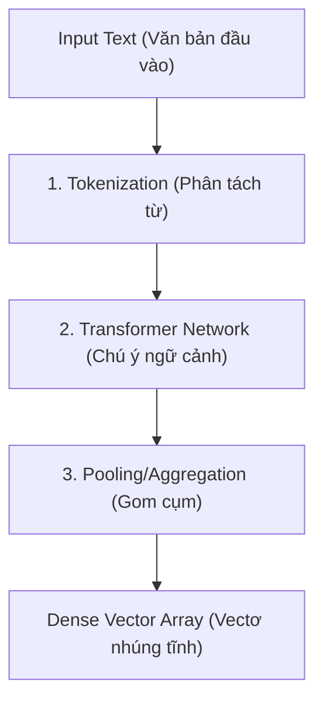

# Các mô hình nhúng - Embedding Models

Máy tính là một cỗ máy xử lý số học thuần túy. Nó không thể trực tiếp đọc hiểu các văn bản, ngắm nhìn các bức ảnh hay lắng nghe các file âm thanh theo cách tự nhiên của con người. Để máy tính có thể "hiểu" và xử lý được các dạng dữ liệu phi cấu trúc này, chúng ta cần một chiếc cầu nối dịch thuật đặc biệt. 

Chiếc cầu nối đó chính là **Các mô hình nhúng (Embedding Models)** – một trong những mảnh ghép công nghệ quan trọng nhất đứng sau sự bùng nổ của Trí tuệ Nhân tạo thế hệ mới (GenAI), các hệ thống tìm kiếm ngữ nghĩa (Semantic Search) và RAG (Retrieval-Augmented Generation).

## Từ thế giới phi cấu trúc đến những con số biết nói

Về cơ bản, **Embedding Models** là các thuật toán Machine Learning hoặc Deep Learning làm nhiệm vụ chuyển đổi (ánh xạ) các thực thể rời rạc từ thế giới thực (như từ ngữ, câu văn, hình ảnh, hoặc thậm chí là một sơ đồ đồ thị) thành các chuỗi số thực có độ dài cố định, được gọi là các **vectơ nhúng (embeddings)**.

Điểm kỳ diệu ở đây là: không gian vectơ này là một không gian liên tục đa chiều (continuous vector space). Mô hình nhúng được huấn luyện sao cho những thực thể có mối quan hệ tương đồng về mặt ngữ nghĩa hoặc hình ảnh trong thực tế sẽ được xếp nằm rất gần nhau trong không gian hình học này. Từ đó, máy tính có thể dễ dàng đo lường mức độ tương đồng giữa chúng bằng các phép toán học đơn giản (như khoảng cách Cosine hay tích vô hướng Dot Product).

## Lịch sử tiến hóa: Từ One-Hot Encoding đến Contextual Embedding

Để thấy rõ tầm quan trọng của Embedding Models, chúng ta hãy cùng nhìn lại chặng đường tiến hóa của các phương pháp biểu diễn ngôn ngữ cho máy tính:

1. **One-Hot Encoding**: Phương pháp sơ khai nhất, coi mỗi từ trong từ điển là một vectơ độc lập chứa toàn số 0 và duy nhất một số 1 (Ví dụ: `chó = [1, 0, 0]`, `mèo = [0, 1, 0]`). Cách này khiến kích thước vectơ bùng nổ cực lớn khi từ điển phình to. Nghiêm trọng hơn, các vectơ này hoàn toàn trực giao với nhau, khiến máy tính không cách nào biết được "chó" và "mèo" có mối liên quan mật thiết hơn là "chó" và "máy bay".
2. **TF-IDF / Bag of Words**: Phương pháp đếm tần suất xuất hiện của từ. Dù cải tiến hơn, nhưng nó hoàn toàn bỏ qua thứ tự của từ ngữ và ngữ cảnh xung quanh câu văn. Nó bất lực trước các hiện tượng từ đồng nghĩa (synonyms) hoặc từ đa nghĩa (polysemy).
3. **Word2Vec / GloVe (Static Word Embedding)**: Thế hệ mô hình nhúng tĩnh đầu tiên ra đời. Chúng nén thông tin vào các vectơ dày đặc (Dense Vectors) chỉ khoảng vài trăm chiều nhưng chứa đầy số thực. Đây là lúc máy tính bắt đầu thực hiện được các phép toán ngữ nghĩa kinh điển: *vectơ("Vua") - vectơ("Đàn ông") + vectơ("Đàn bà") $\approx$ vectơ("Nữ hoàng")*.
4. **Transformer-based (Contextual Embedding)**: Các mô hình hiện đại ngày nay như BERT hay các API của OpenAI. Chúng tạo ra các vectơ nhúng động dựa trên ngữ cảnh. Từ "bank" trong cụm "river bank" (bờ sông) sẽ có một vectơ nhúng hoàn toàn khác với từ "bank" trong cụm "bank account" (tài khoản ngân hàng), phản ánh chính xác đa nghĩa của từ tùy thuộc vào các từ bao quanh nó.

## Thế giới kỳ diệu bên trong Không gian Tiềm ẩn (Latent Space)

Khi một văn bản đi qua Embedding Model, nó sẽ được chuyển đổi thành một vectơ (ví dụ 1536 chiều). Mỗi chiều trong không gian này đại diện cho một đặc trưng tiềm ẩn (latent feature) của dữ liệu. 

Con người không thể đặt tên rõ ràng cho từng chiều (ví dụ: chiều thứ 23 không đại diện cho riêng thuộc tính "giới tính", chiều thứ 114 không đại diện riêng cho "màu sắc"). Nhưng khi kết hợp toàn bộ 1536 chiều số thực này lại, chúng tạo nên một "dấu vân tay" số học độc nhất vô nhị đại diện cho ý nghĩa của thực thể đó.

## Cách thức một mô hình nhúng hoạt động

Mặc dù có nhiều kiến trúc khác nhau, nhưng quy trình chuyển đổi văn bản của các mô hình nhúng hiện đại thường trải qua 3 bước chính:



1. **Phân tách từ (Tokenization)**: Văn bản đầu vào được chia nhỏ thành các mảnh nhỏ gọi là token (có thể là từ hoặc cụm ký tự).
2. **Transformer Network**: Các token được đưa qua các lớp Transformer. Tại đây, cơ chế Self-Attention sẽ giúp các token "giao tiếp" và ảnh hưởng lẫn nhau để xác định ngữ cảnh chính xác của toàn câu.
3. **Gom cụm (Pooling)**: Mô hình sẽ tổng hợp các vectơ riêng lẻ của từng token thành một vectơ duy nhất đại diện cho cả câu (ví dụ: lấy trung bình cộng - Mean Pooling, hoặc lấy vectơ của token đặc biệt `[CLS]` đứng ở đầu câu).

## Thực hành nhanh: Sinh vectơ nhúng bằng Sentence-Transformers

Với thư viện `sentence-transformers` trong Python, bạn chỉ cần vài dòng code để tạo ra các vectơ nhúng ngữ nghĩa chất lượng cao bằng các mô hình mã nguồn mở:

```python
from sentence_transformers import SentenceTransformer, util

# Tải mô hình nhúng mã nguồn mở phổ biến
model = SentenceTransformer('all-MiniLM-L6-v2')

# Các câu văn đầu vào
sentences = ["Mèo đang ngủ trên ghế", "Chó đang chạy ngoài sân", "Con mèo đang lim dim ngủ"]

# Sinh các vectơ nhúng (embeddings)
embeddings = model.encode(sentences)

# Kiểm tra kích thước vectơ
print("Kích thước:", embeddings.shape) # Kết quả: (3, 384) -> 3 câu, mỗi câu là 1 vectơ 384 chiều

# Tính toán độ tương đồng ngữ nghĩa (Cosine Similarity)
cosine_scores = util.cos_sim(embeddings, embeddings)

print(f"Độ tương đồng giữa câu 1 và câu 3: {cosine_scores[0][2]:.4f}")
# Kết quả sẽ rất cao (gần 1.0) vì hai câu có ý nghĩa tương đồng lớn mặc dù từ ngữ sử dụng khác nhau.
```

## Bí kíp chọn mô hình và những sai lầm thường gặp

### Bí kíp chọn mô hình (Best Practices)
* **Chọn đúng mô hình ngôn ngữ**: Hãy cẩn thận khi dùng các mô hình nhúng chỉ được huấn luyện bằng tiếng Anh cho các ứng dụng tiếng Việt. Kết quả tìm kiếm sẽ rất tệ. Bạn nên ưu tiên chọn các mô hình đa ngôn ngữ (Multilingual như `paraphrase-multilingual-mpnet-base-v2`) hoặc các mô hình được huấn luyện tối ưu riêng cho tiếng Việt.
* **Cân bằng giữa Kích thước vectơ và Hiệu năng**: Vectơ có số chiều càng lớn thì khả năng biểu diễn ngữ nghĩa càng chi tiết, nhưng nó cũng ngốn nhiều dung lượng lưu trữ trên Vector DB và làm chậm tốc độ tính toán khoảng cách. Các kích thước từ 384 đến 1536 chiều thường là điểm ngọt (sweet spot) cho hầu hết các dự án.
* **Xử lý độ dài văn bản (Chunking)**: Hầu hết các mô hình nhúng đều có giới hạn độ dài đầu vào (ví dụ 512 tokens). Nếu bạn đưa nguyên một bài báo dài vào, mô hình sẽ cắt cụt phần đuôi. Hãy chia nhỏ văn bản thành các đoạn (chunks) hợp lý trước khi nhúng.

### Sai lầm dễ mắc phải (Common Mistakes)
* **Dùng Word2Vec tính trung bình cộng cho câu dài**: Việc lấy trung bình cộng vectơ của từng từ độc lập từ các mô hình cũ để đại diện cho một câu dài sẽ làm "loãng" và mất đi hầu hết cấu trúc ngữ pháp cũng như ý nghĩa ngữ cảnh. Hãy dùng các mô hình Sentence Embedding chuyên dụng.
* **Chọn sai hàm đo khoảng cách**: Mỗi mô hình nhúng khi huấn luyện thường được tối ưu hóa cho một loại metric cụ thể (như Cosine Similarity, Dot Product, hoặc L2 Euclidean). Hãy đọc kỹ tài liệu của mô hình để thiết lập đúng cấu hình tìm kiếm trên Vector DB của bạn.

## Được và mất: Phân tích khách quan

### Điểm mạnh
* Giải quyết triệt để bài toán tìm kiếm ngữ nghĩa, hiểu được các từ đồng nghĩa, trái nghĩa hoặc diễn đạt khác nhau mà các hệ thống tìm kiếm từ khóa truyền thống chào thua.
* Cho phép tìm kiếm xuyên ngôn ngữ (ví dụ người dùng gõ câu hỏi tiếng Việt nhưng hệ thống vẫn tìm ra câu trả lời nằm ở tài liệu tiếng Anh).
* Nền tảng cốt lõi giúp các ứng dụng GenAI/LLM trả lời câu hỏi dựa trên tài nguyên nội bộ mà không bị ảo tưởng (hallucination).

### Điểm yếu
* **Tính hộp đen (Black-box)**: Rất khó để giải thích chi tiết về mặt toán học tại sao mô hình lại xếp hai câu văn cụ thể có độ tương đồng 0.85.
* **Làm mờ thông tin chính xác**: Các từ khóa cực kỳ đặc thù như mã sản phẩm (SKU), tên riêng, số điện thoại hay mã lỗi hệ thống thường bị hòa tan vào không gian ngữ nghĩa tổng thể. Vì vậy, tìm kiếm bằng mô hình nhúng nên được kết hợp với tìm kiếm từ khóa truyền thống (gọi là *Hybrid Search*) để có kết quả tốt nhất.

## Khái niệm liên quan

* [Vectơ nhúng (Embeddings)](/concepts/genai-ml/embeddings/)
* [Phân tách văn bản (Chunking)](/concepts/genai-ml/chunking/)
* [Tìm kiếm ngữ nghĩa (Semantic Search)](/concepts/genai-ml/semantic-search/)
* [Mô hình nhúng đơn lẻ (Embedding Model)](/concepts/genai-ml/embedding-model/)

## Góc phỏng vấn

### 1. Phân biệt sự khác nhau giữa Word Embeddings tĩnh (Word2Vec) và Contextual Embeddings động (BERT).
* **Gợi ý trả lời**: Word Embeddings tĩnh như Word2Vec gán cố định cho mỗi từ duy nhất một vectơ số thực, không quan tâm đến ngữ cảnh sử dụng từ đó (ví dụ từ "đường" trong "đường ăn" và "đường đi" có chung một vectơ giống hệt nhau). Trong khi đó, Contextual Embeddings động như BERT sử dụng cơ chế Attention để liên tục cập nhật và tính toán vectơ của từ dựa trên các từ xung quanh. Nhờ vậy, từ "đường" trong hai ngữ cảnh trên sẽ có hai vectơ hoàn toàn khác nhau, giúp máy tính nắm bắt ngữ nghĩa chính xác hơn.

### 2. Sự khác biệt giữa Asymmetric Semantic Search (Tìm kiếm ngữ nghĩa bất đối xứng) và Symmetric Semantic Search (Tìm kiếm ngữ nghĩa đối xứng) là gì?
* **Gợi ý trả lời**: 
  * **Symmetric Search (Đối xứng)**: Diễn ra khi câu truy vấn và tài liệu đích có độ dài và cấu trúc tương đương nhau (ví dụ: tìm các câu hỏi tương tự nhau trong kho FAQ). Với bài toán này, ta nên chọn các mô hình nhúng đối xứng thông thường (như `all-MiniLM`).
  * **Asymmetric Search (Bất đối xứng)**: Diễn ra khi câu truy vấn của người dùng rất ngắn (chỉ vài từ) nhưng tài liệu cần tìm lại là một đoạn văn dài. Với bài toán này, ta bắt buộc phải chọn các mô hình nhúng bất đối xứng (như các mô hình được huấn luyện trên tập dữ liệu MS MARCO) để đảm bảo mô hình hiểu được cách ánh xạ một câu hỏi ngắn vào một đoạn văn dài chứa câu trả lời.

## Tài liệu tham khảo

1. **Speech and Language Processing** - Dan Jurafsky and James H. Martin.
2. **Sentence-BERT: Sentence Embeddings using Siamese BERT-Networks** - Reimers & Gurevych (2019).

## Tóm tắt bằng tiếng Anh (English Summary)

Embedding Models are Deep Learning models (such as Word2Vec, BERT, or text-embedding-ada-002) that transform unstructured data (text, images) into dense numeric vectors in a high-dimensional, continuous space. They capture the underlying semantic meaning of the inputs, ensuring that conceptually similar objects are mapped geometrically close to one another. These models overcome the limitations of sparse representations (like TF-IDF or One-Hot Encoding) by capturing context and synonyms, making them a foundational component for Semantic Search, Recommender Systems, and Retrieval-Augmented Generation (RAG). However, they can act as "black boxes" and often struggle with exact keyword matching.
