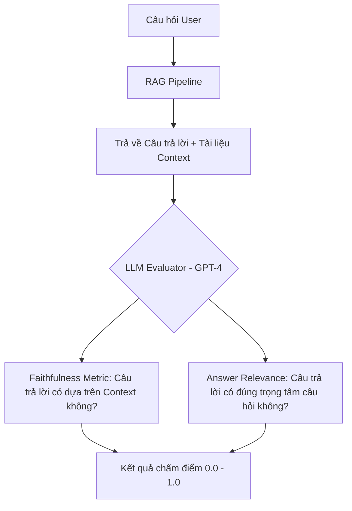

Có một câu nói nổi tiếng trong giới quản trị và kỹ thuật: *"Bạn không thể cải thiện những thứ bạn không thể đo lường"*. 

Khi xây dựng các mô hình Machine Learning hay các hệ thống AI hiện đại, việc bạn chạy thử một vài câu lệnh và thấy kết quả trả về "có vẻ đúng" là chưa bao giờ đủ để tự tin đưa hệ thống lên môi trường Production thực tế. Để biết chắc chắn mô hình của mình hoạt động tốt đến đâu và có thực sự giải quyết được bài toán kinh doanh hay không, chúng ta cần những thước đo khách quan và chuẩn xác. Đó chính là lý do **Chỉ số đánh giá (Evaluation Metric)** tồn tại.

## Tại sao "cảm giác" không bao giờ đủ trong Trí tuệ Nhân tạo?

Về mặt toán học, **Evaluation Metric** là các công thức tính toán sự sai lệch (hoặc mức độ tương thích) giữa **kết quả dự đoán của mô hình (Predictions)** và **kết quả thực tế chuẩn xác (Ground Truth/Labels)**. 

Nhiều người thường nhầm lẫn giữa *Hàm mất mát (Loss Function)* và *Chỉ số đánh giá (Evaluation Metric)*. Hãy nhớ rằng: Loss Function là công cụ để thuật toán tối ưu hóa trong quá trình huấn luyện (được máy tính đọc), còn Evaluation Metric là thước đo tính toán trên tập dữ liệu kiểm thử (Test set) độc lập để cung cấp cho con người một góc nhìn trực quan, dễ hiểu về hiệu quả của mô hình.

Hãy lấy một ví dụ điển hình về tầm quan trọng của việc chọn đúng metric. Bạn xây dựng hệ thống phát hiện giao dịch lừa đảo thẻ tín dụng. Trong thực tế, các giao dịch gian lận chỉ chiếm khoảng 0.1% tổng số giao dịch. Nếu bạn xây dựng một mô hình cực kỳ lười biếng – luôn dự đoán mọi giao dịch là "Bình thường" – mô hình này vẫn đạt độ chính xác (Accuracy) lên tới 99.9%. Nếu chỉ nhìn vào con số Accuracy này, bạn sẽ nghĩ mô hình của mình thật hoàn hảo. Nhưng thực chất, nó hoàn toàn vô dụng vì không phát hiện được bất kỳ giao dịch lừa đảo nào.

## Bản đồ các chỉ số đánh giá theo từng bài toán

Each bài toán AI khác nhau đòi hỏi các nhóm chỉ số đánh giá hoàn toàn khác biệt:

1. **Bài toán Phân loại (Classification)**: Đo lường xem mô hình phân chia nhãn đúng hay sai (ví dụ: email này là Spam hay Hộp thư đến).
2. **Bài toán Hồi quy (Regression)**: Đo lường khoảng cách sai lệch giữa số liệu dự báo và thực tế (ví dụ: dự đoán giá nhà lệch bao nhiêu triệu đồng).
3. **Bài toán Tìm kiếm và Truy xuất (Information Retrieval / RAG)**: Đo lường xem hệ thống có lấy ra đúng và đủ các tài liệu liên quan từ database hay không.
4. **Sinh văn bản (Generative AI / LLM)**: Đo lường độ trôi chảy, tính hữu ích và tính trung thực (không bị ảo giác - hallucination) của câu trả lời.

## Khi "bắt lầm còn hơn bỏ sót": Cuộc đấu tranh giữa Precision và Recall

Trong các bài toán phân loại, có 3 chỉ số vô cùng quan trọng mà bất kỳ kỹ sư nào cũng phải nằm lòng:

* **Accuracy (Độ chính xác tổng thể)**: Tỷ lệ số lần dự đoán đúng trên tổng số mẫu dữ liệu. Chỉ số này chỉ đáng tin cậy khi dữ liệu của bạn cân bằng (số lượng mẫu của các lớp tương đương nhau).
* **Precision (Độ chuẩn xác)**: Trả lời câu hỏi: *"Trong số những trường hợp mô hình dự đoán là Đúng (Positive), có bao nhiêu phần trăm thực sự Đúng trong thực tế?"*. Bạn cần tối ưu hóa Precision khi hậu quả của việc báo động giả (False Positive) là cực kỳ lớn. Ví dụ: phê duyệt khoản vay ngân hàng (nếu duyệt nhầm hồ sơ xấu thì ngân hàng mất tiền).
* **Recall (Độ bao phủ)**: Trả lời câu hỏi: *"Trong tổng số các trường hợp thực tế là Đúng, mô hình đã tìm và giữ lại được bao nhiêu phần trăm?"*. Chỉ số này cần được ưu tiên hàng đầu khi việc bỏ sót (False Negative) gây hậu quả nghiêm trọng. Ví dụ: tầm soát bệnh ung thư (thà nghi ngờ nhầm còn hơn bỏ sót một bệnh nhân).
* **F1-Score**: Trung bình điều hòa giữa Precision và Recall, giúp bạn có được một cái nhìn cân bằng nhất khi cả hai chỉ số trên đều quan trọng.

## Đánh giá hệ thống RAG và các mô hình ngôn ngữ lớn (LLM)

Đánh giá các mô hình ngôn ngữ lớn sinh văn bản (LLM) là một bài toán khó vì ngôn ngữ có tính linh hoạt rất cao. Trước đây, người ta thường dùng các chỉ số như BLEU hoặc ROUGE để đếm số từ trùng khớp giữa câu của máy sinh ra và câu đáp án của con người. Tuy nhiên, cách này đã lỗi thời vì hai câu có từ vựng hoàn toàn khác nhau vẫn có thể mang cùng một ý nghĩa ngữ nghĩa hoàn hảo.

Xu hướng hiện nay là áp dụng phương pháp **LLM-as-a-Judge**. Chúng ta sử dụng một mô hình LLM cực mạnh (như GPT-4) để chấm điểm câu trả lời của mô hình nhỏ hơn dựa trên các tiêu chí khoa học, tiêu biểu là framework **RAGAS**:

* **Faithfulness (Tính trung thực)**: Đo xem câu trả lời của mô hình có hoàn toàn dựa vào tài liệu ngữ cảnh (Context) được cung cấp hay không, tránh hiện tượng tự bịa thông tin.
* **Answer Relevance (Sự liên quan)**: Đánh giá xem câu trả lời có trực tiếp giải quyết đúng thắc mắc trong câu hỏi của người dùng hay không.

## Ví dụ thực tế: Cách tính Precision và Recall cho bộ lọc Spam

Hãy cùng xem một ví dụ tính toán thực tế:
Hệ thống nhận vào 100 email. Thực tế có **10 email là thư rác (Spam)** và **90 email bình thường**.
Mô hình của bạn quét qua và dự đoán **12 email là Spam** (trong đó có 8 email là Spam thật, còn 4 email bình thường bị mô hình nhận diện nhầm).

Dựa vào các con số trên, ta có:
* **True Positive (Đoán Spam và đúng)**: 8
* **False Positive (Nhận diện nhầm - email thường bị báo Spam)**: 4
* **False Negative (Bỏ sót - email Spam bị lọt)**: 2 (bằng 10 email Spam thật trừ đi 8 email đã bắt được).

Tính toán chỉ số:
* **Precision**: $8 / (8 + 4) = 0.66$ ($66\%$)
*Ý nghĩa:* Khi hệ thống của bạn phát cảnh báo một thư là Spam, chỉ có $66\%$ khả năng nó thực sự là thư rác. Người dùng sẽ bị mất mát thông tin nếu email quan trọng bị rơi vào mục Spam.
* **Recall**: $8 / 10 = 0.80$ ($80\%$)
*Ý nghĩa:* Hệ thống của bạn đã bắt thành công $80\%$ tổng số thư rác thực tế có trong hệ thống, bỏ lọt $20\%$.

## Những nguyên lý vàng để đánh giá mô hình chính xác

### Nguyên tắc vàng (Best Practices)
* **Tuyệt đối tránh rò rỉ dữ liệu (Data Leakage)**: Đảm bảo bạn không bao giờ tính toán các chỉ số đánh giá trên tập dữ liệu đã được dùng để huấn luyện mô hình. Điều này khiến điểm số của mô hình cao ngất ngưởng trên giấy tờ nhưng sẽ sụp đổ hoàn toàn khi gặp dữ liệu thực tế.
* **Đo lường từng phần trong RAG**: Khi vận hành một hệ thống RAG, nếu câu trả lời cuối cùng bị sai, hãy đánh giá bước truy xuất (Retrieval) trước bằng các chỉ số như `Recall@K` hay `Hit Rate`. Nếu bước này không lấy ra được tài liệu chứa câu trả lời, thì LLM dù có thông minh đến đâu cũng không thể trả lời đúng.

### Sai lầm dễ mắc phải (Common Mistakes)
* **Rơi vào bẫy tối ưu hóa một chỉ số (Goodhart's Law)**: *"Khi một chỉ số trở thành mục tiêu tối thượng, nó không còn là một chỉ số tốt nữa"*. Nếu bạn ép buộc đội ngũ kỹ sư phải nâng Recall lên 100% bằng mọi giá, họ có thể cấu hình mô hình gắn nhãn mọi email đều là Spam. Lúc này Recall đạt 100% nhưng Precision sẽ rơi về gần bằng 0. Hãy dùng F1-Score để giữ sự cân bằng.

## Khái niệm liên quan

* [Mô hình ngôn ngữ lớn (LLMs)](/concepts/genai-ml/llm/)
* [Tìm kiếm ngữ nghĩa (Semantic Search)](/concepts/genai-ml/semantic-search/)

## Góc phỏng vấn

### 1. Sự khác biệt cốt lõi giữa Precision và Recall là gì? Trong bài toán lọc video có nội dung bạo lực cho trẻ em, bạn sẽ ưu tiên tối ưu hóa chỉ số nào?
* **Gợi ý trả lời**: Precision đo lường mức độ chuẩn xác của các dự báo Positive (hạn chế báo động giả). Recall đo lường khả năng tìm kiếm và bao phủ toàn bộ các mẫu Positive thực tế (hạn chế bỏ sót rủi ro). Trong bài toán lọc video bạo lực để bảo vệ trẻ em, hậu quả của việc bỏ sót một video bạo lực (False Negative) là cực kỳ nghiêm trọng. Do đó, em sẽ ưu tiên tối ưu hóa **Recall**. Thà rằng hệ thống nhận diện nhầm một vài video hoạt hình lành mạnh là bạo lực và chặn chúng lại (giảm Precision), còn hơn là để lọt bất kỳ video bạo lực nào hiển thị trước mắt trẻ em.

### 2. Tại sao chúng ta không nên dùng các chỉ số truyền thống như ROUGE hay BLEU score để đánh giá các hệ thống GenAI và LLM ngày nay?
* **Gợi ý trả lời**: ROUGE và BLEU là các chỉ số hoạt động dựa trên cơ chế so khớp từ vựng vật lý (n-gram overlap) giữa câu do mô hình sinh ra và câu đáp án chuẩn. Tuy nhiên, các mô hình ngôn ngữ lớn (LLM) hiện đại có khả năng sử dụng ngôn từ cực kỳ linh hoạt. Nó có thể viết lại một câu trả lời hoàn toàn bằng các từ đồng nghĩa và cấu trúc câu mới mà vẫn giữ nguyên vẹn ý nghĩa ngữ nghĩa chính xác 100%. Khi đó, nếu đánh giá bằng ROUGE hay BLEU, điểm số trả về sẽ rất thấp vì không khớp từ ngữ thực tế. Để đánh giá LLM hiệu quả, chúng ta phải chuyển sang sử dụng các phương pháp đánh giá dựa trên ngữ nghĩa như BERTScore hoặc áp dụng phương pháp LLM-as-a-judge (như framework RAGAS).

## Tài liệu tham khảo

1. [RAGAS: Automated Evaluation of Retrieval Augmented Generation](https://arxiv.org/abs/2309.15217) - Shahul Es et al. (2023 paper introducing the RAGAS framework).
2. [Ragas Documentation](https://docs.ragas.io/en/stable/) - The official documentation for the RAGAS evaluation framework.
3. [Google Machine Learning Crash Course: Classification Metrics](https://developers.google.com/machine-learning/crash-course/classification/precision-and-recall) - An educational guide explaining Precision, Recall, and Accuracy.
4. [Pattern Recognition and Machine Learning](https://www.microsoft.com/en-us/research/uploads/prod/2006/01/Bishop-Pattern-Recognition-and-Machine-Learning-2006.pdf) - Christopher M. Bishop. A classic textbook containing deep details on ML theory and evaluation.
5. [Qdrant Blog: How to Evaluate RAG Pipelines](https://qdrant.tech/articles/rag-evaluation/) - A practical guide on measuring the retrieval and generation phases of RAG systems.

## Tóm tắt bằng tiếng Anh (English Summary)

Evaluation Metrics are quantifiable mathematical measures used to assess the performance, accuracy, and reliability of AI models. In classification, metrics like Precision, Recall, and F1-Score handle imbalanced datasets far better than standard Accuracy. In Search and RAG systems, metrics like Precision@K, MRR, and NDCG evaluate the retrieval ranking quality. For modern Generative AI, traditional lexical overlap metrics (like BLEU or ROUGE) are obsolete due to their inability to capture semantic equivalence; instead, the industry employs "LLM-as-a-Judge" frameworks (like RAGAS) to evaluate faithfulness and contextual relevance. Understanding the trade-off between metrics (e.g., Precision vs. Recall) is critical to aligning models with business objectives.
