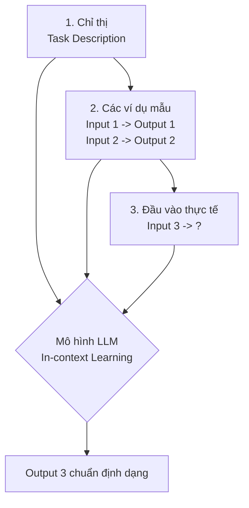

# Học qua vài ví dụ - Few-shot Prompting

Khi dạy một đứa trẻ nhận biết các loại trái cây, thay vì ngồi đọc một loạt định dạng lý thuyết dài dòng về vỏ, hạt hay lá, cách nhanh nhất là chỉ vào quả táo và nói: *"Đây là quả táo"*, chỉ vào quả cam và nói: *"Đây là quả cam"*. Sau khi quan sát vài ví dụ thực tế đó, đứa trẻ sẽ tự khắc nhận biết được các loại quả tương tự.

Trong thế giới Kỹ nghệ Gợi ý (Prompt Engineering) cho các Mô hình ngôn ngữ lớn (LLM), chúng ta cũng áp dụng một phương pháp tương tự mang tên **Few-shot Prompting (Học qua vài ví dụ)**. Kỹ thuật này giúp mô hình hiểu rõ "luật chơi" của bạn và trả về kết quả chính xác theo đúng định dạng mong muốn mà không đòi hỏi phải huấn luyện lại mô hình một cách tốn kém.

## Nghệ thuật "dạy" AI bằng các ví dụ trực quan

Về mặt khái niệm, **Few-shot Prompting** là kỹ thuật chèn thêm một số lượng nhỏ các ví dụ mẫu (các cặp Đầu vào - Đầu ra chuẩn) trực tiếp vào trong câu lệnh (prompt) trước khi đưa ra yêu cầu chính. 

Hãy phân biệt các cấp độ gợi ý cơ bản:
* **Zero-shot**: Bạn chỉ đưa ra yêu cầu trực tiếp mà không kèm theo bất kỳ ví dụ nào (Ví dụ: *"Dịch câu này sang tiếng Anh:..."*).
* **One-shot**: Bạn cung cấp duy nhất một cặp ví dụ mẫu trước khi đưa ra yêu cầu.
* **Few-shot**: Bạn cung cấp từ hai cho đến vài chục ví dụ mẫu để mô hình nhận diện khuôn mẫu dữ liệu một cách chắc chắn hơn.

## In-context Learning: Học trong ngữ cảnh là gì?

Dưới góc nhìn khoa học máy tính, Few-shot Prompting tận dụng một khả năng đặc biệt của kiến trúc mạng Transformer gọi là **In-context Learning (Học trong ngữ cảnh)**. 

Khi bạn gửi prompt chứa các ví dụ, mô hình không hề thay đổi hay cập nhật bất kỳ trọng số (weights) nào trong "não bộ" của nó. Thay vào đó, thông qua cơ chế Attention, nó sẽ phân tích cấu trúc, ngữ điệu và khuôn mẫu của các ví dụ nằm trong khung cửa sổ ngữ cảnh (Context Window) hiện tại, từ đó dự đoán chuỗi từ tiếp theo sao cho khớp với khuôn mẫu đó nhất. Khi hội thoại kết thúc, toàn bộ "kiến thức" tạm thời này cũng sẽ biến mất.

## Tại sao chúng ta cần thiết lập khuôn mẫu cho AI?

Các mô hình ngôn ngữ lớn (LLM) như GPT-4 hay Llama rất thông minh trong việc lập luận chung, nhưng chúng lại tỏ ra khá "ngây thơ" trước các yêu cầu định dạng chặt chẽ của các hệ thống phần mềm truyền thống.

Nếu bạn yêu cầu một LLM: *"Hãy phân loại sắc thái câu nói này thành: Tích cực, Tiêu cực hoặc Trung lập"*, câu trả lời bạn nhận về có thể rất đa dạng:
* *"Tôi nghĩ câu này mang ý nghĩa tiêu cực bạn nhé!"*
* *"Tiêu cực."*
* *"Sắc thái: Tiêu cực"*

Sự thiếu nhất quán này sẽ làm sập toàn bộ đường ống dữ liệu tự động (pipeline) của bạn, nơi mà mã nguồn lập trình chỉ chấp nhận duy nhất một từ khóa chuẩn là `Tiêu cực` hoặc `Negative`. 

Few-shot Prompting ra đời để giải quyết vấn đề này. Khi mô hình nhìn thấy các ví dụ trước đó đều trả lời cộc lốc một từ duy nhất, nó sẽ tự động bắt chước hành vi đó cho câu hỏi cuối cùng của bạn.

## Công thức thiết kế một câu lệnh Few-shot tiêu chuẩn

Một câu lệnh Few-shot chuẩn chỉnh thường được thiết kế gồm 3 phần rõ rệt:



1. **Chỉ thị (Task Description)**: Định nghĩa rõ ràng nhiệm vụ bạn muốn mô hình thực hiện.
2. **Các ví dụ mẫu (Demonstrations)**: Chuỗi các cặp dữ liệu `Đầu vào` $\rightarrow$ `Đầu ra` mẫu chuẩn mực để mô hình bắt chước.
3. **Đầu vào thực tế (Target Input)**: Câu hỏi hoặc văn bản thực tế bạn cần xử lý, kết thúc bằng nhãn trống để mô hình điền nốt kết quả.

## Ví dụ thực tế: Trích xuất mã cổ phiếu và cách viết code API

**Bài toán: Trích xuất tên viết tắt của công ty (Ticker) từ một đoạn văn bản.**

Dưới đây là một prompt Few-shot mẫu bạn gửi cho mô hình:
```text
Trích xuất tên mã viết tắt của các công ty công nghệ trong câu sau.

Văn bản: Apple Inc. vừa phát hành điện thoại mới.
Viết tắt: AAPL

Văn bản: Cổ phiếu của Microsoft Corporation đang tăng giá.
Viết tắt: MSFT

Văn bản: Google Alphabet bị kiện vì độc quyền.
Viết tắt: GOOGL

Văn bản: Tập đoàn Meta Platforms ra mắt kính thực tế ảo.
Viết tắt: 
```

*Kết quả sinh ra bởi mô hình:*
```text
META
```
Mô hình tự động học được quy luật: chỉ trả về mã viết tắt dạng viết hoa 4-5 chữ cái, loại bỏ hoàn toàn các câu từ dẫn dắt rườm rà.

Trong code thực tế (ví dụ sử dụng thư viện Python kết nối với OpenAI API), lập trình viên thường nhúng các ví dụ này vào mảng `messages` với các vai trò (`role`) `user` và `assistant` luân phiên nhau để mô hình học ngữ cảnh một cách tự nhiên nhất:

```python
import openai

response = openai.ChatCompletion.create(
    model="gpt-3.5-turbo",
    messages=[
        {"role": "system", "content": "Trích xuất tên viết tắt của các công ty công nghệ trong câu sau."},
        
        # Ví dụ 1
        {"role": "user", "content": "Văn bản: Apple Inc. vừa phát hành điện thoại mới."},
        {"role": "assistant", "content": "AAPL"},
        
        # Ví dụ 2
        {"role": "user", "content": "Văn bản: Cổ phiếu của Microsoft Corporation đang tăng giá."},
        {"role": "assistant", "content": "MSFT"},
        
        # Đầu vào thực tế cần xử lý
        {"role": "user", "content": "Văn bản: Tập đoàn Meta Platforms ra mắt kính thực tế ảo."}
    ]
)

print(response.choices[0].message.content)
# Kết quả hiển thị: META
```

## Những quy tắc vàng để tối ưu hóa hiệu quả

### Quy tắc thiết kế (Best Practices)
* **Nhất quán tuyệt đối về định dạng**: Các ví dụ mẫu phải giống hệt nhau về cấu trúc, cách sử dụng dấu câu, khoảng trắng và các từ khóa dẫn dắt (ví dụ: luôn dùng `Văn bản:` và `Viết tắt:`). Sự lộn xộn trong định dạng ví dụ sẽ khiến mô hình bị bối rối.
* **Đảm bảo tính đa dạng của tệp ví dụ**: Nếu bạn đang làm bài toán phân loại sắc thái, đừng chỉ đưa vào 3 ví dụ toàn nhãn "Tích cực". Hãy đưa vào đầy đủ các nhãn "Tích cực", "Tiêu cực", "Trung lập" và cả những trường hợp mập mờ (edge cases) để mô hình nắm bắt được toàn bộ không gian của bài toán.
* **Sử dụng các ký tự phân tách rõ ràng**: Hãy dùng các ký hiệu như `---` hoặc `###` để phân biệt rõ ràng ranh giới giữa các ví dụ mẫu với nhau.
* **Chọn số lượng ví dụ vừa đủ**: Thông thường, 3 đến 5 ví dụ là điểm ngọt (sweet spot) mang lại hiệu quả tối ưu nhất. Việc đưa vào quá nhiều ví dụ sẽ ngốn nhiều token gửi đi và làm chậm thời gian phản hồi của API mà không cải thiện độ chính xác là bao.

### Sai lầm dễ mắc phải (Common Mistakes)
* **Đưa các ví dụ bị sai nhãn**: Vô tình đưa các ví dụ mẫu có nhãn đầu ra bị sai lệch logic. Điều này sẽ lập tức định hướng sai cho mô hình ở câu hỏi thực tế.

## Được và mất: Liệu có nên lạm dụng Few-shot?

### Điểm cộng (Pros)
* Cực kỳ dễ triển khai: Bạn không cần huấn luyện lại mô hình, không cần chuẩn bị hạ tầng kỹ thuật phức tạp, chỉnh sửa text và thấy ngay kết quả.
* Rất linh hoạt: Muốn thay đổi logic đầu ra? Bạn chỉ cần cập nhật lại nội dung các ví dụ mẫu trong file config của prompt là xong.
* Kiểm soát tốt định dạng đầu ra, loại bỏ hoàn toàn các câu từ thừa thãi như *"Chắc chắn rồi, đây là kết quả của bạn..."*.

### Điểm trừ (Cons)
* **Tốn token**: Việc đính kèm thêm các ví dụ mẫu làm phình to kích thước của prompt. Do các API tính tiền theo số lượng token và độ dài prompt cũng ảnh hưởng đến thời gian phản hồi (latency), Few-shot sẽ tốn chi phí và chậm hơn so với Zero-shot.
* **Không cải thiện được tư duy logic gốc**: Few-shot chủ yếu giúp mô hình bắt chước khuôn mẫu định dạng, chứ không giúp mô hình trở nên thông minh hơn trước các bài toán suy luận logic phức tạp. (Để giải quyết bài toán suy luận phức tạp, bạn cần chuyển sang kỹ thuật Chain-of-Thought - CoT).

## Khi nào nên áp dụng?

* Khi bạn cần ép mô hình trả về dữ liệu đúng định dạng chuẩn cấu trúc (JSON, XML, CSV) để tích hợp vào hệ thống backend.
* Thực hiện các tác vụ biến đổi dữ liệu đặc thù (ví dụ: chuyển tên người Việt thành định dạng viết hoa không dấu).
* Phục vụ các pipeline phân loại văn bản, phân tích sắc thái cảm xúc ở quy mô nhỏ.

Nếu mô hình Zero-shot thông thường đã làm tốt nhiệm vụ của bạn với độ chính xác cao, hãy bỏ qua Few-shot để tiết kiệm token và tối ưu tốc độ phản hồi. Đối với các bài toán đòi hỏi kiến thức chuyên môn nội bộ khổng lồ lên tới hàng vạn dòng dữ liệu, việc nhét ví dụ vào prompt sẽ làm tràn giới hạn bộ nhớ của mô hình, khi đó bạn buộc phải chuyển sang phương pháp **Fine-tuning (Huấn luyện tinh chỉnh)**.

## Khái niệm liên quan

* [Prompt Engineering](/concepts/genai-ml/prompt-engineering/)
* [Fine-tuning](/concepts/genai-ml/fine-tuning/)

## Góc phỏng vấn

### 1. In-context Learning (Học trong ngữ cảnh) là gì và nó khác biệt thế nào với Fine-tuning (Huấn luyện tinh chỉnh)?
* **Gợi ý trả lời**:
  * **In-context Learning** (diễn ra trong Few-shot Prompting) là cơ chế mô hình tự phân tích các khuôn mẫu dữ liệu được cung cấp trực tiếp trong khung cửa sổ ngữ cảnh (Context Window) của câu lệnh tại thời điểm chạy (Inference). Trong quá trình này, các trọng số (weights) vật lý bên trong cấu trúc của mô hình không hề bị thay đổi hay lưu lại. Mọi kiến thức học được sẽ biến mất ngay khi phiên làm việc kết thúc.
  * **Fine-tuning** là một quá trình huấn luyện thực thụ. Chúng ta sử dụng dữ liệu để thực hiện lan truyền ngược (backpropagation), cập nhật trực tiếp và vĩnh viễn các trọng số bên trong mạng nơ-ron của mô hình, giúp nó ghi nhớ sâu sắc các kiến thức chuyên biệt mà không cần đính kèm ví dụ vào prompt nữa.

### 2. Nếu áp dụng Few-shot Prompting với 5 ví dụ nhưng mô hình vẫn trả về kết quả sai định dạng hoặc sai logic, bạn sẽ xử lý thế nào?
* **Gợi ý trả lời**: Để gỡ lỗi (debug) trường hợp này, em sẽ tiến hành theo các bước sau:
  1. Kiểm tra lại tính chính xác và tính nhất quán của các ví dụ mẫu (liệu có ví dụ nào bị sai nhãn hay cấu trúc định dạng bị lệch pha không).
  2. Thay đổi trật tự các ví dụ: Các mô hình ngôn ngữ lớn thường bị ảnh hưởng bởi thiên kiến Recency Bias (nhớ tốt các ví dụ được xếp ở cuối cùng). Em sẽ thử đảo vị trí các ví dụ khó lên đầu hoặc xuống cuối để kiểm tra hiệu quả.
  3. Nếu bài toán liên quan đến suy luận logic, em sẽ nâng cấp lên kỹ thuật **Chain-of-Thought (CoT) Prompting** bằng cách viết thêm các bước giải thích lập luận chi tiết vào phần Output của các ví dụ mẫu.
  4. Nếu vẫn thất bại, em sẽ chuyển sang phương pháp thu thập tập dữ liệu lớn hơn (khoảng vài trăm mẫu) để tiến hành **Fine-tuning** mô hình.

## Tài liệu tham khảo

1. **Language Models are Few-Shot Learners** - Brown et al. (Mở đầu cho kỷ nguyên GPT-3).
2. **Learn Prompting Documentation** - Few-shot Prompting Guides.

## Tóm tắt bằng tiếng Anh (English Summary)

Few-shot Prompting is a foundational Prompt Engineering technique where a Large Language Model (LLM) is provided with a small number of demonstration examples (input-output pairs) directly within the prompt's context window before asking it to perform a task. It leverages the "In-context Learning" capability of Transformers to strictly enforce output formatting, adhere to specific styles, or perform novel tasks without the need to permanently update the model's parameters (Fine-tuning). While highly effective and easy to implement, it increases token consumption per request and relies solely on pattern matching rather than enhancing underlying reasoning capabilities.
