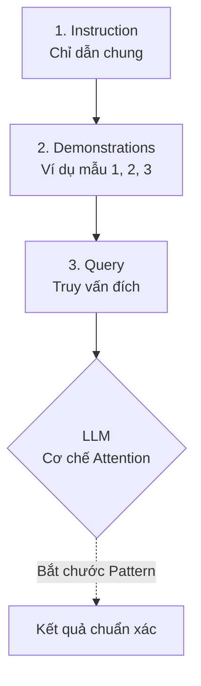

Hãy tưởng tượng bạn vừa nhận một cậu thực tập sinh mới và giao cho cậu ấy một nhiệm vụ phân loại phản hồi của khách hàng. Nếu bạn chỉ nói chung chung: *"Hãy phân loại các tin nhắn này thành tích cực hoặc tiêu cực"*, cậu ấy có thể làm được, nhưng đôi khi sẽ lúng túng với những câu nói đùa hoặc tiếng lóng. Nhưng nếu bạn đưa cho cậu ấy 3 ví dụ mẫu: *"Câu này là tích cực vì khách khen thật lòng, câu kia là tiêu cực vì họ đang mỉa mai"*, cậu ấy sẽ hiểu ý bạn ngay lập tức.

Trong thế giới của các Mô hình Ngôn ngữ Lớn ([LLM](/concepts/genai-ml/llm/)), kỹ thuật này được gọi là **Few-shot Prompting** (Học qua vài ví dụ). Bằng cách cung cấp một số lượng nhỏ các cặp đầu vào - đầu ra mẫu (demonstrations/examples) ngay bên trong câu lệnh (prompt), bạn kích hoạt khả năng học tập tức thời của mô hình để nhận về kết quả chính xác và đúng định dạng nhất.

## Từ "học vẹt" đến khả năng tự suy luận: Bản chất của Few-shot Prompting

Để hiểu rõ Few-shot Prompting, hãy so sánh nó với người anh em *Zero-shot Prompting*. Nếu Zero-shot là việc yêu cầu mô hình làm bài kiểm tra ngay lập tức mà không cho ôn tập trước, thì Few-shot chính là việc cung cấp cho nó 2-3 bài giải mẫu để nó nắm bắt được cách chấm điểm cũng như cấu trúc trả lời.

Về bản chất, bạn sẽ chèn trực tiếp các cặp bài toán và lời giải mẫu (thường từ 1 đến 5 ví dụ) vào chuỗi văn bản gửi cho LLM. Mô hình sẽ phân tích các điểm tương đồng, quy luật cấu trúc từ các ví dụ này. Khi gặp câu hỏi thực tế ở cuối prompt, nó sẽ tự động hoàn thành theo đúng khuôn mẫu đã học được. Điểm đặc biệt là quá trình này diễn ra hoàn toàn dựa trên cửa sổ ngữ cảnh ([Context Window](/concepts/genai-ml/context-window/)) chứ không hề thay đổi các trọng số (weights) của mạng nơ-ron.

## Tại sao chúng ta cần đến Few-shot Prompting?

Dù LLM ngày càng thông minh và có khả năng Zero-shot đáng kinh ngạc, chúng vẫn thường vấp ngã trước các bài toán thực tế của doanh nghiệp vì ba lý do lớn:

1. **Yêu cầu tuân thủ định dạng nghiêm ngặt (Strict Formatting)**: Khi bạn cần kết quả trả về là một chuỗi JSON sạch để nạp vào database, việc ra lệnh bằng lời nói (Zero-shot) rất dễ khiến LLM sinh thêm các câu từ rườm rà như *"Đây là kết quả JSON của bạn..."*. Vài ví dụ Few-shot sẽ định hình khuôn mẫu đầu ra, khiến mô hình im lặng trả về đúng định dạng yêu cầu.
2. **Xử lý các ngữ cảnh đặc thù (Domain-specific tasks)**: Hãy nghĩ về câu: *"Đôi giày này đi sướng vãi!"*. Từ "vãi" vốn mang sắc thái tiêu cực trong từ điển thông thường, nhưng trong ngôn ngữ mạng, nó lại là một từ nhấn mạnh sự tích cực. Cung cấp ví dụ Few-shot giúp mô hình "cập nhật" bộ từ vựng và tư duy logic đặc thù của riêng bạn trong thời gian thực.
3. **Giải pháp thay thế Fine-Tuning giá rẻ**: Việc thu thập hàng ngàn mẫu dữ liệu để huấn luyện lại mô hình (Fine-tune/[LoRA](/concepts/genai-ml/lora/)) rất tốn kém và mất thời gian. Trong khi đó, việc soạn ra 3-5 mẫu chất lượng để nhét vào prompt chỉ tốn của bạn vài phút mà hiệu quả mang lại đôi khi không hề kém cạnh.

## Dưới nắp ca-pô: Cơ chế In-Context Learning hoạt động ra sao?

Cơ sở khoa học của Few-shot Prompting nằm ở khái niệm **In-Context Learning (ICL)** (Học trong ngữ cảnh) — một đặc tính bộc phát (emergent capability) chỉ xuất hiện ở các mô hình ngôn ngữ quy mô lớn với hàng tỷ tham số.

Khi nhận được các ví dụ mẫu, các lớp Transformer không hề tiến hành cập nhật tham số thuật toán Gradient Descent như cách huấn luyện truyền thống. Thay vào đó, qua cơ chế **Attention** (Chú ý), mô hình sẽ tự động xây dựng một ánh xạ tuyến tính nội bộ giữa không gian Input và Output, tạo ra một "rãnh trượt" ngữ nghĩa. Khi từ khóa câu hỏi cuối cùng xuất hiện, xác suất dự đoán các [token](/concepts/genai-ml/token/) tiếp theo sẽ bị uốn nắn mạnh mẽ đi vào quỹ đạo cấu trúc của các ví dụ phía trên.

Quy trình hoạt động này có thể được hình dung như sau:


Một prompt Few-shot tuyển chuẩn luôn gồm 3 phần rõ rệt:
* **Instruction (Chỉ dẫn)**: Định nghĩa rõ vai trò và yêu cầu chung.
* **Demonstrations (Ví dụ mẫu)**: Các cặp `Input - Output` chuẩn xác (thường từ 1 đến 5 cặp), ngăn cách rõ ràng bằng ký tự xuống dòng hoặc dấu phân cách.
* **Query (Truy vấn đích)**: Input thực tế cần mô hình xử lý, để trống phần Output để LLM điền vào.

## Hiện thực hóa qua ví dụ thực tế

Hãy xem xét một tác vụ trích xuất thực thể từ tin nhắn đặt hàng của khách hàng sang định dạng JSON.

**Prompt (Few-shot) gửi lên LLM:**

```text
Trích xuất Món ăn và Số lượng từ tin nhắn. Chỉ trả về JSON, không thêm chữ nào khác.

---
Tin nhắn: Cho mình 2 cốc trà sữa trân châu đường đen và một ly trà đào cam sả nhé.
Output:
{
  "items": [
    {"name": "trà sữa trân châu đường đen", "quantity": 2},
    {"name": "trà đào cam sả", "quantity": 1}
  ]
}

---
Tin nhắn: Lấy 3 bát bún bò Huế đầy đủ, không lấy giá.
Output:
{
  "items": [
    {"name": "bún bò Huế", "quantity": 3}
  ]
}

---
Tin nhắn: Em ơi cho 5 phần cơm sườn nướng và 2 lon coca giao qua quận 1.
Output:
```

**Kết quả sinh ra từ LLM:**

```json
{
  "items": [
    {"name": "cơm sườn nướng", "quantity": 5},
    {"name": "coca", "quantity": 2}
  ]
}
```

Nhờ các ví dụ trực quan, mô hình lập tức hiểu được cách loại bỏ thông tin thừa (không lấy giá, giao qua quận 1) và trả về JSON chuẩn xác 100%.

Để triển khai Few-shot Prompting một cách chuyên nghiệp trong mã nguồn Python, bạn có thể sử dụng thư viện **LangChain** như sau:
```python
from langchain.prompts import FewShotPromptTemplate, PromptTemplate

# 1. Khai báo các ví dụ mẫu
examples = [
  {"input": "Cho mình 2 cốc trà sữa trân châu và một ly trà đào.", "output": '{"items": [{"name": "trà sữa trân châu", "quantity": 2}, {"name": "trà đào", "quantity": 1}]}'},
  {"input": "Lấy 3 bát bún bò Huế đầy đủ, không lấy giá.", "output": '{"items": [{"name": "bún bò Huế", "quantity": 3}]}'}
]

# 2. Định dạng cho mỗi ví dụ
example_prompt = PromptTemplate(
    input_variables=["input", "output"],
    template="Tin nhắn: {input}\nOutput:\n{output}"
)

# 3. Tổng hợp thành Few-shot Prompt
few_shot_prompt = FewShotPromptTemplate(
    examples=examples,
    example_prompt=example_prompt,
    prefix="Trích xuất Món ăn và Số lượng từ tin nhắn. Chỉ trả về JSON, không thêm chữ nào khác.",
    suffix="Tin nhắn: {user_input}\nOutput:\n",
    input_variables=["user_input"]
)

# 4. In thử Prompt với Input thực tế
print(few_shot_prompt.format(user_input="Cho 5 phần cơm sườn và 2 lon coca giao quận 1"))
```

## Bí kíp thiết kế Few-shot Prompt hiệu quả

Để kỹ thuật này phát huy tối đa sức mạnh, bạn nên bỏ túi một vài kinh nghiệm thực tế sau:

* **Đa dạng hóa ví dụ (Diversity)**: Hãy chọn các ví dụ đại diện cho các trường hợp khác nhau (câu ngắn, câu dài, trường hợp thành công, lỗi ngoại lệ). Đừng đưa vào prompt những ví dụ có cấu trúc rập khuôn giống hệt nhau.
* **Đồng bộ định dạng (Formatting Consistency)**: Nếu ví dụ dùng tag `Tin nhắn:`, hãy đảm bảo câu hỏi cuối cùng cũng dùng đúng tag `Tin nhắn:`. Bất kỳ sự lệch pha nào về dấu câu hay cách viết hoa đều có thể khiến mô hình bối rối.
* **Tránh thiên vị nhãn (Label Bias & Recency Bias)**: LLM có xu hướng "nhớ" tốt nhất những gì nằm gần nó nhất (Recency bias). Nếu bạn đang làm bài toán phân loại và xếp toàn bộ ví dụ có nhãn tích cực ở cuối cùng, mô hình sẽ có xu hướng đoán tích cực cho câu hỏi mới. Hãy trộn ngẫu nhiên thứ tự các ví dụ.
* **Kết hợp Chain-of-Thought (CoT)**: Đối với các bài toán logic hoặc tính toán, đừng chỉ đưa ra `[Câu hỏi] -> [Đáp án]`. Hãy đưa ra `[Câu hỏi] -> [Các bước giải thích chi tiết] -> [Đáp án]`. LLM sẽ bắt chước cách suy luận từng bước này để đưa ra câu trả lời chính xác hơn.

## Những "bẫy" thường gặp và cách né tránh

* **Lạm dụng và làm quá tải Context Window**: Việc nhồi nhét tới 20-30 ví dụ vào prompt thường không mang lại hiệu quả vượt trội so với mức tối ưu từ 5-8 ví dụ, trái lại còn làm tăng đáng kể chi phí token, tăng độ trễ (latency) và dễ khiến mô hình rơi vào trạng thái "Lost in the middle" (quên mất thông tin ở giữa).
* **Cung cấp dữ liệu mẫu sai sót (Mislabeled data)**: Cơ chế In-Context Learning nhạy cảm đến mức nếu bạn đưa ra ví dụ bị sai format hoặc sai kiến thức, mô hình sẽ bắt chước lại chính xác những lỗi sai đó.
* **Bỏ quên các trường hợp ngoại lệ (Edge Cases)**: Nếu gặp một câu hỏi hoàn toàn lệch tông, mô hình vẫn sẽ cố gượng ép đầu ra theo cấu trúc ví dụ. Hãy chủ động đưa vào ít nhất một ví dụ mẫu hướng dẫn nó cách từ chối (ví dụ: `Output: "Không liên quan"`).

## Cân nhắc giữa lợi ích và chi phí (Trade-offs)

### Điểm mạnh
* **Kiểm soát đầu ra cực kỳ đáng tin có cấu trúc**: Giúp bạn dễ dàng định hình cấu trúc dữ liệu trả về (JSON, XML) và giọng điệu của chatbot mà không cần huấn luyện lại.
* **Linh hoạt và triển khai nhanh**: Bạn có thể sửa lỗi của AI ngay lập tức bằng cách bổ sung thêm một ví dụ đúng vào prompt mà không cần chờ đợi quy trình train/deploy phức tạp.
* **Tăng độ chính xác đáng kể**: Thử nghiệm thực tế cho thấy Few-shot giúp cải thiện 10-20% độ chính xác ở các tác vụ phân loại và trích xuất so với Zero-shot.

### Điểm yếu
* **Tăng chi phí và độ trễ**: Việc gửi kèm một lượng lớn văn bản ví dụ trong mỗi yêu cầu làm tăng số lượng Input Token (ví dụ từ 50 token vọt lên 1500 token), trực tiếp đẩy chi phí API và thời gian phản hồi lên cao.
* **Bị giới hạn bởi Context Window**: Với các tài liệu cực kỳ dài cần xử lý, việc thêm vào các ví dụ Few-shot sẽ chiếm dụng không gian của cửa sổ ngữ cảnh, không còn chỗ cho thông tin đầu vào thực tế.

## Khi nào nên dùng và khi nào không?

**Nên dùng khi:**
* Bạn cần phân loại dữ liệu hoặc phân tích sắc thái cảm xúc (Sentiment Analysis).
* Bạn bắt buộc phải có đầu ra định dạng chuẩn (JSON, XML) để truyền tiếp vào hệ thống hoặc API khác.
* Mô hình Zero-shot liên tục trả về kết quả lạc đề hoặc diễn đạt sai văn phong mong muốn.

**Không nên dùng khi:**
* Các tác vụ mà mô hình đã làm rất tốt ở mức Zero-shot (như dịch thuật cơ bản, tóm tắt văn bản ngắn) để tránh lãng phí token.
* Tác vụ có quá nhiều luật logic phức tạp vượt quá sức chứa của cửa sổ prompt. Khi đó, [RAG](/concepts/genai-ml/rag/) (Retrieval-Augmented Generation) hoặc Fine-tuning sẽ là lựa chọn kinh tế hơn.

## Các khái niệm liên quan

* [Học không cần ví dụ (Zero-shot)](/concepts/genai-ml/zero-shot/)
* [System Prompt](/concepts/genai-ml/system-prompt/)
* [Tinh chỉnh hiệu quả tham số (PEFT)](/concepts/genai-ml/peft/)

## Góc phỏng vấn: Đối mặt với các câu hỏi hóc búa

### 1. Sự khác biệt cơ chế căn bản giữa In-Context Learning (Few-shot Prompting) và Fine-Tuning là gì?
* **Mục đích câu hỏi**: Kiểm tra xem ứng viên có hiểu sâu về cơ chế hoạt động của mô hình ngôn ngữ lớn dưới góc độ toán học hay chỉ đơn thuần biết viết prompt.
* **Gợi ý trả lời**: 
  * Fine-Tuning trực tiếp cập nhật các trọng số (Weights) của mô hình thông qua quá trình lan truyền ngược (Backpropagation) và thuật toán Gradient Descent trên một tập dữ liệu huấn luyện lớn. Thay đổi này mang tính vĩnh viễn (persistent).
  * In-Context Learning (Few-shot) diễn ra hoàn toàn ở giai đoạn Inference (Suy luận) thông qua cơ chế Attention và quá trình lan truyền xuôi (Forward-pass). Các trọng số của mô hình được giữ nguyên (frozen). LLM chỉ tạm thời lưu trữ và ánh xạ các quy luật này trong bộ nhớ kích hoạt (KV Cache) của ngữ cảnh hiện tại. Khi phiên làm việc kết thúc, mô hình sẽ không nhớ gì về các ví dụ này.

### 2. Hiện tượng Recency Bias (Thiên kiến gần) ảnh hưởng thế nào đến Few-shot Prompting và cách khắc phục?
* **Mục đích câu hỏi**: Đánh giá kinh nghiệm thực chiến của ứng viên khi xử lý các lỗi thường gặp trong môi trường production.
* **Gợi ý trả lời**: Recency Bias khiến LLM có xu hướng bị thu hút mạnh mẽ bởi ví dụ nằm ở vị trí cuối cùng (sát với câu hỏi thực tế nhất). Nếu các ví dụ mẫu có nhãn không được phân bố đều hoặc nhãn ở cuối cùng bị lặp lại nhiều lần, mô hình sẽ dễ dàng dự đoán thiên lệch về nhãn đó. Cách khắc phục là phân bổ đều các nhãn mẫu, trộn ngẫu nhiên thứ tự của các ví dụ trước khi chèn vào prompt, và đảm bảo ví dụ cuối cùng phản ánh đúng phân phối chung.

### 3. "Dynamic Few-shot Prompting" là gì và tại sao nó lại đi đôi với Vector Database?
* **Mục đích câu hỏi**: Đánh giá khả năng thiết kế hệ thống LLM ở quy mô lớn (Production-grade LLM Systems).
* **Gợi ý trả lời**: Thay vì gán cứng (hardcode) một vài ví dụ cố định vào prompt cho mọi người dùng, Dynamic Few-shot Prompting sử dụng [Vector Database](/concepts/genai-ml/vector-database/) để lưu trữ hàng ngàn ví dụ mẫu chất lượng cao dưới dạng vector nhúng ([embeddings](/concepts/genai-ml/embeddings/)). Khi người dùng gửi một câu hỏi mới, hệ thống sẽ tìm kiếm trong Vector DB các ví dụ mẫu có độ tương đồng ngữ nghĩa cao nhất với câu hỏi đó, rồi ghép linh hoạt các ví dụ này vào prompt gửi lên LLM. Điều này giúp tối ưu hóa không gian ngữ cảnh và tăng tính cá nhân hóa cũng như độ chính xác cho từng truy vấn cụ thể.

## Tài liệu tham khảo

1. **"Language Models are Few-Shot Learners"** - Brown et al. (OpenAI, 2020) (Nghiên cứu gốc giới thiệu khái niệm In-Context Learning cùng GPT-3).
2. **"Chain-of-Thought Prompting Elicits Reasoning in Large Language Models"** - Wei et al. (Google Brain, 2022) (Bổ sung CoT vào Few-shot để giải quyết bài toán phức tạp).
3. **Anthropic / OpenAI API Best Practices** - Các hướng dẫn kỹ thuật chính thức về cách chèn examples vào message arrays (ví dụ luân phiên User/Assistant).

## English Summary

**Few-shot Prompting** is a [prompt engineering](/concepts/genai-ml/prompt-engineering/) technique that leverages the **In-Context Learning** capabilities of Large Language Models by injecting a small number of input-output demonstrations directly into the prompt before the final user query. This allows the model to infer patterns, formatting constraints, and domain-specific logic dynamically at inference time without requiring any gradient updates or permanent fine-tuning. While it significantly boosts accuracy and strict output formatting (like JSON structure), it increases token consumption and is subject to limitations such as context window limits and recency bias.